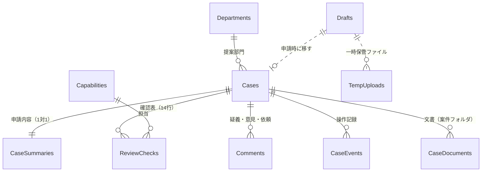

# データモデル

- **出典**: [業務ドメイン構造](../01-requirements/01-domain-structure.md) / [状態遷移](../03-detail-design/03-state-transitions.md) / [機能スコープ](../01-requirements/03-functional-scope.md) / [決定ログ](../_templates/decision-log.md) #12〜#21
- **最終更新**: 2026-09-23
- **状態**: 初版（確定。決定ログ #19・#21）

SharePoint Online の **リスト**（構造化データ）と **ドキュメントライブラリ**（ファイル）で持つ。画面は Power Apps、処理は Power Automate（[ADR-0001](./05-adr/0001-platform-microsoft-365.md)）。

---

## 1. モデリング方針

**基本方針**

1. **書き込みはすべて Power Automate（CMS のサービスアカウント）経由にする。** 利用者は案件のリスト・ライブラリを閲覧だけできる。状態と実行者の検証（[状態遷移 §7](../03-detail-design/03-state-transitions.md)）をフローの側で必ず行うため（→ [ADR-0005](./05-adr/0005-writes-via-flows-and-private-drafts.md)）。
2. **下書きは案件と別のリストに置く。** 案件リストは全員が見られるので、下書きをそこに置くと本人以外にも見えてしまう。下書きリストは「自分が作った項目だけ見られ、編集できる」設定にし、利用者本人が直接保存する。
3. **申請後の案件概要書は変更しない。** そのため、表形式の項目は JSON でまとめて持ってよい（後から一部だけ書き換えることがない）。
4. **ステータスや選択肢はコード値で持つ。** 表示名（日本語／英語）は翻訳表から引く（決定ログ #11・#21）。

**列に持つ / JSON に持つ の判断基準**

| 列に持つ | JSON に持つ |
|---|---|
| 一覧での絞り込み・並べ替え・集計に使う項目（状態、部門、期限、金額、新規／更新の別など） | 表形式の項目（KPI、連携システム、ステークホルダー、費用内訳、フェーズ、リスク） |
| 状態遷移の判定に使う項目（起案者確認、保留の数など） | 項目ごとの状態と出所（AI生成／修正／入力、資料名・見出し） |
| 権限や通知に使う人の項目 | 下書きの入力内容（まるごと） |
| 長文だが一件ずつ表示する項目（課題、必要性など。複数行テキスト列） | 操作記録の詳細 |

**JSON に置いた項目が後で集計対象になった場合**：申請後は変わらないので、フローで列（または別リスト）へ取り出す。例：③で連携システムを台帳にするときは、`TablesJson.integrations` を台帳リストへ展開する。

---

## 2. ER 概要



| 種類 | 名前 | 役割 | 利用者の権限 | 書き込む主体 |
|---|---|---|---|---|
| リスト | **Cases**（案件） | 案件の管理情報と状態 | 閲覧（全員） | フロー |
| リスト | **CaseSummaries**（案件概要書） | 申請内容（申請後は不変） | 閲覧（全員） | フロー |
| リスト | **ReviewChecks**（確認表） | ケイパビリティ×基盤性／負債の選択とコメント | 閲覧（全員） | フロー |
| リスト | **Comments**（疑義・意見・依頼） | 起案者の疑義、審査担当者の追加依頼、委員の修正依頼、議論要請 | 閲覧（全員） | フロー |
| リスト | **CaseEvents**（操作記録） | すべての操作の記録（追記のみ） | 閲覧（事務局・管理者） | フロー |
| リスト | **Drafts**（下書き） | 申請前の入力内容 | **自分の項目だけ閲覧・編集** | 利用者本人 |
| ライブラリ | **CaseDocuments**（案件文書） | 提出された手元資料、論点整理書、回答書、議事録 | 閲覧（全員） | フロー |
| ライブラリ | **TempUploads**（一時保管） | 自動生成のために添付したファイル。1日で削除 | **権限なし**（利用者は直接見ない） | フロー |
| リスト | Departments（部門） | 提案部門の選択肢（日英名） | 閲覧 | 管理者 |
| リスト | Capabilities（ケイパビリティ） | 7つの L1 と担当の審査担当者 | 閲覧 | 管理者 |
| リスト | Settings（設定値） | 期限の日数、委員長・代理など | 閲覧 | 管理者 |
| リスト | Holidays（休日） | 営業日の計算 | 閲覧 | 管理者 |
| リスト | UiStrings（翻訳表） | 申請画面と案件リストの文言（日英） | 閲覧 | 管理者 |

ロールは SharePoint グループで持つ：**CMS 利用者**（案件を閲覧できる全員）、**事務局**、**審査担当者**、**投資委員会**、**PPM**、**CMS 管理者**。サービスアカウントは全リストに書き込める。

---

## 3. エンティティ定義

SharePoint の既定の列（ID、Created、Modified、Author、Editor）は省略。「今回」列が ❌ の列は②用に先に確保するもの（理由は表の下）。

### 3.1 Cases（案件）

**役割**：1件の案件の管理情報、状態、進捗項目。一覧画面はこのリストだけで描く。

| 列名 | 型 | 必須 | 説明 | 今回 |
|---|---|:--:|---|:--:|
| CaseNo | 1行テキスト | ✅ | 案件ID（例：`IC-2026-0001`）。一意 | ✅ |
| Title | 1行テキスト | ✅ | 案件名 | ✅ |
| Status | 選択肢（コード） | ✅ | `RECEIVED`〜`WITHDRAWN`（[状態遷移 §1](../03-detail-design/03-state-transitions.md)）。下書きはここには来ない | ✅ |
| ProposingDept | 参照（Departments） | ✅ | 提案部門 | ✅ |
| ProposalOwner | ユーザー | ✅ | 提案責任者 | ✅ |
| Submitter | ユーザー | ✅ | 起案担当者 | ✅ |
| ReviewType | 選択肢 | ✅ | `EXEC`（執行開始）／`NEW`（年度途中の新規） | ✅ |
| SubmittedAt | 日付と時刻 | ✅ | 申請日時 | ✅ |
| AttachPolicy | 選択肢 | ✅ | `INCLUDE`（添付も提出）／`EXCLUDE`（概要書のみ） | ✅ |
| NotifyRecipients | ユーザーまたはグループ（複数） | | 通知先。社内のユーザー・グループのみ、件数の上限なし（起案担当者・提案責任者は含めず、通知時にフローが足す） | ✅ |
| SecretariatAssignees | ユーザー（複数） | | 事務局の担当（1名以上） | ✅ |
| BriefVersion | 数値 | | 論点整理書の版（0＝未回付） | ✅ |
| ApplicantCheck | 選択肢 | | `UNCHECKED`／`QUESTIONED`／`CONFIRMED` | ✅ |
| PendingCount | 数値 | | 確認表の「保留」の数（ReviewChecks から集計してフローが更新） | ✅ |
| ReviewResult | 選択肢 | | `APPROVE`／`APPROVE_WITH_CONDITIONS`／`REJECT` | ✅ |
| ApprovalConditions | 複数行テキスト | | 承認条件 | ✅ |
| ResultRegisteredBy | ユーザー | | 審議結果の登録者（委員長または代理） | ✅ |
| ResultByDeputy | はい/いいえ | | 代理での登録か | ✅ |
| AnswerStatus | 選択肢 | | `NONE`／`IN_REVIEW`／`REVISION_REQUESTED`／`CHECKED`／`FINAL` | ✅ |
| AnswerVersion | 数値 | | 回答書の版 | ✅ |
| ConsultationDeadline | 日付 | | 議論要請の受付期限 | ✅ |
| MeetingAt / MeetingLink | 日付と時刻 / ハイパーリンク | | 協議（会議）の日時と Teams リンク | ✅ |
| DueType | 選択肢 | | いま走っている期限の種類：`DRAFTING`／`CONFIRM`／`DELIBERATION`／`ANSWER_CHECK`／`CONSULT_WINDOW`／空 | ✅ |
| DueDate | 日付 | | その期限日（営業日で計算） | ✅ |
| IsOverdue | はい/いいえ | | 期限超過（定期フローが更新） | ✅ |
| FinalizedAt | 日付と時刻 | | 結果確定日時 | ✅ |
| HandedOffToPPMAt | 日付と時刻 | | PPM へ引き渡した日時 | ✅ |
| WithdrawnFromStatus / WithdrawnReason / WithdrawnAt | 選択肢 / 複数行 / 日時 | | 取り下げの記録 | ✅ |
| TriageLane | 選択肢 | | ②トリアージ（軽／重） | ❌ |
| BriefGeneratedBy / AgentConfigVersion | 選択肢 / 1行 | | ②論点整理書の生成元（人／エージェント）と設定の版 | ❌ |

**インデックス**：Status、SubmittedAt、ProposingDept、DueDate、Submitter
**一意制約**：CaseNo（列の「一意の値を適用」）

❌ の列を先に作る理由：②で列を足すと、Power Apps の画面とフローの両方を改修することになる。空の列は害がなく、名前を先に決めておけば②の設計が既存の画面を壊さない。

スコア（素点・確定値・重み）は CMS に記録しない（決定ログ #21）。

### 3.2 CaseSummaries（案件概要書）

**役割**：申請内容。1案件に1件。**申請時にフローが作り、以後は変更しない。**

| 列名 | 型 | 説明 |
|---|---|---|
| Case | 参照（Cases） | 親の案件（一意） |
| CurrentIssue / Necessity / BusinessContext | 複数行テキスト | §1 目的・背景 |
| QualitativeBenefits | 複数行テキスト | §2 定性的効果 |
| InScopeOrgUsers / InScopeProcesses / InScopeSystems / OutOfScope / FutureConsiderations | 複数行テキスト | §3 スコープ |
| BeneficiaryScope | 複数行テキスト | §4 受益範囲 |
| UserCount | 1行テキスト | §4 利用者数（数値または「不明」） |
| DataCategories | 選択肢（複数） | §4 対象データの種類（コード） |
| DataDescription | 複数行テキスト | §4 |
| NewOrRenewal | 選択肢 | §4 `NEW`／`RENEW`／`MOD` |
| CurrentProduct | 1行テキスト | §4 |
| SupportEndDate | 1行テキスト | §4 `YYYY-MM`、または「不明」「該当なし」 |
| OpsStructure | 複数行テキスト | §4 |
| InitialCostTotal / RunningCostAnnual | 数値 | §6 万円 |
| PlannedStart / PlannedEnd | 1行テキスト | §7 `YYYY-MM` |
| Milestones / Constraints | 複数行テキスト | §7 |
| TablesJson | 複数行テキスト（プレーン） | 表形式の項目（§4 参照） |
| FieldMetaJson | 複数行テキスト（プレーン） | 項目ごとの状態と出所（§4 参照） |
| SourceFilesJson | 複数行テキスト（プレーン） | 自動生成に使ったファイルの名前・種類（提出しなかった場合も記録） |
| GeneratedAt / GenerationCount | 日時 / 数値 | 最後に自動生成した日時と回数 |
| DisplayLanguage | 選択肢 | 申請時の表示言語（`ja`／`en`）。PDF の見出しの言語に使う |

年月を1行テキスト（`YYYY-MM`）にするのは、AI の出力と「不明」を同じ列に入れられ、文字列のままでも並べ替えられるため。形式の検証は [検証・エラー設計](../03-detail-design/04-validation-and-errors.md) で定める。

### 3.3 ReviewChecks（確認表）

**役割**：論点整理書の末尾の確認表。論点整理書の最初の回付（S04）で 7ケイパビリティ×2軸＝14行をフローが作る。

| 列名 | 型 | 説明 |
|---|---|---|
| Case | 参照（Cases） | |
| Capability | 参照（Capabilities） | 7つの L1 |
| Axis | 選択肢 | `FOUNDATION`（基盤性）／`DEBT`（負債） |
| Selection | 選択肢 | `PENDING`（保留）／`CONFIRMED`（確認済み）／`NA`（該当なし） |
| Reviewer | ユーザー | 最後に選択した審査担当者 |
| SelectedAt | 日付と時刻 | |
| RiskNote | 複数行テキスト | リスクとして記載すべき事項（審査担当者が書く。事務局が論点整理書に反映。決定ログ #19） |
| BriefVersionAtSelection | 数値 | 選択したときの論点整理書の版 |

**一意**：Case＋Capability＋Axis（フローで重複を防ぐ）
審査担当者が選べるのは、Capabilities で自分が担当に入っている行だけ（フローで検証）。修正版の登録時は、事務局が選んだ行だけ `PENDING` に戻す（決定ログ #13）。

### 3.4 Comments（疑義・意見・依頼）

| 列名 | 型 | 説明 |
|---|---|---|
| Case | 参照（Cases） | |
| Kind | 選択肢 | `APPLICANT_QUESTION`（起案者の疑義・意見）／`REVIEWER_REQUEST`（論点の追加依頼）／`COMMITTEE_REVISION`（回答書の修正依頼）／`CONSULT_REQUEST`（議論要請） |
| Body | 複数行テキスト | 本文 |
| TargetVersion | 数値 | 対象の論点整理書または回答書の版 |
| Resolved | はい/いいえ | 事務局が対応済みにしたか |
| ResolutionNote | 複数行テキスト | 対応内容 |

### 3.5 CaseEvents（操作記録）

**役割**：監査証跡。**追記だけ。** 更新・削除はサービスアカウントにも運用で禁止する（3年経過後の一括削除を除く）。

| 列名 | 型 | 説明 |
|---|---|---|
| Case | 参照（Cases） | 下書き段階の操作は記録しない |
| Transition | 1行テキスト | 遷移番号（`S02` など、[状態遷移 §4](../03-detail-design/03-state-transitions.md)） |
| FromStatus / ToStatus | 1行テキスト | 状態コード |
| Actor | ユーザー | 操作した人（フローを呼んだ本人） |
| OnBehalf | はい/いいえ | 代理での操作か |
| OccurredAt | 日付と時刻 | |
| DetailJson | 複数行テキスト | 変更内容の要約（選んだ行、版、通知先など） |

**インデックス**：Case、OccurredAt

### 3.6 Drafts（下書き）

**役割**：申請前の入力内容を、本人だけが見られる形で持つ。

| 列名 | 型 | 説明 |
|---|---|---|
| Title | 1行テキスト | 案件名（一覧表示用） |
| FormJson | 複数行テキスト（プレーン） | 申請画面の入力内容すべて（メタデータ、案件概要書、表、項目の状態と出所、通知先、添付の一覧） |
| TempUploadIds | 1行テキスト | 一時保管ファイルの ID（カンマ区切り） |
| LastGeneratedAt | 日付と時刻 | |

**リストの設定**：詳細設定の「項目レベルのアクセス許可」を **「読み取り：自分が作成した項目のみ」「作成と編集：自分が作成した項目のみ」** にする。利用者本人が Power Apps から直接保存する（申請前なので状態の検証は要らない）。申請時にフローが Cases／CaseSummaries へ移し、下書きの項目は削除する。

### 3.7 CaseDocuments（案件文書）

案件ごとにフォルダを作る（フォルダ名＝CaseNo）。

```
CaseDocuments/
└─ IC-2026-0001/
   ├─ 01_submitted/     提出された手元資料（AttachPolicy＝INCLUDE のときだけ）
   ├─ 02_issue-brief/   論点整理書（版はバージョン履歴で持つ）
   ├─ 03_answer/        審議回答書（案〜確定）
   └─ 04_meeting/       議事録（協議があった場合）
```

| 列名 | 型 | 説明 |
|---|---|---|
| Case | 参照（Cases） | |
| DocKind | 選択肢 | `SUBMITTED`／`ISSUE_BRIEF`／`ANSWER`／`MINUTES` |
| DocVersion | 数値 | 論点整理書・回答書の版（CMS 上の版。SharePoint のバージョン番号とは別） |
| IsFinal | はい/いいえ | 回答書の確定版 |

権限は継承のまま（全員閲覧）。**案件ごとにアクセス権を分けない**ので、件数が増えても権限の管理が重くならない（決定ログ #16）。

### 3.8 TempUploads（一時保管）

| 列名 | 型 | 説明 |
|---|---|---|
| Uploader | ユーザー | アップロードした人 |
| DraftId | 数値 | 対応する Drafts の ID |
| FileKind | 選択肢 | 資料の種類（任意） |

**権限**：継承を切り、**サービスアカウントと CMS 管理者だけ**に絞る（決定ログ #19）。利用者はこのライブラリに直接アクセスしない。アップロード・読み取り（自動生成）・移動（申請時）はすべてフローが行い、画面にはファイル名だけを Drafts から出す。
**削除**：1日1回の定期フローが、作成から1日を過ぎたファイルを削除する（決定ログ #17）。ごみ箱の扱いは保持期間に任せる（#18）。

### 3.9 マスタ

| リスト | 主な列 |
|---|---|
| Departments | Code、NameJa、NameEn、IsActive、SortOrder |
| Capabilities | Code、NameJa、NameEn、Reviewers（ユーザー複数）、SortOrder |
| Settings | Key、Value、Note（例：`SLA_DRAFTING`=3、`SLA_CONFIRM`=3、`SLA_DELIBERATION`=3、`SLA_ANSWER_CHECK`=2、`CONSULT_WINDOW`=3、`TEMP_RETENTION_DAYS`=1、`RETENTION_YEARS`=3、`CHAIR`、`CHAIR_DEPUTY`） |
| Holidays | Date、Name |
| UiStrings | Key、Ja、En（申請画面と案件リストの文言。ほかの画面は日本語のみ。決定ログ #21） |

---

## 4. JSON 構造の定義

### CaseSummaries.TablesJson

```json
{
  "kpis":            [{ "metric": "", "current": "", "target": "", "method": "", "when": "" }],
  "monetaryBenefits":[{ "item": "", "annualAmount": null, "basis": "" }],
  "integrations":    [{ "system": "", "method": "", "direction": "" }],
  "integrationsNone": false,
  "stakeholders":    [{ "role": "SPONSOR", "name": "", "involvement": "" }],
  "initialCosts":    [{ "item": "", "amount": null, "note": "" }],
  "runningCosts":    [{ "item": "", "annualAmount": null, "note": "" }],
  "phases":          [{ "phase": "", "activities": "", "start": "", "end": "", "note": "" }],
  "risks":           [{ "risk": "", "impact": "", "likelihood": "", "response": "" }]
}
```

`stakeholders.role` はコード（`SPONSOR`／`PM`／`BUSINESS_OWNER`／`IT`／`USER_REP`／`OTHER`）。

### CaseSummaries.FieldMetaJson

```json
{
  "currentIssue":   { "origin": "AI", "source": "案件概要書_LIMS更新.docx §1.3" },
  "necessity":      { "origin": "AI_EDITED", "source": "…" },
  "userCount":      { "origin": "USER" },
  "supportEndDate": { "origin": "AI_EDITED", "candidates": [
                        { "value": "2027-12", "source": "…" }, { "value": "2028-03", "source": "…" } ] },
  "kpis":           { "origin": "AI", "source": "…" }
}
```

`origin` は `AI`／`AI_EDITED`／`USER`／`EMPTY`。申請時点の値を保存し、事務局が「AI 生成のまま提出された値」を見分けるのに使う。

**制約**：Drafts.FormJson は途中保存を許すため、すべての項目を省略可とする。必須の検証は申請時（フロー）で行う。JSON の正確な定義は Power Apps／Power Automate で共有する JSON スキーマファイルを正とする（04-implementation で置き場所を決める）。

---

## 5. 版管理・履歴

| 項目 | 方針 |
|---|---|
| 履歴の持ち方 | リスト・ライブラリの **バージョン履歴を有効**にする。加えて、業務上の操作はすべて CaseEvents に追記する |
| 版を作るタイミング | 論点整理書・回答書は、登録のたびに CMS 上の版（BriefVersion／AnswerVersion）を+1し、ファイルは同じ名前で上書きして SharePoint のバージョンを積む |
| 版の刈り込み | 当面なし。結果確定から 3 年で案件ごと削除する（§7） |
| 復元 | 文書はバージョン履歴から戻せる。案件の状態は戻さない（差し戻しの遷移は持たない） |
| 監査ログとの関係 | 監査の正は CaseEvents。SharePoint のバージョン履歴は補助 |

---

## 6. 同時更新の制御

| 項目 | 方針 |
|---|---|
| 制御方式 | 楽観的な制御。フローは処理の最初に Cases の Status と Modified を読み、画面が送ってきた値と違えば処理を止める |
| 競合検知の単位 | 案件（Cases の1件） |
| 競合時の応答 | フローがエラー（「ほかの人が先に更新しました」）を返し、何も書き込まない |
| 競合時の画面 | 最新の内容を読み直して表示する → [検証・エラー設計](../03-detail-design/04-validation-and-errors.md) |
| 同じ案件のフローの重複実行 | 案件単位でフローの同時実行を1本に絞る設定（または Cases に処理中フラグ）で直列にする。方式は実装時に決める |

---

## 7. データ量とパフォーマンス

前提：**年間 120 件、記録は 3 年保持**（決定ログ #19）。保持件数の最大は 3 年分。SharePoint では 1 つのビューで扱える件数に上限（5,000 件）があり、Power Apps からの検索も条件によっては先頭の最大 2,000 件しか対象にならない。

| リスト | 1案件あたり | 年間 | 3年分（最大） | 上限との関係 | 対策 |
|---|---|---|---|---|---|
| Cases・CaseSummaries | 1件 | 120 | 360 | 余裕あり | Status・SubmittedAt に索引 |
| ReviewChecks | 14件 | 1,680 | 5,040 | **上限をわずかに超える** | Case 列に索引。案件単位でしか読まない（1回の読み取りは14件） |
| Comments | 数件 | 数百 | 千件台 | 余裕あり | Case 列に索引 |
| CaseEvents | 20〜40件 | 2,400〜4,800 | 7,200〜14,400 | **上限を超える** | Case・OccurredAt に索引。画面からは案件単位でしか読まない。全体の集計はフローで年度ごとに行う |
| Drafts・TempUploads | 一時的 | − | − | 余裕あり | − |

索引を付けた列で絞り込めば、リスト全体が 5,000 件を超えても、絞り込んだ結果が 5,000 件以下なら問題なく読める。**索引は、件数が少ないうちに作っておく**（件数が多くなってからでは作れない場合がある）。

**保持期間の処理**：結果確定（承認済み・非承認）または取り下げから 3 年を過ぎた案件は、年1回の処理で、Cases とその関連リスト・文書をまとめて削除する。起点を結果確定日とするのは、進行中の案件の記録を消さないため。削除前に一覧を出力して CMS 管理者が確認する（手順は 08-operations）。

Power Apps からの検索は、Power Apps が SharePoint 側で絞り込める条件（等号、StartsWith など）だけで書く（04-implementation の規約で定める）。

---

## 8. 将来拡張への備え

| 追加予定 | 時期 | 現在の設計で吸収できるか | 必要な作業 |
|---|---|---|---|
| トリアージ結果、論点整理書の生成元とエージェント設定の版 | ② | 列を確保済み（Cases の ❌ 列） | 値を書くフローを足す |
| エージェント設定の版管理と変更承認（Q1） | ② | 定義追加のみ | AgentConfigs リストを追加 |
| 軽レーンの抜き取り監査・異議申立て（Q2） | ② | 定義追加のみ | Comments に Kind を追加、監査用リストを追加 |
| モニタリング、エスカレーション、レビューゲート | ③ | 定義追加のみ | Status にコードを追加、Monitoring リストを追加 |
| 連携システム・保守期限の台帳 | ③ | 定義追加のみ | CaseSummaries.TablesJson から台帳リストへ展開するフロー |

---

## 9. 作成と変更の運用

| 項目 | 方針 |
|---|---|
| 作り方 | リスト・ライブラリ・列・索引・権限を、プロビジョニング用のスクリプトまたはテンプレートで作る（手作業で作らない）。道具は 04-implementation で決める |
| 命名規則 | リスト・列の内部名は英語（本書の名前）。表示名は日本語 |
| 本番への適用 | 開発サイトで確認 → 手順書どおり本番サイトへ。承認は CMS 管理者 |
| 戻し方 | 列の削除はしない（使わなくなった列は非表示にする） |
| 初期データ | Departments、Capabilities、Settings、Holidays、UiStrings はファイルで管理して投入する |

---

## 10. 決定済みの事項（2026-09-23）

| # | 事項 | 決定 |
|---|---|---|
| ADR-0005 | 書き込みの方式 | すべてフロー（サービスアカウント）経由。下書きは本人専用リスト（#19） |
| T21 | 一時保管ライブラリの権限 | サービスアカウントと管理者だけ。利用者は直接見ない（#19） |
| T6 | 審査担当者のリスク記載 | 確認表の行（RiskNote）に書き、事務局が論点整理書に反映する（#19） |
| T22 | 件数と保持 | 年間 120 件程度。記録は 3 年保持（結果確定・取り下げから）（#19） |
| T23 | サービスアカウント | IT部門で用意する（#19） |
| T3 | スコア | CMS に記録しない（#21） |
| T12 | 通知先 | 件数の上限なし。社外アドレスは不可（#21） |
