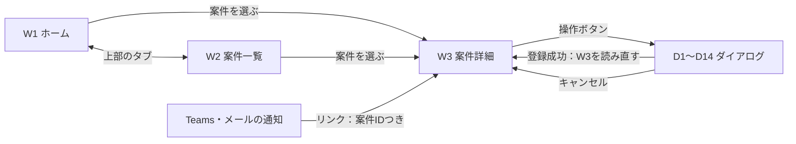
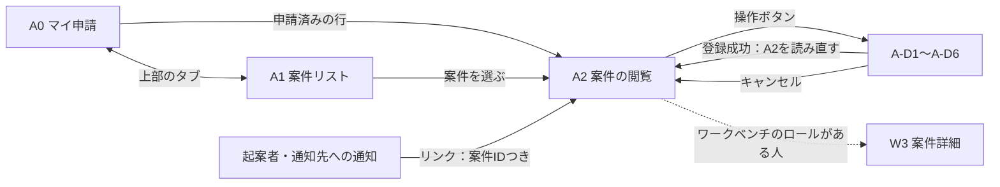

# 画面設計

- **出典**: [状態遷移](./03-state-transitions.md) §4・§7、[フロー設計](../02-architecture/03-api-design.md) §2、[データモデル](../02-architecture/02-data-model.md)、[ADR-0006](../02-architecture/05-adr/0006-two-apps-intake-and-workbench.md)
- **最終更新**: 2026-09-23
- **状態**: 審議ワークベンチの初版（[紙芝居](./mockup-workbench/)あり）。申請用アプリは申請前を [紙芝居](./mockup-application-form/) で、申請後（案件リスト・案件の閲覧・起案者の操作）を §6 で定める

アプリは2本（ADR-0006）。§1〜§5 は **②審議ワークベンチ**（事務局・審査担当者・委員会・PPM、日本語のみ）、§6 は **①IT投資 申請** の申請後の画面を扱う。

---

## 1. 画面一覧（審議ワークベンチ）

| # | 画面名 | 責務 | 主な利用ロール | 今回 |
|---|---|---|---|:--:|
| W1 | ホーム（対応が必要な案件） | 自分が今やるべき操作がある案件を、ロールごとに期限順で並べる | 全ロール | ✅ |
| W2 | 案件一覧 | 全案件の検索・絞り込み | 全ロール | ✅ |
| W3 | 案件詳細 | 1件の案件の全情報と、状態・ロールに応じた操作 | 全ロール | ✅ |
| D1〜D14 | 操作ダイアログ | W3 から開く登録・選択・確定の入力（§3.4） | 操作ごと | ✅ |

**作らない画面**：マスタ（部門、ケイパビリティと担当、設定値、休日、翻訳表）の編集画面。CMS 管理者が SharePoint のリスト画面で直接編集する（件数が少なく、更新が年数回のため）。

---

## 2. 画面遷移

| 遷移 | 条件 | 条件を満たさない場合 |
|---|---|---|
| 通知のリンク → W3 | 審議ワークベンチのロールのどれかに所属 | 「この画面を使う権限がありません」と表示し、申請用アプリの案件の閲覧へのリンクを出す |
| W3 → 各ダイアログ | 状態とロールが §3.4 の表の条件を満たす（ボタンを出す条件） | ボタンを出さない。フロー側でも同じ条件を確かめる（C02 GuardCase） |
| ダイアログ → 登録 | フローが `OK` を返す | エラーコードに応じた表示（§4） |

---

## 3. 画面別の詳細

### 3.1 W1 ホーム（対応が必要な案件）

ロールごとに「自分の番」の案件だけを出す。複数のロールを持つ人は、ロールごとの区画が縦に並ぶ。

| 区画 | 出す案件（条件） | 並び順 | 行に出す情報 |
|---|---|---|---|
| 事務局：担当の割当 | Status＝受付済み かつ 担当なし | 申請日 | 案件名、提案部門、申請日、期限 |
| 事務局：論点整理書の作成 | Status＝受付済み かつ 自分が担当 | 期限 | 同上 |
| 事務局：意見・依頼への対応 | Status＝論点整理中 かつ 未対応の疑義・追加依頼あり かつ 自分が担当 | 期限 | 未対応の件数 |
| 事務局：回答依頼 | Status＝審議待ち かつ 自分が担当 | 移行日 | − |
| 事務局：回答書の作成・確定 | Status＝審議中 かつ（審議結果が登録済みで回答書が未作成／修正依頼あり／内容確認完了） | 期限 | 回答書の状態 |
| 事務局：結果の確定登録 | Status＝回答済み で受付期間が終了、または 協議中 | 受付期限 | − |
| 審査担当者：確認表 | Status＝論点整理中 かつ 自分の担当ケイパビリティの行に「保留」がある | 期限 | 自分の保留の数、論点整理書の版 |
| 委員長（代理）：審議結果の登録 | Status＝審議中 かつ 審議結果が未登録 | 期限 | − |
| 委員長（代理）・委員：回答書の確認 | Status＝審議中 かつ 回答書の状態＝内容確認中 | 期限 | 回答書の版 |
| PPM：引き渡し | Status＝承認済み かつ 引き渡しから30日以内 | 引き渡し日 | 承認条件の有無 |

- 期限を超過した案件は赤い印を付け、区画の先頭に出す。
- 読み取りは Cases を索引付きの列（Status、DueDate）で絞ってから、担当者などで絞り込む（データモデル §7）。

### 3.2 W2 案件一覧

| 要素 | 内容 |
|---|---|
| 絞り込み | 状態（複数選択）、提案部門、審議区分、期限超過のみ、自分が担当のみ、申請年度 |
| 検索 | 案件ID・案件名（前方一致） |
| 列 | 案件ID、案件名、提案部門、状態、期限、担当、申請日 |
| 既定の表示 | 今年度の、結果確定前の案件 |
| 並べ替え | 期限、申請日、状態 |

### 3.3 W3 案件詳細

**上部（常に表示）**

| 要素 | 内容 |
|---|---|
| 見出し | 案件ID、案件名、提案部門、提案責任者、起案担当者 |
| 状態 | 7段階の進み具合（受付済み → … → 結果確定）と、今の状態・期限・超過の印 |
| 担当 | 事務局の担当 |
| 操作ボタン | 今の状態と自分のロールで押せる操作だけを出す（§3.4） |

**タブ**

| タブ | 内容 | データ |
|---|---|---|
| 案件概要書 | 申請内容をセクション1〜8で表示。項目ごとに「AI生成のまま／修正／入力」の印と出所を表示できる（切り替え）。PDF 出力 | CaseSummaries |
| 論点整理 | 論点整理書（最新版を開く・過去の版の一覧）、確認表（7ケイパビリティ×基盤性／負債、選択・選択者・日時・リスクの記載）、起案者確認の状態 | CaseDocuments、ReviewChecks、Cases |
| 意見・依頼 | 起案者の疑義・意見、審査担当者の追加依頼、委員の修正依頼、議論要請。対応済みかどうかと対応内容 | Comments |
| 審議 | 審議結果・承認条件・登録者（代理か）、回答書（案〜確定）と版、内容確認の状態 | Cases、CaseDocuments |
| 協議 | 議論要請の内容、招集情報（日時・会議リンク）、議事録（協議があった場合だけ表示） | Comments、Cases、CaseDocuments |
| 添付資料 | 提出された手元資料（「案件概要書のみ」の場合は「提出なし」と表示） | CaseDocuments |
| 履歴 | 操作記録（いつ・誰が・何をしたか）。事務局・CMS 管理者だけに表示 | CaseEvents |

### 3.4 操作ダイアログ（W3 のボタン）

ボタンは、**状態とロールの両方が合うときだけ**表示する。登録は必ずフローを呼ぶ（ADR-0005）。

| # | ボタン | 表示する状態 | 表示するロール | 入力 | 呼ぶフロー |
|---|---|---|---|---|---|
| D1 | 担当者を割り当てる | 受付済み | 事務局 | 担当者（1名以上） | F10 |
| D2 | 論点整理書を登録・回付 | 受付済み（初版）／論点整理中（修正版） | 事務局（担当） | ファイル。修正版では「保留に戻す確認表の行」を選ぶ（0行も可） | F11 |
| D3 | 意見・依頼に対応済みにする | 論点整理中・審議中 | 事務局（担当） | 対応内容 | F12（対応の記録） |
| D4 | 確認表を選択する | 論点整理中 | 審査担当者（自分の担当行だけ編集可） | 行ごとに 確認済み／該当なし／保留、リスクの記載 | F13 |
| D5 | 論点の追加を依頼する | 論点整理中 | 審査担当者 | 依頼内容 | F12 |
| D6 | 委員会へ回答を依頼する | 審議待ち | 事務局（担当） | 依頼の一言（任意） | F15 |
| D7 | 審議結果を登録する | 審議中（結果が未登録） | 委員長・代理 | 承認／条件付き承認／非承認、承認条件、代理かどうか（自動判定） | F16 |
| D8 | 回答書（案）を登録する | 審議中（結果が登録済み） | 事務局（担当） | ファイル | F17 |
| D9 | 回答書の修正を依頼する | 審議中（内容確認中） | 委員 | 依頼内容 | F18 |
| D10 | 回答書の内容を確認済みにする | 審議中（内容確認中） | 委員長・代理 | − | F19 |
| D11 | 回答書を確定する | 審議中（内容確認済み） | 事務局（担当） | − | F20 |
| D12 | 議論を要請する | 回答済み（受付期間内） | 委員 | 理由 | F21 |
| D13 | 招集情報を登録する | 協議中 | 事務局（担当） | 日時、会議リンク | F22 |
| D14 | 結果を確定登録する | 回答済み（受付期間後）／協議中 | 事務局（担当） | 協議中は議事録ファイル。結果は審議結果から自動 | F23 |

起案者の操作（疑義・意見、確認完了、議論要請、通知先の変更、取り下げ）は申請用アプリで行う（§6.5）。

---

## 4. 画面の状態表示（全画面共通）

| 状態 | 表示 |
|---|---|
| 初期読込中 | 一覧・タブの中身を読み込み中の表示（スケルトン） |
| データ0件 | W1：「対応が必要な案件はありません」。W2：「条件に合う案件はありません」と絞り込みの解除ボタン |
| 取得エラー | 「読み込めませんでした」と再読込ボタン |
| 権限なし | 「この画面を使う権限がありません」と申請用アプリへのリンク |
| 保存中 | ダイアログのボタンを押せなくし、処理中の表示（書き込みは 10 秒以内が目標） |
| 保存失敗 | フローの応答コードで分ける（フロー設計 §5）：`E_CONFLICT` は「ほかの人が先に更新しました」と最新を読み直す。`E_STATE`・`E_FORBIDDEN` は理由を表示してダイアログを閉じる。`E_VALIDATION` は該当欄を赤くする |

---

## 5. 共通レイアウト

| 要素 | 内容 | 表示条件 |
|---|---|---|
| ヘッダ | アプリ名「審議ワークベンチ」、利用者名と所属ロール | 常に |
| 上部タブ | ホーム／案件一覧 | 常に |
| 通知・トースト | 登録の成功・失敗の短い表示 | 操作のあと |
| 表示の大きさ | PC（横 1366px 以上）。Teams のタブからも開ける | − |

ステータスの表示（色・ラベル）は [状態遷移 §8](./03-state-transitions.md) に合わせ、申請用アプリと同じ部品（コンポーネントライブラリ）を使う。

---

## 6. 申請用アプリ（①IT投資 申請）

全員が使う。申請前の画面は [紙芝居](./mockup-application-form/) を正とし、本節では **申請後の画面**（案件リスト、案件の閲覧、起案者の操作）を定める。

### 6.1 画面一覧

| # | 画面名 | 責務 | 利用者 | 日英 | 今回 |
|---|---|---|---|:--:|:--:|
| A0 | マイ申請 | 自分の下書きの再開・新規申請、**自分の申請済み案件**の一覧（押すと A2） | 全員 | ✅ | 紙芝居あり（申請済みの行は本節で追加） |
| A1 | 案件リスト | 全案件（下書きを除く）の検索・絞り込み | 全員 | ✅ | ✅ |
| A2 | 案件の閲覧 | 1件の案件の閲覧と、起案担当者の操作 | 全員（操作は起案担当者だけ） | 一部（§6.4） | ✅ |
| A-D1〜A-D6 | 起案者の操作ダイアログ | A2 から開く登録の入力（§6.5） | 起案担当者 | − | ✅ |

- **操作できるのは起案担当者（Cases.Submitter）だけ**。提案責任者・通知先・ほかの利用者は閲覧のみ（状態遷移 §7。フロー側でも C02 GuardCase で確かめる）。
- 審議ワークベンチのロールを持つ人には、A2 の右上に「審議ワークベンチで開く」を出す（同じ案件の W3 へ）。

### 6.2 画面遷移

| 遷移 | 条件 | 条件を満たさない場合 |
|---|---|---|
| 通知のリンク → A2 | CMS 利用者グループに所属 | 「この案件を表示する権限がありません」 |
| 案件IDの案件が見つからない | − | 「案件が見つかりません」と A1 へのリンク |
| A2 → ダイアログ | 起案担当者 かつ 状態が §6.5 の条件を満たす | ボタンを出さない |

### 6.3 A1 案件リスト

| 要素 | 内容 |
|---|---|
| 絞り込み | 状態（複数選択）、提案部門、申請年度、「自分が起案した案件のみ」 |
| 検索 | 案件ID・案件名（前方一致） |
| 列 | 案件ID、案件名、提案部門、状態、申請日、結果確定日 |
| 既定の表示 | 今年度に申請された案件（取り下げを含むすべての状態）。申請日の新しい順 |
| 並べ替え | 申請日、状態、案件ID |
| 出さないもの | 下書き（Drafts は本人のリストで、ここには出ない）、期限・担当・起案者確認などの審議の内部状況 |
| 日英 | 見出し・状態名・部門名（Departments の NameJa／NameEn）を切り替える。案件名は入力のまま（翻訳しない） |

- 読み取りは Cases を索引付きの列（Status、SubmittedAt、ProposingDept、Submitter）で絞る（データモデル §7。委任できる条件だけを使う）。
- 状態の表示は起案者向けの呼び方にする（§6.6）。

### 6.4 A2 案件の閲覧

**上部（常に表示）**

| 要素 | 内容 | 日英 |
|---|---|:--:|
| 見出し | 案件ID、案件名、提案部門、提案責任者、起案担当者、申請日 | ✅ |
| 進み具合 | 7段階（受付済み → 論点整理中 → 審議待ち → 審議中 → 回答済み →（協議中）→ 結果確定）と今の状態。取り下げは「取り下げ（〇〇の段階で）」と表示 | ✅ |
| 起案者へのお知らせ | 起案担当者が今やるべきことを1行で出す（例：「論点整理書が回付されました。確認して、確認完了か疑義・意見を登録してください（期限 10/2）」「回答書が確定しました。10/8 までなら議論を要請できます」） | − |
| 操作ボタン | 起案担当者に、今の状態で押せる操作だけを出す（§6.5）。PDF 出力は全員 | − |

**タブ**

| タブ | 内容 | 表示する時期 | データ | 日英 |
|---|---|---|---|:--:|
| 案件概要書 | 申請内容をセクション1〜8で表示（申請画面の確認と同じ様式）。PDF 出力 | 常に | CaseSummaries | ✅ |
| 論点整理 | 論点整理書（最新版を開く、過去の版の一覧）、確認表（7ケイパビリティ×基盤性／負債の選択とリスクの記載）、起案者確認の状態 | 論点整理書の回付後（受付済みの間は「事務局が作成中です（期限 ○/○）」） | CaseDocuments、ReviewChecks、Cases | − |
| 意見・依頼 | 起案者の疑義・意見、審査担当者の論点の追加依頼、議論要請と、それぞれへの事務局の対応 | 1件以上あるとき | Comments | − |
| 回答書 | 確定した回答書（審議結果・承認条件を含む）と、議論要請の受付期限 | 回答書の確定後 | CaseDocuments、Cases | − |
| 協議 | 招集情報（日時・会議リンク）、議事録 | 協議中になったあと | Cases、CaseDocuments | − |
| 添付資料 | 提出された手元資料。「案件概要書のみ」を選んだ案件は「提出なし（案件概要書のみ申請）」と表示 | 常に | CaseDocuments | − |

- **申請用アプリで出さないもの**：回答書の案と委員の修正依頼、審議結果（回答書の確定前）、担当者、期限の超過、操作記録（#24）。議事録は結果確定後に出す。ワークベンチを持つ人は W3 で見る。
  - リストの権限は全員閲覧のまま（#15・#16）なので、これは表示の整理であり、アクセスの制限ではない。
- 日英の対象は上部と「案件概要書」タブだけ（#21）。ほかのタブとダイアログは日本語で表示する（#24）。

### 6.5 起案者の操作（A2 のボタン）

ボタンは **起案担当者で、かつ状態が合うときだけ** 表示する。登録は必ずフローを呼ぶ（ADR-0005）。取り下げ・結果確定のあとは、どのボタンも出さない。

| # | ボタン | 表示する状態 | 入力 | 押せる条件（画面側） | 呼ぶフロー | 遷移 |
|---|---|---|---|---|---|---|
| A-D1 | 論点整理書を開く | 論点整理中 | − | − | −（最新版を開き、開いた版をアプリ内に記録） | − |
| A-D2 | 疑義・意見を登録する | 論点整理中 | 内容（必須、2,000字まで） | − | F12 | S05 |
| A-D3 | 確認完了を登録する | 論点整理中 かつ 起案者確認≠確認完了 | 確認の一言（任意） | 最新版を A-D1 で開いたあと | F14（開いた版を渡す） | S08 → C01（S09） |
| A-D4 | 議論を要請する | 回答済み かつ 受付期限内 | 理由（必須） | − | F21 | S17 |
| A-D5 | 通知先を変更する | 受付済み〜協議中 | 追加・削除（社内のユーザー・グループのみ、件数の上限なし） | − | F05 | − |
| A-D6 | 取り下げる | 受付済み〜協議中 | 理由（必須）。「取り下げると元に戻せません」の確認 | − | F06 | S20 |
| − | PDF 出力 | 常に | − | − | F04 | − |

**操作の決まり**

| 決まり | 内容 |
|---|---|
| 確認完了と版 | F14 は、開いた版と Cases.BriefVersion を比べる。違えば `E_CONFLICT`（「論点整理書が更新されました。最新版を開いてから確認してください」）。修正版が回付されると起案者確認は未確認に戻る（S07） |
| 疑義のあとの確認完了 | 疑義・意見を登録したあとでも、確認完了は登録できる（事務局の対応を待たずに進めてよいと起案者が判断した場合）。未対応の疑義は事務局の区画に残る |
| 確認完了の取り消し | できない。考えが変わった場合は疑義・意見を登録する（起案者確認は「疑義あり」に戻る） |
| 議論要請 | 受付期限は A2 の上部と回答書タブに出す。期限を過ぎるとボタンは消え、フローも `E_STATE` を返す |
| 取り下げ | 取り下げ前の状態・理由・日時を記録し、以後は閲覧のみ（S20）。案件リストには「取り下げ」として残る |
| 通知先 | 変更は次の通知から反映する。起案担当者・提案責任者は通知先に含めない（フローが常に足す） |
| 同時操作 | 事務局の回付と起案者の登録が重なった場合は `E_CONFLICT` とし、A2 を読み直す |

### 6.6 状態の表示（起案者向けの呼び方）

内部の状態はワークベンチと同じ（状態遷移 §8）。申請用アプリでは次の呼び方と説明を出す（UiStrings で日英）。

| 状態 | 表示名 | A2 の説明（起案担当者に出す文） |
|---|---|---|
| 受付済み | 受付済み | 事務局が論点整理書を作成しています。 |
| 論点整理中 | 論点整理中 | 論点整理書を確認し、確認完了か疑義・意見を登録してください。（確認完了後は）審査担当者の確認を待っています。 |
| 審議待ち | 審議待ち | 投資委員会への回答依頼を待っています。 |
| 審議中 | 審議中 | 投資委員会が審議しています。 |
| 回答済み | 回答済み | 回答書が確定しました。○/○ までなら議論を要請できます。 |
| 協議中 | 協議中 | 会議で直接協議します。招集情報を確認してください。 |
| 承認済み／非承認 | 承認済み／非承認 | 結果が確定しました。 |
| 取り下げ | 取り下げ | この案件は取り下げられました。 |

### 6.7 画面の状態表示

§4 と同じ。ただし権限なしは「この案件を表示する権限がありません」、データ0件（A1）は「条件に合う案件はありません」と絞り込みの解除ボタン、A0 で申請済みが0件のときは申請済みの区画を出さない。

---

## 7. 印刷・出力

| 出力 | 対象画面 | 方式 | 要件 |
|---|---|---|---|
| 案件概要書の PDF | W3「案件概要書」タブ | F04（方式は #T14） | 申請用アプリと同じ様式 |
