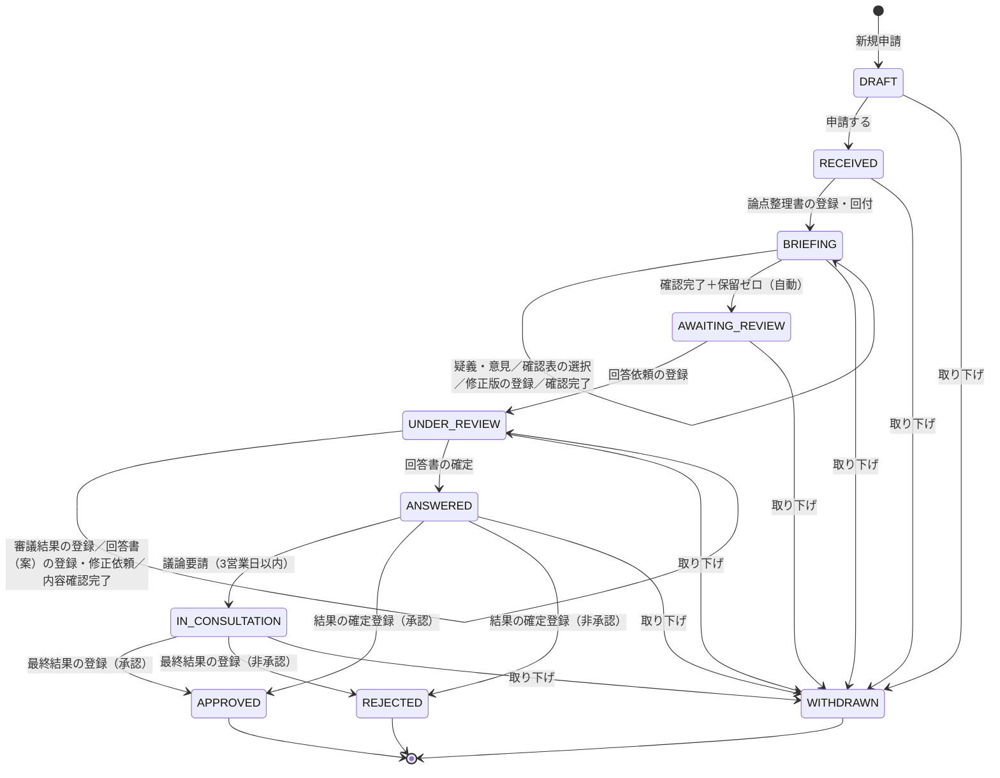

# 状態遷移設計

- **出典**: `images/04_deliberation-sequence.mmd`、04章 §2.1、[機能スコープ](../01-requirements/03-functional-scope.md)、[決定ログ](../_templates/decision-log.md) #12
- **最終更新**: 2026-09-23

案件は **7つのステータス**（受付済み〜結果確定）を順に進む。申請前の「下書き」と、例外の「取り下げ」は別に持つ。Step1 の細かい進み具合（起案者の確認、確認表の保留数など）はステータスを増やさず、**進捗項目**（§6）で持つ。

---

## 1. 状態の定義

| # | 状態コード | ラベル | 英語表示 | 意味 | Step | 今回実装 |
|---|---|---|---|---|---|:--:|
| — | `DRAFT` | 下書き | Draft | 申請前。起案担当者だけが見られる | 申請 | ✅ |
| 1 | `RECEIVED` | 受付済み | Received | 申請を受け付け、事務局が担当を割り当てて論点整理書を作っている | Step1 | ✅ |
| 2 | `BRIEFING` | 論点整理中 | Issue briefing | 論点整理書を回付し、起案者と審査担当者が確認している（修正の往復を含む） | Step1 | ✅ |
| 3 | `AWAITING_REVIEW` | 審議待ち | Awaiting review | Step2 へ進む条件がそろい、事務局の回答依頼を待っている | Step1→2 | ✅ |
| 4 | `UNDER_REVIEW` | 審議中 | Under review | 委員会が審議し、回答書（案）の確認・修正をしている | Step2 | ✅ |
| 5 | `ANSWERED` | 回答済み | Answered | 回答書を起案者に通知した。議論要請を受け付けている（3営業日） | Step2 | ✅ |
| 6 | `IN_CONSULTATION` | 協議中 | In consultation | 議論要請を受け、会議で直接協議している（例外） | Step3 | ✅ |
| 7 | `APPROVED` | 承認済み | Approved | 審議結果が「承認」で確定した。PPM へ引き渡した | Step4 | ✅ |
| 7 | `REJECTED` | 非承認 | Not approved | 審議結果が「非承認」で確定した | Step4 | ✅ |
| — | `WITHDRAWN` | 取り下げ | Withdrawn | 起案者が申請を取り下げた。データは削除せず残す | 例外 | ✅ |

「承認済み」と「非承認」は同じ段階（7：結果確定）の2つの終わり方。条件付きの承認は「承認済み」＋承認条件あり、として持つ（状態は増やさない）。

---

## 2. 状態遷移図

---

## 3. 遷移マトリクス

行＝遷移前、列＝遷移後。番号は §4 の遷移番号。`−` は遷移しない。

| 遷移前 ＼ 遷移後 | 下書き | 受付済み | 論点整理中 | 審議待ち | 審議中 | 回答済み | 協議中 | 承認済み | 非承認 | 取り下げ |
|---|:--:|:--:|:--:|:--:|:--:|:--:|:--:|:--:|:--:|:--:|
| 下書き | S01 | S02 | − | − | − | − | − | − | − | S20 |
| 受付済み | − | S03 | S04 | − | − | − | − | − | − | S20 |
| 論点整理中 | − | − | S05〜S08 | S09 | − | − | − | − | − | S20 |
| 審議待ち | − | − | − | − | S10 | − | − | − | − | S20 |
| 審議中 | − | − | − | − | S11〜S14 | S15 | − | − | − | S20 |
| 回答済み | − | − | − | − | − | S16 | S17 | S18 | S18 | S20 |
| 協議中 | − | − | − | − | − | − | S19a | S19b | S19b | S20 |
| 承認済み | − | − | − | − | − | − | − | − | − | − |
| 非承認 | − | − | − | − | − | − | − | − | − | − |
| 取り下げ | − | − | − | − | − | − | − | − | − | − |

差し戻し（受付済み → 下書き など、前の状態へ戻す遷移）は持たない。事実の不足は、論点整理中の疑義・意見のやり取りで補う。

---

## 4. 遷移一覧（どの操作でどの状態に移るか）

「自動」は CMS（Power Automate）が条件を見て行う。通知はすべて Teams／メール。★ は通知先（申請時に登録した関係者）にも送る。

| # | 遷移前 → 遷移後 | 操作 | 実行者 | 前提条件（満たさなければブロック） | CMS の処理・記録 | 通知 |
|---|---|---|---|---|---|---|
| S01 | （なし）→ 下書き／下書き → 下書き | 新規申請／下書き保存 | 起案者 | なし（下書きでは必須チェックしない） | 下書きを保存 | − |
| S02 | 下書き → **受付済み** | 申請する | 起案者 | 必須項目がそろっている。手元資料 1件以上。添付ファイルの提出方法を選んでいる。「内容を確認した」が ON | 案件IDの採番。「含めて申請」なら手元資料を案件の資料として保存、「概要書のみ」なら何もしない（一時保管のファイルは1日後に自動削除）。案件概要書と項目ごとの状態（AI生成／修正／入力）を申請時点で保存。期限「作成・回付」開始 | 事務局、★受付 |
| S03 | 受付済み → 受付済み | 担当者の割当 | 事務局 | 1名以上を割り当てる | 担当者と割当日時を記録 | 割り当てた担当者 |
| S04 | 受付済み → **論点整理中** | 論点整理書の登録・回付 | 事務局 | 担当者の割当済み。論点整理書（版1）を登録 | 確認表を初期化（7ケイパビリティ×基盤性／負債＝すべて「保留」）。起案者確認＝未確認。期限「確認」開始 | 起案者、審査担当者、★Step移行 |
| S05 | 論点整理中 → 論点整理中 | 疑義・意見の登録 | 起案者 | − | 起案者確認＝疑義あり。意見を記録 | 事務局 |
| S06 | 論点整理中 → 論点整理中 | 確認表の選択／論点の追加依頼 | 審査担当者 | 自分の担当ケイパビリティの行だけ | 選択（確認済み／該当なし／保留）と確認者・日時を記録。追加依頼は事務局へ | 事務局（追加依頼時） |
| S07 | 論点整理中 → 論点整理中 | 修正版の登録・回付 | 事務局 | 保留に戻す行を選ぶ（0行も可） | 版を+1。起案者確認＝未確認に戻す。確認表は、事務局が選んだ行だけ「保留」に戻す（選ばなかった行は選択を残す）。期限「確認」を再開始 | 起案者、審査担当者 |
| S08 | 論点整理中 → 論点整理中 | 確認完了の登録 | 起案者 | 最新版を表示済み | 起案者確認＝確認完了 | 事務局 |
| S09 | 論点整理中 → **審議待ち** | （自動） | CMS | 起案者確認＝確認完了 **かつ** 確認表の保留＝0 | 移行日時を記録 | 事務局 |
| S10 | 審議待ち → **審議中** | 回答依頼の登録 | 事務局 | − | 期限「審議」開始 | 委員会メンバー、★Step移行 |
| S11 | 審議中 → 審議中 | 審議結果の登録 | 委員長（代理可） | 判定（承認／条件付き承認／非承認）と承認条件 | 審議結果と登録者（代理の場合はその旨）を記録 | 事務局 |
| S12 | 審議中 → 審議中 | 回答書（案）の登録 | 事務局 | 審議結果が登録済み | 回答書の版を+1。期限「回答書確認」開始 | 委員会メンバー |
| S13 | 審議中 → 審議中 | 修正依頼 | 委員会 | − | 依頼内容を記録 | 事務局 |
| S14 | 審議中 → 審議中 | 内容確認完了 | 委員長（代理可） | 最新版を表示済み | 確認者・日時を記録 | 事務局 |
| S15 | 審議中 → **回答済み** | 回答書の確定 | 事務局 | 内容確認完了済み | 回答書を確定版として固定。議論要請の受付（3営業日）開始 | 起案者、委員会、★回答書の確定 |
| S16 | 回答済み → 回答済み | （自動）受付期限の到来 | CMS | 3営業日経過、議論要請なし | 議論要請の受付を締める | 事務局（確定登録の依頼） |
| S17 | 回答済み → **協議中** | 議論要請の登録 | 起案者 または 委員会 | 受付期間内（3営業日） | 要請者・理由を記録 | 事務局、委員会、起案者 |
| S18 | 回答済み → **承認済み／非承認** | 審議結果・承認条件の確定登録 | 事務局 | 受付期間が終了している | 結果と承認条件を確定。承認なら PPM へ引き渡し（S21） | 起案者、★承認結果 |
| S19a | 協議中 → 協議中 | 招集情報の登録 | 事務局 | − | 日時・会議リンクを記録（会議は Teams。CMS の外） | 起案者、委員会、★会議の招集 |
| S19b | 協議中 → **承認済み／非承認** | 議事録・最終結果の登録 | 事務局 | 議事録を登録 | 結果と承認条件を確定。承認なら PPM へ引き渡し（S21） | 起案者、委員会、★承認結果 |
| S20 | 下書き〜協議中（結果確定前のどの状態からでも）→ **取り下げ** | 取り下げ | 起案者 | 理由の入力 | データは削除しない。取り下げ前の状態・理由・日時を記録し、以後は閲覧のみ | 事務局、★（審議中以降は委員会にも） |
| S21 | 承認済み（入った時点） | （自動）PPM へ引き渡し | CMS | − | 承認案件と承認条件を PPM へ引き渡す | PPM |

---

## 5. 期限（SLA）

期限はすべて営業日で、設定値として持つ（決定ログ #12）。期限の前日と当日に担当者へリマインドし、超過したら上位者にも通知する。**超過しても状態は止めない。**

| 期限 | 状態 | 起点 | 終点 | 日数 | 対象者 | 超過時の通知先 |
|---|---|---|---|:--:|---|---|
| 作成・回付 | 受付済み | S02 申請 | S04 回付 | 3 | 事務局 | 事務局（担当以外も含む全員） |
| 確認 | 論点整理中 | S04／S07 回付 | S09 移行 | 3 | 起案者・審査担当者（未完了の人） | 事務局 |
| 審議 | 審議中 | S10 回答依頼 | S11 審議結果の登録 | 3 | 委員会メンバー | 委員長 |
| 回答書確認 | 審議中 | S12 回答書（案）の登録 | S14 内容確認完了 | 2 | 委員会メンバー | 委員長 |
| 議論要請の受付 | 回答済み | S15 確定 | 受付終了（S16） | 3 | 起案者・委員会 | −（期限で締める） |

合計（作成・回付＋確認＋審議＋回答書確認）で、申請から回答書の通知まで **11営業日**。審議待ちの期限は #T17。

---

## 6. 進捗項目（ステータスを増やさずに持つもの）

| 項目 | 取りうる値 | 使う状態 | 用途 |
|---|---|---|---|
| 論点整理書の版 | 1, 2, … | 論点整理中 | 修正のたびに+1。起案者・審査担当者は常に最新版を見る |
| 起案者確認 | 未確認／疑義あり／確認完了 | 論点整理中 | S09 の判定 |
| 確認表（7×基盤性／負債） | 保留／確認済み／該当なし | 論点整理中 | 保留の数を S09 の判定と一覧表示に使う |
| 審議結果 | 承認／条件付き承認／非承認 | 審議中〜 | 回答書と確定登録の元 |
| 回答書の状態 | 未作成／内容確認中／修正依頼中／確認完了／確定 | 審議中 | 委員会と事務局のやり取りの管理 |
| 議論要請の受付期限 | 日付 | 回答済み | S16・S17 の判定 |

---

## 7. 状態による編集可否

画面で入力欄を隠すだけでなく、**登録処理（Power Automate）の側で状態と実行者を検証する**。

| 状態 | 起案者 | 事務局 | 審査担当者 | 委員会 |
|---|---|---|---|---|
| 下書き | 案件概要書・添付・通知先をすべて編集可 | 見えない | 見えない | 見えない |
| 受付済み | 通知先の追加・削除のみ。取り下げ可 | 担当割当、論点整理書の登録 | − | − |
| 論点整理中 | 疑義・意見、確認完了。通知先。取り下げ可 | 修正版の登録 | 担当行の確認表、論点の追加依頼 | − |
| 審議待ち | 通知先。取り下げ可 | 回答依頼の登録 | − | − |
| 審議中 | 通知先。取り下げ可 | 回答書（案）の登録 | − | 修正依頼（委員）。審議結果・内容確認完了は委員長（代理可） |
| 回答済み | 議論要請（期間内）、通知先。取り下げ可 | 確定登録（期間後） | − | 議論要請（期間内） |
| 協議中 | 通知先。取り下げ可 | 招集情報、議事録・最終結果 | − | − |
| 承認済み／非承認／取り下げ | 閲覧のみ | 閲覧のみ | 閲覧のみ | 閲覧のみ |

案件概要書そのものは、申請後はだれも編集できない（変更は疑義・意見と論点整理書で扱う）。閲覧は、案件リストを参照できる人全員が、案件概要書・論点整理書・回答書・提出された添付ファイルを見られる（決定ログ #16）。詳細は [ロールと権限](../01-requirements/05-roles-and-permissions.md)。

---

## 8. 状態表示

| 状態 | 色（意味） | 一覧での並び順 | 起案者の画面に出す補足 |
|---|---|:--:|---|
| 下書き | 黄（未提出） | 1 | − |
| 受付済み | 青 | 2 | 論点整理書の作成を待っています |
| 論点整理中 | 青 | 3 | 起案者確認・保留の数・期限 |
| 審議待ち | 青 | 4 | − |
| 審議中 | 紫 | 5 | 期限 |
| 回答済み | 紫 | 6 | 議論要請の受付期限 |
| 協議中 | 赤（例外） | 7 | 会議の日時 |
| 承認済み | 緑（完了） | 8 | 承認条件の有無 |
| 非承認 | 灰（完了） | 9 | − |
| 取り下げ | 灰（完了） | 10 | − |

期限を超過している案件は、状態に関係なく赤い印を付ける。

---

## 9. 今回実装しない遷移

| 遷移 | 実装しない理由 | 実施時期 |
|---|---|---|
| トリアージ（軽レーンは論点整理を簡略化して審議へ） | AIエージェントと Q2（軽レーンの監査）が前提 | ② |
| 承認済み → 伴走中 → レビューゲート（継続／条件見直し／中止） | PPM の運用が前提 | ③ |
| 差し戻し（前の状態へ戻す） | 疑義・意見のやり取りで足りる。状態が複雑になる | 必要になれば検討 |

状態コードは②③で追加しても既存の値を変えないよう、コード値（`RECEIVED` など）で持つ。

---

## 10. 決定済みの事項

| # | 事項 | 決定（2026-09-23） |
|---|---|---|
| T16 | 修正版を登録したときの確認表の扱い | 事務局が「保留」に戻す行を選ぶ |
| T17 | 審議待ちを残すか | 残す（期限は設けない） |
| T18 | 審議結果・内容確認完了の登録者 | 委員長（代理可） |
| T19 | 取り下げ | 結果確定前ならいつでも認める。「取り下げ」の状態でデータは残す |
