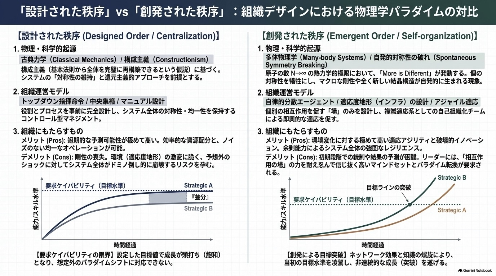

# 複雑系（complex systems）と創発プロセス（emergence process）

## 0. SUMMARY

**1. 組織は複雑適応系（CAS）として見ると理解しやすい**

組織は、設計図通りに動く機械というより、自律的な個人（エージェント）が相互作用しながら環境に適合していく生命体に近い性質を持ちます。ただしこれはあくまでモデルです。組織のどの部分にこの見方が有効かは §4 で切り分けます。

**2. More Is Different（多ければ異なる）**

ミクロな個が組み合わさると、足し算を超えた新しい次元の秩序が立ち現れます。これが創発です。アンダーソンが示したのは、マクロの法則がミクロの法則から導出できないという点でした。マクロの法則そのものは存在し、しかも簡潔です。だから創発の実務的な含意は、**管理が効く階層が移る**ことにあります。個人の行動計画は取っ手になりません。マクロ変数が取っ手になります。

**3. 中央集権が届く範囲は、アシュビーの法則が決める**

制御する側の多様性が、制御される側の多様性を下回れば、その差の分だけ制御は届きません（必要多様性の法則）。情報理論的に厳密な制約です。これは不等式なので、解が3つあります。**A: 中央の多様性を上げる／B: 対象の多様性を下げる（標準化）／C: 判断を現場に移す（委譲）**。

**4. 号令だけでは、決めたルールは組織に浸透しない**

ルールを決めること自体は設計です。しかし、決めたルールが実際に組織へどう広まるかは、号令では制御できない創発的な過程です。人はそれぞれ「周囲のどれだけが従ったら自分も従うか」という閾値を持ち、その分布が、停滞期を経て一気に浸透する非線形な広まり方を生みます。効くレバーは号令の強化ではなく、閾値の低い人から巻き込むことと、接触構造を変えることです。

**5. 創発には2つのダイナミクスがある**

- **合成的創発（揃える力）**：対話を通じてビジョン、企業文化、心理的安全性を共有・同質化し、組織のブレない土台（剛性）を形成します。
- **編成的創発（噛み合わせる力）**：多様なメンバーが異なる役割を持ち寄り、パズルのように即興的にかみ合わせることで、不確実な環境へ動的に適応します。アジャイルの真髄はこちらです。

**6. 設計と創発は、領域ごとに使い分ける**

環境が安定し、情報が中央に集約でき、失敗が不可逆な領域では、設計と標準化が優れています（航空の離着陸手順、感染管理プロトコル、会計処理）。環境が動き、判断材料が現場にしかない領域では、創発が優れています。ほとんどの組織は両方を同時に抱えています。

リーダーの役割は、この2領域を仕分けたうえで、創発領域についてはビジョンで方向性を揃えつつ（合成）、相互作用が起きる場を整えることです。

<br>

## 1. 複雑適応系（CAS）

不確実なビジネス環境において、組織を完全に管理・制御可能な機械と見なすパラダイムは、少なくとも一部の領域で通用しなくなっています。リーダーは組織の一部を **複雑適応系（Complex Adaptive Systems: CAS）** として捉え直す必要があります。

### More is Different が示したこと

物理学者フィリップ・W・アンダーソン（1972）が示したのは、要素（個人）の量的な拡大が、ある閾値を超えると質的に異なる振る舞いをマクロレベルで生み出すという事実です。すべては単純な基本法則に従っているが、その法則から全体を再構築することはできない。これが創発（Emergence）の核にあります。

組織論には Philip Anderson（1999, *Complexity Theory and Organization Science*）という同姓の別人がいます。ここで参照しているのは物理学者の Philip W. Anderson です。

### 創発は、マクロな取っ手が現れる現象である

Krakauer らの原論文は、創発についてこう述べています。

> 創発的性質を示すシステムは、部品の単純なスケーリングによって新規性を生み出すよう促すことができ、また非常に効率的な高次の記述や抽象に適している。**そしてそれが、制御と設計のためのレバー（levers for control and design）を提供する。**

創発とは、微視的な詳細を無視できる簡潔なマクロ記述（有効理論）が自発的に成立することです。個々の分子の運動を追えなくても、温度と圧力という2変数でガスは操作できます。

したがって組織について立てるべき問いは、**「わが組織における温度と圧力にあたるマクロ変数は何か」**です。会議体の構成、誰と誰が話すか、異論の許容度、意思決定の権限境界、評価の単位 — こうしたものが操作対象になります。

### 組織はKnowledge-In型の創発である

Krakauer らは創発を2つの型に分けています。単純な要素の相互作用から複雑さが生まれる **Knowledge-Out（KO）型** と、複雑な入力や環境から高度な能力が生まれる **Knowledge-In（KI）型** です。生物、経済、大規模言語モデルは KI 型です。

人間の組織は明確に KI 型です。メンバー一人ひとりが既に膨大な学習を経た存在であり、鳥の群れ（Boids）のような無情報のエージェントとは根本的に違います。組織論で単純なエージェントモデルを引用するときは、この型の違いに注意が必要です。

### 知識は関係性に宿る

ラルフ・ステイシー（2001）は、組織の知識とは中央で体系化される実体ではなく、人々の間の **複雑な応答プロセス（Complex Responsive Processes）** の中に存在すると主張しました。

このプロセスは **権力関係（Power relating）** を含み、極めて感情的かつ知的な営みです。自己組織化とは、感情的な葛藤や権力の交渉、そして有効な制約（Enabling constraints）を通じて形成される動的な秩序を指します。

ステイシーの立場は本文書の他の部分と鋭く対立します。この緊張は「最も強い反論：ステイシー」の節で正面から扱います。

<br>

## 2. 統制の限界：アシュビーの必要多様性

中央集権的統制の限界を**定理として**示しているのは、サイバネティクスの W. R. アシュビー（1956）です。

> **Only variety can destroy variety.**（多様性のみが、多様性を打ち消しうる）

制御する側が識別・対応できる状態の数が、制御される側の擾乱の数を下回るならば、その差の分だけ制御は原理的に達成されません。これは情報理論的に証明できる制約です。中央の管理部門が現場の複雑さを下回る単純さしか持てない以上、現場の全状況を統制しきることは原理的に不可能である — こう言えるのはこの法則によってです。

不等式なので、解き方が3つあります。実在の組織はこの3つを場所ごとに使い分けています。

| 解法 | 内容 | 実例 |
| --- | --- | --- |
| **A. 中央の多様性を上げる** | データ基盤、観測点、専門人材を増やし、中央が識別できる状態の数を増やす | 航空管制、金融リスク管理 |
| **B. 対象の多様性を下げる** | 標準化、モジュール化、チェックリスト、選択肢の削減 | 離着陸手順、感染管理プロトコル、会計処理 |
| **C. 判断を現場に移す** | 多様性を持つ当事者に決定権を渡す | 異常事態における機長の最終権限、自律型チーム |

航空会社は、離着陸手順では B を徹底し、異常事態では C を発動します。権限委譲は道徳的な理想ではなく、**不等式の解**です。「この業務の多様性は中央で吸収できないから C を選ぶ」。この順序で考えるのが、この法則の実務的な使い方です。

<br>

## 3. 非線形性と閾値：なぜ号令だけでは浸透しないのか

前節で見たアシュビーの法則は、中央が保持しうる多様性の量が統制の上限を規定する、という情報理論的な制約でした。ここではもう一つ、号令だけでは組織が動かない理由を扱います。ルールを決定すること自体は設計行為です。しかし、決定されたルールが実際に組織内でどのように広まるかは、号令によっては制御できない創発的な過程だからです。

創発領域の変化は、直線的に進みません。しばらく何も起きず、ある点を超えた瞬間に一気に動く。これは意志や熱意の問題ではなく、**閾値の構造**の問題です。

**閾値モデル（Granovetter, 1978）**

人はそれぞれ「周囲の何割が採用したら自分も採用するか」という閾値を持っています。閾値の分布によって、同じ働きかけでも全体が動くか動かないかが決まります。停滞期は、この分布から必然的に生じます。ここで号令を強めても、ほとんど効きません。

**複雑contagion（Centola & Macy, 2007）**

情報（単純contagion）は一度聞けば伝わりますが、**行動の変容には複数の知人からの重複した働きかけが必要**です。したがって、広く薄い伝達より**狭く濃い接触**のほうが効きます。全社メールより、同じチーム内の複数人が同時に実践している状態のほうが強い。

**実務上のレバーは2つ**

1. **閾値の低い人の密度を上げる**（誰を最初に巻き込むか）
2. **接触構造を変える**（誰と誰が同じ場にいるか）

抵抗層（閾値の高い人）を直接説得しに行くのは、コストの割に最も効かない打ち手です。周囲が変われば彼らは自動的に動きます。

<br>

## 4. 設計が有効な領域と、創発が有効な領域

アシュビーの法則が示す3つの解のうち、実務で頻繁に用いられるのはBとCです。Bはルールを定めて委ねる「設計」に、Cは現場に判断権限を渡す「創発」に相当します。以下では、目の前の業務にBとCのいずれを適用すべきかを検討します。

設計と創発の使い分けは、**業務の性質**で決まります。判断軸は4つあります。

| 判断軸 | 設計（統制）が有効 | 創発（自己組織化）が有効 |
| --- | --- | --- |
| 環境の変動性 | 低い。条件がほぼ同じまま続く | 高い。前提が数ヶ月で書き換わる |
| 情報の局在性 | 中央に集約できる。数値化しやすい | 現場にしかない。言語化しにくい判断が要る |
| 失敗の可逆性 | 不可逆・致命的。人命や巨額損失に直結 | 可逆・安価。試して戻せる |
| 反復性 | 同じ作業が繰り返される | 一回性が高く、毎回条件が違う |
| 具体例 | 給与計算、会計処理、安全手順、規制対応、離着陸チェックリスト、感染管理 | 製品探索、R&D、顧客対応の即興、術中の判断、新規事業、組織横断の課題解決 |

**ほとんどの組織は、同じ組織の中に両方を抱えています。**手術室は、器具のカウントと感染管理では極度に設計的でありながら（チェックリスト逸脱は許されない）、術中の想定外には極度に創発的です（役割を即興で組み替える）。両方が同じチームの中で、同じ日に起きています。

やるべきことは、**自組織の業務を4軸で仕分け、それぞれに正しいモードを当てること**です。

失敗は両方向で起きます。**設計領域に創発を持ち込む**（安全手順を現場裁量にする）と、**創発領域に設計を持ち込む**（探索業務を詳細なKPIで縛る）。後者ばかりが批判されがちですが、前者は人命に関わります。

<br>

## 5. 合成的創発（Composition）：同質化と共有のプロセス

合成的創発と編成的創発は、いずれも複数のメンバーが相互作用しながら1つの組織的性質を形成していくプロセスである点で共通しています。両者を分ける軸は1点のみです。すなわち、その性質はメンバー同士が類似していくことで生まれるのか（合成）、それともメンバー同士の差異がうまく組み合わさることで生まれるのか（編成）、という点です。したがって、合成的創発を個人単位への働きかけ、編成的創発を個人の組み合わせ方の問題として理解するのは正確ではありません。いずれも、個人単独の属性ではなく、人と人との相互作用の中で生じる現象です。

合成的創発とは、個人の属性が相互作用を通じて同質化し、組織レベルで共有された属性として収束するプロセスです。

**メカニズムと同型性（アイソモーフィズム）**

個人の認知、感情、態度が日常的なやり取りを通じて、共通の文化・風土・規範へと収束します。これは、個人レベルの特性が集団レベルでも同様の形で現れる「同型性」に基づいています。

**同質化の抑制力**

ASA（引き付け・選択・淘汰）プロセスや社会化（Socialization）が、メンバー間の差異を低減させ、共有された **心理的気候（Psychological Climate）** を形成します。

**発生源は常に個人である（レベル・オブ・オリジン）**

共有属性の発生源は常に個人です。組織レベルの文化や風土を評価する際は、管理者の主観的な予測に頼らず、個々のメンバーが実際に共有しているかを測定する**方法論的な厳密さ**が求められます。

**測定の具体的な方法**

簡便な方法は、メンバー全員に同一の質問（例えば「このチームが目指す方向を一言で言うと何か」）を投げかけ、回答のばらつきを見ることです。回答がほぼ同一の語彙に収束していれば同質化が進んでおり、ばらついていればまだ収束していません。

より厳密には、組織研究で標準的に用いられる2つの指標が参考になります。メンバー間の回答一致度を測る **r<sub>wg</sub>**（James, Demaree, & Wolf, 1984）と、個人間の分散のうちチーム所属によって説明される割合を示す **ICC(1)**、および集団平均としての信頼性を示す **ICC(2)**（Bliese, 2000）です。いずれも値が高いほど同質化の度合いが強いことを示します。§7-1 で示す6類型の判定手続きのうち、Q2（メンバー間で実際にどの程度そろっているかを確認する問い）は、まさにこの測定に対応します。この確認によって「十分に同質化している」と判定されて初めて、合成の土台が成立したと言えます。

**操作可能なパラメータがある**

意見形成のモデル研究（Hegselmann & Krause, 2002 の bounded confidence モデル）が示すのは、**「異なる意見にどこまで耳を貸すか」という許容度パラメータをわずかに動かすだけで、集団が単一の合意に収束するか、いくつもの島に分裂したまま二度と交わらないかが切り替わる**ということです。相転移が起きます。

これが §1 で述べた「マクロ変数を操作する」の具体例です。誰か個人を説得しても全体は変わりません。対話の構造（誰と誰が話すか、どこまで異論を許容するか）を変えると全体が変わります。

このモデルには権力も感情も入っていません。実際の組織では、上司の一言が許容度を非対称に変えます。読み取れるのは方向性までです。

<br>

## 6. 編成的創発（Compilation）：多様性と統合のプロセス

編成的創発とは、メンバーが異なる強みを発揮し、それらが複雑なパターンとして組み合わさることでマクロな能力へ統合されるプロセスです。

**機能的等価性による統合**

編成においてメンバーは同質である必要がありません。それぞれが異なる貢献を行い、パズルのピースのように噛み合うことで、全体として **機能的等価性**（個々の差異が組み合わさり、上位レベルで特定の役割を果たすこと）が達成されます。**不連続性**を前提としたモデルです。

**構成パターンが価値を生む**

ウェグナーの「トランザクティブ・メモリー」に代表されるように、誰が何を知っているかの構成パターンが重要です。ここでは **非一様な分散パターン** そのものが価値を生みます。プロスポーツチームやアジャイルチームで、全員が同じスキルを持つよりも異なる役割が高度に連携する方が高いパフォーマンスを発揮するのと同じ理屈です。

**測りにくく、モデル化しにくい**

構成的（configural）な創発は、噛み合い方が事例ごとに固有で、パラメータ1つでは表現できません。一般モデルに落ちにくいという性質があります。

これは実務上の重要な示唆でもあります。測りにくくモデル化しにくいものは、経営の視界から落ちやすい。「アジャイルの真髄」と言われながら編成的創発が最も管理されていないのは、おそらくこの測定困難性が理由です。

<br>

## 7. 創発の6類型モデル

Kozlowski & Klein (2000) は、ミクロからマクロへの創発を「要素の均一性」と「組み合わせのルール」の観点から6つに分類しました。

この枠組みはもともと**測定論**のものです。「個人から取ったデータを、チームや組織レベルの指標として集約してよいか」を判定するために作られました。ただし転用できる部分があります。集約のルールが違えば、効く介入も違う。これは分類から論理的に導ける帰結です。

| 類型 | 特徴 | 組み合わせのルール | 効く介入 |
| ------ | ------ | ------ | ------ |
| 収束的創発 (Convergent) | 強い共有度。認識や態度が均一。 | 相加的／平均的 (Shared) | 平均を動かす施策。対話、共有の場、繰り返しの発信。全員に等しく効く打ち手が意味を持つ数少ない型。 |
| プール型制限創発 (Pooled Constrained) | 最低限の貢献が求められる標準化環境。 | 相加的 (Threshold) | 下限のルール設計。底上げは平均への働きかけより最低基準の設定で動く。 |
| プール型無制限創発 (Pooled Unconstrained) | 自由度の高い貢献の積み上げ。 | 相加的 (Summation) | 総量が目的なら人数を増やすほうが速い。平均値評価は実態を隠すので分布で見る。 |
| 最小値／最大値創発 (Minimum/Maximum) | ボトルネックや天才一人が全体を決定。 | 非線形 (Limit/Max) | 最小値型は**ボトルネックだけ**を直す。平均を上げても指標は動かない。最大値型は一人に集中投資する。 |
| 分散型創発 (Variance) | 多様性そのものが価値を生む。 | 分散的 (Dispersion) | 分散を増やす／減らすことが直接の目的になる。均質化施策が逆効果になりうる。 |
| パターン型創発 (Patterned) | 役割が高度に噛み合う非一様な分散。 | 構成的／非線形 (Configural) | 個人ではなく**組み合わせ**を設計する。誰が何を知っているかの可視化。個人評価は機能しない。 |

使い方はシンプルです。動かしたい組織指標を1つ挙げ、「これはどの型か」を問う。それだけで打ち手が変わります。よくある失敗は、最小値型（ボトルネック律速）の指標に対して、全員向けの研修という収束型の介入を打つことです。平均は上がりますが、指標は動きません。

型の判定は経験的に当たりをつけるためのものです。本来この枠組みは ICC・r<sub>wg</sub>・WABA といった統計的手続きで検証されます。

---

<br>

### 7-1. 指標の分類と型の見分け方

**指標とは何か**

ここでいう指標とは、動かしたい組織レベルの数値や状態――たとえば「チームの雰囲気」「営業拠点の売上」「欠勤率」――を指します。上表の6類型は、こうした指標が個人レベルの値からどのように成り立つかを分類したものです。したがって、ある指標がどの類型に該当するかを判定することが、適切な介入を選ぶための前提になります。

**指標のカテゴリ**

実務で使われる組織指標は、内容の観点から大まかに次のように分類できます。これはKozlowski & Kleinの分類ではなく、実務でよく用いられる測定領域を整理したものです。

| カテゴリ | 内容 | 例 |
| --- | --- | --- |
| 事業成果 | 売上・利益・生産量など、事業の結果そのものを測る指標 | 営業拠点の売上 |
| 定着・稼働 | メンバーが組織にとどまり働き続けているかを測る指標 | 欠勤率、離職率 |
| 組織風土・意識 | メンバーの気持ちや考え方がそろっている度合いを測る指標 | チームの雰囲気、心理的安全性 |
| 人材の多様性 | メンバー間の違いの大きさそのものを測る指標 | 属性・バックグラウンドの多様性 |
| 知識・スキル | 誰が何を知っているか、役割の組み合わせを測る指標 | 専門性の分布、アジャイルチームの役割分担 |
| 能力の上限・ボトルネック | 最も弱い、または最も強いメンバーの能力で全体が決まる指標 | 登山チームの速度、陪審員の評決 |

カテゴリは「何を測るか」という切り口であり、「どう成り立つか」を決める6類型とは独立した軸です。同一カテゴリの指標であっても、成り立ち方（類型）は事例ごとに異なりえます。

**型の見分け方：3つの問い**

動かしたい指標を1つ定め、次の3つの問いを順に適用することで、6類型のいずれに該当するかを判定できます。

1. **Q1. その値は特定の1人の値でほぼ決まるか。** 最も優れた者、または最も劣る者の値がそのままチーム全体の値になっているならば、④最小値／最大値創発に該当します。該当する場合、以降の問いに進む必要はありません。
2. **Q2. メンバー全員が同程度の値になることが望ましいか。** 「はい」の場合、実際の一致度を確認します。ほぼ一致していれば①収束的創発、最低基準は満たしつつも個人差が残るならば②プール型制限創発です。「いいえ」（ばらつきが許容される）の場合はQ3へ進みます。
3. **Q3. 関心の対象は合計・平均か、ばらつきの大きさそのものか、それとも役割の組み合わせか。** 合計・平均であれば③プール型無制限創発、ばらつきの大きさ自体が特徴であれば⑤分散型創発、役割の組み合わせが数値以上に重要であれば⑥パターン型創発に該当します。

以下は、各類型を代表する指標を1つずつ選び、この判定手続きを適用した例です。

| | チームの雰囲気 | 営業拠点の売上 | 欠勤率 | 登山チームの速度 | メンバーの多様性 | 誰が何を知っているか |
| --- | --- | --- | --- | --- | --- | --- |
| Q1. 1人の値で決まるか | いいえ → Q2へ | いいえ → Q2へ | いいえ → Q2へ | はい。最も遅い人の速度で決まる | いいえ → Q2へ | いいえ → Q2へ |
| Q2. 全員同程度が望ましいか | はい。実際にほぼそろっている | はい。ただし最低ラインを超えていればよく、ばらつきもある | いいえ。そろっていなくてよい → Q3へ | （Q1で判定済み） | いいえ。そろっていなくてよい → Q3へ | いいえ。そろっていなくてよい → Q3へ |
| Q3. 合計・平均か、ばらつきか、組み合わせか | （Q2で判定済み） | （Q2で判定済み） | 合計・平均を見たい | （Q1で判定済み） | ばらつきの大きさそのものが特徴 | 誰が何を担当しているかの組み合わせが重要 |
| 判定 | ①収束的創発 | ②プール型制限創発 | ③プール型無制限創発 | ④最小値／最大値創発 | ⑤分散型創発 | ⑥パターン型創発 |

この判定手続きは経験的に当たりをつけるためのものであり、本来必要な統計的検証（ICC・r<sub>wg</sub>・WABAなど）を代替するものではありません。

---

<br>

### 7-2. 6類型の詳細と具体例

| 創発の類型 | メカニズム（組み合わせルール） | 論文内で挙げられている具体例 |
|---|---|---|
| ① 収束的創発 *(Convergent)* | 完全な同質化（合成）<br>全員が同じ種類・同じ量の要素を提供し、マクロな平均や総和に綺麗に収束する。 | レガッタ（ボート競技）の漕ぎ手、シンクロナイズドスイミング、共有メンタルモデル、組織風土（気候） |
| ② プール型制限創発 *(Pooled Constrained)* | 最小基準のある緩やかな共有<br>同じ種類の要素だが、提供する「量」は人により異なる。システム（インセンティブやルール）によって最小の貢献基準が縛られており、分散は中程度に抑えられる。 | 営業拠点の売上パフォーマンス（全員が一定以上のノルムを達成しつつ全体の売上を作る）、意思決定において共有されている共通情報 |
| ③ プール型無制限創発 *(Pooled Unconstrained)* | フリーライダーを許容する合成<br>要素の種類は同じだが、提供する量に制限がないため、バラつきが非常に大きい。一部のサボり（社会的手抜き）を平均値やカウントにそのまま合算する。 | チーム内の欠勤率、離職率、労働災害発生率 |
| ④ 最小値／最大値創発 *(Minimum/Maximum)* | 非線形な「極端値」による決定<br>メンバーの中で最も優秀な一人、または最も足手まといな一人のレベルが、そのままチーム全体のケイパビリティを決定する。 | 最大値例: 戦車の乗組員やアメフトのクォーターバックの認知能力（一人飛び抜けた知性があればチームが機能する）<br>最小値例: 陪審員の評決（一人の反対派が全体を止める）、登山チームの登頂速度（最も遅い人に引きずられる） |
| ⑤ 分散型創発 *(Variance)* | バラつきそのものが全体の特性になる<br>平均値ではなく、メンバー間の差異や多様性の度合い（分散）自体がマクロな特徴として創発する。 | チームのデモグラフィック多様性（年齢や性別の分散）、規範の結晶化度、リーダーのカリスマの均一性、文化の強さ |
| ⑥ パターン型（編成）創発 *(Patterned)* | パズルのように噛み合う相互作用<br>メンバーが全く異なる役割や知識（異質な要素）を持ち寄り、それらが動的かつ非線形に噛み合うことで、マクロな全体能力が創発する。 | トランザクティブ・メモリ（Wegner, 1995: 誰が何を知っているかを互いに把握し補い合う知性）、多機能アジャイルチームの適応的パフォーマンス |

---

<br>

### 7-3. 「創発 ＝ アジャイル」という理解について

実務では創発とアジャイルがほぼ同義で語られます。しかしそれでは創発の持つポテンシャルを半分しか使えません。創発には、安定（コンセンサス）を生むダイナミクスと、適応（アジリティ）を生むダイナミクスの2つがあるからです。

**① 安定と秩序を生む創発（合成的創発）**

上記の ①収束的創発 や ②プール型制限創発 がこれにあたります。

- *具体例*: 企業の共有されたビジョン、強い企業文化（風土）
- *特徴*: 組織のアイデンティティを固定化し、ブレない秩序や剛性（Rigidity）をもたらします。メンバー同士が相互作用を繰り返すことで考え方が同質化し、「うちの会社らしさ」が自発的に生まれます。

**② 適応と即興を生む創発（編成的創発）**

アジャイルチームや自己組織化チームの文脈で語られるのは、⑥パターン型創発 や ④最小値／最大値創発 の領域です。

- *具体例*: 多機能なスクラムチームやプロジェクトチーム
- *特徴*: デザイナー、エンジニア、マーケターが異なるパズルピース（異質性）として噛み合うことで、マクロな適応力が創発します。

**組み合わせ方**

1. **合成的創発（①や②）** で、組織のブレない土台（心理的安全性、企業文化、共通のビジョン）をメンバー間に収束・共有させる
2. その土台の上で **編成的創発（⑥や④）** を使い、多様性と即興的な組み合わせを爆発させる

この「安定と適応の二重奏」が、CASとしての組織を活性化させる鍵になります。

なおこの順序は Kozlowski & Klein の命題ではありません。6類型は創発の分類であって、順序の理論ではないからです。実務的な解釈として扱い、支えるなら心理的安全性研究（Edmondson など）を別に用意してください。

<br>

## 8. 実践ロードマップ：相互作用の管理と成長支援

創発領域において、リーダーの役割は個人のアウトプット管理から相互作用（場）の設計へシフトします。設計領域（§4）では話が別です。

**感情と権力のダイナミクスを扱う**

自己組織化の現場では、権力と感情の交渉が不可避です。リーダーはこれを排除せず、建設的な対立を許容し、相互作用の質を高める「有効な制約」を設ける必要があります。

**エントレインメント（引き込み）**

創発プロセスには初期の停滞期（潜伏期）があります。これを乗り越えて非線形な成長を実現するには、組織の自然なリズムと同期する **エントレインメント** を意識します。不自然な締め切りを強制せず、チームの成熟サイクルを見極めて支援する。

この議論は §3 の閾値の性質と整合的で、実感にも合います。ただし形式的な裏づけはありません。経験則として扱ってください。

**Doing more with less**

Krakauer らが "less is more" と呼ぶように、知能とは能力をより効率的に使うことにあり、複雑な問題を少ない資源（ルールや概念）で解く「アルゴリズムの圧縮」に本質があります。リーダーは、チームが経験から強力な類推（アナロジー）や共通言語を見出し、少ない情報でより多くを成し遂げられるよう、学習のプロセスを忍耐強く支援してください。

**月曜からできること**

1. 自分の担当業務を §4 の4軸で仕分ける。紙に2列書き、設計領域と創発領域に振り分ける。「全部が創発」「全部が設計」になったら判定を疑う。
2. 設計領域に創発を持ち込んでいないか点検する。安全・会計・規制対応を現場裁量にしていないか。
3. 創発領域に設計を持ち込んでいないか点検する。探索業務を詳細なKPIと週次進捗で縛っていないか。
4. 動かない指標を1つ選び、§7 のどの型かを問う。最小値型なのに全員向け施策を打っていないか。
5. 浸透しないルールについて、号令を増やす前に閾値の分布と接触構造を見る。
6. マクロ変数を1つ特定し、そこだけを変えて観察する。会議体の構成、誰と誰が話すか、異論の許容度、権限境界。
7. 会議のあと、後述の4つの問いを自分に当てる。

<br>

## 9. 参考文献

**創発と複雑系の理論**

* Anderson, P. W. (1972). *More Is Different.* Science, 177(4047), 393–396.
* Krakauer, D. C., Krakauer, J. W., & Mitchell, M. (2025). *Large Language Models and Emergence: A Complex Systems Perspective.* arXiv:2506.11135（Phil. Trans. R. Soc. A 掲載版あり）
* Ashby, W. R. (1956). *An Introduction to Cybernetics.* Chapman & Hall.
* Reynolds, C. W. (1987). *Flocks, Herds, and Schools: A Distributed Behavioral Model.* SIGGRAPH '87.

**組織論・集団ダイナミクス**

* Kozlowski, S. W. J., & Klein, K. J. (2000). *A Multilevel Approach to Theory and Research in Organizations.*
* Stacey, R. (2001). *Complex Responsive Processes in Organizations: Learning and Knowledge Creation.* Routledge.
* Stacey, R., Griffin, D., & Shaw, P. (2000). *Complexity and Management: Fad or Radical Challenge to Systems Thinking?* Routledge.
* Uhl-Bien, M., Marion, R., & McKelvey, B. (2007). *Complexity Leadership Theory.* The Leadership Quarterly, 18(4).
* Hegselmann, R., & Krause, U. (2002). *Opinion Dynamics and Bounded Confidence.* JASSS, 5(3).
* Granovetter, M. (1978). *Threshold Models of Collective Behavior.* American Journal of Sociology, 83(6).
* Centola, D., & Macy, M. (2007). *Complex Contagions and the Weakness of Long Ties.* American Journal of Sociology, 113(3), 702–734.
* Wegner, D. M. (1995). *A Computer Network Model of Human Transactive Memory.*
* James, L. R., Demaree, R. G., & Wolf, G. (1984). *Estimating within-group interrater reliability with and without response bias.* Journal of Applied Psychology, 69(1), 85–98.
* Bliese, P. D. (2000). *Within-group agreement, non-independence, and reliability: Implications for data aggregation and analysis.* In K. J. Klein & S. W. J. Kozlowski (Eds.), *Multilevel Theory, Research, and Methods in Organizations* (pp. 349–381). Jossey-Bass.

<br>
<br>

# 問い

## 創発（Emergence）の概念とは

創発は、自然科学における還元主義・構成主義の限界を解き明かすための厳密な説明プロセスとして誕生しました。それが組織論や社会科学に輸入された結果、トップダウンで中央集権的にすべてを設計・管理できるとする機械論的パラダイムに対するアンチテーゼとして機能するようになります。

### 1. 起源としての自然科学的な発見プロセス

創発は、多体系（Many-body systems）を記述するための厳密な自然科学的アプローチとして定式化されました。

**構成主義の崩壊**

物理学者 P.W. アンダーソンが1972年の『More Is Different』で示したのは、「すべては単純な基本物理法則に従っているが、だからといってそれらの法則から宇宙を再構築することはできない」という事実です。

**有効理論（Effective Theory）の発見**

自然科学における創発の本質は、微視的な詳細（量子力学や個々の分子の運動）を無視し、より低次元で簡潔な変数（温度や圧力などのマクロ状態）を用いてシステムを説明できる「有効理論」が自発的に成立することにあります。

有効理論が成立するということは、そのマクロ変数を通じた**操作が可能になる**ということでもあります。創発は説明の道具であると同時に、制御の道具です。

**対称性の破れ**

原子や分子の数（N）が極限（N → ∞）に近づくと、空間の完全な対称性が自発的に破れ、結晶格子や超伝導といった、元の要素の性質からは予測不能な新しいマクロの物理的剛性（秩序）が突如として立ち現れます。

<br>

### 2. 組織論における中央集権へのアンチテーゼ

**機械論的マネジメントへの批判**

従来の経営学や組織設計は、優秀なパーツ（個人）を集めて完璧な組織図とルールをトップダウンで構築すれば、狙い通りの組織ケイパビリティが作れるという設計主義に基づいていました。組織の一部が複雑適応系である以上、ミクロな個人のルールの単純な外挿でマクロな能力を構成することはできません。

操作の単位が、個人からマクロ変数へ移ります。

**知識創造における集権化への反論**

ラルフ・ステイシー（2001）は、組織の学習や知識創造を中央集権的にコード化・管理される情報処理プロセスと捉える主流派のシステム思考を痛烈に批判しました。知識とはマニュアルに保存される静的なものではなく、人々の日々の動的な関係性（Complex Responsive Processes of relating）そのものの中にしか自発的に存在し得ない、と彼は主張します。

**ミクロとマクロの乖離**

Kozlowski & Klein（2000）も、マクロな組織の現象を個人の行動に単純還元するアプローチと、個人のデータから組織レベルの介入を安易に推奨するアプローチ（原子論的誤謬）の双方を、創発モデルによって乗り越える必要性を説いています。

<br>

### 3. 論理の結合点

複雑系の知見から組織論的な結論までは、次の道筋でつながります。

```
マクロの法則はミクロの法則から導出できない（Anderson, 1972）
　　↓
しかしマクロには簡潔な有効理論が成立し、それが操作の取っ手になる（Krakauer et al., 2025）
　　↓
ゆえに管理の対象は「個人の行動」から
　　　　　　　　　「マクロ変数・ルール・相互作用の構造」へ移る
　　↓
その上で、中央が扱える多様性を超える領域では、原理的に統制が届かない（Ashby, 1956）
　　↓
ゆえに領域ごとに、A（中央の多様性を上げる）／
　　　　　　　　　B（対象の多様性を下げる＝標準化）／
　　　　　　　　　C（判断を現場に移す＝委譲）を選び分ける
```

この連鎖でしばしば省略されるのが2段目と4段目です。省略すると「ミクロからマクロは一方通行だから統制は不可能であり、リーダーは場の整備に徹するべきだ」という短い議論になりますが、ここには2つの飛躍が含まれます。

第一に、**導出できないことと制御できないことは別の命題**です。超伝導も温度も圧力も、マクロなレベルでは制御できます。第二に、**「完全には縛れない」から「場の整備だけに限定せよ」は導けません**。部分的な統制も統制です。

中央集権的な管理が破綻するのは、**必要多様性の不等式を満たせない領域において**です。その外では、設計と統制は正しく機能します。

<br>

### 「設計された秩序」と「創発された秩序」

<br>



<br>

**「設計された秩序」（左）**

古典物理学における構成主義（還元した要素を組み立てれば全体を100%再構築できるという仮説）を起源とします。トップダウンのルールや統制によって、静的で予測可能な状態を保ちます。

環境が安定し、情報が中央に集約でき、失敗が不可逆な領域では、この秩序は極めて頑健です。高度に設計された組織（航空、手術室、半導体工場、原子力）は、最も長命で信頼性の高い組織でもあります。脆弱性が露呈するのは、**環境の変動性が中央の吸収能力（必要多様性）を超えたとき**です。

**「創発された秩序」（右）**

多体物理学における自発的対称性の破れを理論的バックボーンとします。自己組織化チームにおけるメンバー間の動的な相互作用を通じて、環境変化への高い適応力（レジリエンス）を組織にもたらします。

**この図を使うときの注意**

自発的対称性の破れが生むのは、物理学的には**剛性（Rigidity）**です。結晶は硬い。このアナロジーが組織論で対応するのは、**共有された文化やアイデンティティ、つまり合成的創発**です。§7-3 で「合成的創発は剛性をもたらす」と書いたのと同じことを、物理側から言っています。アジリティは構成的な噛み合わせという別のメカニズムから来ます。

また「設計＝脆い／創発＝強い」は議論の入口としては有効ですが、結論にすると誤ります。§4 の表が示すとおり、条件によって優劣は入れ替わります。この図は2つのモードが存在することを示すものとして読んでください。

<br>
<br>

## システム思考とナレッジマネジメントへの批判

### 1. 情報処理的・中央集権的ナレッジマネジメントへの批判

1990年代以降、ナレッジマネジメントの主流派は、組織の知識創造を「個人の頭の中にある暗黙知をマニュアルやシステムへコード化し、中央集権的にデータベースへ蓄積・共有することで、組織全体で効率的に処理・管理できるもの」と定義してきました。

ステイシーはこのアプローチを「もはや維持不可能（no longer tenable）」と切り捨てました。批判の核心は、**知識とは人間から切り離してデータベースに保存したり、中央からコントロールしたりできる静的な実体（Object）ではない**という点にあります。

知識をモノのように扱い、中央からパイプラインで流すように設計・流通させようとするシステム思考の前提そのものが、組織という複雑な生命体の実態を見誤っている、というのが彼の主張です。

### 2. 主流派システム思考の3つの盲点

**感情と知的プロセスの分断**

主流派のモデルは、組織の学習を冷徹で合理的なコンピュータのごとき認知・情報処理プロセスとして扱います。しかし人間による真の学習や知識創造は極めて感情的（Emotional）なプロセスであり、不安、情熱、葛藤といった感情的な関わり合いと不可分です。

**権力関係（Power Relating）の無視**

組織における対話や知識の創発は、常に人と人との政治的なパワーバランス、可能にすると同時に制約し合う権力関係の中で行われます。主流派はこうした泥臭い権力のダイナミクスをノイズとして排除し、クリーンに設計された情報フローだけを記述しようとしました。

**創造と破壊の同時性の否定**

新しい知識やアイデアが創発されるプロセスは、単なる改善ではなく、既存のルールやアイデンティティを根底から揺るがす、創造的であると同時に破壊的な（Creative as well as destructive）プロセスです。これを中央から完全に予測・管理しようとすれば、創発の芽であるゆらぎやカオスをすべて摘み取ってしまいます。

### 3. 代替案：複雑な応答プロセス

ステイシーは、システム思考に代わるフレームワークとして **複雑な応答プロセス（Complex Responsive Processes of relating）** を提唱しました。

**知識は関係性そのものに宿る**

知識とは、中央のサーバーやマニュアルに保存されているデータではなく、組織内の人々が交わすリアルタイムの対話（Communicative interaction）と、その関係性の質（Qualities of those relationships）そのものの中に、動的に存在し続けます。

**自己組織化的な相互作用をプロセスの中央に置く**

組織が学習し知性を獲得する鍵は、上空から描かれた情報フローの設計図にはありません。現場のメンバー同士が目の前の不確実な状況にリアルタイムで反応し合い、調整し合う自己組織化的な相互作用の対話インフラを、どれだけ耕せるかにかかっています。

<br>
<br>

## 最も強い反論：ステイシー

ここまでステイシーを引用してきましたが、彼の立場は本文書のアプローチそのものと対立します。この対立を隠さずに扱います。

### 1. ステイシーはCASの組織適用を自ら撤回した

ステイシーの仕事は大きく2期に分かれます。第一期では「カオスの縁」やステイシー・マトリクスといった複雑系由来の枠組みを用いていました。

第二期（複雑応答プロセス期）に入って、彼はそれらを自ら撤回します。ステイシー・マトリクスについては、確実性と不確実性のパラドクスを潰す形で解釈されやすいとして、図そのものの使用に反対するようになりました。そして**複雑適応系を組織に適用すること自体を放棄し、自然科学をそのまま人間の行為に適用するのは無効（invalid）である**と論じます。

`Stacey, R. (2001). Complex Responsive Processes in Organizations` は、CASの組織適用から離脱していく本です。

### 2. 彼の立場からすれば、§1〜§8 は批判対象になる

鳥の群れのモデルを持ち出し、物理学の対称性の破れを引き、集団を6つの型に分類し、効く介入を処方する。これらはすべて、彼が「組織という人間の営みを、外から眺める客体として扱う誤り」と呼んだものに当てはまります。

「リーダーは場を整えるべきだ」という結論も彼のものではありません。リーダーが相互作用の場を設計できるという発想自体を、彼は管理主義が裏口から戻ってきたものとして警戒していました。

### 3. この反論をどう受け止めるか

全面的に受け入れれば、モデルも類型も介入も全部捨てることになり、実務的にはほぼ何も残りません。ステイシー自身、代替となる設計論を提示していません。設計論を求めること自体が誤りだ、というのが彼の主張だからです。

現実的な着地はこうです。**ステイシーは理論的基礎としてではなく、是正装置（corrective）として使う。**

モデルは使う。そのうえで、モデルが必ず落としているもの — 感情、権力、即興、その場の生々しさ — を思い出させる装置として、彼の問いを手元に置く。§5 で意見形成モデルに「権力も感情も入っていない」と付記したのは、この使い方です。

実務的には、彼の批判は次項の**4つの問い**に圧縮できます。

### 4. 「場の整備」を主張しているのは誰か

「リーダーは個人を統制するのではなく、創発が起きる条件を整えよ」という主張を体系化したのは、**Uhl-Bien, Marion & McKelvey (2007)** の Complexity Leadership Theory です。彼らはリーダーシップを3つの機能に分けました。

| 機能 | 内容 |
| --- | --- |
| **Administrative（管理型）** | 計画、調整、資源配分。官僚制的な機能で、これ自体が必要とされています |
| **Adaptive（適応型）** | 現場の相互作用から生まれる、公式の権限に紐づかない変化の動き |
| **Enabling（実現型）** | 上記2つの間に立ち、適応的な動きが管理機構に潰されないよう緩衝し、条件を整える機能 |

この理論は管理機能の廃止を主張していません。3つの機能の**相互の絡み合い**を扱う理論であり、その意味で §4 の使い分けの立場と整合します。

<br>
<br>

## 何を学ぶべきか

批判の背景にある論理と、それを実務に落とし込むためのフレームワークを体系的に学ぶための領域を整理します。

### 1. 複雑系組織論（Complexity Theory in Organization Science）

組織を、自律的な個人（エージェント）が相互作用しながら環境に適合していく複雑適応系として捉える領域です。

- **エージェントとスキーマ（Schemata）**: 独自の認知枠組みを持つ個人が、どのように自発的にネットワークを形成するか
- **カオスの縁と共進化**: 変化の激しい環境で、組織が適応度地形（Fitness Landscape）をどのように探索し、自己組織化を果たすか
- **複雑系リーダーシップ**: マネージャーの役割は個人の行動設計ではなく適応度地形の修正・管理であるという思想。Uhl-Bien, Marion & McKelvey (2007) の体系です

### 2. 複雑応答プロセス理論（Complex Responsive Processes of relating）

ラルフ・ステイシーらが提唱し、ハートフォードシャー大学の複雑性とマネジメントセンターを中心に体系化された領域です。

- **関係性の中の知識**: 知識をコード化して保存できる実体とみなす主流派ナレッジマネジメントを排し、知識とは人々の間における動的な対話や関わり合いの質そのものであると定義します
- **学習の二面性**: 学習や知識創造は「感情的かつ知的」「創造的かつ破壊的」「可能にすると同時に制約し合うパワー関係」の動的なプロセスであることを学びます

この領域は上記1と対立関係にあります。両方を無批判に併用することはできません。両者の緊張そのものを理解することが、この2領域を学ぶ最大の価値です。

### 3. マルチレベル組織論（Multilevel Theory in Organizations）

コズロフスキーやクラインらが体系化した、ミクロ（個人・心理）とマクロ（組織・構造）を架橋する統合パラダイムです。

- **メゾ・パラダイム（Meso Paradigm）**: 心理学的アプローチ（個人の差異）と社会学的アプローチ（集団・構造の制約）を融合させる
- **創発のシステムダイナミクス**: 個人の認知や行動が、どのような相互作用を経てマクロな組織能力へ創発するのか、その因果的メカニズム
- **統計的妥当性**: WABA、HLM、ICC、r<sub>wg</sub> など。この統計的手続きがこの領域の中核であり、6類型はその副産物です

### 4. サイバネティクス／制御理論

§2 の必要多様性の法則が属する領域です。中央集権的統制の限界を、比喩ではなく定理として扱えるようになります。アシュビーの『An Introduction to Cybernetics』（1956）、およびその組織論への応用としてスタッフォード・ビアの Viable System Model が入口になります。

### 5. クリティカル・マネジメント研究（Critical Management Studies）

主流派経営学が前提としている道具的合理性（効率や管理の最大化）やトップダウンの統制の限界を暴き、組織のあり方を批判的に再考する領域です。

- **設計主義への疑問**: 中央集権的な設計主義が、なぜ複雑なシステムにおいて機能しないのか
- **自己組織化の正当性**: 統制を緩めること（Loose coupling）が、組織の柔軟性やサバイバル能力にどう寄与するか

<br>
<br>

## 「対話の質」を測る4つの問い

会議のあとに自分に当てる問いです。スコアリングも妥当性検証もありません。

### 1. 【感情 ── 感情が知性を動かしているか？】

- **問い**：今日の対話は、客観的なデータやロジックだけのやり取りでしたか。それともメンバーの本音、不安、情熱、葛藤といった感情的な関わり合いが含まれていましたか。
- **ポイント**：真の学習や知識創造は感情と不可分です。感情が押し殺され、データ処理マシンと化した対話からは、組織を動かすエネルギーは生まれません。

<br>

### 2. 【パワー ── 互いを活かし合えているか？】

- **問い**：特定の誰かが会話の主導権を握り、他者を制約する場になっていませんでしたか。発言がお互いを刺激し、新たな行動や思考を可能にし合う関係性でしたか。
- **ポイント**：対話は常にパワー関係（Power relating）の中で行われます。ヒエラルキーによる制約が強すぎると、自己組織化は一瞬で停止します。

<br>

### 3. 【破壊と創造 ── 「当たり前」を揺るがせているか？】

- **問い**：誰もが傷つかない無難な合意で終わりましたか。既存のルールや暗黙の前提を疑い、一時的な混乱をもたらすような破壊的かつ創造的な瞬間がありましたか。
- **ポイント**：イノベーションの創発は、常に既存の古い秩序の破壊とセットで訪れます。耳の痛い意見や一見突飛なアイデアによる「心地よい揺らぎ」を歓迎できているかが鍵です。

<br>

### 4. 【即興 ── 予期せぬ「脱線」から何かが生まれたか？】

- **問い**：用意されたアジェンダやスライドをきれいになぞるだけの時間でしたか。偶発的な脱線や雑談から、その場で即興的に面白いアイデアが立ち現れましたか。
- **ポイント**：組織の生きた知恵は、静的なマニュアルやコード化されたデータベースには存在しません。対話のプロセスにおける「今この瞬間（Living Present）」の自己組織化的な相互作用からのみ、真のナレッジが創発されます。

<br>
<br>

---

## この文書の位置づけ

ここに書かれた組織論的な含意の多くは、理論からの推論と他分野からの類推にとどまります。

アシュビーの法則とアンダーソンの議論は形式的に厳密ですが、それを人間組織に適用する一歩は厳密ではありません。「最も強い反論：ステイシー」の節は、この一歩に向けられた批判です。

§4 の4軸は、複数の文献から構成した実務的な整理です。6類型の型判定も目視によるもので、本来必要な統計的検証は別に要ります（§5で示したr<sub>wg</sub>・ICCは、あくまで合成的創発の同質化度を測る手段であり、6類型全体の判定を代替するものではありません）。

これらを踏まえたうえで、境界条件つきで使ってください。
