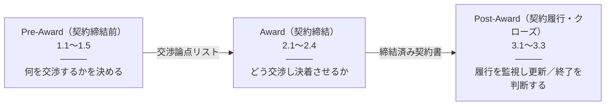
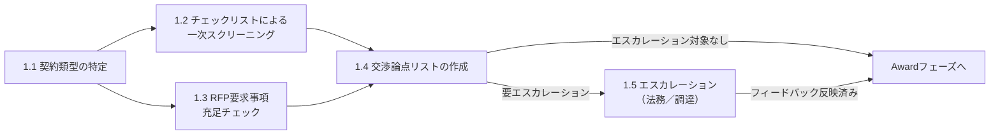
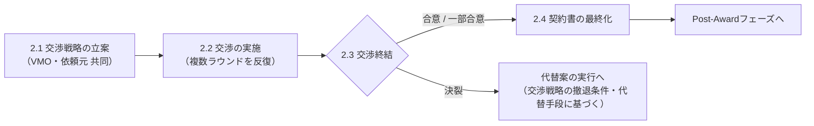
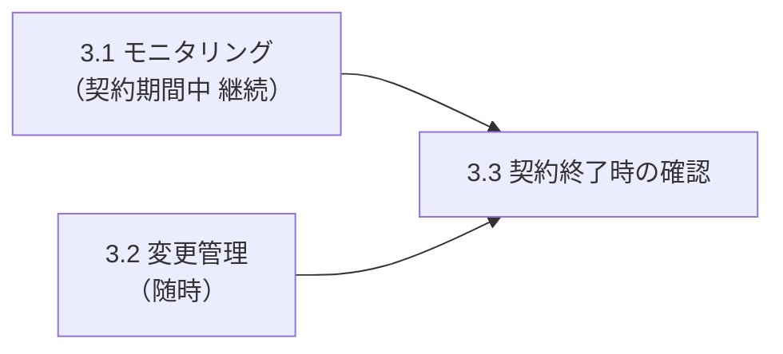

# IT契約管理　標準業務プロセス

> **この章の位置づけ**：ANSI/NCMA CMS標準のライフサイクルフェーズ（Pre-Award／Award／Post-Award）を骨格として、IT部門がIT契約を審査・締結・運用する際の標準業務プロセスを定義する。各フェーズは開始条件・終了条件・アクションとアウトプットを明示し、アクションに順序・依存関係がある場合はフローチャートで示す。CMS自体の指導原則・ドメイン・コンピテンシーの解説は `appendix/cms-standard/A_cms-lifecycle-overview.md` にまとめてあり、本章では各フェーズが対応するCMSドメインを一行で示すのみとする。
> **対象読者**：IT部門メンバー、契約審査に関わる担当者

## 要旨

IT契約の標準業務プロセスは、ANSI/NCMA CMS標準の3つのライフサイクルフェーズ（Pre-Award＝契約締結前、Award＝契約締結、Post-Award＝契約履行・クローズ）に沿って設計する。各フェーズについて、開始条件・終了条件（完了の定義）・実行するアクションとそのアウトプットを定義し、アクション間に依存関係がある場合はフローチャートとクリティカルパスを示す。契約書レビューエージェント・要求事項充足チェックエージェントでできること・できないこと、利用シーン・活用方法・結果の取り扱いは「4. エージェントの活用」にまとめる。

## フェーズ全体像

各フェーズは、前フェーズのアウトプット（矢印上の成果物）が揃った時点で開始する。フェーズ内の各アクションの依存関係は、それぞれの「フロー」に示す。

## 1. Pre-Award（契約締結前）フェーズ

本フェーズはCMSドメイン**2.1 ソリシテーション開発（バイヤー主体）**に対応する。詳細は `appendix/cms-standard/A_cms-lifecycle-overview.md` を参照。

### 開始条件

- 新規契約または契約更新の検討が始まり、契約相手・提供サービスの内容が具体化している

### 終了条件（完了の定義）

- 契約類型コードが確定している
- 該当チェックリスト（`appendix/checklists/`）による照合結果が得られている
- RFP等の要求仕様書がある場合、RFP要求事項充足チェック結果（チェックリストでカバーされない項目を含む）が得られている
- **交渉論点リスト**（優先順位・交換条件を含む）が作成されている
- 必要な場合はエスカレーションを実施し、法務・調達からのフィードバックが「必須対応事項」と「参考情報（依頼元が判断できるもの）」に整理されている
- 上記を踏まえた交渉論点リストが、Awardフェーズに引き継げる状態になっている（この時点ではまだ契約書は最終化されていない）

### アクションとアウトプット

| # | アクション | インプット | アウトプット | 実施者／判定区分 |
|---|---|---|---|---|
| 1.1 | 契約類型の特定 | 契約相手・提供サービスの情報（契約書ドラフトや見積があれば併用） | 契約類型コード（例：A-2） | IT部門内で完結（担当者が単独で判定できることが多い。判定に迷う場合はIT部門内でレビューする） |
| 1.2 | チェックリストによる一次スクリーニング | 契約類型コード、契約書案または見積・提案内容 | **チェックリスト照合結果**（項目ごとの条文有無・充足度・対応区分などの機械的な照合結果。エージェントを利用する場合はその自動チェック結果がこれにあたる。この時点では懸念事項の評価や解釈は行わない） | チェックリスト上の各項目に明記（IT部門内で完結／法務エスカレーション／調達連携）。**1.3と並行して実施可能** |
| 1.3 | RFP要求事項充足チェック | RFP等の要求仕様書、契約書案 | RFP要求事項の充足チェック結果（チェックリストでカバーされない項目を含む） | IT部門（依頼元と連携）。**1.2と並行して実施可能** |
| 1.4 | 交渉論点リストの作成 | 1.2のチェックリスト照合結果、1.3のRFP要求事項充足チェック結果 | **交渉論点リスト**（優先順位・交換条件を含む） | IT部門（依頼元と連携）。**Pre-Awardフェーズで最も重要なアクション** |
| 1.5 | エスカレーション（必要時） | 1.4の交渉論点リスト、契約書案（両者を添えて提出） | 法務・調達部門からのフィードバック（「必須対応事項」「参考情報」に整理済み） | IT部門 → 法務部門／調達部門。**最終的な法的判断は法務部門が行う** |

#### 1.4 交渉論点リストの作成手順

1.2・1.3の結果はいずれも機械的なチェック結果に過ぎず、そこから交渉に使える論点を組み立てるのが1.4であり、ここでほぼ成否が決まる。

1. 1.2のチェックリスト照合結果と、1.3のRFP要求事項充足チェック結果（特にチェックリストでカバーされない項目）を突き合わせ、契約書上どのような条件になっているかを整理し、依頼元に正しく情報を共有する
2. 優先順位と交渉戦略を整理する。条件にトレードオフや同等価値の代替がないかを検討し、各条件を「絶対に譲れないもの」と「譲れるもの（ただし何と交換条件とするか）」に分類する
3. 上記1・2に論点整理を加えたものが交渉論点リストである
4. なお、「契約を締結しない」という撤退条件の検討はこの段階（交渉論点リストの作成時点）では行わない。撤退条件はAwardフェーズ2.1「交渉戦略の立案」で`form2_negotiation-strategy.md`を用いて整理する

エスカレーション（1.5）の要否は、1.2のチェックリスト判定（項目ごとの「法務エスカレーション」「調達連携」の対応区分）に加えて、1.3のRFP要求事項充足チェックのうち、必須区分かつ契約書側が未充足のもの（`requirement-check-agent`の`/requirement-checker`が出力する「必須 かつ 未充足・チェックリスト非カバー」の最優先サマリーに該当する項目）があるかどうかも踏まえて判断する。いずれか一方でも該当項目があれば1.5のエスカレーションを実施する。

テンプレート：`appendix/templates/form1_negotiation-points-list.md`

1.5のエスカレーションでは、交渉論点リストと契約書を添えて法務・調達に提出し、それぞれからフィードバックを得る。このフィードバックは、必ず対応しなければならない「必須対応事項」と、依頼元が参考情報として判断できる「参考情報」とに整理したうえで交渉論点リストに反映する。

Pre-Awardフェーズの役割は、チェック結果をもとに交渉論点リストを作成し、必要に応じてエスカレーションを行ってフィードバックを整理することであり、ベンダーとの交渉そのもの・契約書の確定は行わない（Awardフェーズで実施する）。

エージェントによる支援（契約類型の自動判定、チェックリスト照合、法務レビュー下書きの生成、RFP要求事項の抽出・充足チェック）は「4. エージェントの活用」を参照。エージェントを利用しない場合は、担当者が該当チェックリストの各項目を契約書案と直接突き合わせて1.2の照合結果を作成する（1.1の類型判定、1.3の充足チェックも同様に手動で実施できる）。エージェントの利用有無にかかわらず、本フェーズの終了条件は変わらない。

### フロー

**クリティカルパス**：1.2と1.3は並行して実施できるため、この区間は両者のうち所要時間が長い方（法務・調達との連携が発生しうる1.2、またはRFPの分量に応じた1.3）が律速要因になる。その後1.4を経て、エスカレーションが発生する経路（1.1 → 1.2／1.3（並行） → 1.4 → 1.5 → Awardフェーズ）が全体のクリティカルパスになりやすい。エスカレーションの発生要因は、1.2のチェックリスト判定（法務エスカレーション／調達連携）と、1.3のRFP要求事項充足チェック（必須かつ未充足のもの）の2系統があり、いずれか一方でも該当すればこの経路をたどる。法務・調達からの回答待ちが律速要因になるため、エスカレーション対象がある案件はこの経路の所要時間がフェーズ全体のリードタイムを決める。なお、1.4（交渉論点リストの作成）はエスカレーションの有無によらず必ず実施する、Pre-Award最大の価値創出ステップである。

## 2. Award（契約締結）フェーズ

本フェーズはCMSドメイン**3.1 契約形成（バイヤー・セラー共同）**に対応する。詳細は `appendix/cms-standard/A_cms-lifecycle-overview.md` を参照。本フェーズそのものが「ベンダーとの交渉」であり、単一のアクションではなく、交渉戦略の立案から交渉本体の実施、終結後の契約書最終化までを含む一連のプロセスとして扱う。この段階で価格・コストの単独評価やソース選択を新たに行うことは想定しない（複数候補間の比較検討はPre-Awardまでに完了しているものとする）。交渉は最終的に「合意」「一部合意」「決裂」のいずれかで終結し、決裂の場合は交渉戦略に基づく代替案の実行に移る。なお、締結後の契約情報の記録（管理台帳への登録等）は基盤担当が別プロセスで行うため、本書のスコープ外とする。

### 開始条件

- Pre-Awardフェーズが完了し、交渉論点リスト（該当する場合は法務・調達からのフィードバックのうち必須対応事項を反映したもの）が引き継がれている。この時点ではまだ契約書は最終化されていない

### 終了条件（完了の定義）

- 交渉が「合意」または「一部合意」で終結し、契約書の最終化（2.4）を経て契約が締結されている（一部合意の場合は、残論点と契約締結後の定例会での継続審議予定が記録されている）
- **または**、交渉が「決裂」に終わり、交渉戦略（2.1）で定めた撤退条件・代替手段に基づく代替案の実行に移行することについて依頼元の合意が得られている（この場合、本契約は締結されない）

### アクションとアウトプット

| # | アクション | インプット | アウトプット | 実施者 |
|---|---|---|---|---|
| 2.1 | 交渉戦略の立案 | Pre-Awardの交渉論点リスト | 交渉戦略（論点の提示順序、時間的制約への対応方針、撤退条件・代替手段を含む） | VMO・依頼元（共同） |
| 2.2 | 交渉の実施 | 2.1の交渉戦略、契約書案 | 各論点についての進捗（暫定的な合意・保留・対立の状況）。交渉戦略で定めた提示順序に従い、複数ラウンドの折衝を反復する | IT部門・調達（必要に応じて法務） |
| 2.3 | 交渉終結 | 2.2までの交渉結果 | 交渉結果の分類：**合意**（交渉論点リストの内容が解消され契約書に反映できる）／**一部合意**（主要論点は解消したが一部残論点がある。時間切れにより自社提案どおりの内容で一旦決着させた場合を含む）／**決裂**（合意に至らず、契約を締結しない） | IT部門・調達（必要に応じて法務） |
| 2.4 | 契約書の最終化 | 2.3の交渉結果（合意または一部合意の場合） | 締結済み契約書（一部合意の場合は、残論点と次回審議予定を明記した記録を含む） | IT部門／契約権限者 |

2.3の判定が「決裂」の場合は2.4に進まない。2.1の交渉戦略で定めた撤退条件・代替手段（`form2_negotiation-strategy.md`の「4. 撤退条件」）に基づき、代替案（他ベンダーとの契約検討、現行契約の延長、内製化等）の実行に移る。代替案の内容によっては、新たな契約先候補についてPre-Awardフェーズから改めて実施することになる場合がある。代替案の実行そのものは本書のスコープ外とする。

#### 2.1 交渉戦略の立案の考え方

Pre-Awardで作成した交渉論点リストをそのままベンダーにぶつけるのではなく、どの順序でテーブルに乗せるかという戦略を立てるのが2.1である。VMOと依頼元の共同作業であり、内部で立案してから別途依頼元の承認を得るという二段階の手続きではない。

1. まず、この交渉における**ゴール（成功条件）**を、個別論点の充足状況ではなく契約全体として依頼元と合意する。以降の提示順序・時間配分・撤退条件は、いずれもこのゴールから逆算して決める。
2. 交渉論点リストの各論点について、優先度（絶対に譲れないもの／譲れるもの）に加えて、**時間的な制約**を戦略要素として組み込む。論点の重要度だけでなく、契約締結までにかけられる時間、および各論点にどれだけ時間をかけるかの目安を決める。
3. **時間切れに持ち込むこと自体も、有効な交渉戦略の一つとして扱う。** ベンダー側がこの時間制約を交渉戦略のポイントとして利用してくることも多いため、自社側でもあらかじめ時間切れ時の対応方針を決めておく。
4. 時間切れになった場合の標準的な対応方針は、「一旦、自社提案どおりの内容で契約を締結し、残論点は契約締結後の定例会で継続して審議する」というものであり、2.3における「一部合意」の典型例にあたる。この対応には次の3つの利点がある。
   - **期限の利益**：契約が一旦成立することで、業務を止めずに当面の利益を確保できる
   - **既成事実化による説明負担の移転**：自社提案どおりの内容で一旦合意が成立するため、以後その内容を変更したい側（多くの場合ベンダー側）が、変更の必要性を説明する立場に立つことになる
   - **情報提供の抑制による優位性の維持**：契約締結後は追加の情報提供を必要な範囲に抑えることができ、自社に有利な状態を維持しやすい
5. 上記に加えて、交渉が決裂した場合に備えた撤退条件・代替手段（BATNA）も、この時点でVMOと依頼元が共同で整理しておく。論点の提示順序、時間的制約への対応方針、撤退条件・代替手段のいずれも、実際の交渉に直接影響する内容であるため、依頼元との共同作業としてその場で合意を得る。

テンプレート：`appendix/templates/form2_negotiation-strategy.md`

Pre-Awardフェーズの役割が交渉論点リストの作成（何を交渉するか）であるのに対し、Awardフェーズの役割はその論点を実際にどう交渉し決着させるか（どの順序で・どこまで時間をかけて・決着しない場合はどう収めるか）であり、この戦略性がAwardフェーズの中核をなす。

本フェーズはエージェントによる支援の対象外であり、いずれのアクションも担当者が実施する（各エージェントの適用範囲は「4. エージェントの活用」を参照）。

#### 2.2 交渉の進め方

2.1で立案した戦略に沿って交渉を実施するにあたり、案件によらず共通して守る進め方は次のとおり。

- **交渉窓口の一本化**：ベンダーとのやり取りは窓口を一本化し、複数の担当者が異なる回答をしないようにする
- **譲歩は対価を伴って行う**：一方的に譲歩せず、譲歩する場合は必ず何かを見返りとして求める（交渉論点リストの「交換条件」を用いる）
- **情報開示を絞る**：自社の予算上限・スケジュールの逼迫度・代替手段の有無などは交渉上不利になりうる情報であり、必要な範囲を超えて開示しない
- **即答を避ける**：ベンダーからの提示に対しては持ち帰りを基本とし、その場での即答・即決を避ける
- **記録を残す**：交渉の各回で合意した内容・保留した内容を議事録として残し、「言った言わない」を防ぐ
- **社内承認ラインの確認**：どこまでの譲歩を自分の判断で決められるか、それ以上は誰の承認が必要かを事前に確認しておく

### フロー

**クリティカルパス**：2.2の反復（交渉のラウンド）を経て2.3で終結するまでの所要時間が本フェーズのリードタイムを左右する。2.1で時間的制約への対応方針をあらかじめ決めておくことで、この反復には実質的な上限が設定される（時間切れに達すれば2.3で「一部合意」として決着させる）。決裂の場合は2.4に進まず代替案の実行に移行するため、本フェーズ自体の終了は早まるが、後続の代替案検討はフェーズ外の別プロセスとして扱う。なお、一部合意により契約締結後に残論点が残る場合、その継続審議はPost-Awardフェーズの3.2（変更管理）等の枠組みで扱う。

## 3. Post-Award（契約履行・クローズ）フェーズ

本フェーズはCMSドメイン**4.1 契約履行**／**4.2 契約クローズ**（いずれもバイヤー・セラー共同）に対応する。詳細は `appendix/cms-standard/A_cms-lifecycle-overview.md` を参照。

### 開始条件

- 契約が締結され、履行が開始されている

### 終了条件（完了の定義）

- 契約期間が終了し、更新または終了のいずれかが決定されている
- 契約終了の場合、データ返還・消去・移行義務など必要な後処理が完了している

### アクションとアウトプット

| # | アクション | インプット | アウトプット | 実施者 |
|---|---|---|---|---|
| 3.1 | モニタリング（契約期間中、継続的に実施） | 管理ポータル等の利用量・容量データ | エンタイトルメント（割当量）に対する余裕の把握 | IT部門 |
| 3.2 | 変更管理（ベンダー都合の条件変更が発生した都度、随時実施） | ベンダーからの契約条件変更通知（価格改定、エンタイトルメント変更、ストレージモデル変更等） | 既存契約への影響評価、最適化の余地の洗い出し | IT部門 |
| 3.3 | 契約終了時の確認 | 3.1・3.2の蓄積情報、契約終了・更新のタイミング、`appendix/checklists/`の該当チェックリスト | データ返還・消去・移行義務等の確認結果、更新／終了の判断材料 | IT部門 |

### フロー

**クリティカルパス**：3.1・3.2は契約期間中に並行して継続するため、単純な逐次関係はない。契約終了時の判断（3.3）は、両方から得られる情報が出揃った時点で実施する。

## 4. エージェントの活用

本プロセスでは、それぞれ独立した2つのエージェントを組み合わせて活用する。両エージェントの間にファイル・フォルダ上の依存関係はなく、別々のプロジェクトとして運用する。

### 4.1 契約書レビューエージェント（contract-review-agent）

契約書レビューエージェント（`../../03_agents/contract-review-agent/`）が提供するSkillは以下の3つ。主に1.1（契約類型の特定）・1.2（チェックリストによる一次スクリーニング）を支援する。

| Skill | できること |
|---|---|
| `/contract-summarize` | 契約書を要約し、条文別の有利不利分析（甲・乙それぞれへの影響）、関連する可能性のある法規制の列挙を含む法務レビューの下書きを生成する |
| `/it-contract-classifier` | IT契約類型マスターと照合し、主類型・副類型、確信度（High/Medium/Low）と判定根拠、複合契約の有無を判定する |
| `/it-contract-checker`（`/it-contract-classifier`の実行が前提） | 分類結果をもとに該当チェックリストと契約書テキストを照合し、条文の有無（yes/no/unknown）と充足度（1〜5段階）を判定する |

機能仕様・実行手順の詳細はエージェント側のドキュメント（`contract-review-agent/README.md`）で管理しており、二重管理を避けるため本章には記載しない。

### 4.2 要求事項充足チェックエージェント（requirement-check-agent）

要求事項充足チェックエージェント（`../../03_agents/requirement-check-agent/`）は、1.3「RFP要求事項充足チェック」を支援する（1.2のチェックリストによる一次スクリーニングと並行して実施可能）。契約書レビューエージェントとは別プロジェクトであり、`checklists/`等のファイルを共有しない自己完結型の構成になっている。

| Skill | できること |
|---|---|
| `/requirement-extractor` | RFP・要求仕様書から要求事項を抽出し、**必須／任意の二値区分のみ**を付与したフラットな一覧（`output/requirements_*.md`）を生成する。優先順位付けは行わない |
| `/requirement-checker`（`/requirement-extractor`の実行と、その出力に対する担当者レビューが前提） | レビュー済みの要求事項一覧と契約書を照合し、条文の有無（yes/no/unknown）と充足度（1〜5段階）を判定する。参考チェックリストを任意で指定すると、チェックリスト非カバー項目も判定する |

**重要な制約**：`/requirement-extractor`と`/requirement-checker`は別Skillに分かれており、両者の間には**必ず担当者によるレビュー**が入る。`/requirement-checker`はStep 0で「必須／任意の区分・要求事項の内容を担当者が確認済みか」を必ず確認し、未了の場合は処理を中止する。これは、要求事項の優先順位・重要度の判断をAIに委ねず、必ず人間が確認・決定するという設計方針による（次項「エージェントでできないこと」参照）。

機能仕様・実行手順の詳細はエージェント側のドキュメント（`requirement-check-agent/README.md`、`requirement-check-agent/design.md`）で管理しており、二重管理を避けるため本章には記載しない。

### エージェントでできないこと

契約実務では当然必要とされるが、いずれも上記2エージェントのスコープ外であり、担当者自身が検討・実施する必要がある。

- **契約書の作成（ドラフティング）**：既存の契約書を要約・分析することはできるが、新規の契約書や条項そのものを作成することはできない
- **契約書本体への直接のレビューコメント付与**：レビュー結果は別ファイル（`output/`・`output2/`配下のレポート）として出力される。Wordのコメント機能・変更履歴など、契約書ファイル自体への書き込みは行わない
- **レビューコメントにとどまらない対案（代替条文案）の提示**：有利不利の分析やリスクの指摘までは行うが、それに代わる条文案の起案は行わない
- **要求事項・懸念事項の優先順位付け、トレードオフの判断、絶対に譲れないもの／譲れるものの分類、交渉の撤退条件の設定**：要求事項充足チェックエージェントは必須／任意の二値区分までしか行わない。優先順位付け・トレードオフの判断は1.4の手順2「優先順位と交渉戦略の整理」、撤退条件の設定は2.1「交渉戦略の立案」で、いずれも担当者が行う

### 利用シーン

**契約書レビューエージェント**

- 契約書ドラフトが既に存在し、契約類型の判定やチェックリストとの照合に時間がかかる場合
- 複数の契約書を並行してレビューする必要があり、一次スクリーニングの負荷を減らしたい場合
- 法務部門へのエスカレーション前に、論点を整理した下書きを用意しておきたい場合

**要求事項充足チェックエージェント**

- RFPや要求仕様書がある案件で、チェックリストだけでは洗い出せない要求事項を漏れなく確認したい場合
- 交渉論点リスト（1.4）の作成にあたり、依頼元に共有すべき「チェックリスト非カバー」項目の一次候補を素早く整理したい場合

### 活用方法

- いずれのエージェントの出力も「一次ドラフト」として扱う。1.1〜1.5の各ステップの担当者が内容を確認してから次工程に進める
- 契約類型の判定確信度が低い場合や、複数の契約類型にまたがる可能性がある場合は、担当者による目視確認を必須とする
- チェックリスト照合の結果は、`appendix/checklists/`の該当チェックリストと突き合わせ、判定根拠となる契約書の記述を実際に確認する
- 要求事項充足チェックエージェントを使う場合は、`/requirement-extractor`の出力（必須／任意の区分）を担当者が確認・修正してから`/requirement-checker`を実行する、という2段階の運用を必ず徹底する。レビューを省略して連続実行しない
- 「できないこと」に該当する作業（契約書のドラフティング、直接のコメント付与、対案の提示、優先順位付け）は、エージェントの出力を参考にしつつ担当者・法務部門が自ら行う

### 結果の取り扱い

- 各エージェントの出力（分類結果・チェック結果・レビュー下書き・要求事項一覧）は、そのまま契約締結の可否判断や法務・調達への正式な報告には使わず、担当者が内容を検証したうえで利用する
- 法務エスカレーション・調達連携の要否、交渉論点リストにおける優先順位・交換条件、および交渉戦略における撤退条件は、最終的にIT部門メンバー（および必要に応じて法務・調達部門）が判断する。エージェントの判定・区分はその判断材料の一つとして扱う
- エージェントの出力をそのまま契約審査記録として残す場合は、後から確認・監査できるよう、いつ・どの契約書に対する出力かを分かる形で保管する

---

**参照**：`chapters/00_contract-types.md`（契約類型一覧）、`appendix/checklists/`（類型別チェックリスト）、`appendix/templates/form1_negotiation-points-list.md`（交渉論点リストのテンプレート）、`appendix/templates/form2_negotiation-strategy.md`（交渉戦略のテンプレート）、`appendix/cms-standard/A_cms-lifecycle-overview.md`（CMSの指導原則・ドメイン詳細）、`../../03_agents/contract-review-agent/`（契約書レビュー自動化ツール）、`../../03_agents/requirement-check-agent/`（要求事項充足チェック自動化ツール）
