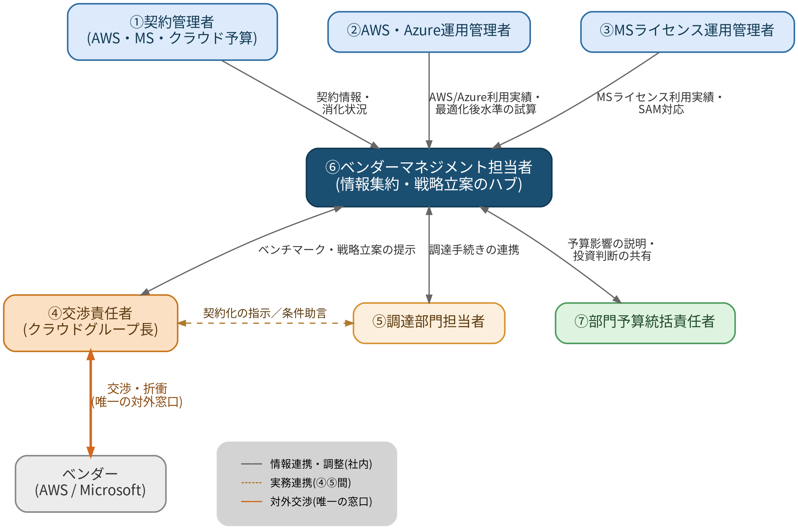

# 11. 交渉体制：役割分担案(提案)

> **この章の位置づけ**：第3章・第7章で述べた交渉プロセスを実行するための社内体制を提案する、本資料の総括章。
> **対象読者**：経営層／部門予算統括責任者／ベンダーマネジメント担当

## 要旨

ベンダーとの交渉力学に対応するには、単価交渉の巧拙だけでなく「基準点とタイミングを自社側が握る」ための社内体制が不可欠である。本章では、7つの役割(①〜⑦)を定義し、各ロールの関係図、交渉プロセスの6フェーズにおける役割分担表、月次・四半期・キックオフの運営体制を提案する。⑥ベンダーマネジメント担当者を情報集約・戦略立案のハブとし、④交渉責任者にベンダーとの交渉窓口を一本化する構造を核とする。

## 11.1 提案の趣旨

第3章・第7章で述べた通り、ベンダーとの交渉力学に対応するには、単価交渉の巧拙だけでなく「基準点とタイミングを自社側が握る」ための社内体制が不可欠である。特に、現場部門の個別判断がそのままクラウド配置戦略になってしまう状態(第4章のAzure論点)や、更新交渉の準備不足が時間的余裕のなさというレバレッジをベンダーに与えてしまう状態(第7.5章)を防ぐには、平時から契約・運用・交渉・予算の各機能が連携する体制が必要になる。以下は、貴社側の登場人物として想定される7つの役割をもとに、これまで整理してきた交渉プロセス(第3〜6章)を実行するための役割分担案である。

## 11.2 各ロールの役割定義

**① AWS・MSライセンス・クラウド予算契約の各管理者**　各ベンダーとの契約そのものの日常管理を担う。契約更新日・支払条件・true-up/true-down実績など契約の一次情報を保持し、第7.5章で述べた更新カレンダーの一元管理の情報源となる。個別契約の実務窓口として、交渉準備段階では現行契約条件を、契約後は消化状況を提供する。

**② AWS・Azure運用管理者**　AWS・Azureの実利用データ(インスタンス稼働率、ストレージ利用状況、タグ付け状況等)を保持し、第3.2章・第4.3章で述べた「最適化後の基準水準」の試算に必要な一次データを提供する。ライトサイジングやアーキテクチャ改善の実行主体でもあり、第9章で整理したコスト上昇ドライバーへの対処(オーバープロビジョニングの是正、ライフサイクルポリシーの設定等)を技術面で担う。

**③ MSライセンス運用管理者**　M365・Copilot等のライセンス払い出し状況、部門別利用実態、SAMレビューへの対応を担う。第3.1章で述べたライセンスのセグメント化(F3/E3/E5の混在設計)の基礎データを持ち、Microsoft側の監査条項・SAMエンゲージメント(第7.2章)への一次対応窓口にもなる。

**④ 交渉責任者(クラウドグループ長)**　ベンダーとの交渉における意思決定権者。エスカレーション経路上でMicrosoft・AWS側のアカウント責任者と対峙し、コミット水準・価格条件についての最終合意を行う。第7.5章で述べた「相手方の意思決定構造の把握」を踏まえ、ベンダー側の承認権限者と自社側の交渉責任者を同格で対峙させることが交渉力を保つ上で重要になる。

**⑤ 調達部門担当者**　契約手続き・法務レビュー・入札プロセスの運営を担う。マルチLAR入札(第7.3章)や第三者アドバイザリーの起用手続き、契約書上のProduct Terms・監査条項・Exit条項(第7.2章)のレビューを実務面で担当し、交渉で合意した内容を正式な契約条件に落とし込む役割を持つ。

**⑥ ベンダーマネジメント担当者**　契約・運用・交渉・予算の各機能をつなぐ調整のハブとして、ベンダー横断での戦略立案とベンチマーク情報の収集(第7.5章「情報の非対称性の是正」)を主導する。個別契約の担当者(①②③)が持つデータを統合し、Microsoft関連契約(EA/MCA-E・Azure・Unified Support)を一体で見る視点(第4.3章・第6.3章)を提供する、本資料で一貫して述べてきた分析・戦略機能そのものを担う。

**⑦ 部門予算統括責任者**　IT予算全体に対する最終的な予算権限を持ち、交渉結果が来年度予算・経営説明にどう反映されるかの責任を負う。第2章で述べた「増加要因の3分類」を踏まえた経営層への説明、AI投資のような戦略的増加項目についての投資対効果管理の方針決定など、個別交渉の結果を経営レベルの意思決定につなぐ役割を持つ。

## 11.3 各ロール間の関係図

各ロールが具体的にどのような情報・役務をやり取りするかを一枚図に整理すると、次のようになる。①②③が保持する契約・利用実績データが⑥ベンダーマネジメント担当者に集約され、⑥が④交渉責任者・⑤調達部門担当者・⑦部門予算統括責任者との調整を行う。ベンダーと直接交渉する窓口は④に一本化する。

*図　各ロール間の情報・役務の関係*

## 11.4 交渉プロセスにおける役割分担表

凡例：◎=主担当(実務のオーナーとして遂行)　●=意思決定・最終承認　○=協議・関与(専門知見の提供や実務支援)　△=情報共有・事後報告　－=原則関与なし

①AWS・MSライセンス・クラウド予算契約の各管理者　②AWS・Azure運用管理者　③MSライセンス運用管理者　④交渉責任者(クラウドグループ長)　⑤調達部門担当者　⑥ベンダーマネジメント担当者　⑦部門予算統括責任者

| フェーズ | ① | ② | ③ | ④ | ⑤ | ⑥ | ⑦ |
|---|---|---|---|---|---|---|---|
| 平時ガバナンス(更新カレンダー管理・利用モニタリング・新規サービス採用の事前統制) | ◎ 契約情報の一元管理 | ○ 利用データ提供、PoC事前申請 | ○ 利用データ提供、PoC事前申請 | ○ 方針確認 | － | ◎ 全体統括・ドリフト監視 | △ 定期報告受領 |
| 交渉準備(最適化後基準点の算出・外部ベンチマーク・戦略立案) | ○ 現行契約条件の提供 | ◎ 利用実績分析・最適化後水準の試算 | ◎ 利用実績分析・最適化後水準の試算 | ○ 戦略の承認 | ○ アドバイザリー起用等の手続き | ◎ ベンチマーク収集・戦略立案の主導 | △ 投資判断への示唆共有 |
| 交渉実行(ベンダー折衝・エスカレーション対応) | ○ 実務データの提供 | △ 技術的質問への対応 | △ 技術的質問への対応 | ● 交渉の意思決定 | ○ 契約条件面の助言 | ◎ ファシリテーション・記録 | － (金額上限超過時のみ関与) |
| 契約締結(条項レビュー・入札プロセス・法務確認) | ○ 実務確認 | － | － | ● 最終合意の承認 | ◎ 入札運営・契約書レビュー・締結手続き | ○ 内容確認・関連契約との整合性チェック | ● 予算影響がある場合の最終承認 |
| 予算反映・経営報告 | ○ 契約条件の予算反映 | － | － | ○ 交渉結果の説明 | － | ○ 資料作成支援・全体整理 | ◎ 予算計上・経営層への説明責任 |
| 契約後フォロー(履行状況モニタリング・次回更新への申し送り) | ◎ 消化状況・true-up等のトラッキング | ○ 利用実績の継続収集 | ○ 利用実績の継続収集 | △ 定期報告受領 | － | ◎ 次回交渉への論点整理・引き継ぎ | △ 定期報告受領 |

## 11.5 推奨される運営体制

上記の役割分担を機能させるには、随時のやり取りだけでなく、定例の場を設けることが望ましい。

**月次のベンダー管理ワーキング**：①②③⑥が参加し、⑥ベンダーマネジメント担当者が事務局を務める。契約更新カレンダーの確認、利用実績・最適化余地のアップデート、監査・SAMレビューへの対応状況などを共有する実務レベルの場とする。

**四半期の交渉戦略レビュー**：④⑥⑦が参加し、④交渉責任者が主催する。進行中の交渉の状況、ベンチマーク情報のアップデート、予算への影響を確認し、必要に応じてエスカレーション方針や投資判断(AI関連等の戦略投資の扱い)を確認する。

**交渉開始時のキックオフ**：更新の12〜18か月前を目安に、対象契約について①②③⑥⑤が参加するキックオフを行い、最適化後基準点の試算方針とスケジュールを合意する。この時点で④・⑦にも交渉の全体方針を共有し、着地水準のイメージについて事前にすり合わせておく。

エスカレーションフローとしては、日常的な契約・利用実態の把握は①②③が担い、異常値や交渉が必要な事象が生じた場合は⑥ベンダーマネジメント担当者に集約する。⑥が全体観点で戦略を整理したうえで④交渉責任者に上申し、④がベンダーとの交渉を主導する。⑤調達部門は契約手続き・法務面から一貫して関与し、契約条件が予算計画を超える場合や経営説明が必要な場合には⑦部門予算統括責任者の承認を得る、という流れを基本形とする。この体制により、現場の個別判断が先行して既成事実化する事態(第4章で指摘したAzureのビーチヘッド拡大のような状況)を防ぎ、ベンダーとの交渉において常に自社側が基準点とタイミングを主導できる状態を維持することを狙いとする。

## この章の結論

- 交渉力学に対応するには、単価交渉の巧拙だけでなく「基準点とタイミングを自社側が握る」ための社内体制が不可欠であり、7つの役割(①〜⑦)を定義する。
- 情報は①②③(契約・運用の一次情報保持者)から⑥ベンダーマネジメント担当者に集約され、⑥が④交渉責任者・⑤調達部門・⑦部門予算統括責任者と調整する構造とし、ベンダーとの交渉窓口は④に一本化する。
- 交渉プロセスの6フェーズ(平時ガバナンス〜契約後フォロー)ごとに主担当・意思決定者・協議者を明確化したRACI表を運用の基礎とする。
- 月次ワーキング・四半期レビュー・更新キックオフという3つの定例の場を設けることで、現場判断の先行による既成事実化(第4章のAzure論点)を防ぎ、自社側が基準点とタイミングを主導する状態を維持する。

---

**参照**：第3章(交渉力学と3原則)、第4章(Azureのビーチヘッド拡大の防止)、第5.7章(ビジネスアプリ領域の可視化ステップ／本章の体制で担うべき追加作業)、第7.5章(交渉プロセスの設計)、第12章(各ロールが担う施策の一覧と優先順位)
