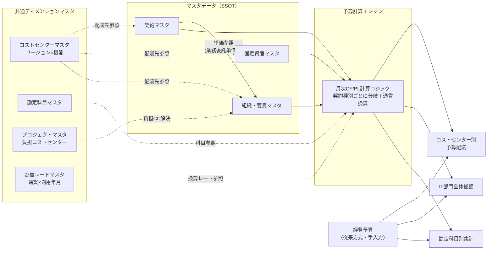

# IT部門 Run予算管理システム 業務要件定義書

- 文書種別：業務要件定義書（Draft）
- 版数：v0.5
- 作成日：2026-09-12
- 作成：Claude（Hiroyasu氏との検討を基に作成）
- 想定最終アウトプット形式：Excelスプレッドシート（Windows版Excel + Power Query + Power Pivot）。技術選定の根拠は `it_budget_adr.md` を参照

---

## 1. 目的・背景

現状、IT部門の予算管理は静的なExcelでの積み上げ集計に依存しており、契約更新や資産の増減があるたびに手作業でシートを作り直す運用になっている。特にM365ライセンス費用については、契約更新月にIT部門の損益（PL）が一括計上により乱高下し、月次の予実管理が機能しない課題が確認されている（前払費用（BS）を用いた平準化モデルにより解消済み）。

この経験を踏まえ、IT部門の予算管理全体を「契約・資産・要員といった事実を記録したマスタデータから、予算を計算ロジックにより機械的に導出する」方式（Single Source of Truth／SSOT型の予算管理）に切り替えることで、以下を実現することを目的とする。

- マスタデータさえ正しく維持されていれば、誰が計算しても同じ予算数値が得られる（冪等性）
- 予算の誤りの原因を「計算ロジック」ではなく「マスタデータの品質」に一本化できる
- 契約・資産の増減に応じて予算が自動的に更新され、手作業での再構築が不要になる

## 2. 対象範囲（スコープ）

### 2.1 対象とする予算（In Scope）

IT部門の「Run予算」（運用・維持のための経常的な予算）を対象とする。具体的には次の4つのマスタ、および経費予算（後述）から構成される。

| マスタ / 区分 | 内容 |
|---|---|
| 契約マスタ | SaaS・保守・通信・業務委託等の契約に基づく費用 |
| 固定資産マスタ | 端末・ネットワーク機器等、購入し資産計上する物品の減価償却費 |
| 組織・要員マスタ | 正社員のFTE按分人件費、および稼働単価が開示されている外部人材費用 |
| 経費予算（従来方式） | T&E、教育費、出張、イベント、謝礼、買い切りソフトウェア、クラウド利用料の完全変動部分等 |

### 2.2 対象外とする予算（Out of Scope）

| 区分 | 理由 |
|---|---|
| プロジェクト・新規投資予算（Grow/Transform予算） | 契約等の確定事実からの導出ではなく、ROIや優先順位に基づく意思決定プロセスに属するため、本モデリング手法とは性質が異なる。別途プロジェクト予算のガバナンスで管理する。**ただし、プロジェクトにアサインされた要員の人件費はRun予算に含める**（前提11）。プロジェクトの開発部分は別途請負契約を締結し、Grow/Transform予算側で予算化する |
| リース資産マスタ | 現時点でリース契約が存在しないため、今回は実装しない。将来リース契約が発生した時点で会計方針（オンバランス処理の要否）を確認のうえ、別途要件定義する |

> **境界条件の注意**：プロジェクトが完了し本稼働に入った後の費用（導入したSaaSのライセンス費用、保守費用等）は、Run予算側（契約マスタ等）に引き渡される。引き渡しのタイミング・手続きは運用ルールとして別途定める必要がある（本書「11. 未確定事項」参照）。

## 3. 全体アーキテクチャ

マスタデータ（契約・固定資産・組織要員）が「事実」の記録であり、予算計算エンジンはそこから決定論的に月次の費用を算出する。経費予算（T&E等、クラウド変動費を含む）のみ、従来どおり人による見積もり・入力に依拠する。コストセンター・勘定科目・プロジェクト・為替レートの4マスタは、各マスタ／出力の共通ディメンション（軸）として参照される補助マスタであり、費用そのものを生む「事実」データではない。

## 4. 用語定義

| 用語 | 定義 |
|---|---|
| Run予算 | 運用・維持のための経常的な予算（本書の対象） |
| Grow/Transform予算 | 新規投資・変革のための予算（本書の対象外、プロジェクト予算として別管理） |
| SSOT (Single Source of Truth) | 予算計算の唯一の正となる入力データ源。本書では契約マスタ・固定資産マスタ・組織要員マスタを指す |
| 前払一括型契約 | 契約金額を契約開始月に一括でキャッシュアウトし、前払費用（BS）として資産計上した上で、一定期間（通常12ヶ月）かけて均等償却する契約類型 |
| 月額固定型契約 | 毎月一定額が請求され、前払処理を要さずそのまま月次のPLに計上する契約類型 |
| 業務委託単価型 | 稼働率・単価により費用が変動する業務委託契約（フリーランス、常駐型SE等）。契約マスタには単価情報のみを登録し、予算計上は組織・要員マスタ側でFTEに準じた按分により行う |
| チャージバック | IT部門が一旦全額を負担した費用のうち、**IT部門外**の利用部門に再請求（付け替え）する部分。IT部門の予算総額から控除される。本システムでは控除が目的であり、再請求先の識別・金額提示は行わない（前提16） |
| 配賦（アロケーション） | IT部門が負担する費用を、IT部門内の15コストセンターに割り当てること。IT部門の予算総額は変動しない。チャージバックとは明確に区別する |
| FTE (Full Time Equivalent) | 従業員の稼働割合を表す指標。1.0が専任稼働相当 |
| ESU (Extended Security Updates) | Windows Server等、サポート終了後もセキュリティ更新を有償で継続する契約 |
| コストセンター | 予算管理上の配賦単位。本書ではリージョン（日本／北米／EMEA）×機能組織（アプリケーション／インフラ／データ／セキュリティ／ガバナンス）の組み合わせで定義する |
| 現地通貨 | 契約・取得・給与等が実際に発生している通貨（円・ドル・ユーロ・ポンドのいずれか） |
| 表示通貨 | 出力時にユーザーが選択する集計・表示上の通貨（現地通貨のまま、または単一通貨に換算） |

## 5. 前提条件（今回の検討で確定した事項）

| # | 項目 | 決定内容 |
|---|---|---|
| 1 | 会計年度 | 暦年ベース（1月〜12月）。FY25 = 2025年1月〜12月 |
| 2 | 予算対象期間 | 複数年ローリング（3〜5年）。契約マスタの複数年契約（例：M365のFY25〜27）をそのまま活用し、継続的に先の年度まで見通す運用 |
| 3 | 固定資産の減価償却方法 | 定額法・社内耐用年数基準（法定耐用年数とは別に、管理会計上の耐用年数を用いる） |
| 4 | 予算アウトプットの粒度 | コストセンター別（リージョン×機能組織）の予算配賦、IT部門全体の総額、勘定科目別集計の3軸すべてに対応する |
| 5 | クラウド利用料の扱い | コミット契約部分（AWS Savings Plans、Azure予約等）は契約マスタの月額固定型として扱う（実態は毎月払い＋未達差額精算のため）。完全な変動部分は経費予算で扱う |
| 6 | 買い切り型ソフトウェアライセンス | 金額の大小や会計上の資産計上／一括経費の別に関わらず、予算上は簡便化のため経費予算として扱う |
| 7 | ESU（拡張セキュリティ更新） | 前払一括型契約として契約マスタに計上する（複数年での段階的値上げは、既存の複数年契約ロジックでそのまま対応可能） |
| 8 | 業務委託の扱い | 月額固定で請求されるものは契約マスタ（月額固定型）。稼働管理・単価が開示されるもの（フリーランス、常駐型SE等）は組織・要員マスタに外部人材として計上し、契約マスタ側の単価情報を参照キーで紐付ける |
| 9 | 通貨 | 円・ドル・ユーロ・ポンドの4通貨を扱う。各マスタの金額は発生時の現地通貨で保持し、出力時に「現地通貨表示」と「単一通貨への換算表示」の両方に対応する |
| 10 | コストセンター構造 | 日本・北米・EMEAの3リージョン×アプリケーション・インフラ・データ・セキュリティ・ガバナンスの5機能組織＝15コストセンターで構成する。各マスタの配賦先はこのコストセンター単位で持つ |
| 11 | プロジェクト人件費の扱い | 要員がプロジェクトにアサインされている場合も、その人件費（正社員・外部人材を問わず）はRun予算として計上する。プロジェクトの開発部分は別途請負契約を締結し、Grow/Transform予算側で予算化する |
| 12 | 契約終了日の入力ルール | 書面上の契約終了日ではなく、**実際に契約が終了する時期**を入力する。更新を前提とした自動延長ロジックは実装しない。終了予定がない契約は空欄とし、予算期間の最終月まで継続計上する |
| 13 | 前払一括型の登録単位 | 1回の前払支払につき1行で登録する。複数年契約は契約年度ごとに行を分ける（既存M365モデルの登録方式を踏襲）。同一契約の束ね表示には契約グループIDを用いる |
| 14 | BS（貸借対照表）予算 | 前払費用残高・期末帳簿価額等のBS予算は**出力対象外**とする。計算エンジンは月次のCFとPLのみを算出する |
| 15 | 消費税の扱い | 金額は原則税抜で入力する。税区分の厳密な管理・税額計算は本システムの対象外とし、税込入力が混在しても運用上許容する |
| 17 | 経費予算の予算化単位 | 経費はコストセンター単位の**年額**で予算化し、上期・下期に分けて計上する。月次への展開は各半期の金額をその6ヶ月に均等配分する（6.4参照） |
| 16 | チャージバックの管理粒度 | チャージバックは**比率のみ**を保持する。目的はIT部門の予算からの控除であり、再請求先への金額提示は行わないため、再請求先を識別するコード・マスタは持たない |

## 6. マスタデータ要件

### 6.0 共通ディメンションマスタ

契約マスタ・固定資産マスタ・組織要員マスタから共通して参照される、配賦・集計軸の基礎データ。

**コストセンターマスタ**

| 項目 | 説明 |
|---|---|
| コストセンターコード | 一意キー（例：リージョンコード＋機能コードの組み合わせ） |
| リージョン | 日本／北米／EMEA |
| 機能組織 | アプリケーション／インフラ／データ／セキュリティ／ガバナンス |
| コストセンター名 | 表示用の名称 |

リージョン×機能組織の組み合わせで、原則15コストセンターを定義する（前提10）。契約マスタ・固定資産マスタ・組織要員マスタの「配賦先」は、すべてこのコストセンターコードを参照する。**本マスタが管理するのはIT部門内のコストセンターのみ**であり、チャージバック先（IT部門外の利用部門）は含まない。

**勘定科目マスタ**

| 項目 | 説明 |
|---|---|
| 勘定科目コード | 一意キー |
| 勘定科目名 | 減価償却費、通信費、業務委託費、支払手数料 等 |
| 集計区分 | 勘定科目別集計表での大分類（任意、レポート用） |

契約マスタ・固定資産マスタ・組織要員マスタ・経費予算の「勘定科目コード」は、すべて本マスタを参照する。

**プロジェクトマスタ**

| 項目 | 説明 |
|---|---|
| プロジェクトコード | 一意キー |
| プロジェクト名 | |
| 負担コストセンターコード | コストセンターマスタを参照。本プロジェクトにアサインされた要員の人件費を計上するコストセンター |
| 期間 | プロジェクトの開始月・終了月 |

組織・要員マスタのFTE配分先としてプロジェクトを指定した場合、その人件費は**本マスタの負担コストセンターに配賦**される（前提11）。プロジェクトコードは分析用の補助軸として保持し、コストセンター別配賦表の集計単位そのものにはしない。

**為替レートマスタ**

| 項目 | 説明 |
|---|---|
| 通貨コード | USD／EUR／GBP／JPY |
| 適用年月 | レートを適用する月 |
| 対円レート | 表示通貨への換算に用いるレート |
| レート区分 | **予算レート（期首固定）を既定とする**（ADR-005）。実績レート・月次スポットレートは将来の実績分析用に追加可能な構造としておく |

出力時に表示通貨（現地通貨のまま、または指定した単一通貨）を選択できるようにし、単一通貨換算を選んだ場合はこの為替レートマスタのレートで換算する。マスタ自体の金額はすべて発生時の現地通貨で保持し、換算は集計・表示の段階でのみ行う（マスタの原本性を保つため）。

### 6.1 契約マスタ

前払費用処理や月額固定請求など、契約に起因する費用を管理する。契約種別によって必須項目と計算ロジックが分岐する。

**共通項目**

| 項目 | 説明 |
|---|---|
| 契約ID | 一意キー。組織・要員マスタからの参照キーとしても使用 |
| 契約グループID | 任意。複数年契約を年度ごとに複数行で登録する場合に、同一契約として束ねるためのキー（前提13） |
| ベンダー / 契約名 | 例：M365、Windows Server ESU 等 |
| カテゴリ | SaaS、通信、保守、業務委託 等（集計・レポート用のタグ） |
| 契約種別 | 「前払一括型」「月額固定型」「業務委託単価型」のいずれか |
| 契約開始日 | |
| 契約終了日（実効） | **実際に契約が終了する時期**を入力する。書面上の終了日と異なる場合は実態を優先（前提12）。終了予定がない場合は空欄とし、予算期間の最終月まで継続計上する |
| 通貨 | 円／ドル／ユーロ／ポンドのいずれか。金額は本通貨（現地通貨）で保持する |
| 勘定科目コード | 勘定科目別集計のためのマッピング用（要確認：勘定科目マスタの有無、コード体系） |
| 配賦先コストセンターコード | コストセンターマスタを参照。IT部門内15コストセンターのうち、本契約の費用を負担するコストセンター。1契約が複数コストセンターにまたがる場合は、配賦先ごとに契約行を分ける |
| チャージバック比率 | **IT部門外**の利用部門へ再請求する比率（4章 用語定義参照）。部門外への再請求がない契約は0とする。IT部門内の配賦とは別概念であり、混同しない。再請求先を識別する項目は持たない（前提16） |
| 備考 | |

**契約種別ごとの追加項目・計算ロジック**

| 契約種別 | 追加入力項目 | 自動計算項目 |
|---|---|---|
| 前払一括型 | 支払金額（1回あたり。前提13により1行＝1回の支払）、償却月数（既定12） | IT部門負担額 ＝ 支払金額×(1−チャージバック比率)、チャージバック金額 ＝ 支払金額×チャージバック比率、純IT部門負担額/月 ＝ IT部門負担額÷償却月数、償却終了月 |
| 月額固定型 | 月額固定額 | 純IT部門負担額/月 ＝ 月額固定額×(1−チャージバック比率)、年換算額（参考表示） |
| 業務委託単価型 | 単価（基準額）、上限単価（契約書に明記がある場合のみ）、下限単価（契約書に明記がある場合のみ） | なし。**本種別の契約行は予算計上の対象外**とし、単価参照専用のマスタとして扱う（要件7-10）。予算計上は組織・要員マスタ側で行う |

> **前払一括型の登録単位**：既存M365モデルでは、FY25／FY26／FY27の各契約年度をそれぞれ独立した行（契約開始月＋支払金額＋償却月数12）として登録している。この方式を本システムでも踏襲し、支払スケジュールを表す専用項目は設けない（前提13）。複数年契約は「1回の前払支払＝1行」で表現され、計算エンジン側は支払回数を意識する必要がない。
>
> **実装済みの検証**：M365（前払一括型・3ヵ年契約）を題材に、契約マスタ→月次エンジンの計算ロジックはExcelで実装・検証済み（複数年契約の重ね合わせ、契約追加時の自動反映を確認済み）。月額固定型・業務委託単価型は今回新たに要件化する部分。

### 6.2 固定資産マスタ

購入し資産計上する物品（端末、ネットワーク機器等）の減価償却費を管理する。

| 項目 | 説明 |
|---|---|
| 資産ID | 一意キー |
| 資産名 / 用途 | 例：貸与PC、スマートフォン、モバイルWiFi、拠点間ネットワーク機器 |
| 資産区分 | 有形固定資産／無形固定資産等の分類（任意、レポート用） |
| 取得日 | |
| 取得価額 | |
| 通貨 | 円／ドル／ユーロ／ポンドのいずれか。取得時の現地通貨で保持する |
| 社内耐用年数（月数） | **月数で保持する**（例：36＝3年）。年数と月数が混在すると月次償却の計算式が成立しないため、入力段階で月数に統一する（前提3） |
| 配賦先コストセンターコード | コストセンターマスタを参照。利用部門への按分用 |
| 勘定科目コード | 勘定科目別集計用 |
| 備考 | |

**自動計算項目**：月次減価償却費（取得価額 ÷ 社内耐用年数（月数））、償却終了月。期末帳簿価額はBS予算が出力対象外のため算出しない（前提14）。

> 未確定事項：少額資産の一括償却基準（取得価額の閾値）、除却・売却が発生した場合の減価償却の停止処理（「11. 未確定事項」参照）。

### 6.3 組織・要員マスタ

正社員のFTE按分による人件費、および稼働単価が開示されている外部人材（フリーランス、常駐型SE等）の費用を管理する。

| 項目 | 説明 |
|---|---|
| 要員ID | 一意キー |
| 氏名 / 識別子 | 正社員 or 外部人材の別を含む |
| 種別 | 正社員／外部人材（業務委託単価型） |
| 単価 | 正社員：標準単価（要確認：個人給与実額か、グレード別標準額か）／外部人材：契約マスタの契約IDを参照して単価を取得 |
| 単価通貨 | 円／ドル／ユーロ／ポンドのいずれか（海外拠点の正社員・外部人材向け） |
| 参照契約ID | 外部人材の場合のみ。契約マスタとの連携キー |
| 配分先（複数可） | コストセンターコードまたはプロジェクトコードごとのFTE比率（例：日本アプリケーション50%、Bプロジェクト30%、北米インフラ20%で合計100%）。合計が100%であることを入力検証する |
| 適用期間 | 配属期間、契約期間。**年度ごとに異なるFTE比率を設定できること**（例：FY26は1.0、FY27はプロジェクト兼務のため0.7、FY28は1.0）。年度の途中で配分が変わる場合のみ、開始日・終了日で期間を区切る |
| 予算計上額（外部人材のみ） | 自動計算せず手入力。単価に上限・下限がある場合の参考情報として契約マスタの値を参照可能 |

**按分ロジック**：1人の要員が主務部門・兼務先・プロジェクトに複数のFTE比率で配分されている場合、単価×FTE比率を各配分先の費用として計上する。配分先がプロジェクトの場合も**Run予算として計上**し（前提11）、プロジェクトマスタの負担コストセンターに配賦したうえで、プロジェクトコードを分析用の補助軸として保持する。

> 未確定事項：正社員の単価算定基準（「11. 未確定事項」参照）。

### 6.4 経費予算（マスタ非経由・従来方式）

契約マスタ・固定資産マスタ・組織要員マスタのいずれにも当てはまらない費用を、従来どおりの見積もり・積み上げ方式で予算化する。

**対象**

- T&E（出張旅費等）
- 教育費
- イベント開催費
- 謝礼
- 買い切り型ソフトウェアライセンス（Visual Studio、有償OSS等。前提6参照）
- クラウド利用料のうち完全な変動部分（コミットを超過した従量課金分等）

**予算化の単位**

経費は**コストセンター単位の年額**で予算化し、**上期・下期に分けて計上する**（前提17）。
マスタ3種が契約・資産・要員という月次の事実から導出されるのに対し、経費だけは
年額の見積もりが出発点になるため、入力の粒度が異なる。

| 項目 | 説明 |
|---|---|
| 年度 | 会計年度（暦年） |
| コストセンターコード | コストセンターマスタを参照 |
| 勘定科目コード | 勘定科目マスタを参照 |
| 費目 | 「国内出張旅費」「教育研修費」等。同一コストセンター・同一勘定科目でも、費目を分けて管理できる |
| 通貨 | 円／ドル／ユーロ／ポンドのいずれか |
| 上期額 | 1月〜6月に計上する金額 |
| 下期額 | 7月〜12月に計上する金額 |
| 備考 | |

1行 ＝ 年度 × コストセンター × 勘定科目 × 費目。同一キーの行が重複していないことを入力検証する。

**月次への展開**

上期額を1〜6月の6ヶ月に、下期額を7〜12月の6ヶ月に均等配分する。上期・下期を分けて
持つのは、出張が下期に偏る／研修を上期に集中させるといった実務上の偏りを、年額のまま
表現するためである。半期内はこれ以上細かくは配分しない。

## 7. 予算計算エンジン要件

| # | 要件 |
|---|---|
| 1 | 契約マスタの契約種別（前払一括型／月額固定型）ごとに異なる計算ロジックを適用し、月次のキャッシュフロー（CF）・損益（PL）を算出する。BS（前払費用残高等）は出力対象外のため算出しない（前提14） |
| 2 | 固定資産マスタから月次減価償却費を算出する |
| 3 | 組織・要員マスタからFTE比率×単価により、コストセンター別・プロジェクト別の人件費（外部人材費用を含む）を算出する。プロジェクト配分分もRun予算として計上し、プロジェクトマスタの負担コストセンターに配賦する（前提11） |
| 4 | 各マスタに行を追加するだけで、既存の計算ロジックが自動的に反映されること（契約数・資産数・要員数の増加に対してロジックの変更が不要な設計） |
| 5 | 同一のマスタ入力からは常に同一の予算数値が算出されること（冪等性）。手動での上書き調整を許容しない（業務委託単価型の「予算計上額」欄のみ、設計上手入力とする） |
| 6 | 会計年度は暦年（1月〜12月）を基準とし、複数年（3〜5年）のローリング表示に対応する |
| 7 | コストセンター別・勘定科目別の集計軸に対応するため、各マスタに配賦先コストセンターコード・勘定科目コードを保持し、これらのキーで集計できること |
| 8 | 各マスタの金額は発生時の現地通貨（円／ドル／ユーロ／ポンド）で保持し、通貨換算は集計・出力の段階でのみ行う（マスタ本体には換算後の値を持たせない） |
| 9 | 出力時に表示通貨を選択できること。「現地通貨のまま表示」と「指定した単一通貨に換算して表示」の両方に対応し、換算時は為替レートマスタのレートを用いる |
| 10 | 契約種別が「業務委託単価型」の契約行は**予算計上の対象外**とし、単価参照専用として扱う。計算エンジンは本種別の行から費用を生成しない（組織・要員マスタ側との二重計上を防ぐため） |
| 11 | チャージバック比率による控除は、**IT部門外**への再請求に対してのみ適用する。IT部門内15コストセンター間の配分は配賦として扱い、IT部門の予算総額を変動させない。チャージバックは比率による控除のみを行い、再請求先別の集計・出力は行わない（前提16） |
| 12 | 契約終了日（実効）が設定されている契約は当該月まで、空欄の契約は予算期間の最終月まで計上する。更新を前提とした自動延長は行わない（前提12） |
| 13 | 経費予算は、コストセンター単位の年額（上期額・下期額）から、各半期の金額をその6ヶ月に均等配分して月次に展開する（6.4、前提17） |

## 8. 出力要件

| 出力 | 内容 |
|---|---|
| コストセンター別予算配賦表 | リージョン（日本／北米／EMEA）×機能組織（アプリケーション／インフラ／データ／セキュリティ／ガバナンス）の15コストセンター単位で、月次・年次のIT関連費用一覧を出力（契約のチャージバック、資産の利用部門按分、人件費のFTE按分を集約）。リージョン単位・機能組織単位それぞれでの小計にも対応 |
| IT部門全体総額 | コストセンターをまたいだIT部門トータルのRun予算総額（月次・年次） |
| 勘定科目別集計表 | 減価償却費、通信費、業務委託費等、勘定科目単位での集計 |

**表示通貨の切り替え**：いずれの出力についても、表示通貨を「現地通貨のまま（複数通貨が混在する明細表示）」と「単一通貨に換算して合算表示」から選択できること。単一通貨換算を選んだ場合の換算レートは為替レートマスタを参照する。

> 将来検討事項として、予算（計画値）に対する実績の入力・差異分析機能があるが、今回のスコープには含めない（「11. 未確定事項」に記載）。

## 9. 費用分類マッピング表

これまでの検討で洗い出した代表的な費用項目の分類先一覧。

| 費用項目 | 分類先 | 契約種別／備考 |
|---|---|---|
| M365ライセンス費用 | 契約マスタ | 前払一括型（複数年契約） |
| Windows Server等のESU | 契約マスタ | 前払一括型 |
| クラウド利用料（コミット部分：AWS Savings Plans、Azure予約等） | 契約マスタ | 月額固定型 |
| クラウド利用料（完全変動部分） | 経費予算 | マスタ非経由 |
| ハードウェア保守契約 | 契約マスタ | 月額固定型（想定） |
| 通信費（拠点間回線、モバイル回線） | 契約マスタ | 月額固定型（想定） |
| 業務委託（月額固定請求） | 契約マスタ | 月額固定型 |
| 業務委託（フリーランス、常駐型SE等、稼働単価型） | 組織・要員マスタ | 契約マスタの単価情報を参照 |
| 貸与PC・スマートフォン・モバイルWiFi | 固定資産マスタ | 定額法・社内耐用年数 |
| 拠点間ネットワーク機器 | 固定資産マスタ | 定額法・社内耐用年数 |
| 買い切り型ソフトウェアライセンス（Visual Studio、有償OSS等） | 経費予算 | 資産計上／一括経費の別に関わらず経費予算扱い |
| T&E、教育費、出張、イベント、謝礼 | 経費予算 | マスタ非経由 |
| プロジェクトにアサインされた要員の人件費（正社員・外部人材） | 組織・要員マスタ | **Run予算として計上**。プロジェクトマスタの負担コストセンターに配賦（前提11） |
| プロジェクトの開発費用（請負契約） | 対象外 | 別途請負契約を締結し、Grow/Transform予算として別管理（前提11） |
| プロジェクト・新規投資予算（上記以外） | 対象外 | Grow/Transform予算として別管理 |
| リース資産（オペレーティングリース等） | 対象外（今回） | 契約が存在しないため未実装。将来要件定義 |

## 10. 技術選定（決定済み・`it_budget_adr.md` 参照）

**Windows版 Excel + Power Query + Power Pivot** を採用することを決定した（ADR-001）。マスタブックと計算ブックを物理的に分離し（ADR-002）、月次展開はPower Query（M言語）、集計・通貨換算はDAXメジャーで実装する（ADR-004）。決定の根拠・却下した選択肢・将来の移行パスは `it_budget_adr.md` を参照のこと。

以下は選定時に用いた考慮事項である（記録として残す）。

| 観点 | 考慮点 |
|---|---|
| データ量 | 契約数・資産数・要員数が今後どの程度の規模になるか（数十件〜数百件で収まるか、それ以上か）によって、Excelの数式ベース集計（SUMPRODUCT等）で十分か、Power Query/Power Pivotやデータベースを要するかが変わる |
| 計算ロジックの複雑性 | 契約種別ごとの分岐、FTEの複数配分先按分、コストセンター別・勘定科目別の多軸集計、多通貨換算など、ロジックが積み上がるほどExcel数式の保守性は低下する。VBA、Power Query（M言語）、外部スクリプト（Python等）による計算処理の分離も選択肢になる |
| 更新頻度・同時編集 | 複数人がマスタを同時に更新する運用があるか（Excelはロック・排他制御に弱い） |
| 監査証跡 | マスタの変更履歴（誰が・いつ・何を変更したか）を残す必要があるか |
| 他システムとの連携 | 契約管理システム、固定資産台帳、人事システム等、既存システムからのデータ連携（手動転記／自動連携）の要否 |
| 可視化・レポーティング | コストセンター別・勘定科目別集計をダッシュボード化する場合、Excel単体よりBIツール（Power BI等）との連携が有利な場合がある |

## 11. 未確定事項・要確認事項一覧

| # | 項目 | 内容 |
|---|---|---|
| 1 | 固定資産：少額資産の一括償却基準 | 取得価額がいくら以下であれば固定資産マスタを経由せず一括経費（経費予算）とするか |
| 2 | 固定資産：除却・売却時の処理 | 耐用年数の途中で資産を除却・売却した場合、減価償却費の計上をいつ停止するか（帳簿価額はBS予算が対象外のため管理しない） |
| 3 | 組織・要員マスタ：正社員の単価算定基準 | 個人の給与実額を使うか、グレード・職種別の標準単価を使うか |
| 4 | 業務委託単価型：予算計上額の更新運用 | 手入力する「予算計上額」を誰が・どのタイミングで更新するか |
| 5 | マスタデータのガバナンス | 契約マスタ・固定資産マスタ・組織要員マスタそれぞれの更新責任者、更新頻度、承認フロー |
| 6 | 初期データ移行元 | 既存の契約台帳・固定資産台帳・人事システム等から、各マスタへの初期データ投入方法 |
| 7 | 為替レートの情報源 | 適用基準は「予算レート（期首固定）」を既定とすることを決定済み（ADR-005）。残課題はレートの情報源（社内公示レート、TTM等）と、改定時の承認フロー |
| 8 | 予実比較・差異分析機能 | 将来フェーズとするか、今回のスコープに含めるか |
| 9 | 勘定科目マスタ | 本書6.0に共通ディメンションマスタとして定義済み。残課題は、既存の会計システム側コード体系との対応付け |
| 10 | プロジェクト予算からRun予算への引き渡しルール | プロジェクト完了後、導入したSaaS・資産・要員をどのタイミングで各マスタに登録するか |
| 11 | コストセンターマスタの改編運用 | 組織変更（リージョン追加、機能組織の統廃合等）が発生した場合の、コストセンターマスタの更新手順と過去データの扱い（履歴として残すか、遡って付け替えるか） |
| 12 | プロジェクトマスタの登録責任者 | プロジェクトの新設・終了時に、誰がプロジェクトマスタ（負担コストセンターを含む）を登録・更新するか |

## 12. 変更履歴

| 版数 | 日付 | 内容 |
|---|---|---|
| v0.1 | 2026-09-12 | 初版作成 |
| v0.2 | 2026-09-12 | コストセンター構造（リージョン×機能組織）、多通貨対応（円／ドル／ユーロ／ポンド、現地通貨表示と単一通貨換算表示）を反映。コストセンターマスタ・為替レートマスタを共通ディメンションマスタとして追加 |
| v0.5 | 2026-09-13 | サンプル実装（`01_sandbox/run-budget`）の構築を通じて判明した欠落・曖昧さを反映。①経費予算のデータ構造を定義（コストセンター単位の年額・上期／下期。前提17、6.4、要件7-13）②固定資産の社内耐用年数を月数に統一（6.2。従来は「月数または年数」で月次償却の計算式が成立しなかった）③要員のFTEを年度ごとに設定できることを明記（6.3） |
| v0.4 | 2026-09-12 | チャージバックは比率のみを保持し、再請求先の識別・金額提示は行わないことを確定（前提16）。未確定事項からチャージバック先の管理粒度を削除 |
| v0.3 | 2026-09-12 | レビュー指摘への決着を反映。①プロジェクト人件費のRun予算計上（前提11）②契約終了日の実効日入力ルール（前提12）③前払一括型の1支払＝1行ルール（前提13）④BS予算の出力対象外化（前提14）⑤消費税の扱い（前提15）⑥チャージバックをIT部門外への再請求に限定し「配賦」と用語分離⑦業務委託単価型の予算計上対象外を明記（要件7-10）。勘定科目マスタ・プロジェクトマスタを共通ディメンションマスタに追加。技術選定の結論（ADR）を反映。章番号の参照誤り・Mermaid記法・用語表記の揺れを修正 |
