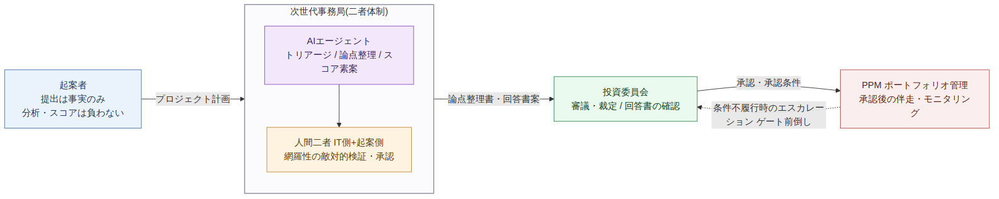
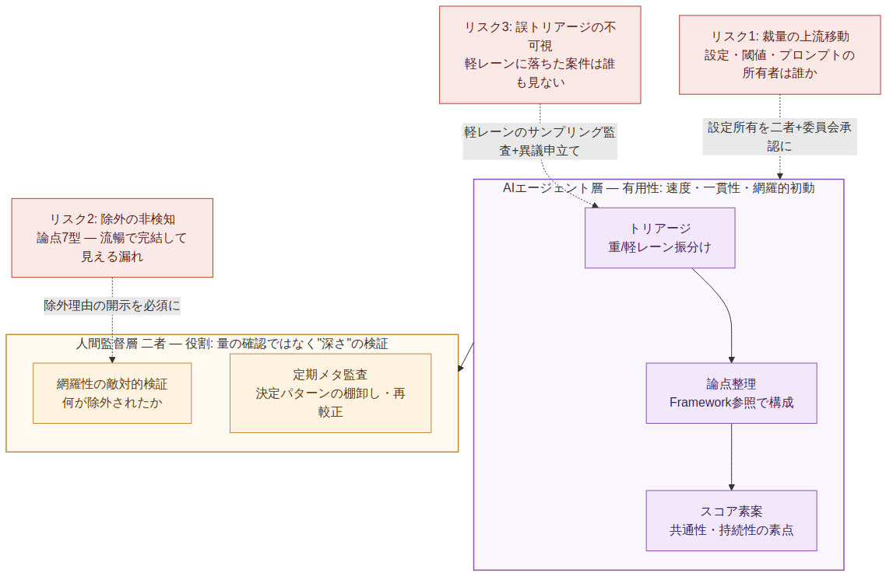
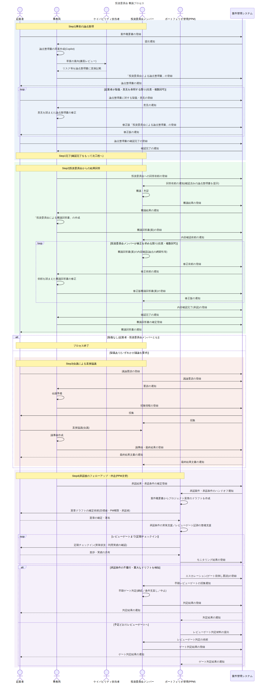

# 投資委員会プロセス改善企画 ── AIエージェントによる次世代事務局の構想

> **この章の位置づけ**：Layer 2 設計 ／ 04 設計B：運営プロセス。分析②（02）に応答する。非同期・文書駆動の4ステップ、権限分離、CMS、AIエージェント事務局と、その内在リスク（R1〜R3）・未決論点（Q1・Q2）。誰が・どう回すかを決める。
> **前章**：[03 設計A：判断ルール](03_it-materiality-proposal.md)　**次章**：[05 実践](05_practice-operations.md)

本書は、投資委員会の審議プロセスを非同期・文書駆動へ再設計し、CMS（案件管理システム）とAIエージェントを事務局機能へ導入する構想をまとめたものである。まず現行運営の問題点を列挙し、提案するガバナンスモデルとその問題解決の仕組みを示す。続いて技術的変革としてCMSとAIエージェントの導入効果を述べ、最後に、AIエージェント導入に伴う有用性・限界・内在リスクを問題提起として記載する。

| 項目 | 内容 |
|---|---|
| 宛先 | 投資委員会 事務局メンバー・管理者 ／ 投資委員会メンバー |
| 文書区分 | プロセス改善に関する企画提案（内部審議用） |
| 目的 | 現行審議プロセスの構造的問題の解消と、CMS・AIエージェント導入によるガバナンスモデルの提示 |
| 診断の出典 | 審議機構の構造分析（分析層）で導いた4症状に対する応答として設計されている |

---

## 1　現在の問題点

現行の投資委員会は会議主義で運営されているが、その会議が本来の機能を果たせていない。運営の実態から、次の4つの構造的な問題が確認されている。

| # | 問題 | 内容 |
|---|---|---|
| **P1** | 会議が機能していない | 会議主義で運営されているにもかかわらず、審議の場が実質的に機能しておらず、意思決定の質・スピードにつながっていない。 |
| **P2** | 事前資料の作成負荷 | 会議の要否にかかわらず、起案者が事前に用意すべき資料の作成負荷が重い。この不満は起案者からもれなく上がっている。 |
| **P3** | 承認可否の回答が遅い | 会議の開催頻度が高くないため、承認可否の回答を得られるまでの時間が長すぎる。案件のスピードが会議日程に律速されている。 |
| **P4** | 承認後の空白 | 投資委員会は審議結果を伝えるのみで、その後の具体的なサポートやフォローアップがない。承認された案件が成果に結びつくかを見届ける仕組みがない。 |

これらは個別の運用改善で解けるものではなく、「**会議に依存した同期的プロセス**」と「**裁定して終わりという役割設計**」という構造そのものに起因する。したがって本企画は、部分最適ではなく審議プロセスの抜本的な再設計を提案する。

構造的な成立メカニズムは分析層の該当章（[02 審議機構の構造分析](02_committee-structural-analysis.md)）に譲る。

---

## 2　提案するガバナンスモデル

提案の骨子は、審議を会議依存の同期プロセスから、CMSを介した**非同期・文書駆動プロセス**へ転換し、あわせて**承認後の伴走機能**と、**権限が特定主体に集中しない役割分離**を組み込むことである。

*図1　ガバナンスモデル全体像 ── 役割の分離と、承認後の伴走・エスカレーション*

### 2.1　プロセスの4ステップ

| Step | 担当 | 内容 |
|---|---|---|
| **1　事前の論点整理** | 事務局 | 事務局が論点整理書を作成する。草案はAI（当面は Microsoft Copilot）で作成し、事務局と同列でケイパビリティ担当者にも案内して書面でレビューする。担当者は、リスクとして記載すべき事項があれば論点整理書に直接記載する。起案者に求めるのは「事実」であって分析・スコアではない。起案者は疑義・意見を任意の回数だけ表明でき、確認完了をもって次工程へ進む。 |
| **2　委員会からの結果回答** | 投資委員会 | 委員会が審議・判定し、事務局が回答書を作成する。回答書は委員会自身が内容（論点の網羅性）を確認したうえで確定し、起案者へ通知する。 |
| **3　会議による直接協議** | 例外時のみ | 起案者・委員会のいずれかが疑義を表明した場合に限り開催する。会議は既定ではなく例外に位置づけ、本当に協議が必要な案件に集中させる。 |
| **4　承認後のフォローアップ・伴走** | PPM | ポートフォリオ管理（PPM）が承認案件を引き受け、案件概要書からプロジェクト憲章のドラフトを起こしたうえで、承認条件の実装支援・定期チェックイン・レビューゲートに向けた証跡整備を担う。条件不履行や重大なドリフトを検知した場合は、委員会へエスカレーションし、レビューゲートの前倒しを要請できる（PPMが持つのは発議権で、前倒しの決定は委員会が行う）。 |

### 2.2　権限分離の設計原則

本モデルの要は、**論点設定・事実認定・スコアリング・裁定・伴走**という機能を、単一の主体に集中させないことである。各機能の担当と、それに対するチェックを次のとおり配置する。

| 機能 | 担当 | チェック（牽制） |
|---|---|---|
| **論点整理（framing）** | 事務局（二者体制） | ケイパビリティ担当者の書面レビュー・起案者の疑義・意見ループ（Step1） |
| **事実認定** | 起案者＝事実提出 ／ 事務局＝整理 | 事実と評価の分離（申請者は事実のみ） |
| **スコアリング** | 事務局のIT部門側担当が素点、委員会が確定・重み | 起案側担当による素点のレビュー（事実との突合）・委員会レビュー |
| **裁定** | 投資委員会 | 回答書の内容確認ゲート（Step2） |
| **承認後の伴走** | ポートフォリオ管理（PPM） | 裁定主体と分離＋委員会へのエスカレーション（発議）権限 |

#### 二者体制

事務局はIT部門側と起案側から1名ずつを任命する。起案側にもIT企画を担当する者がおり、任命に違和感は生じない。論点整理の**中立性（framing）** と、**外形上の公正さ（optics）** の双方を担保する。ただし、起案側の担当が自部門を起案者とする案件を扱う場合は相反となるため、当該案件では担当を差し替える回避ルールを設ける。

#### 理論の位置づけ

本モデルの論点整理は、外部性等の経済学的フレームワークを運用ルールとして参照する。ただしそれは**あくまで事務局内部の運用規律**であり、回答書等の対外文書では前面に出さず、平易な業務言語で記述する。

---

## 3　問題点をどのように解決するか

第1章で挙げた4つの問題に対し、本モデルがどの機構で応えるかを対応づける。

| 問題 | 新モデルの打ち手 | 効果 |
|---|---|---|
| **P1** 会議が機能していない | 非同期・文書駆動へ転換し、Step3（会議）を疑義時のみの例外とする | 会議は本当に協議が要る案件に限定され、場が機能する |
| **P2** 事前資料の作成負荷 | 論点整理を事務局が担い、起案者に求めるのは事実のみ（事実と評価の分離） | 起案者の分析 framing 負荷が構造的に消える |
| **P3** 回答が遅い | CMS駆動で会議開催を待たずに承認可否が進む。各ステップにSLA（期限）を設定 | 回答速度が会議頻度から切り離される |
| **P4** 承認後の空白 | Step4でPPMが伴走（条件実装支援・定期チェックイン・エスカレーション） | 「裁定して終わり」から「成果まで伴走」へ転換 |

> **補足 ── SLAの埋め込み**
> 非同期化は放置すると別の遅延を生む。「事務局は◯営業日以内に論点整理」「委員会確認は◯営業日以内」といった期限を各ステップに**制度として**組み込み、速度を担保する。

> **補足 ── 伴走と裁定の分離**
> 承認後の伴走は、裁定を下した委員会・事務局ではなく**PPM**が担う。採点者と伴走者を別主体とすることで、起案者にとって受け入れやすい支援関係になる。両者はCMSを共有ハブとして連結される。

---

## 4　技術的変革

### 4.1　CMS（案件管理システム）の導入とその効果

CMSは、全ステップを非同期で成立させる基盤である。提出・通知・登録・確認がシステム上で完結し、審議が会議日程から独立する。

| 効果 | 内容 |
|---|---|
| 回答速度の向上 | 承認可否が次回会議の開催を待たずに進む（**P3への直接の解**）。 |
| 透明性・監査可能性 | 誰が・いつ・何を判断したかが記録として残り、後から検証できる。 |
| 伴走のハンドオフ | CMSはPPMとも共有され、承認案件・承認条件をStep4へ引き渡す共有ハブとなる。 |
| 台帳の初版化 | 蓄積された申請書（事実）の束が、そのまま資産・依存関係を把握する台帳の初版になる。 |

### 4.2　AIエージェントの導入とその効果

本企画の中核として、事務局機能（**トリアージ・論点整理・スコア素案**）をまずAIエージェントが担い、人間はその結果を検証・管理する体制を想定する。人間は、明らかな誤りがないか、そして**エージェント自体が正しく機能しているか**を管理する役割を負う。

| 効果 | 内容 |
|---|---|
| キャパシティの解消 | 二者体制の人間だけでは、論点整理・スコア支援・台帳保持・伴走・トリアージのすべては担いきれない。年次の予算編成（03 §05）に加え、執行開始の判断と年度途中の新規案件が随時上がってくる。エージェントが初動を担えば、案件数が増えても人間のレビューは回る。 |
| 一貫性 | 案件ごとの恣意・贔屓が疑われにくく、これはむしろ公正さ（optics）にプラスに働く。 |
| 初動の網羅性 | フレームワークを機械的に参照するため、論点の洗い出しに漏れが生じにくい。 |

> **分析層との接続**　ここでAIエージェントが担うのは、単なる省力化ではない。[分析層](02_committee-structural-analysis.md)が示したとおり、**論点整理は公共財であり、費用を単独で負う事務局にとって過小供給が均衡になる**。供給主体を立てるだけでは足りず、供給能力そのものを制度的に与える必要がある。エージェントはその**供給能力**にあたる。

ただしこの体制は、人間の役割を「**量の確認**」から「**深さ＝検証可能性（reviewability）の担保**」へと再定義することを前提とする。詳細は第5章で問題提起として述べる。

---

## 5　問題提起 ── AIエージェント事務局の有用性・限界・内在リスク

以下は導入を止めるための論点ではなく、**導入を成功させるために、あらかじめ設計へ織り込むべき論点**である。AIエージェントの有用性は前章のとおりだが、それと表裏の限界とリスクを直視しておく。

*図2　AIエージェント層の有用性と、人間監督が捕捉すべき失敗・緩和策*

### 5.1　有用性の要約

**速度**（会議・人手に律速されない）、**一貫性**（恣意の排除）、**初動の網羅性**（フレームワーク参照）。これらは第1章の問題 P1〜P4 の解消を、人的キャパシティの制約なしに実現するための前提となる。

### 5.2　限界と内在リスク

| リスク | 内容 | 緩和策 |
|---|---|---|
| **R1** 裁量の上流移動 | 二者体制は外形上の裁量を中立化するが、真の裁量はエージェントの設定（ルール・閾値・プロンプト）へ移る。「AIが判定した」が正統性の“ロンダリング”になりうる。 | 設定の所有を二者＋委員会の承認事項とし、変更を可視化する |
| **R2** 除外の非検知 | エージェントの失敗は流暢で完結して見える出力に宿る。「明らかな誤り」を探す軽いレビューは、抜け落ちた論点を通してしまう（論点7型の漏れ）。 | 「検討したが落としたもの／なぜ立てなかったか」の開示を必須化し、人間レビューを網羅性の敵対的検証に校正 |
| **R3** 誤トリアージの不可視 | 外部性の高い案件が軽レーンへ誤送されると、その案件は誰の目にも触れないまま通過する。最も結果が重く、最も観測されない誤差。 | 軽レーンのサンプリング監査、または起案者による安価な異議申立て経路 |

> **誤差の非対称性**
> 人間の誤りはランダムで、だからこそ捕まる。エージェントの誤りは**相関する** ── 同じ盲点で毎回同じように間違え、しかも見えない。一貫性は利点だが、その裏面として**系統誤差は系統的に不可視になる**。したがって「エージェントが正しく機能しているか」の確認は、案件ごとのレビューの傍らで済ませるものではなく、決定パターンを定期的に棚卸しし再較正する **“メタ監査”** として、明示の工程に乗せる必要がある。

### 5.3　意思決定を要する未解決の設計論点

本モデルを「なぜ納得すべきか」を理屈ではなく**構造**で示せる状態にするため、導入前に次の2点を確定させる必要がある。

- **Q1. 設定の所有** ── エージェントの設定（ルール・閾値・プロンプト）を**誰が所有し、その変更に誰の承認を要するか**。ここが未定義であれば、二者体制は“見えている裁量”を中立化しただけで、“見えない裁量”はなお特定主体の手に残る。
- **Q2. 軽レーンの監査** ── トリアージで軽レーンへ振り分けた案件を、**どうサンプリング監査するか**、または起案者の**異議申立てをどう制度化するか**。

---

## 6　結び

現行がこれほど機能不全である以上、本提案がもたらすトレードオフは概ねポジティブと考えられる。速度・負荷・承認後の伴走・事務局の外形的公正さは、本モデルで構造的に解ける。

残る主眼は、**AIエージェント層に集約された裁量と、それに対する人間監督の校正**に絞られる。第5章の設計論点（とりわけ Q1・Q2）を確定させることが、抜本改革を安全に着地させるための要件である。まずは**外部性の明確な旗艦案件**から段階的に適用し、CMSに蓄積される実績を根拠に、対象範囲とガバナンスを拡張していくことを推奨する。

---

## 付録　審議プロセス 詳細シーケンス図

Step1〜Step4の全メッセージフローを示す。各主体（起案者・事務局・投資委員会メンバー・PPM）とCMSの間の登録・通知・確認の往復、および今回追加した「**回答書の内容確認ゲート（Step2）**」と「**PPMによる承認後の伴走・エスカレーション（Step4）**」を含む。

*図3　投資委員会 審議プロセス（Step1〜Step4）　─　Mermaidソース：[images/04_deliberation-sequence.mmd](../images/04_deliberation-sequence.mmd)*
