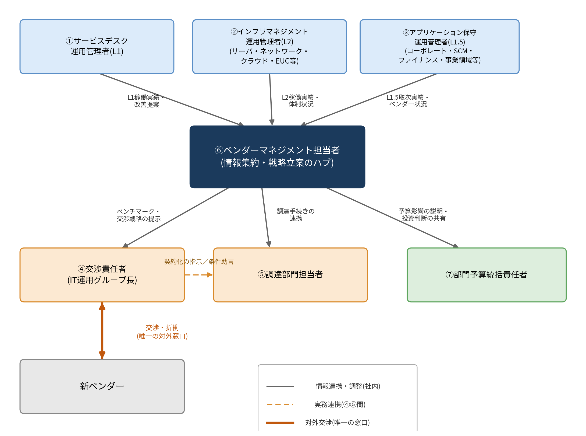

# 11. 体制：交渉・契約設計の役割分担(提案)

> **この章の位置づけ**：複数年アウトソーシング契約の交渉・設計を担う社内体制を提案する章である。
> **対象読者**：交渉責任者／調達部門／部門予算統括責任者／ベンダーマネジメント担当者

## 要旨

it-cost-optimizationにおける体制設計と同じ考え方を踏襲し、本資料の作成主体であるベンダーマネジメント担当者(⑥)を、情報集約・戦略立案のハブとして位置づける。サービスデスク・インフラ・アプリケーション保守それぞれの運用管理者から実績・課題を集約し、交渉責任者へベンチマークと交渉戦略を提示、調達部門と契約手続きを連携するという役割分担である。

## 11.1 提案の趣旨

移行プロジェクト側の体制(請負契約の実行体制)とは別に、この契約交渉・設計側の体制を明確に分けておくことが望ましい。両者の情報連携(移行で判明した実態を契約条件に反映する等)は必要だが、責任の所在は分離する。

## 11.2 各ロールの役割定義

| 役割 | 内容 |
|---|---|
| ①サービスデスク運用管理者(L1) | L1の稼働実績を把握し、SLA・KPI設計への改善提案を行う |
| ②インフラマネジメント運用管理者(L2：サーバ・ネットワーク・クラウド・EUC等) | L2の稼働実績・体制状況を把握し、SLA・KPI設計への改善提案を行う |
| ③アプリケーション保守運用管理者(L1.5：コーポレート領域・SCM領域・ファイナンス領域・事業領域等) | 各アプリケーション保守ベンダーとの取次実績・ベンダー状況を把握し、L1.5に関する契約条件への改善提案を行う |
| ④交渉責任者(IT運用グループ長) | 新ベンダーとの唯一の対外交渉窓口。価格モデル・ベンチマーキング条項の最終判断を行う |
| ⑤調達部門担当者 | 契約化の実務・法務対応を担う。④と実務連携する |
| ⑥ベンダーマネジメント担当者(情報集約・戦略立案のハブ) | ①②③の情報を集約し、④に交渉戦略・ベンチマークを提示。⑤と調達手続きを連携する |
| ⑦部門予算統括責任者 | 契約の予算影響を把握し、投資判断を共有される |

## 11.3 各ロール間の関係図

*図　各ロール間の情報・役務の関係*

## 11.4 契約交渉プロセスにおける役割分担表

凡例：◎主担当／●意思決定・最終承認／○協議・関与／△情報共有・事後報告／－原則関与なし

| フェーズ | ① | ② | ③ | ④ | ⑤ | ⑥ | ⑦ |
|---|---|---|---|---|---|---|---|
| 平時ガバナンス(モニタリング) | ◎ | ◎ | ◎ | △ | － | ○ | △ |
| 契約条件設計(SLA・価格モデル) | ○ | ○ | ○ | ● | △ | ◎ | － |
| 交渉実行 | － | － | － | ◎ | ○ | ○ | － |
| 契約締結 | ○ | ○ | ○ | ● | ◎ | ○ | △ |
| 予算反映・経営報告 | △ | △ | △ | ○ | － | ○ | ● |
| 契約後フォロー | ◎ | ◎ | ◎ | △ | － | ◎ | △ |

## 11.5 推奨される運営体制

移行プロジェクト側の体制とは別に、この契約交渉・設計側の体制を明確に分けておくことが望ましい。月次でのワーキングに加え、契約締結(12月)に向けては週次での進捗確認を推奨する。

## この章の結論

- it-cost-optimizationと同じ7ロール構造を踏襲し、①②③の運用管理者から⑥ベンダーマネジメント担当者が情報を集約し、④交渉責任者に戦略を提示、⑤調達部門と契約化を連携する体制を提案する。
- 移行プロジェクト側の体制とは責任を分離しつつ、必要な情報連携を行う。
- 契約締結(12月)に向けては、月次ワーキングに加え週次での進捗確認を推奨する。

---

**参照**：第1章(対象範囲)、第9章(L1.5の契約上の扱い)、第12章(施策一覧と優先順位)
