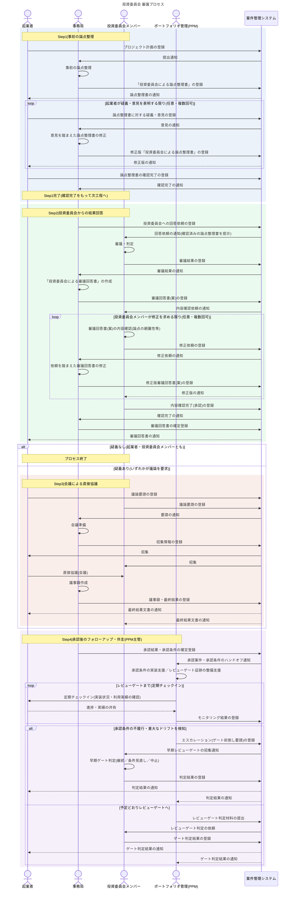

```mermaid
sequenceDiagram
    title 投資委員会 審議プロセス
    actor 起案者
    actor 事務局
    actor 投資委員会メンバー
    actor PPM as ポートフォリオ管理(PPM)
    participant CMS as 案件管理システム

    rect rgb(235, 242, 250)
    Note over 起案者,投資委員会メンバー: Step1|事前の論点整理
    起案者->>CMS: プロジェクト計画の登録
    CMS->>事務局: 提出通知
    事務局->>事務局: 事前の論点整理
    事務局->>CMS: 「投資委員会による論点整理書」の登録
    CMS-->>起案者: 論点整理書の通知

    loop 起案者が疑義・意見を表明する限り(任意・複数回可)
        起案者->>CMS: 論点整理書に対する疑義・意見の登録
        CMS->>事務局: 意見の通知
        事務局->>事務局: 意見を踏まえた論点整理書の修正
        事務局->>CMS: 修正版「投資委員会による論点整理書」の登録
        CMS-->>起案者: 修正版の通知
    end

    起案者->>CMS: 論点整理書の確認完了の登録
    CMS->>事務局: 確認完了の通知
    Note over 起案者,投資委員会メンバー: Step1完了(確認完了をもって次工程へ)
    end

    rect rgb(235, 250, 238)
    Note over 起案者,投資委員会メンバー: Step2|投資委員会からの結果回答
    事務局->>CMS: 投資委員会への回答依頼の登録
    CMS->>投資委員会メンバー: 回答依頼の通知(確認済みの論点整理書を提示)
    投資委員会メンバー->>投資委員会メンバー: 審議・判定
    投資委員会メンバー->>CMS: 審議結果の登録
    CMS->>事務局: 審議結果の通知
    事務局->>事務局: 「投資委員会による審議回答書」の作成
    事務局->>CMS: 審議回答書(案)の登録
    CMS->>投資委員会メンバー: 内容確認依頼の通知

    loop 投資委員会メンバーが修正を求める限り(任意・複数回可)
        投資委員会メンバー->>投資委員会メンバー: 審議回答書(案)の内容確認(論点の網羅性等)
        投資委員会メンバー->>CMS: 修正依頼の登録
        CMS->>事務局: 修正依頼の通知
        事務局->>事務局: 依頼を踏まえた審議回答書の修正
        事務局->>CMS: 修正版審議回答書(案)の登録
        CMS-->>投資委員会メンバー: 修正版の通知
    end

    投資委員会メンバー->>CMS: 内容確認完了(承認)の登録
    CMS->>事務局: 確認完了の通知
    事務局->>CMS: 審議回答書の確定登録
    CMS-->>起案者: 審議回答書の通知
    end

    alt 疑義なし(起案者・投資委員会メンバーとも)
        Note over 起案者,投資委員会メンバー: プロセス終了
    else 疑義あり(いずれかが議論を要求)
        rect rgb(250, 238, 235)
        Note over 起案者,投資委員会メンバー: Step3|会議による直接協議
        起案者->>CMS: 議論要請の登録
        投資委員会メンバー->>CMS: 議論要請の登録
        CMS->>事務局: 要請の通知
        事務局->>事務局: 会議準備
        事務局->>CMS: 招集情報の登録
        CMS->>起案者: 招集
        CMS->>投資委員会メンバー: 招集
        起案者->>投資委員会メンバー: 直接協議(会議)
        事務局->>事務局: 議事録作成
        事務局->>CMS: 議事録・最終結果の登録
        CMS-->>起案者: 最終結果文書の通知
        CMS-->>投資委員会メンバー: 最終結果文書の通知
        end
    end

    rect rgb(245, 240, 250)
    Note over 起案者,PPM: Step4|承認後のフォローアップ・伴走(PPM主管)
    事務局->>CMS: 承認結果・承認条件の確定登録
    CMS->>PPM: 承認案件・承認条件のハンドオフ通知
    PPM->>PPM: 承認条件の実装支援／レビューゲート証跡の整備支援

    loop レビューゲートまで(定期チェックイン)
        PPM->>起案者: 定期チェックイン(実装状況・利用実績の確認)
        起案者-->>PPM: 進捗・実績の共有
        PPM->>CMS: モニタリング結果の登録
    end

    alt 承認条件の不履行・重大なドリフトを検知
        PPM->>CMS: エスカレーション(ゲート前倒し要請)の登録
        CMS->>投資委員会メンバー: 早期レビューゲートの招集通知
        投資委員会メンバー->>投資委員会メンバー: 早期ゲート判定(継続／条件見直し／中止)
        投資委員会メンバー->>CMS: 判定結果の登録
        CMS-->>起案者: 判定結果の通知
        CMS-->>PPM: 判定結果の通知
    else 予定どおりレビューゲートへ
        PPM->>CMS: レビューゲート判定材料の提出
        CMS->>投資委員会メンバー: レビューゲート判定の依頼
        投資委員会メンバー->>CMS: ゲート判定結果の登録
        CMS-->>起案者: ゲート判定結果の通知
        CMS-->>PPM: ゲート判定結果の通知
    end
    end
```