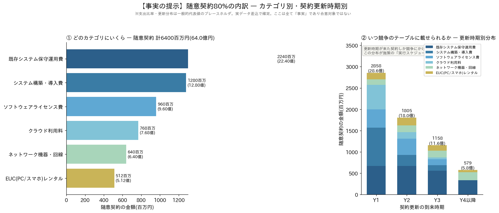
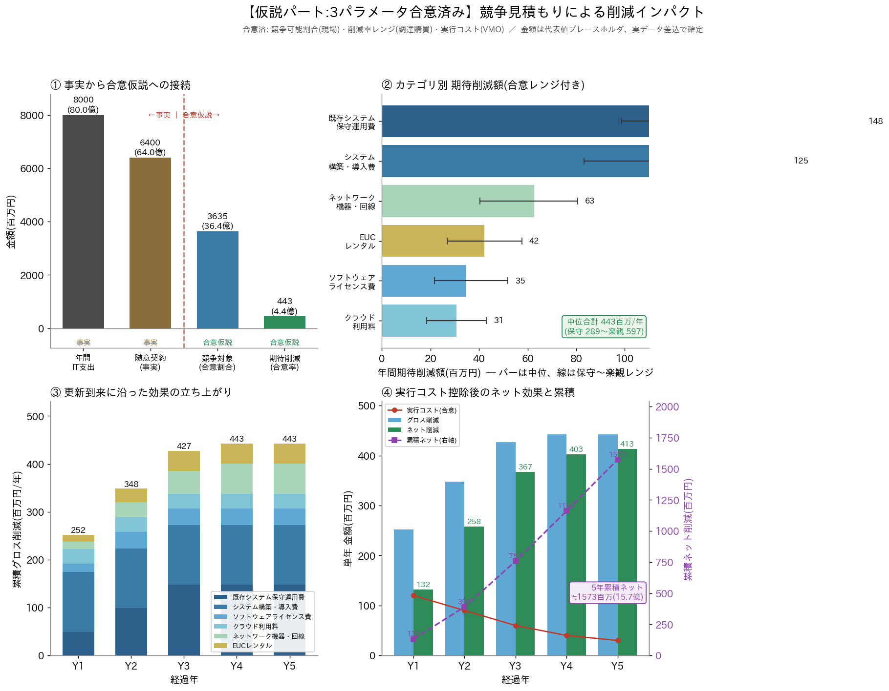
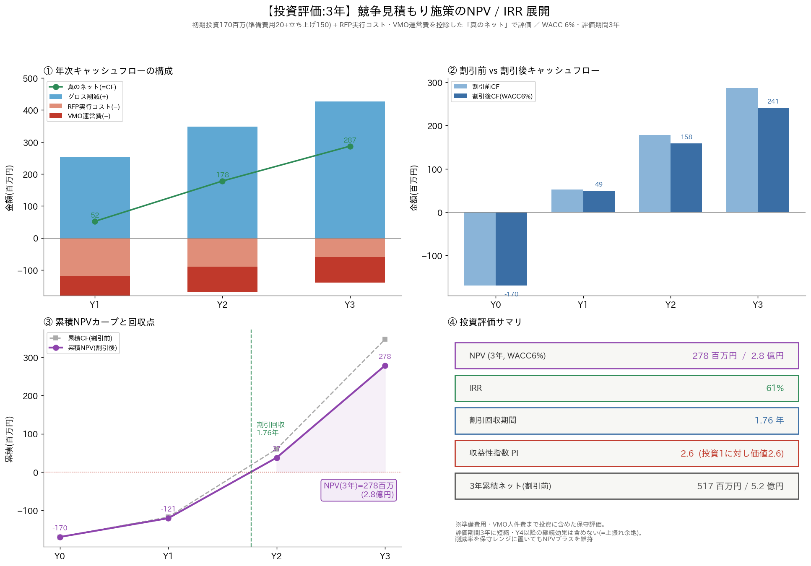
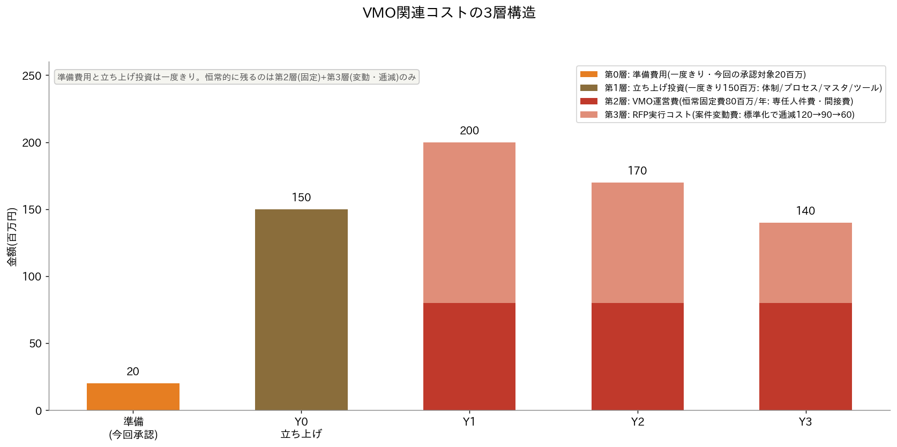
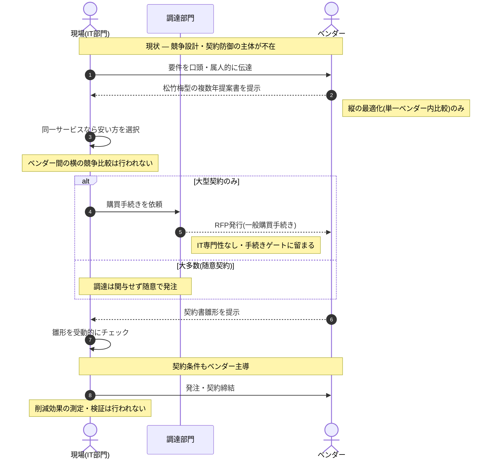
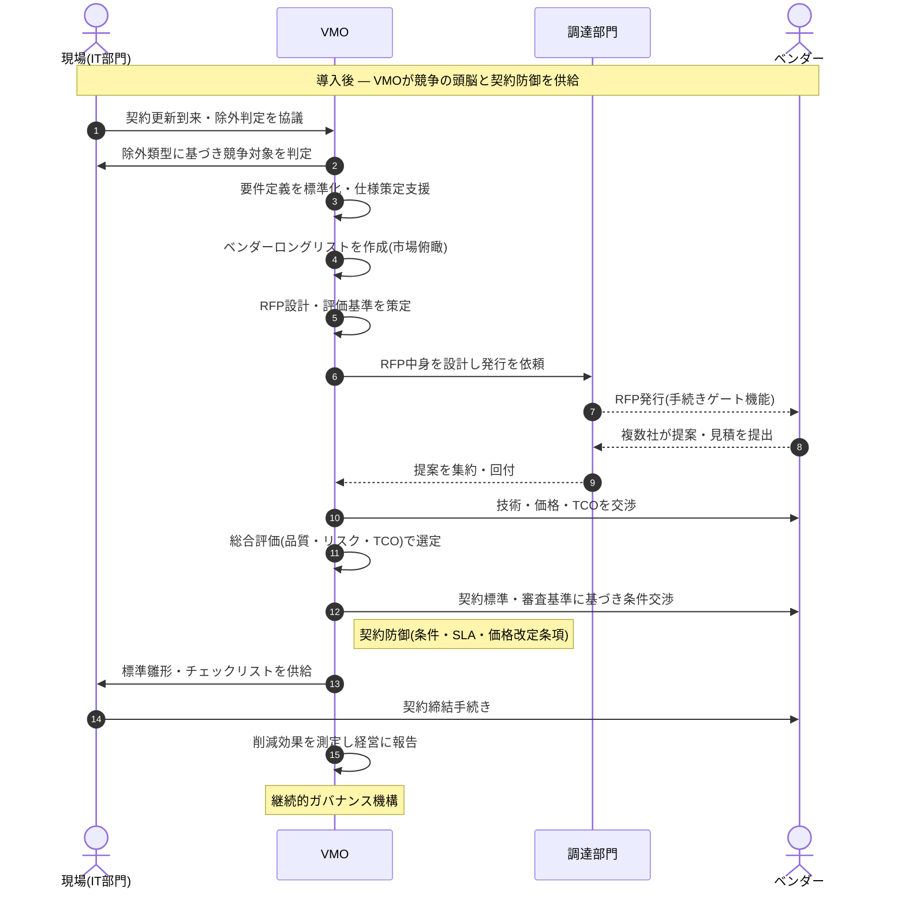

# VMO Value Create施策 企画提案書

## 本書の構成

本提案書は三部構成です。**第I部は投資承認を求める本論**であり、経営会議のご判断はこの第I部で完結します。**第II部**は、なぜVMO（Vendor Management Office：ベンダーマネジメント専門機能）が必要かという構造分析と役割の前後比較、**第III部**はVMOが実務を担い切れるかというキャパシティ・プランニングであり、いずれも第I部の判断を裏づける背景・補論です。

- **第I部　投資提案（承認本論）**
- **第II部　施策の前提となる構造分析と役割再定義**
- **第III部　VMO運営の実行可能性 ― キャパシティ・プランニング**

 
 

# 第I部　投資提案

## 1. 事実：現状

年間IT支出は約80億円です。契約件数は約200件、取引ベンダーは約50社にのぼります。このうち金額ベースで約80%（64億円）が、競争入札も相見積もりも経ず、既存ベンダーの提案どおりに発注される随意契約となっています。残る約20%は数件の大型契約が中心で、これらについては調達部門が購買手続きに関与しています。

この64億円をカテゴリ別に分解すると、既存システム保守運用費が最大（約22.4億円）で、以下、システム構築・導入費（12.8億円）、ソフトウェアライセンス費（9.6億円）、クラウド利用料（7.7億円）、ネットワーク機器・回線（6.4億円）、EUCレンタル（5.1億円）と続きます。

重要な事実として、既存契約の多くは**複数年契約**です。ベンダーはいわゆる松竹梅型の複数プラン提案を行い、複数年契約に対するディスカウントを提示しています。現場は「同一サービスなら安い方が合理的」という判断で複数年・低価格プランを選択しており、結果として単年契約はほとんど残っていません。したがって現状は「ベンダー提案を無検証で鵜呑みにしている」のではなく、**単一ベンダーの提案内での価格最適化（縦の最適化）は行われている**状態です。この事実は、後述する問題の本質（第II部）を正確に定義するうえで決定的に重要です。

もう一点の事実として、契約更新時期の分布があります。競争見積もりは契約更新のタイミングでしか実施できないため、「いつ競争のテーブルに載せられるか」が施策の実行スケジュールを規定します。更新時期別に見ると、初年度（Y1）に更新が到来するのは約28.6億円分、Y2に約18.0億円、Y3に約11.6億円と、複数年に分散しています。すなわち本施策は、既存契約を今すぐ引き剥がすものではなく、**更新の到来に沿って段階的に競争プロセスを適用していく**性質のものです。複数年契約が主体であることは、この段階適用がさらに緩やかに立ち上がることを意味します。

*注：本資料のカテゴリ別比率・更新時期分布は一般的な代表値によるプレースホルダです。契約マスタ整備チームの実データが確定次第、同じ枠組みで差し替えます。複数年契約の実態（更新月の分布）も、実データ投入時に契約単位で反映します。*

 

## 2. 効果試算の設計：事実と仮説を峻別し、仮説は関係部門と合意する

効果試算は「事実」と「仮説」を明確に区分して設計しています。年間IT支出80億円と随意契約比率80%は事実です。一方、そこから先の絞り込み、すなわち「随意契約のうちどれだけが現実に競争可能か」「競争にかければどの程度下がるか」「実行にいくらかかるか」は仮説であり、それぞれ最も知見を持つ部門と合意して確定します。

| 仮説パラメータ | 合意相手 | 合意の根拠となる知見 | 合意方法 |
|---|---|---|---|
| 競争可能割合（除外条件） | 現場（各システム管理者・チームマネジャー） | 契約実態、切替リスク、ベンダーとの関係性という一次情報 | VMOが除外理由の類型（戦略パートナー／切替リスク過大／単一ソース妥当）を定義し、契約単位で根拠とともに判定 |
| 削減率レンジ（カテゴリ別） | 調達・購買部門（市場相場観）＋外部ベンチマーク | 一般購買の市場相場観、外部ベンチマーク | カテゴリ別に保守・中位・楽観の3水準レンジで設定。経営報告には保守側を使用 |
| 投資・実行コスト | VMO自身 | 施策実行の当事者としての工数見積 | 保守的に厚めに計上し、下振れ余地を残す |

削減率の合意にあたっては、**起点となる価格が既に複数年ディスカウント後の実勢価格である**点に留意します。定価からの値引きではなく、ディスカウント後価格からの追加削減余地を見積もるため、削減率は保守側に置いて評価します。この論点は準備フェーズで調達・外部ベンチマークと必ず突き合わせます。なお、調達部門はIT専門性を欠くため、削減率の合意においては「市場相場観の提供」に役割を限定します（詳細は第II部）。

この分担には、数字の精度を高める以上の意味があります。除外条件を現場と、削減率を調達・外部ベンチマークと握ることで、試算は「VMOが机上で作った数字」ではなく「**関係部門の知見を統合した全社の数字**」になります。これは当社が目指す部門横断のベンダーマネジメント標準の確立、その最初の実践そのものです。

 

## 3. 期待効果：段階的な絞り込みと保守的なレンジ

合意された（合意を想定した）パラメータを適用すると、効果は次のように導かれます。年間IT支出80億円のうち随意契約64億円（事実）。そこから現場と合意する**カテゴリ別の競争可能割合**を適用すると、競争対象は約36.4億円に絞られます（一律ではなくカテゴリごとの割合を加重した結果です）。さらに調達・外部ベンチマークと合意するカテゴリ別削減率（中位）を適用すると、満額到達時の年間期待削減額は約4.4億円、保守側の削減率でも約2.9億円となります。

効果は初年度から満額では出ません。契約更新の到来に沿って立ち上がり、複数年契約が主体であることも考慮すると、緩やかに積み上がって3年目に年間約4.3億円（中位・グロス）の水準に達します。用語を明確にすると、**「満額到達時＝約4.4億円」は全契約が競争を経た後の定常値**、**「Y3実績＝約4.3億円」は3年目時点での立ち上がり途上の値**であり、両者は別概念です。この「すぐに満額を約束しない」構造こそが、試算の実行可能性を担保しています。

なお、年次の立ち上がりは現段階では「契約更新の到来に沿って効果が積み上がる」近似計算です。契約単位の更新月の実データを投入すると配分は変動しうるため、この点は準備フェーズで確定させます。加えて、VMOの処理能力による立ち上がりの上限は第III部で別途評価しています。

 

## 4. 投資評価：人件費まで全額計上してNPVプラス

本施策を投資として評価するにあたり、意図的に最も保守的な立て方を採用しています。すなわち、準備費用20百万円と立ち上げ投資150百万円をY0の初期投資として計上し、さらにVMO専任体制の人件費（運営費・年80百万円）とRFP実行コスト（年120→90→60百万円、標準化により逓減）を毎年のキャッシュアウトとして全額控除した「真のネット」でキャッシュフローを構成しています。

この保守的前提のもとで、評価期間3年・WACC 6%での結果は、**NPV 278百万円、IRR 61%、割引回収期間 1.76年、収益性指数（PI）2.6** です。投資1に対して3年間で約2.6倍の価値が返る計算になります。

さらに、VMOの処理能力（キャパシティ）を最も厳しいシナリオで織り込んでも、**NPV 250百万円、IRR 53%、回収 1.94年、PI 2.5** を維持します（算定根拠は第III部）。すなわち本施策のNPVプラスは、実行上の律速要因を保守的に見込んでも揺らぎません。

加えて3点の保守性を付記します。第一に、評価期間を3年に限定しており、競争で下げた単価が4年目以降も効き続ける継続効果を価値に含めていません。第二に、削減率は中位を使用しており、保守レンジに置き換えてもNPVはプラスを維持します。第三に、本評価には**契約条件の改善による価値が一切含まれていません**。VMOによる契約防御（不利な価格改定条項の是正、SLA適正化等）は価格削減とは別軸の価値であり、定量化が難しいため試算には織り込んでいませんが、実現すればさらなる上振れ要因となります（第II部）。

 

## 5. コスト構造：恒常的に残るのは運営費のみ

本施策のコストは性質の異なる層で構成されており、その大半は一過性です。準備費用（20百万円）と立ち上げ投資（150百万円）は一度きりの支出です。恒常的に残るのはVMO運営費（固定費・年80百万円）と、案件量に応じて変動するRFP実行コスト（プロセスの標準化・習熟により年120→90→60百万円と逓減）のみです。年間のコスト総額は初年度の200百万円をピークに減少していく構造です。

VMO運営費80百万円/年は専任の少数精鋭チーム（マネジャー・メンバー・外部コンサルで構成、詳細は第III部）の人件費・外部委託費等を想定した固定費です。人数・単価の内訳は準備フェーズで確定し、正式稟議に付します。年約4.3億円規模の削減に対して運営費0.8億円という費用対効果の分母となる数字であり、確度を高めて提示します。

 

## 6. 実行アプローチ：現場・調達・VMOの三者分業を前提とした段階適用

本施策の成否は、現場・調達・VMOの役割を明確に分業することにかかっています。実行にあたっては次の原則を明確にします。

競争見積もりの適用は契約更新の到来に沿った段階適用とし、既存契約を期中に強制解約することはしません。戦略的パートナーや、関係性そのものが価値となっている契約は、除外類型に基づく判定を経て競争対象から外します。

役割分担の要点は、**VMOが競争の頭脳工程（要件標準化、ロングリスト作成、RFP設計・評価基準策定、技術・価格交渉、契約条件審査）を新たに供給し、調達部門は本来機能している購買手続きゲートに専念し、現場は一次情報の提供と契約締結を担う**というものです。これにより、現場の負荷はむしろ軽減され、調達部門にIT専門性を新たに求めることもありません。VMOは既存部門の仕事を奪うのではなく、これまで組織の空白地帯に落ちていた専門工程を埋める役割を担います（前後比較は第II部）。

競争は最安値落札ではなく、品質・リスク・総所有コスト（TCO）を含む総合評価で行います。削減の成果は、現場のコスト意識・調達の手続き機能・VMOの専門性が結合した部門横断の共同成果として位置づけます。

 

## 7. 承認依頼事項の詳細

### （1）初期投資および人員体制（方向性の承認）

立ち上げ投資150百万円（Y0）の内訳は、VMO体制構築、ベンダーマネジメント標準プロセスの整備、契約・ベンダーマスタの本格整備（既存チームの成果を引き継ぎ拡張）、調達・契約管理ツールの導入・設定、関係部門トレーニングです。人員体制は、専任のVMO機能（マネジャー・メンバー・外部コンサルからなる少数精鋭チーム、運営費として年80百万円規模）を想定しています。正式な金額・体制は準備フェーズの成果をもって稟議に付議します。本日は、この方向で準備を進めることへの承認をお願いします。

 

### （2）準備費用 20百万円（本日の承認対象）

直近3〜4ヶ月で以下を実行するための費用です。

| 使途 | 概算 | 成果物 |
|---|---|---|
| 契約・支出データの実数確定（契約マスタチームとの共同作業、カテゴリ×更新時期×契約年数×階層のマッピング） | 6百万円 | 実データに基づく確定版の効果試算・キャパ試算 |
| 現場との除外条件ワークショップ（除外類型の定義、対象契約のスクリーニング） | 4百万円 | 競争対象契約の一次リストと除外判定基準 |
| 削減率ベンチマーク調査（調達の市場相場観の聴取＋外部ベンチマーク購入。ディスカウント後価格を起点とする） | 5百万円 | カテゴリ別削減率レンジの合意文書 |
| RFP標準プロセス・評価基準・契約標準のドラフト設計 | 3百万円 | RFPテンプレート、総合評価基準案、契約審査チェックリスト |
| 正式稟議資料の作成・関係部門レビュー（現場・調達との役割分担合意含む） | 2百万円 | 投資稟議書（実数版）、三者役割分担合意書 |

この準備フェーズの完了により、本提案書のプレースホルダ数値はすべて実データと部門合意に基づく確定値に置き換わり、経営会議は確度の高い数字で本投資の最終判断ができます。**20百万円は、170百万円の投資判断を確実なものにするための、いわば意思決定の品質への投資です。**

 

## 8. 主要リスクと対応

現場の抵抗により除外が過大となり競争対象が空洞化するリスクに対しては、除外を現場の申告制ではなく類型基準による判定制とし、除外理由を文書化して四半期ごとにレビューします。

複数年ディスカウント後の価格が起点であるため追加削減余地が想定より小さいリスクに対しては、削減率を保守側に置き、準備フェーズで外部ベンチマークによる検証を経た数字のみを経営報告に使用します。

競争の結果ベンダーを切り替えた際の品質低下・移行トラブルのリスクに対しては、最安値落札ではなくTCOと品質の総合評価を徹底し、切替時は移行計画の審査を必須とします。

三者分業が機能せず役割の綱引きが生じるリスクに対しては、準備フェーズで現場・調達との役割分担を文書で合意し（第7章成果物）、VMOが担う工程と調達が担う手続きの境界を明確化します。

VMOの実行キャパシティ不足のリスクに対しては、需給を定量評価したうえで、初年度は大型・中型案件を優先し小型案件を翌期に繰り越す運営規律を敷きます。この規律下でもNPVプラスが維持されることを確認済みです（第III部）。

 

## 9. スケジュール概要

準備フェーズ（承認後3〜4ヶ月）：データ確定（契約年数・更新月・階層を含む）、3パラメータの部門合意、三者役割分担合意、正式稟議。
Y0（稟議承認後〜6ヶ月）：VMO体制立ち上げ、標準プロセス・契約標準・ツール整備、メンバー育成着手。
Y1以降：更新到来契約から順次競争見積もりを適用。四半期ごとに削減実績と対象カバレッジを経営報告。

 
 

# 第II部　施策の前提となる構造分析と役割再定義

本部は、なぜVMOという新機能が必要かを構造から説明します。第I部の投資判断そのものには必須ではありませんが、「なぜ既存部門ではなくVMOなのか」という問いに答える論拠です。

## 10. 問題の本質：横の競争比較と契約防御を担う主体が組織に存在しない

随意契約それ自体が悪ではありません。また第I部で示したとおり、現場は複数年ディスカウントを取るなど、**単一ベンダー内での価格最適化（縦の最適化）は行っています**。したがって「価格をまったく検証していない」という単純な指摘は正確ではありません。

問題の本質は、当社に決定的に欠けている二つの機能にあります。

第一に、**ベンダー間の市場競争を設計・遂行する機能（横の最適化）**です。松竹梅の比較は同一ベンダー内の縦の比較にすぎず、そのベンダーの提示価格が市場水準に照らして妥当かは検証されていません。複数ベンダーを競わせる土俵（ロングリスト、RFP設計、評価基準）を作る主体が組織のどこにも存在しないため、市場との競争比較が構造的に成立していません。

第二に、**契約条件を能動的に統制する機能**です。当社では契約実務をIT部門の現場が担っていますが、契約に関する専門性を欠くため、実態はベンダーが提示する契約書雛形を受動的にチェックするにとどまっています。価格だけでなく契約条件（責任範囲、SLA、価格改定条項、解約条項、知的財産の帰属等）についても、ベンダー主導で組成されている可能性が高い状態です。

この二つの欠落は、価格の妥当性を検証する仕組みの不在であると同時に、**調達ガバナンス上の統制欠陥**でもあります。内部監査・外部監査の観点からも、「競争性のない発注」と「ベンダー雛形の受動受諾」は指摘リスクを抱えた状態です。本施策は、監査で指摘される前にこの統制欠陥を能動的に是正する、自浄的なガバナンス強化の取り組みでもあります。

 

## 11. 原因は個人ではなく構造：タスクが組織の空白地帯に落ちている

競争プロセスの中核工程——要件定義の標準化、ベンダーロングリストの作成、RFP設計・評価基準の策定、技術・価格交渉、契約条件の審査——は、いずれも専門性と相応の工数を要します。ところが当社では、これらのタスクが**組織のどの部門にも明確に割り当てられていません**。

調達部門は制度上、RFPや相見積もりの購買手続きに関与するルールですが、IT領域の専門性を持たず、一般購買業務の延長としてIT購買を扱っているのが実情です。能動的に要件定義をしたり、ベンダーロングリストを作成したり、技術的観点でベンダーと交渉する能力は備わっていません。実際に調達が関与できているのは、残り20%を占める数件の大型契約における購買手続きに限られます。契約実務についても、調達のルールに規定がなく、現場が担わざるを得ない状態です。

一方、現場は限られた工数の中でシステムを安定稼働させることに手一杯であり、市場を俯瞰したロングリスト作成や競争設計にまで手が回りません。結果として、現場はベンダーが提示する松竹梅提案の中から選ぶ（縦の最適化）ところで実務が完結し、横の競争比較や契約防御は誰も担わないまま放置されてきました。

すなわち原因は、**競争を設計する機能と契約を防御する機能が、組織の「空白地帯」に落ちている**ことにあります。空白に落ちたタスクの主導権は、必然的にベンダー側が握ることになります。提案書の型（松竹梅）も契約書の雛形も、ベンダーが用意するものを起点にせざるを得ないからです。したがって解決策は、現場への叱責や号令ではなく、**この空白を埋める専門機能（VMO）の整備**でなければなりません。

 

## 12. VMO導入によるプロセス・役割の再定義

前章までの構造を、工程レベルで可視化し、VMO導入前後の役割変更を明示します。責任分担（RACI）と処理フロー（シーケンス）の二つの角度から示します。

### 12.1 責任分担マトリクス（RACI）：As-Is / To-Be

R=実行責任、A=最終責任、C=協議先、I=報告先。「―」は担い手不在（空白地帯）を示します。

**As-Is（現状）**

| 工程 | 現場(IT) | 調達 | VMO | ベンダー |
|---|---|---|---|---|
| IT要件定義・仕様策定 | A/R | | ― | C(主導) |
| ベンダーロングリスト作成 | ― | ― | ― | ― |
| RFP設計・評価基準策定 | ― | ― | ― | ― |
| RFP発行・相見積取得（大型のみ） | C | A/R | ― | I |
| RFP発行・相見積取得（大型以外） | ― | ― | ― | ― |
| ベンダー交渉（技術・価格） | A/R(弱) | C(大型時) | ― | C(主導) |
| 契約条件審査・交渉 | A/R(受動) | | ― | R(雛形主導) |
| 契約締結手続き | A/R | | ― | I |
| 削減効果測定・ガバナンス | ― | ― | ― | ― |

現状は、最終責任（A）が現場に偏在する一方、実質的な実行（R）の多くをベンダーが握り、要件以降の競争・評価・測定工程が「―（不在）」で埋まっています。空白の多さがそのまま統制欠陥の可視化です。

 

**To-Be（VMO導入後）**

| 工程 | 現場(IT) | 調達 | VMO | ベンダー |
|---|---|---|---|---|
| IT要件定義・仕様策定 | A/R | | R(標準化支援) | I |
| ベンダーロングリスト作成 | C | I | A/R | |
| RFP設計・評価基準策定 | C | I | A/R | |
| RFP発行・相見積取得 | I | A/R(手続) | C(中身設計) | I |
| ベンダー交渉（技術・価格） | C | C(契約条件) | A/R | |
| 契約条件審査・交渉 | C | I | A/R(標準・審査) | I |
| 契約締結手続き | R | I | A/C(雛形供給) | I |
| 削減効果測定・ガバナンス | I | I | A/R | |

To-Beでは空白（―）が消え、VMOが競争の頭脳工程と契約防御工程を最終責任として引き受けます。調達は本来機能する購買手続きに、現場は要件と締結に責任を保持します。ベンダーが握っていた実行主導権（提案設計・契約雛形）を組織側に取り戻す構図です。

 

### 12.2 処理フロー（シーケンス図）：As-Is / To-Be

**As-Is：ベンダー主導・受動フロー**

 

**To-Be：VMO主導・競争設計フロー**

 

### 12.3 二つの図が示すこと

RACIは責任の所在の静的な穴を、シーケンス図はフローの動的な主導権を示します。両者を並べると、As-Isの本質が二層で見えます。RACIでは要件以降が「―」で空き、シーケンスではその空白をベンダーが自らの提案書と契約雛形で埋めています。すなわち**空白地帯にベンダーが流れ込む構造**です。To-Beは、その空白にVMOを挿入することで、ベンダーが握っていた主導権（提案設計・契約雛形）を組織側に取り戻します。これが「VMOは調達の仕事を奪わず、誰も担っていなかった空白を埋める」という本施策の中核メッセージを、二つの角度から裏づけます。

 
 

# 第III部　VMO運営の実行可能性 ― キャパシティ・プランニング

第II部で示したとおり、本施策はVMOが競争の頭脳工程と契約防御工程の大半を担い、その品質にも責任を負う設計です。したがって、VMO自身が新たなボトルネックになりはしないか、実務を担い切れるかを定量的に検証する必要があります。本部はその需給分析と、処理能力制約下でも投資価値が保たれることの確認です。

## 13. 供給側：VMOチームの体制と実効工数

VMOは専任の少数精鋭チームとし、次の構成を想定します。マネジャー（パートタイム・0.5FTE、統括と品質レビューを中心とする）、専任メンバー2名、外部コンサル1名です。外部コンサルは実務を担うと同時に、メンバー2名の育成を担います。育成の進捗に応じてメンバーの生産性が2年目以降に立ち上がり、外部コンサルの実務比重は逓減していく設計です。

管理・レビュー工数と育成負荷を控除した実効工数（競争案件に投下可能な正味工数）は、年次で次のとおりです。

| 要員 | Y1 | Y2 | Y3 | 備考 |
|---|---|---|---|---|
| マネジャー（PT 0.5FTE） | 3.5 | 3.5 | 3.5 | 統括・品質レビュー中心 |
| メンバー2名 | 12 | 18 | 20 | 育成期は生産性逓増→自立→定常 |
| 外部コンサル1名 | 8.5 | 9 | 6 | 実務＋育成。実務比重は逓減 |
| **実効供給 合計（人月/年）** | **24.0** | **30.5** | **29.5** | |

外部コンサルの実務比重逓減は、RFP実行コスト（120→90→60）の逓減とも整合します。すなわち標準化・内製化が進むにつれ外部依存とコストがともに下がる構造です。

 

## 14. 需要側：工数原単位と年次必要工数

競争プロセス1件あたりの工数は案件規模に大きく依存するため、大型・中型・小型の3階層で工数原単位を置きます。保守的に、いずれもバッファを乗せた上限側を採用します。

| 階層 | 工数原単位 | 根拠 |
|---|---|---|
| 大型 | 6.0 人月/件 | 3〜6ヶ月。保守側（6ヶ月）を採用 |
| 中型 | 1.2 人月/件 | 約1ヶ月＋バッファ |
| 小型 | 0.3 人月/件 | 約1週間＋バッファ |

年次の必要工数は、各年の更新到来額から競争対象額を算出し（随意比率×競争可能割合の加重）、それを階層別の件数に分解して工数原単位を乗じて求めます。ここでは最も厳しい前提（大型偏重かつ契約単価が小さめで件数が膨らむ「最悪複合シナリオ」）を採用します。

| 項目 | Y1 | Y2 | Y3 |
|---|---|---|---|
| 競争対象額（百万円） | 約1,300 | 約818 | 約527 |
| 必要工数 合計（人月） | 27.3 | 17.2 | 11.1 |

 

## 15. 需給判定：制約はY1のみ、しかも限定的

供給と需要を突き合わせると、次のようになります。

| 項目 | Y1 | Y2 | Y3 |
|---|---|---|---|
| 実効供給（人月） | 24.0 | 30.5 | 29.5 |
| 必要工数（人月） | 27.3 | 17.2 | 11.1 |
| **処理可能割合（クリップ係数）** | **88%** | **100%** | **100%** |

最悪複合シナリオでも、供給が需要を下回るのは初年度（Y1）のみで、その処理可能割合は88%です。Y2・Y3は供給に十分な余裕があります。

この結果には重要な構造的理由があります。**削減効果は金額（大型契約が支配）で決まる一方、工数は件数で決まります。** 大型契約は「1件あたり金額は大きいが工数は数人月」であり、金額あたりの工数効率が高い。したがって削減額の大半を稼ぐ大型・中型案件は供給内で十分こなせ、工数を圧迫するのは金額の小さい小型案件群です。

そこで運営規律として、**初年度は大型・中型案件を優先し、小型案件は翌期に繰り越す**こととします。これにより、限られた初年度キャパを削減効果の大きい案件に集中させ、かつVMOが自らの成果物品質を担保できる範囲でのみ案件を受けるという統制を働かせます。件数を追って品質を落とすのではなく、品質を保てる範囲に案件を絞る——この規律自体がガバナンス機能の一部です。

 

## 16. 処理能力制約を織り込んだ投資評価

上記の処理可能割合（Y1=88%）を初年度グロス削減に適用してキャッシュフローを再構成すると、投資評価は次のようになります。

| 指標 | 制約なし | キャパ制約後（最悪複合） |
|---|---|---|
| NPV | 278百万円 | **250百万円** |
| IRR | 61% | **53%** |
| 割引回収期間 | 1.76年 | **1.94年** |
| 収益性指数（PI） | 2.6 | **2.5** |

最も厳しいキャパシティ前提を織り込んでも、**NPVは250百万円のプラスを維持し、割引回収期間は2年未満**にとどまります。前述のとおりキャパ制約が効くのは初年度のみで、削減効果の大きい大型・中型案件は供給内で処理できるため、NPVへの影響は限定的です。したがって本施策の投資妥当性は、実行上の律速要因を保守的に見込んでも揺らぎません。

なお、本キャパシティ試算のパラメータ（工数原単位、階層ミックス、平均契約額、更新到来額）は、いずれも準備フェーズで契約マスタの実データにより確定します。実データにより需給がさらに緩む可能性が高く、その場合は上表よりNPVは改善します。

