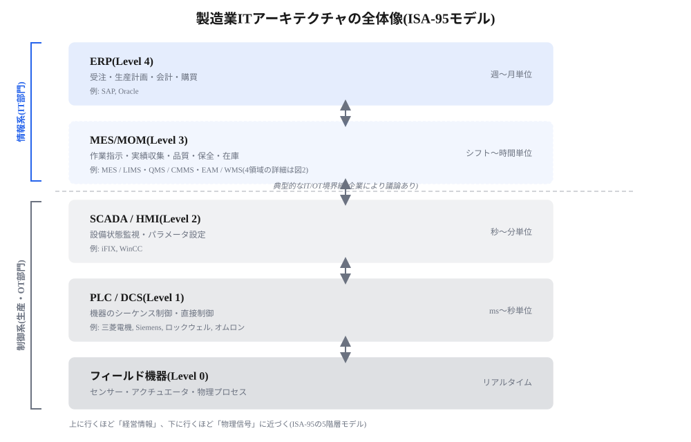
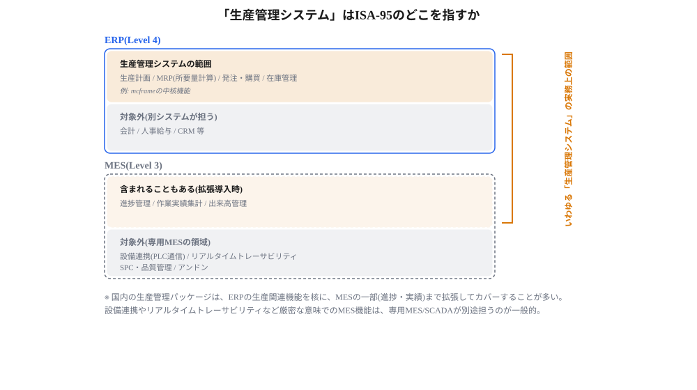
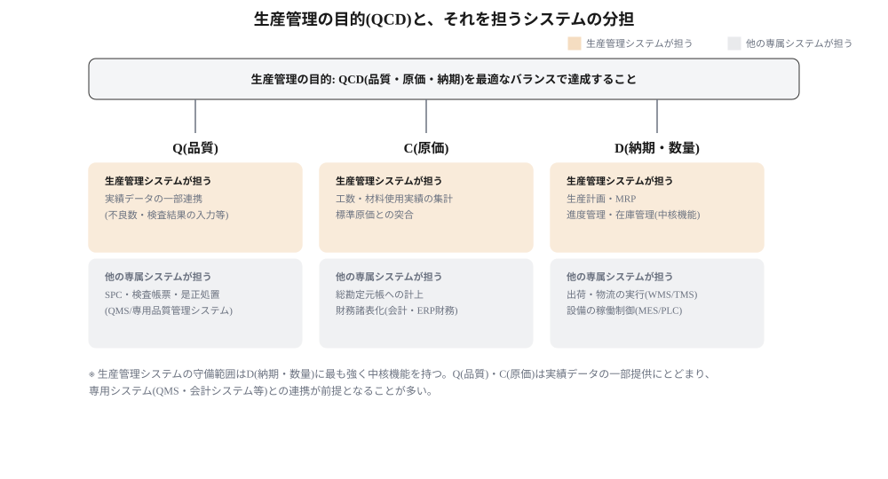

# 生産系ITの基礎理論:ISA-95・MESA-11・IT/OTの境界

> **この章の位置づけ**:生産本部が主管するシステムを理解するための共通言語(ISA-95モデル、MESA-11、IT/OT区分基準)を定義する
> **対象読者**:IT部門、経営層への説明が必要な場面

## 要旨

- 製造業のITアーキテクチャはISA-95モデルにより、ERP(Level4)/MES(Level3)/SCADA・HMI(Level2)/PLC・DCS(Level1)/フィールド機器(Level0)の5階層に整理できる。上に行くほど「経営情報」に、下に行くほど「物理信号」に近づく。
- MESの機能は「MESA-11」という業界標準の11機能で分解でき、生産管理システムがどこまでをカバーしているかを判定する物差しになる。
- IT/OTの違いは「どの階層か」ではなく、目的・リアルタイム性・障害影響・セキュリティ優先順位・ライフサイクル・管掌部門という6つの観点で判断する。
- 「生産管理システム」という実務用語は、ISA-95のどの階層にもぴったり対応しない。ERPの生産関連機能を核に、MESの一部機能まで拡張してカバーする、機能横断的な概念である。
- 生産管理の目的はQCD(品質・原価・納期)の達成であり、生産管理システムが中核的に担うのは主にD(納期・数量)である。

## 本コンセプトで使う組織用語

| 用語 | 定義 | 本コンセプトでの役割 |
|---|---|---|
| IT部門 | 本社のIT部門 | ERP・全社インフラ・全社マスタの運用主管。IT投資の承認主体の一方 |
| 生産本部 | 製造を管掌する事業部門。生産IT・生産技術・製造現場を含む | IT投資の承認主体の一方 |
| 生産IT | 生産本部内のITチーム | 工場設備関連IT(OT)およびMES工場固有領域の運用主管 |
| 業務部門 | 業務要件とデータのオーナーとなる部門の総称。生産管理・生産技術・品質保証・経理・人事等 | Data Owner、業務要件の決定主体 |
| 生産部門 | 業務部門のうち、製造現場を持つ部門 | 日々の業務運用の主体 |

「運用主管」(誰がそのシステム・機能を日常的に管理するか)と「承認主体」(誰がその投資を決裁するか)は別の軸である。運用主管はIT部門・生産IT・業務部門の3者で整理し、承認主体はIT部門・生産本部の2者で整理する。生産ITが運用主管となる領域の投資は、承認主体としては生産本部に集約される。

## ISA-95の5階層

| 階層 | 内容 | 時間粒度 | 代表製品(国内) | 代表製品(海外) |
|---|---|---|---|---|
| ERP(Level4) | 受注・生産計画・会計・購買 | 週〜月単位 | mcframe | SAP S/4HANA, Oracle, Microsoft Dynamics |
| MES(Level3) | 作業指示・実績収集・品質・トレーサビリティ | 日〜時間単位 | mcframe MES, 日立FactRiSM, 横河電機YOKOGAWA-MES, 富士電機MES | Siemens Opcenter, SAP Digital Manufacturing, Rockwell FactoryTalk, AVEVA MES |
| SCADA/HMI(Level2) | 設備状態監視・パラメータ設定 | 秒〜分単位 | 横河電機CENTUM/Exaquantum, 富士電機Citect SCADA, 日立Integrate SCADA | AVEVA System Platform, Siemens WinCC, GE/Emerson iFIX |
| PLC/DCS(Level1) | 機器のシーケンス制御・直接制御 | ms〜秒単位 | 三菱電機, オムロン, キーエンス, 富士電機 | Siemens, Rockwell Automation, Schneider Electric, ABB |
| フィールド機器(Level0) | センサー・アクチュエータ・物理プロセス | リアルタイム | — | — |

*図1　製造業ITアーキテクチャの全体像(ISA-95モデル)*

## MESA-11:MESの11機能

MESは「計画(ERP)と現場実行の乖離(Execution Gap)を埋める」ためのシステムで、MESA Internationalが1997年に11の標準機能を定義している。

| # | 機能 | 内容 |
|---|---|---|
| 1 | 資源配分・稼働状況管理 | 設備・工具・技能・資材など生産資源の管理 |
| 2 | 詳細スケジューリング | 生産計画に基づく詳細な作業順序計画 |
| 3 | 生産ディスパッチ | 作業指示を現場に展開 |
| 4 | 文書管理 | 作業指示書・図面・レシピの管理 |
| 5 | データ収集 | 実績・稼働データの収集 |
| 6 | 労務管理 | 作業者の稼働・資格管理 |
| 7 | 品質管理 | 検査・SPC・不良管理 |
| 8 | プロセス管理 | 工程の監視・異常検知 |
| 9 | 保全管理 | 設備の予防保全・故障対応 |
| 10 | トラッキング・トレーサビリティ | ロット・シリアル単位の追跡 |
| 11 | パフォーマンス分析 | OEE等の生産性分析 |

## 生産計画・BOM・製造指図の階層対応

同じ用語でも、ERP/MES/現場の各階層で呼び名と粒度が変わる。

| | ERP(Level4) | MES(Level3) | 現場(SCADA/PLC) |
|---|---|---|---|
| 生産計画 | 年間・月次生産計画(S&OP・MPS)、年〜月単位 | 日程計画・詳細スケジューリング、日〜時間単位 | 作業順序・段取り、分単位 |
| BOM | M-BOM(製造部品表)、原価・所要量計算の基準 | 作業BOM(BOP)、工程順序付き部品表 | 部品引当・ピッキング |
| 製造指図 | 製造指図(Production Order) | 作業指示書(ディスパッチリスト) | 実行・実績記録 |

ERP階層の「生産計画」と「M-BOM」を掛け合わせて「製造指図」が生成され(MRP計算)、MESで「作業指示書」へと工程・設備単位に展開される。逆方向は実績データのフィードバックである。

## IT/OTの区分基準

「どの階層か」ではなく、次の6つの観点で判断する。

| 観点 | IT | OT |
|---|---|---|
| 主目的 | 情報処理・経営の意思決定支援 | 物理プロセスの直接制御・監視 |
| 対象 | データ・情報 | 機器・エネルギー・マテリアルそのもの |
| リアルタイム性 | 分〜日単位の遅延は許容範囲 | ms〜秒単位で即応が必須 |
| 障害時の影響 | 業務停止・情報の不整合 | 安全・環境・人身事故に直結し得る |
| セキュリティ優先順位 | 機密性(Confidentiality)優先 | 可用性・安全性(Availability/Safety)優先 |
| ライフサイクル | 数年サイクルで更新 | 設備の耐用年数(十数年〜)に紐づく |
| 伝統的な管掌部門 | IT部門 | 生産技術・保全部門 |

ERP/MESは基本的にIT側、SCADA/PLC/フィールド機器はOT側に分類されるのが典型だが、実際のシステムは階層をまたいで機能が混在するため、管掌境界は「システムの種類」ではなく上記の観点でどちらの性質が強いかで判断するのが実務的である。

## 「生産管理システム」の位置づけ

「生産管理システム」は、ISA-95の1階層ではなく、ERPの生産関連機能(生産計画・MRP・発注・在庫)を核に、企業によってはMESの一部機能(進捗管理・実績集計)まで拡張してカバーする、機能横断的な実務用語である。設備連携やリアルタイムトレーサビリティのような狭義のMES機能は、通常この範囲に含まれない。

*図2　「生産管理システム」はISA-95のどこを指すか*

## 生産管理の管理対象と目的

生産管理が「何を」管理するかを整理すると、次の5つに分けられる。このうち進度・現品・余力は伝統的に「生産統制の3要素」と呼ばれる。

| 管理対象 | 何を管理するか | 代表的な指標・帳票 |
|---|---|---|
| 進度 | 計画通りに生産が進んでいるか | 生産進捗率、納期遵守率 |
| 現品 | 仕掛品・完成品が今どこに・いくつあるか | 現品票、在庫ロケーション |
| 余力 | 設備・人の能力と作業量のバランス | 稼働率、負荷率 |
| 品質 | 決められた基準を満たしているか | 不良率、歩留まり |
| 原価 | 目標コストで作れているか | 標準原価差異、実際原価 |

一方、生産管理の目的はQCD(品質・原価・納期)を最適なバランスで達成することである。生産管理システムが中核的に担うのはD(納期・数量、生産計画・MRP・進度管理・在庫管理)であり、Q(品質)・C(原価)については実績データの一部提供にとどまり、専用の品質管理システム(QMS)や会計システムとの連携が前提となる。

*図3　生産管理の目的(QCD)と、それを担うシステムの分担*

## この章の結論

- ERP/MES/SCADA/PLC/フィールド機器の5階層(ISA-95)が、生産系ITを理解する共通言語になる。
- MESA-11は、MESの機能を分解し、自社システムのカバレッジを判定する物差しとして使える。
- IT/OTの区分は階層ではなく、目的・リアルタイム性・影響・セキュリティ・ライフサイクル・管掌部門の6観点で判断する。
- 「生産管理システム」はISA-95に対応しない実務用語であり、ERP中核+MES一部という位置づけで理解する。

---

**参照**:`01_current-state.md`(この理論を当社の実態に当てはめた診断)
