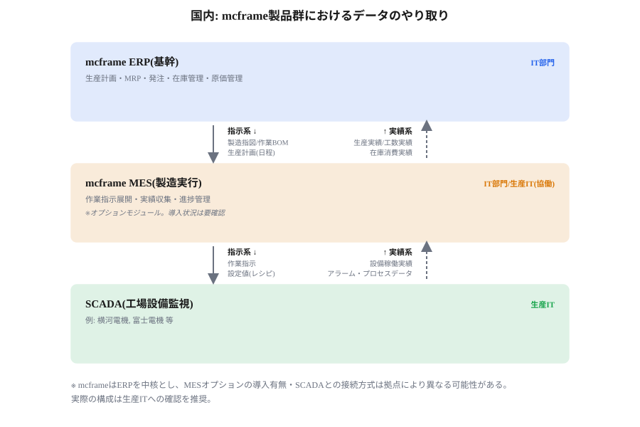
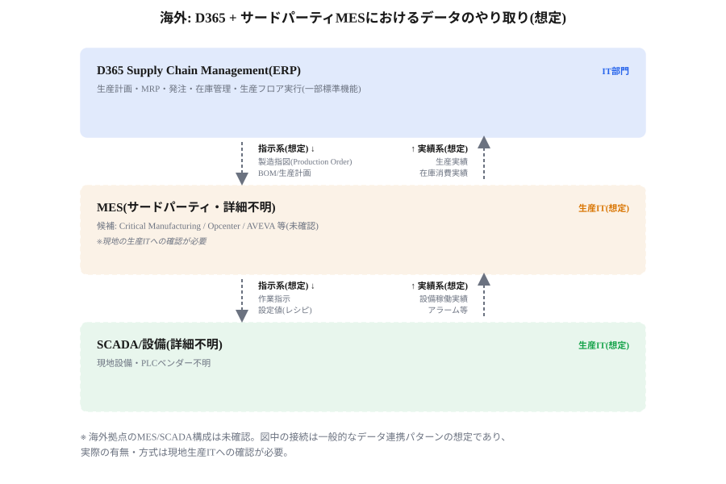
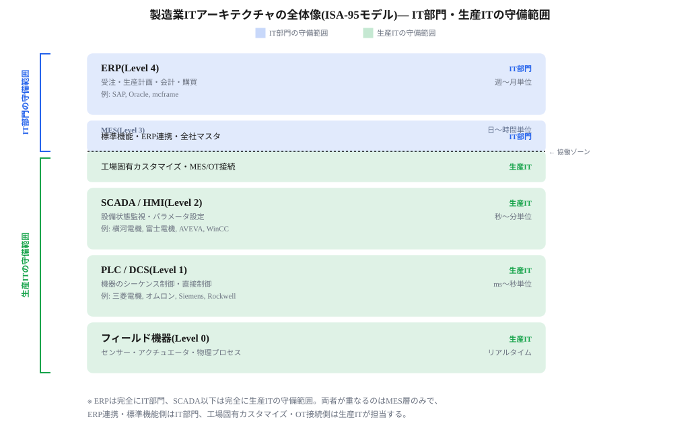
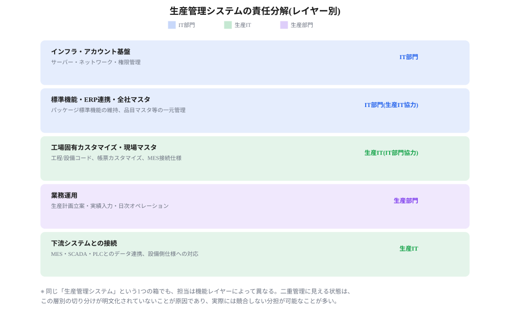
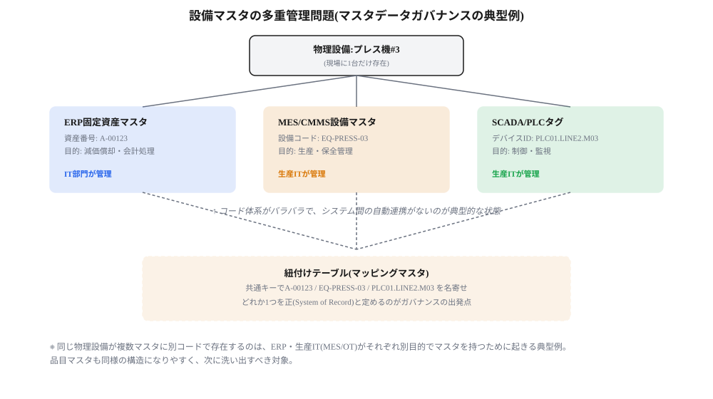

# 当社の現状:システム構成と責任分解の実態

> **この章の位置づけ**:00章の理論を当社の実態に当てはめ、現状の構造的な問題を事実ベースで整理する
> **対象読者**:IT部門、生産IT

## 要旨

- 国内はERP・MESともにmcframe(三菱電機デジタルイノベーション)、海外はERPがD365(Microsoft Dynamics 365)だが、MES/SCADAの構成は未確認。
- mcframeがMESA-11のうちカバーするのは主に2(詳細スケジューリング)・3(生産ディスパッチ)で、品質・保全・トレーサビリティ・OEE分析等は対象外の可能性が高い。
- 組織上はIT部門(本社)と生産IT(生産本部内)が並立し、OT(工場設備関連IT)は生産IT、それ以外(ERP・全社インフラ)はIT部門という大枠の合意はあるが、MES層で責任が重なる。
- 同じ物理設備が、ERP・MES/CMMS・SCADA/PLCでそれぞれ別のIDで管理される「マスタの多重管理」が典型的な問題として存在する。
- 現状の協働体制は「努力目標」であり、正式な決定権限を持つガバナンス体制が存在しない。

## 当社のシステム構成

| 拠点 | ERP | MES | SCADA/PLC |
|---|---|---|---|
| 国内 | mcframe | mcframe MES(導入状況・範囲は要確認) | 横河電機・富士電機等(想定) |
| 海外 | D365 Supply Chain Management | サードパーティ製品(詳細不明) | 現地設備・PLCベンダー不明 |

D365 Supply Chain Managementには「生産フロア実行」ワークスペースがあり、MESA-11の一部(スケジューリング・ディスパッチ・データ収集の一部)を標準機能でカバーするが、品質・保全・トレーサビリティ・OT接続は含まれない。海外拠点が標準機能のみで運用しているのか、サードパーティMES(Critical Manufacturing、Siemens Opcenter、AVEVA等が候補)を別途導入しているのか、あるいは紙・Excel運用なのかは未確認であり、現地生産ITへの確認が必要な調査項目である。

*図1　国内:mcframe製品群におけるデータのやり取り(想定)*

*図2　海外:D365+サードパーティMESにおけるデータのやり取り(想定・詳細不明)*

## mcframeのMESA-11カバレッジ(当社の状況・目安)

| MESA-11機能 | 当社の状況(目安) |
|---|---|
| 1. 資源配分・稼働状況管理 | 一部(計画上の割当は対象、リアルタイム稼働状況は対象外) |
| 2. 詳細スケジューリング | 対象(mcframeの担当領域) |
| 3. 生産ディスパッチ | 対象(mcframeの担当領域) |
| 4. 文書管理 | 一部(指図書レベルは対象、図面等は対象外) |
| 5. データ収集 | 一部(手入力実績は対象、設備自動収集は対象外) |
| 6. 労務管理 | 一部(工数実績は対象、資格管理等は対象外) |
| 7. 品質管理 | 対象外の可能性大 |
| 8. プロセス管理 | 対象外(SCADA/PLC側の領域) |
| 9. 保全管理 | 対象外(専用CMMS等が必要) |
| 10. トラッキング・トレーサビリティ | 一部(ロット単位は対象、設備単位リアルタイムは対象外) |
| 11. パフォーマンス分析 | 対象外の可能性大 |

「対象外」の領域は、生産ITが何らかの形(スクラッチ開発のシステム、またはExcel・紙でのマニュアル運用)で埋めている可能性が高いが、実態は未確認であり、確認が必要である。

## 組織構造とレイヤー別の責任の重なり

当社は本社にIT部門があり、製造は生産本部が管掌する。生産本部内には生産ITというITチームがあり、工場設備に関するIT(OT)を管掌する。ERPや全社PC・通信インフラはIT部門が主に管理する。

この大枠をISA-95の5階層に当てはめると、ERPは完全にIT部門、SCADA以下は完全に生産ITという明確な分担になる一方、MES層のみ両者が重なる。MES内でも、標準機能・ERP連携・全社マスタはIT部門、工場固有カスタマイズ・MES/OT接続は生産ITという形で、さらに分解できる。

*図3　製造業ITアーキテクチャの全体像(ISA-95モデル)— IT部門・生産ITの守備範囲*

「生産管理システムの二重管理」に見える状態も、同じ構造で説明できる。1つのシステムを2部門が奪い合っているのではなく、インフラ基盤・ERP連携はIT部門、工場固有カスタマイズ・MES/OT接続は生産IT、日々の業務運用は生産部門、というように機能レイヤーごとに責任者が異なるだけである。

*図4　生産管理システムの責任分解(レイヤー別)*

## マスタデータの多重管理という実例

現場に1台しかない設備が、ERP(固定資産マスタ、会計目的)・MES/CMMS(設備マスタ、生産保全目的)・SCADA/PLC(タグ、制御目的)という3つの異なるシステムでそれぞれ別のIDで管理され、自動的な紐付けがない、という典型的な問題がある。同じ構造は品目マスタでも起きやすい。

*図5　設備マスタの多重管理問題(マスタデータガバナンスの典型例)*

主要マスタのSystem of Record(正)と管理主体を整理すると、次のようになる。

| マスタ種別 | System of Record | Data Owner(業務側) | System管理 |
|---|---|---|---|
| 品目マスタ(部品・製品コード) | ERP(mcframe/D365) | 生産管理部門・購買部門 | IT部門 |
| 標準工程・ルーティング(原価・所要量計算用) | ERP | 生産技術部門 | IT部門 |
| 詳細工程・作業手順(現場ルーティング/BOP) | MES | 生産技術部門・現場 | 生産IT |
| 設備マスタ(会計・固定資産目的) | ERP | 経理部門 | IT部門 |
| 設備マスタ(生産・保全目的) | MES/CMMS | 生産技術・保全部門 | 生産IT |
| 制御タグ・デバイスID | SCADA/PLC設定 | 現場エンジニア | 生産IT |
| 工場・ライン・設備の物理階層 | MES/生産技術台帳 | 生産技術部門 | 生産IT |
| 従業員マスタ | 人事システム | 人事部門 | IT部門 |

## 現状の協働体制

現在は、IT部門と生産ITが「協働・連携しましょう」という努力目標のもとで動いており、正式な決定機関やSystem of Recordを定める権限を持つ体制は存在しない。この状態では、意思決定の遅延や属人化、マスタの不整合が起きやすい。

## この章の結論

- 国内はERP・MESともにmcframeで一定の可視性があるが、海外はMES/SCADA構成が未確認という空白がある。
- IT部門・生産ITの守備範囲は、ERP=IT部門、SCADA以下=生産ITで明確だが、MES層に責任の重なりが集中する。
- 設備マスタなどのマスタデータは、目的ごとに複数のシステムで別々に管理されており、System of Recordが未定義である。
- 現状の協働は努力目標にとどまり、正式なガバナンス体制がないことが根本課題である。

---

**参照**:`00_framework.md`(本章で使う理論の定義)、`02_recommendations.md`(この診断に対する提言)
