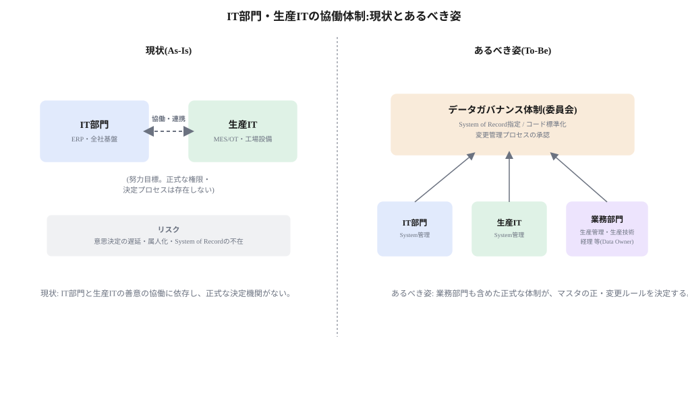

# 提言:責任分解の原則、データガバナンス体制、投資承認ルーティング

> **この章の位置づけ**:01章で明らかになった課題(責任の重なり、マスタ多重管理、非公式な協働体制)に対する打ち手を、制度・プロセスとして提示する
> **対象読者**:IT部門、生産IT、経営層

## 要旨

- ERP/MES/SCADA/PLCのレイヤーごとに、IT部門・生産IT・業務部門の責任分解の原則を明文化する。
- マスタデータについては、業務部門も含めた正式なデータガバナンス体制を設置し、System of Recordと変更管理プロセスを決定する。
- IT投資案件については、影響度・リスク・技術レイヤーに基づく承認ルーティングの枠組みを導入し、IT部門・生産本部どちらが承認すべきかを機械的に判定できるようにする。

## 責任分解の原則

MESA-11の11機能それぞれについて、現場即応性・OT接続の有無(生産IT寄り)と、全社標準・ERPとの連携(IT部門寄り)という軸で運用主管を整理する。詳細は`03_decision-criteria.md`のマッピング表を参照。

原則として次の3パターンに分類する。

1. **生産IT主体**:現場即応性が高く、OT接続が前提となる機能(資源配分の稼働状況、生産ディスパッチ、データ収集、プロセス管理、保全管理)
2. **共同管理**:ERPとの連携や全社標準化の要素と、現場実装の要素の両方を持つ機能(詳細スケジューリング、労務管理、品質管理、トレーサビリティ、パフォーマンス分析)
3. **業務部門主体**:そもそもIT部門・生産ITのどちらでもなく、品質保証部門や人事部門が主体となるべき機能(現時点では文書管理のみ)。システムはIT部門・生産ITが基盤提供する。

## データガバナンス体制

マスタデータ(品目・設備・工程コード等)は、ERPと、Level3の各システム(MES・LIMS/QMS・CMMS/EAM・WMS)と、OTがそれぞれ別目的でマスタを持つため、同じ物理的実体が複数のIDで管理される「多重管理」が構造的に発生する。Level3がMOMの4領域に分かれている以上、この多重化はL3内部でも起きる(例:同じ製品ロットがMESの製造ロットIDとLIMSの検体IDで別管理される)。これに対処するには、ブリッジ・変換機能を作るだけでは不十分で、変換ロジックの正しさを継続的に担保する責任者(オーナー)を明文化する必要がある。

現状は、IT部門と生産ITの間の「協働・連携」という努力目標に依存しており、正式な決定機関がない。あるべき姿は、IT部門・生産IT・業務部門(生産管理・生産技術・経理等、Data Ownerとしての役割)が参加する正式なデータガバナンス体制を設置し、この体制がマスタごとのSystem of Record指定、コード体系の標準化、変更管理プロセスの承認を担うことである。

*図1　IT部門・生産ITの協働体制:現状とあるべき姿*

## IT投資案件の承認ルーティング

生産本部内のIT投資案件について、IT部門が承認すべきか、生産本部が承認すべきか、または両方かを判定するための枠組みを導入する。ここで判定するのは承認主体(組織)であり、運用主管(IT部門/生産IT/業務部門)とは別の軸である。判定には、既存の案件情報(案件名・案件概要・概算費用・実施しない場合のリスク)だけでは不足しており、対象レイヤー・影響度・リスク・コスト構造に関する追加情報が必要になる。追加すべき項目と、それを用いた判定フローの詳細は`03_decision-criteria.md`を参照。

## この章の結論

- 責任分解は「生産IT主体」「共同管理」「業務部門主体」の3パターンに整理できる。
- マスタデータガバナンスは、IT部門・生産IT・業務部門が参加する正式な体制として制度化する。
- IT投資の承認ルーティングは、追加項目とルールベースの判定フローによって、属人的な判断を減らす。

---

**参照**:`01_current-state.md`(この提言の根拠となる診断)、`03_decision-criteria.md`(判断基準の詳細)
