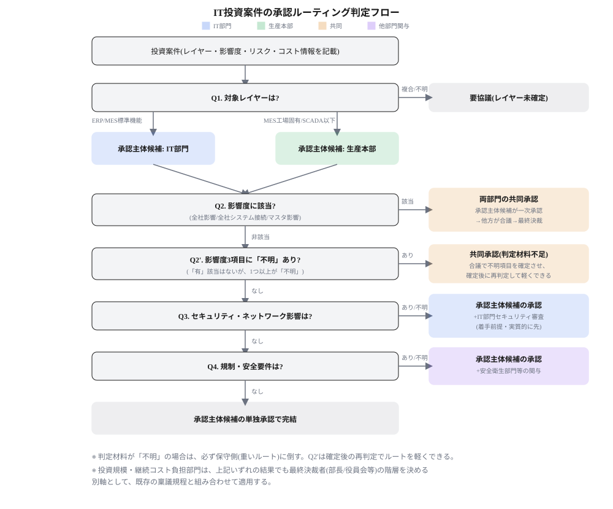

# 判断基準:MESA-11の運用主管マッピングと投資承認ルーティング

> **この章の位置づけ**:02章の提言を、実務で使える具体的な判断基準・判定ロジックに落とし込む
> **対象読者**:IT部門、生産IT、投資案件の起案者

## 要旨

- MESA-11の11機能それぞれについて、運用主管(IT部門/生産IT/共同管理/業務部門主体)と判断根拠を一覧化する。
- IT投資案件リストに追加すべき8項目とその分類(技術分類/影響度/リスク/予算コスト)を定義する。
- 対象レイヤー・影響度・リスクの問いに答えることで、承認主体と承認ルートを機械的に判定するフローを定義する。「不明」は保守側(重いルート)に倒す。

## MESA-11×運用主管マッピング

| MESA-11機能 | 判断のポイント | 運用主管 | mcframe ERP/MESでのカバー |
|---|---|---|---|
| 1. 資源配分・稼働状況管理 | 設備・人員の"今の状態"、現場即応性が高い | 生産IT | △(計画上の割当は○、リアルタイム稼働状況は―) |
| 2. 詳細スケジューリング | ERP計画を現場制約で組み替える橋渡し | 共同管理 | ○ |
| 3. 生産ディスパッチ | リアルタイムの作業手配、OT接続が前提 | 生産IT | ○ |
| 4. 文書管理 | 業務(品質保証・技術部門)の管理対象 | 業務部門主体 | △(指図書レベルは○、図面等は―) |
| 5. データ収集 | 設備からの直接データ収集 | 生産IT | △(手入力実績は○、設備自動収集は―) |
| 6. 労務管理 | 現場勤怠・スキル、全社人事連携 | 共同管理 | △(工数実績は○、資格管理等は―) |
| 7. 品質管理 | 検査基準は全社標準、データ収集は現場。担当システムはLIMS/QMS | 共同管理 | ― |
| 8. プロセス管理 | 工程監視・異常検知、制御に直結 | 生産IT | ― |
| 9. 保全管理 | 設備そのものの管理。担当システムはCMMS/EAM | 生産IT | ― |
| 10. トラッキング・トレーサビリティ | ERPロットと現場製造履歴の紐付け | 共同管理 | △(ロット単位は○、設備単位リアルタイムは―) |
| 11. パフォーマンス分析 | データ収集は現場、KPI標準化はIT/経営企画 | 共同管理 | ― |

(○=対象、△=部分対応・要確認、―=対象外)

「―」の読み方に注意が必要である。mcframeで「―」となる7(品質管理)・9(保全管理)は、**mcframeの機能不足ではなく、MOMの別領域を担うシステム(LIMS/QMS、CMMS/EAM)の担当範囲**である(00章の図2を参照)。8(プロセス管理)はSCADA/PLC側、11(パフォーマンス分析)は分析基盤側であり、いずれも担当システムが異なるだけである。したがって承認ルーティングにおいても、これらの領域の投資案件は「MESの追加開発」ではなく「別系統のL3システムの導入」として起案される点に留意する。

11機能は「生産IT主体5・共同管理5・業務部門主体1」に分類でき、共同管理が想定より多い。これは02章の責任分解の原則と対応している。

## IT投資案件に追加すべき項目

既存の記載(案件名・案件概要・概算費用・実施しない場合のリスク)だけでは承認ルートを判定できないため、次の8項目を追加する。

| 追加すべき項目 | 記載内容の例 | 項目分類 |
|---|---|---|
| 対象レイヤー(ISA-95) | ERP/MES(標準機能)/MES(工場固有)/SCADA・PLC/フィールド機器 | 技術分類 |
| 全社影響範囲 | 単一工場限定/複数拠点/全社(海外含む) | 影響度 |
| 全社システムとの接続有無 | ERP・全社ネットワーク・全社マスタとの連携 有/無 | 影響度 |
| マスタデータへの影響 | 新規コード体系の発生、既存マスタとの整合性への影響 | 影響度 |
| セキュリティ・ネットワーク影響 | 外部接続/クラウド利用/リモートアクセスの有無 | リスク |
| 規制・安全要件 | 労働安全衛生法・環境法等への対応が主目的か否か | リスク |
| 継続コストの負担部門 | 保守・ライセンス費用をIT予算/生産本部予算のどちらが負担するか | 予算・コスト |
| 投資規模 | 金額帯(既存の稟議規程の区分に対応) | 予算・コスト |

影響度に関する項目が3つと最も多いのは、承認ルーティングの本質的な問いが「この投資はどこまで波及するか」であり、組織範囲・システム接続・マスタという3つの角度から補完し合う必要があるためである。

## 承認ルーティングの判定フロー

このフローが決めるのは投資案件の**承認主体(組織)**であり、IT部門または生産本部の2者である。本章前半で整理した運用主管(IT部門/生産IT/業務部門)とは別の軸である点に注意する。生産ITが運用主管となる領域(MES工場固有・SCADA/PLC・フィールド機器)の投資は、承認主体としては生産本部に集約され、生産ITは技術的な起案・評価を担う。

1. **Q1(承認主体候補の決定)**:対象レイヤーが「ERP」または「MES(標準機能)」→ 承認主体候補=IT部門。「MES(工場固有)」「SCADA・PLC」「フィールド機器」→ 承認主体候補=生産本部。「複合」または「不明」→ 要協議(以降の判定は行わず、両部門で対象レイヤーを確定させてから再判定する)。
2. **Q2(影響度チェック)**:全社影響範囲が「複数拠点」または「全社」、または全社システムとの接続有無が「有」、またはマスタデータへの影響が「有」のいずれかに該当 → **両部門の共同承認**。承認主体候補が一次承認→他方が合議→最終決裁、という順序。ここで確定し、Q3・Q4は判定しない。
3. **Q2'(影響度が判定不能な場合)**:Q2の3項目に「有」該当がなく、かつ1つ以上が「不明」→ **両部門の共同承認(判定材料不足)**。保守側に倒す。合議の場で不明項目を確定させ、確定後に再判定してルートを軽くしてよい。
4. **Q3(セキュリティゲート)**:Q2・Q2'に該当せず、セキュリティ・ネットワーク影響が「有」または「不明」→ **承認主体候補の単独承認+IT部門セキュリティ審査**(着手前提。実質的にIT部門が先)。
5. **Q4(安全衛生ゲート)**:Q2〜Q3に該当せず、規制・安全要件が「有」または「不明」→ **承認主体候補の単独承認+安全衛生部門等の関与**。
6. いずれにも該当しない → **承認主体候補の単独承認で完結**。

判定材料が「不明」の場合は、必ず保守側(重いルート)に倒す。軽いルートに倒して見落とすリスクを避けるためである。

投資規模・継続コストの負担部門は、このロジックには使用せず、既存の稟議規程に従って最終決裁者の階層(部長/役員会等)を決める別軸として扱う。

*図1　IT投資案件の承認ルーティング判定フロー*

## この章の結論

- MESA-11の11機能は「生産IT主体5・共同管理5・業務部門主体1」に分類できる。
- 投資案件リストへの追加項目は「技術分類1・影響度3・リスク2・予算コスト2」の4カテゴリ、計8項目。
- 承認ルートはQ1〜Q4の問いで機械的に判定でき、共同承認時の順序、セキュリティ審査が実質的に先行するケースも明示できる。判定材料が「不明」の場合は共同承認に倒し、確定後の再判定で軽くする運用とする。

---

**参照**:`02_recommendations.md`(本章の判断基準が実現する提言)、`04_operation.md`(この判定を運用に載せる方法)
