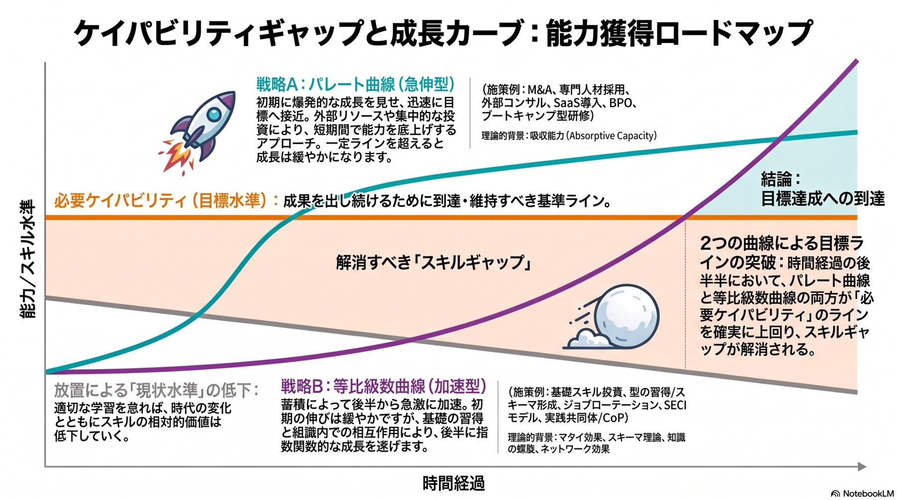
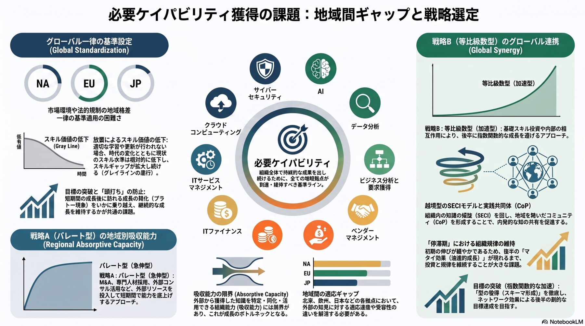

# スキルマネジメント・フレームワーク ── 戦略Bの実行指針

> 3拠点（日本・北米・欧州、計約200名）のIT組織を対象とする、能力獲得の枠組みである。
> 出発点は2枚の図にあり、本書はそこで **戦略B（等比級数型・内部蓄積型）** と呼ばれた経路を、実行可能な手順に変換したものである。

> **戦略Bは戦略Aの代替案ではない。戦略Aを成立させ続けるための前提条件である。**

---


# 第I部　前提 ── なぜ戦略Bなのか

> **戦略Bは、戦略Aの代替案ではない。戦略Aを成立させ続けるための前提条件である。** 本部はその根拠を示す。


## 1. ケイパビリティギャップ ── 3本の線

能力に関する議論は、ほとんどの場合、次の3本の線に還元できる。



> 縦軸は能力／スキル水準、横軸は時間経過。オレンジの水平線が**必要ケイパビリティ**、右下がりのグレー線が放置した場合の**現状水準**、その間の面積が解消すべき**スキルギャップ**にあたる。

**必要ケイパビリティ（目標線）**  
成果を出し続けるために、**到達し、かつ維持すべき基準ライン**。事業がどこへ向かうかによって決まり、能力側の努力では動かない。

**現状水準（グレー線）**  
適切な学習を怠れば、時代の変化とともにスキルの相対的価値は低下していく。**何もしなければ横ばいではなく、右下がりになる。**

**スキルギャップ**  
2本の線に挟まれた領域。**解消すべき差分であり、同時に測定すべき対象**でもある。

> **［この図の最初の含意］**
> **ギャップは、何もしなければ自動的に拡大する。**
> 現状線が右下がりであるため、**目標線が一定であってもギャップは広がり続ける。**したがって「現状維持」という選択肢は存在しない。維持しているつもりの状態は、相対的な後退である。


## 2. ギャップを埋める戦略は、2つある

図の2本の成長カーブは、能力獲得の2つの型にあたる。**どちらが優れているかという問いは成立しない。**立ち上がり方と限界の位置が違うだけである。

|  | 戦略A ── パレート曲線（急伸型） | 戦略B ── 等比級数曲線（加速型） |
|---|---|---|
| 形 | 初期に爆発的な成長を見せ、迅速に目標へ接近する。**一定ラインを超えると成長は緩やかになる** | 初期の伸びは緩やか。蓄積によって**後半から急激に加速し、指数関数的な成長を遂げる** |
| 手段 | 外部リソースや集中的な投資により、**短期間で能力を底上げする** | 基礎の習得と組織内での相互作用により、**内部に能力を蓄積する** |
| 施策例 | M&A、専門人材採用、外部コンサル活用、SaaS導入、BPO、ブートキャンプ型研修 | 基礎スキル投資、型の習得／スキーマ形成、ジョブローテーション、SECIモデル、実践共同体（CoP） |
| 理論的背景 | 吸収能力（Absorptive Capacity） | マタイ効果、スキーマ理論、知識の螺旋、ネットワーク効果 |
| 主な難所 | **頭打ち（プラトー現象）。**短期間の成長後に訪れる鈍化をどう越えるか | **停滞期。**加速が現れるまで、投資と規律を継続できるか |


## 3. 戦略A ── スピードと時間を買う

戦略Aを「もう終わった話」として扱ってはならない。**当社が現に依存している経路であり、今後も一定の範囲で使い続ける手段でもある。**その内実を押さえなければ、以降の議論は「外部依存は悪」という粗い読みに落ちる。

戦略Aは、深刻なスキルギャップを短期間で解消するための、**変革・獲得型のアプローチ**である。


### 3.1 成長の軌道と「頭打ち」のメカニズム

戦略Aの最大の特徴は、施策の開始と同時に見られる**爆発的な立ち上がり**である。外部から完成されたケイパビリティを持ち込むため、初期段階で目標水準へ急速に接近し、**組織に目に見える成果を即座にもたらす。**

しかし一定のラインを超えると成長曲線は緩やかになり、**早期に「頭打ち（プラトー）」を迎えるという宿命を持つ。**

> 頭打ちが起きる理由は、外部の質の問題ではない。**外部から導入した知識やシステムが、既存の組織プロセスや文化と衝突する。**あるいは、**それらを使いこなすための内部的な習熟が追いつかない。**いずれも受け手の側で起きる現象である。


### 3.2 ケイパビリティを「外部から移植する」5つの施策

この戦略は、自社にない能力を**「買う」あるいは「借りる」**ことで成立する。

| 施策 | 内容 | 移植されるもの |
|---|---|---|
| **M&A・アクハイア** | 必要な技術や専門性を持つ企業・チームを丸ごと買収する | 名目上の能力を、即座に手に入れる |
| **専門人材の中途採用・幹部招聘** | 即戦力となる外部エキスパートを投入する | 組織の実行力を一気に引き上げる |
| **外部ベンダー・コンサルティング** | 高度な知見を持つ外部リソースを一時的に活用する | プロジェクト単位で成果を創出する |
| **SaaS・プラットフォーム導入** | 自前開発を避け、既製の最先端ツールを導入する | 業務遂行能力を底上げする |
| **集中ブートキャンプ型研修** | 短期間の詰め込み型教育を行う | 特定のスキルを急速に習得させる |

> **当社が長期にわたり用いてきたのは、3番目である**（→ 4章）。また本書が研修を補助に置くのは、5番目が戦略Aに属するためである ── **痕跡が生まれず、蓄積にならない**（→ 第VI部33章）。


### 3.3 吸収能力の壁 ── 到達点を決めるのは、受け手側である

戦略Aの成否と到達点の高さを決定づけるのは、**外部ソースの質以上に、受け手側の「吸収能力（Absorptive Capacity）」である。**

> **［吸収能力］**
> **外部の知識を特定し、自社の文脈に合わせて同化・変換し、最終的に収益に結びつく形で活用する能力。**
> どれほど高度な能力を外部から持ち込んでも、組織側の受け皿 ── コミュニケーション、評価制度、内製化の仕組み ── が不十分であれば、**獲得した能力は「借り物」のまま陳腐化し、グレー線（相対的な現状水準の低下）に飲み込まれる。**

> **戦略Aを実行しても、受け皿がなければグレー線は下がり続ける。投資しているのにギャップが広がるという現象は、この経路で起きる。**


### 3.4 グローバルHQにおける戦略的意義とリスク

3拠点を統括する立場にとって、戦略Aは**「非連続な変化への即応」**において極めて重要である。AI、サイバー脅威といった変化は、内部蓄積の速度を待たない。

|  | 内容 |
|---|---|
| 意義 ── 緊急性の解消 | 深刻なスキルギャップを放置すれば競争優位は急速に失われる。まず戦略Aによって当面の目標水準を突破し、**生存のための時間を確保する** |
| リスク ── 地域間のバラツキ | 拠点ごとに吸収能力や受容性が異なるため、**HQが主導した一律のパレート型施策でも、拠点ごとに立ち上がりの速さと最終的な定着度にバラツキが出る** |



> 左に戦略A側の制約（**一律基準の困難、地域別の吸収能力**）、右に戦略B側の論点（**越境SECIとCoP、停滞期における組織規律の維持**）が配置されている。

後者は、この図が「地域間の適応ギャップ」として描いた論点そのものである。**本書が「3拠点に同一の基準を均等適用しない」という原則を置くのは、この構造への対処にあたる**（→ 第II部8章）。


### 3.5 結論 ── 戦略Aは、時間を買う手段である

> **［戦略Aの位置づけ］**
> **「スピードと時間を買う」ための極めて強力な手段である。しかしそれ単体では、持続的な優位性になりにくい。**
> **戦略Aで確保した「時間的猶予」を使い、いかに並行して戦略B（内部蓄積型）の土台を築き、外部から得た知見を組織固有の強みへと転換できるか。** ここが、組織マネジメントの真の核心である。

この一文が、本書全体の位置づけを決めている。**次章では、当社がその時間的猶予を何に使ってきたかを見る。**


## 4. 当社は、戦略Aを既に実行済みである

ここが本書の出発点であり、一般論から当社固有の話に切り替わる地点である。

日本拠点は数十年にわたり事業を支えてきたが、全領域をカバーできるだけの人員はなく、**長期にわたりベンダー依存の状態にある。**これは 3.2 の5施策のうち「外部ベンダー・コンサルティング」を、プロジェクト単位ではなく**恒常的な体制として運用してきた**形である。

**そしてこれは、正しく機能してきた。**全領域をカバーする人員がないまま、事業のバリューチェーン全域を止めずに回してきた。数十年それが成立してきた以上、この選択は正しかったと評価すべきである。


### 問うべきは「Aが失敗したか」ではない

戦略Aが買うのは**時間**である。したがって当社について問うべきは次の一点になる。

> **戦略Aが数十年にわたって買い続けてきた時間を、我々は何に使ったのか。**

戦略Bの土台 ── 外部から得た知見を組織固有の強みへ転換する仕組み ── が並行して築かれていれば、いま能力は蓄積されているはずである。**しかし当社には、その蓄積を確認する手段すら存在しない**（→ 第II部10章）。

**築かれなかったのか、築かれたが見えていないのか。それすら判定できない状態にある。**

> **［問いの立て直し］**
> **当社にとって戦略Aは「これから選ぶ選択肢」ではない。既に実行され、その限界に到達しつつある現状そのものである。**
> したがって問うべきは「AかBか」ではなく、**「Aが買った時間を、これから何に使うか」**である。


## 5. 戦略Bは、戦略Aの代替ではなく前提条件である

3.3 で述べた吸収能力の壁を、当社の文脈に置き直す。

本書は能力を3水準で測る（→ 第III部13章）。その中間に置かれた「**評価できる**」── 外部の見積・成果物に対して、根拠を伴う差し戻し・修正要求・代替案提示を行える水準 ── は、**吸収能力の実務的な定義そのものである。**

> **［本書で最も重要な帰結］**
> **戦略Bは、戦略Aの代替案ではない。戦略Aの前提条件である。**
> 外部から買い続けるためにも、**買ったものの当否を判断できる者が社内に要る。**判断できなければ、それは調達ではなく委任である。 本書が「評価できる」水準を中核に据えているのは、この理由による ── **これは内製化の主張ではなく、外部依存を制御可能に保つための条件である。**

この帰結には、実務上の系がある。

> **評価水準さえ確保すれば、遂行の冗長性は外部から買える。**社内に評価できる者を置くことは、内製人員を厚く持つことよりも安く、かつ効く。この論点は 第V部31章 で代替案との比較として扱う。

**本書は「外部依存をやめるべきである」とは述べない。**それは 3.4 が示した通り、非連続な変化への即応力を捨てることを意味する。**述べるのは、外部依存を制御可能に保つ条件である。**


## 6. 本フレームワークの範囲

| 扱わないもの | 理由 |
|---|---|
| **処遇制度** 等級・報酬・評価 | 測定結果を処遇に接続しないことを前提とするため。**ただし「接続しない」ことの明文化は範囲内であり、必須である**（→ 第V部29章） |
| **研修コンテンツの内容設計** 何を教えるか | 本書が出力するのは「誰に何が足りないか」までである。教える中身の設計は別の職掌に属する |
| **現地法人のガバナンス** 雇用主体・労働法制・就業規則 | 拠点法人に属し、定義権の移管では動かない |
| **内製比率の数値目標** | 掲げない。置くのは**判断の規則**であり、比率は結果として出る（→ 第V部32章） |
| **事業計画から業務量を積み上げる手法** | 各拠点・各機能の業務特性に依存する。本書は単位と分担を定めるに留まる |
| **配置の実行** | 規制・ビザ・言語・報酬体系・本人の意思は、スキルの外側に存在し続ける。**本書が解決するのは判定できることまでである** |


---


# 第II部　現在地 ── 蓄積の起点

> 戦略Bは蓄積の戦略である。したがって**どこから積み始めるのかが分からなければ着手できない。** 本部は、その起点にあたる現状を確定させる。


## 7. 3拠点の状況

対象は3拠点のIT組織、総勢約200名。ただし**その大半は日本に所在する。**

**日本 ── 本社機能**  
数十年にわたり事業を支えてきた本社機能であり、**バリューチェーン全域に対応する人材配置**が行われている。一方で**すべての領域をカバーできるほどの人材確保ができておらず**、長期にわたりベンダー依存の状態にある。

**北米 ── セールスから製造へ**  
もとはセールス拠点であり、**製造拠点化に向けたIT人材の配置**が進んでいる。立ち上げ期特有の事情から、**短いサイクルでの人員入れ替え**が生じている。

**欧州 ── セールスのサポート**  
機能はセールス拠点のサポートであり、**IT人材というよりセールスサポート的な人材**が中心。

> **3拠点に共通する構造 ──** 各拠点にそれぞれIT組織長が存在し、各組織長が自拠点の **IT戦略・人材採用・ケイパビリティ戦略** を策定している。


## 8. 発展段階と、そこから出る3つの原則

3拠点の違いを、拠点ごとの個別事情としてではなく、一般的な枠組みの中に位置づける。


### 一般モデル

多国籍企業の海外拠点は、一般に次の段階を経て役割を拡大していく。段階が上がるにつれて現地に置かれる機能が増え、それに伴って **必要となるIT能力の種類そのものが変わる。**

| 段階 | 拠点の役割 | 現地IT人材の性質 |
|---|---|---|
| Stage 1 輸出・代理店 | 現地に自社拠点を持たない | 不要。本社が完結 |
| Stage 2 販売拠点 | 現地市場への営業活動 | セールス中心。ITは本社システムの**利用者**に留まる |
| Stage 3 機能拡張 | 販売に付随する機能を現地に拡充 | 専門IT人材ではなく、**汎用的な業務サポート人材** |
| Stage 4 生産拠点化 | 現地での製造・オペレーション開始 | 規制対応を含む**専門IT人材が急務。**ただし組織としての蓄積は浅い |
| Stage 5 フルバリューチェーン | 研究・企画を含む全機能を持つ自律拠点 | 幅広い専門人材が長期在籍し、**ナレッジが蓄積する** |

> このモデルが示すのは、**優劣ではなく段階の違いである。**Stage 2の拠点に専門IT人材がいないのは不足ではなく、その段階では必要とされていないためである。**段階の移行は不可逆ではないが、飛び越えられない。**Stage 4への移行期には必ず「専門人材は必要だが、組織としての型はまだない」という不安定な期間が生じる。


### 当社3拠点の位置づけ

|  | 日本 | 北米 | 欧州 |
|---|---|---|---|
| 該当段階 | **Stage 5** | **Stage 3→4**（移行期） | **Stage 2〜3** |
| 機能 | 研究・製造・販売・管理のすべてを内包する本社機能 | 研究拠点は既存。**製造拠点を新設中（2027年稼働目標）** | 商業・セールス機能。研究・製造機能は持たない |
| IT人員 | 全体の大半。バリューチェーン全域に配置 | 少数。**短サイクルでの人員入れ替え** | 少数。**セールスサポート寄り** |
| 課題の性質 | **成熟疲労** 役割の広さに人員規模が追いつかず、長期の外部依存 | **成長痛** 組織としての型がまだ固まっていない | **役割定義以前** IT組織として独立させるべきかという段階 |
| 含意 | 供給側の中心。ただし能力の相当部分が外部に所在する | 製造ITは**自ら標準を整備し、既に自走している** | ほとんどの機能において供給側ではなく**受益側** |


### ここから出る3つの原則


### 原則1 ── 3拠点に同一の基準を均等適用しない
*段階の差を、能力の差として誤読しないため*

発展段階が異なる組織に同じ物差しを当てると、**若い拠点は一律に「未熟」と出力され、成熟拠点は「過剰包括的で非効率」と出力される。**いずれも実態の比較になっていない。

> **本書全体を貫く制約 ── 共通とするのは尺度の定義であり、共通としないのは目標値と適用範囲である。**


### 原則2 ──「発展段階」と「領域ごとの能力水準」は別物である
*最も見落とされやすい*

段階モデルが説明するのは **拠点が持つ機能の範囲** であって、**個々の領域における能力の高さ** ではない。

その具体例が北米の製造ITである。拠点全体としては移行期にあるが、製造IT領域に限れば**日本とは異なる標準で構築を完了し、自らSOP・技術標準を整備している。標準を作れる組織は、その領域を遂行できる** ── これは申告に依らない、水準の客観的な証拠である。

一方、日本は既存工場を長年支えてきたが、それは**別の標準に対する能力**である。絶対的に劣っているのではなく、参照する標準が違う。

> **「日本が先進、海外が後進」という前提は成り立たない。領域ごとに供給側と受益側が入れ替わりうる。**


### 原則3 ── 課題の性質が異なる以上、打ち手も異なる
*全社共通の数値目標は、いずれの拠点にも適合しない*

| 拠点 | 打ち手の重心 |
|---|---|
| 日本 | **育成**（採用では経緯知識が埋まらない） |
| 北米 | **これから配置する能力の設計**（日本と同じ構造に入るかがまだ決まっていない） |
| 欧州 | **測る範囲を変える**（同質でない対象に同じ物差しを当てない） |

> **このモデルを使わない方がよい場面 ──** 個人の能力評価（段階は組織の属性である）／将来の到達点の保証（移行中であることは到達を意味しない）／領域ごとの判断（拠点単位では粗すぎる）。**領域ごとの能力水準は別途測らなければ分からない。**


## 9. 3つの根本課題

当社が抱える課題は、3つの根本課題に整理される。**誰が解くかは問わない。対処の時期と方法は、その課題を担う立場が決めるべきものである。**


### ① 組織は、自分の状態を知覚できていない
*回復可能*

**測定項目と実態が、二重にずれている。**

- 社員が実際に担ってきたこと ── **要件翻訳、受入判断、工数の妥当性検証、経緯知識、社内調整** ── は標準タクソノミーに存在しない
- 逆に、標準タクソノミーにある実装・設計・構築の能力は、長期のベンダー依存によって**社内に保有されていない可能性が高い**

**さらに深刻なのは、誤差の性質である。**「15年この領域を担当してきた」という事実から「この領域を遂行できる」が導かれてしまう。**悪意も虚偽もなく、所管と遂行が混同される。**そして組織全員が同じ認識枠組みを共有しているため、**ピアレビューでも補正されない。**

> **結果としてスキル台帳は、最も知りたいことを隠す ── その領域は自社で遂行できるのか、外部がいなければ止まるのか。これは「可視化止まり」以前の問題であり、可視化の対象そのものが違っている。**


### ② 揃える動機が、どの職掌からも生じない
*回復可能*

3拠点にそれぞれIT組織長がおり、それぞれが自拠点のケイパビリティ戦略を策定している。**全員が自分の職掌を正しく果たしている。にもかかわらず尺度は揃わない。**

一般に言われる「オーナーシップの不在」とは構造が違う。

> あちらは**「誰もやっていない」**だが、こちらは **「全員がやっているが、それぞれ別々にやっている」** である。したがって調整担当を新設しても埋まらない ── **その人にとって、揃わなくても業務は止まらない。困るのは組織であって、その人ではない。**

- 拠点を超えた人材の比較・活用が、**意志ではなく原理の問題として判定不能**になっている
- **5年間のタレント開発活動が、ひとつの活動ではなく3つの並行した別の活動であった**


### ③ 失われつつあるものに、期限がある
*不可逆 ── 唯一、実在する締切を持つ*

経緯知識 ── なぜこのシステムがこう作られているか ── の単一保有である。

- ①②が回復可能な課題であるのに対し、**これだけが不可逆である**
- 保有者が退職した瞬間、**採用でも配置でも外部調達でも戻らない**
- そして現時点で、**誰が何を単独保有しているかのリストが存在しない。**作成に要するのは**半日程度**と見積もられている

> **実在する締切を持つ論点は、これ一つである。**


## 10. 課題の一覧と、依存関係


### ① 知覚の欠落 に属する項目

| # | 課題 | 内容 |
|---|---|---|
| **C1** | 測定項目が実態と合っていない | 社員が実際に担ってきた業務が標準タクソノミーに存在しない。逆に標準タクソノミーが持つ実装・設計・構築の能力は保有されていない可能性が高い |
| **C2** | 所管と遂行が構造的に混同される | 「長く担当してきた」から「遂行できる」が導かれる。誤差の方向が定まっているため集計で打ち消されず、認識枠組みが共有されているためピアレビューでも補正されない |
| **C3** | 行動の痕跡が記録に残らない | 自社積算、差し戻し検討結果、切り分け仮説、代替案の提示が様式に存在せず、照会先がない |
| **C5** | 測定結果と処遇の関係が定まっていない | 接続しないことが明文化されていないため、抵抗と申告の歪みが生じる余地が残る |
| **C11** | 測定結果の解釈基準が定義されていない | 発展段階の差を能力差と読む、ベテランの低評価と読む、コスト削減施策と読む ── 出力はそのまま提示すれば誤読される |

> C1・C2 が**装置の設計**、C3 が**入力の存在**、C5 が**入力の正直さ**、C11 が**出力の伝わり方**にあたる。**いずれか一つでも欠ければ、組織は自らの状態を知覚できない。**


### ② 定義権の分割／③ 経緯知識の喪失

| # | 課題 | 内容 |
|---|---|---|
| **C4** | スキル定義の権限が3拠点に分割されている | 各拠点のIT組織長が自拠点の定義を持ち、揃える動機がどの職掌からも生じない。拠点を超えた比較が原理的に判定不能 |
| **C6** | 経緯知識が単独保有されている | なぜこのシステムがこう作られているかを照会できる社員が、領域によって1名である。保有者リストが存在しない |


### いずれの根本課題にも属さない項目

| # | 課題 | 内容 |
|---|---|---|
| **C7** | 作動条件が整っていない | 機会（業務の配分）・失敗の許容・時間（工数）が揃わなければ、打ち手を設計しても行動は発生しない |
| **C8** | 北米拠点の人員が定着していない | 短サイクルでの入れ替えが生じており、遂行水準が積み上がらない |
| **C9** | 仕事の分類が未実施 | ①場所拘束／②場所自由・移転可能／③場所自由・移転不能 の分類が行われておらず、北米の需要への加算分が確定しない |
| **C10** | 内製方針が未決 | ②に分類される領域を社内で持つか外部に出すかが定まっていない。能力の議論では決着しない |
| **C12** | 需要が定義されていない | 必要人数が記入されておらず、供給側を測っても差分が算出できない。加えて需要の単位は層ごとに異なる |


### 依存関係

```
C1 測定項目が実態と合わない ─┐
C2 所管と遂行の混同         ─┼─▶ C3 痕跡が残らない ─┐
C5 処遇との関係が未定       ─┘                       │
                                                     ├─▶【測定の成立】─┬─▶【拠点横断の判定】◀─ C4 定義権の3分割
C1 ─┐                                                │                 │
C2 ─┴─▶ C11 解釈基準がない ─────────────────────────┤                 └─▶【需給の差分】◀─ C12
                                                     │
C9 分類が未実施 ─▶ C10 内製方針が未決 ─▶ C12 需要が未定義 ─┘

C3 痕跡が残らない ─┐
C7 作動条件の不足  ─┼─▶【打ち手の成果】
C8 北米の定着      ─┘

C6 経緯知識の単独保有 ── 依存なし・期限あり（独立）
```

この図が示すことは3つある。

1. **測定の成立には、C3・C11・C12 の3つが同時に必要である。**どれか一つでも欠ければ、測定は成立しない
2. **C12（需要）は、C9 → C10 という2段の前提を持つ。**分類作業と方針決定を経なければ需要は書けない
3. **C6 だけが、他のどの課題にも依存しない。**そして唯一、期限を持つ

> **［着手順序の決定要因］**
> **着手順序は、依存の深さではなく、期限の有無で決まる。**
> **C6（経緯知識保有者リストの作成、半日）が最優先である。**他のすべては回復可能であり、これだけが取り返しがつかない。


---


# 第III部　測定 ── 現状線の引き方

> **問いを「できるか」から「したか」へ変える。**能力は本人の内側にしか答えがないが、行動には記録・成果物という外形が残る。 測定は目的ではない。**戦略Bの起点を確定させる作業である。**


## 11. 三層構造

一般的なスキル管理は、能力を単一のタクソノミーで表現する。当社も5年間この形で運用してきた。しかしこの形は破綻する ── **社員が実際に担ってきた能力が、標準タクソノミーに存在しないためである。**

| 道 | 帰結 |
|---|---|
| 標準タクソノミーを自社で拡張し、 1本の体系にすべてを載せる | タクソノミーの自社設計が始まる。**製品既定の体系を借りられなくなり、版の追随も自社負担になる。**加えて、性質の違う能力が同じ尺度で並ぶ |
| **層に分け、層ごとに別の扱いをする** | 標準体系はそのまま借りられる。**自社設計の範囲が、標準体系に存在しない部分だけに限定される** |

**後者を採る。**

| 層 | 対象 | 内容 |
|---|---|---|
| 基層 R2・R3・R5 | 技術遂行 開発、基盤、運用等 | 自ら手を動かして設計・構築・運用する能力。**標準タクソノミー（DSS・iCD 等）がそのまま使える領域** |
| 付加層A R4 | ベンダー統制 | 外部の見積・成果物の当否を、根拠を伴って判断する能力。**標準体系に項目が存在しない。当社固有カテゴリとして自社定義する** |
| 付加層B | 経緯知識 | なぜこのシステムがこう作られているかを説明できる能力。**そもそもスキルではなく、特定個人に属する事実の保有である** |


### 層を分けることの実質 ── 分けた瞬間に、扱いが分かれる

|  | 基層 | 付加層A（R4） | 付加層B（経緯知識） |
|---|---|---|---|
| タクソノミー | **製品既定を借りる** | **自社固有カテゴリとして定義する** |  |
| 尺度 | 製品既定の**5段階のまま** | **3水準** 遂行できる／評価できる／所管しているのみ | **保有者数** 1名か、2名以上か |
| 測り方 | 自己申告＋ピア可視化＋アセスメント | **ライン長による記録照会** | 氏名と人数を書き出す。**判定は不要** |
| 支配的な誤差 | 類型①② 補正される | **類型③（構造的誤差）** 集計でもピア可視化でも補正されない |  |
| SaaS製品に載せるか | **載せる** | **載せない**（表計算で扱う） |  |
| 需要の単位 | **人数** | **カバレッジ** 充足／未充足の2値 | **冗長性** 保有者数 |
| 打ち手 | 育成・採用・配置・**外部委託** | 業務プロセスと様式の改訂 | **保有者が在籍する間の移転のみ** |
| 外部委託の可否 | **可能** | **不可。**評価者を外部化すれば評価が成立しない | **不可。**外部も経緯を知らない |
| 失われたときの回復 | 回復可能 | 回復可能 | **不可逆** |

> **この表の最下段が、優先順位を決めている。基層と付加層Aは回復可能であり、付加層Bだけが不可逆である。**


## 12. タクソノミーは二本立てとする

|  | 内容 | 出所 |
|---|---|---|
| 標準タクソノミー 基層に対応 | 技術スキル（開発言語、基盤技術、ソフトウェア等） | **製品既定を借りる。** 自社で設計しない |
| 自社固有カテゴリ 付加層A・Bに対応 | **統合・評価・ドメイン知** 要件翻訳／受入判断／工数妥当性の検証／経緯知識 | **自社定義** （カスタムカテゴリ） |

> **［見落としてはならない点］**
> **標準タクソノミーで「測れない」項目群は、測れないから価値がないのではない。**
> 数十年にわたり外部を使って事業を止めずに回してきたのは、この能力が存在したからである。**すなわちこれらは、当社の実質的な競争力そのものである可能性が高い。**

タクソノミーが二本立てである以上、**尺度も二本立てになる。**基層は製品既定の5段階、付加層Aは3水準である。1つの尺度に統一しようとすれば、統一のために片方を歪めることになる。


## 13. 3水準

初級／中級／上級という一次元スケールでは、当社で支配的な誤差を分離できない。**分離できる尺度を用意しなければ、分離した回答は返ってこない。**

| 水準 | 行動としての定義 |
|---|---|
| 遂行できる | 当該領域で、**自ら手を動かして設計・構築・運用を完了させた実績がある** |
| 評価できる | 遂行の実績はないが、**外部の成果物・見積に対して、根拠を伴う差し戻し・修正要求・代替案提示を行った実績がある** |
| 所管しているのみ | 責任は負っているが、**上記いずれの実績も存在しない** |

> **［中間の水準が中核である］**
> **「評価できる」は、長期の外部依存下における中核能力である。**
> 外部から買い続けるためにも、買ったものの当否を判断できる者が要る。判断できなければ、それは調達ではなく委任である。**これは吸収能力の実務的な定義そのものにあたる**（→ 第I部5章）。

そして**検出すべきは3番目である。**「所管しているのみ」がどこに分布しているかが、**どこで組織が止まるかを示す。**台帳の目的は、良い値を集めることではない。

> **とりわけ「代替案の提示」が強い指標になる。**差し戻しや修正要求は「求められたから応じた」でも起こりうるが、代替案の提示は **求められていないのに自ら行う行動** であり、外部の提案を独立に評価できていなければ発生しない。


## 14. 問いの転換 ──「できるか」から「したか」へ

| 従来の問い | 本書の問い |
|---|---|
| 「この領域のスキルレベルは？」 | **「直近3年に、何をしたか？」** |
| 能力を問う。**本人の内側にしか答えがない** | 行動を問う。**記録・成果物という外形が残る** |

自己申告であっても、**行動の申告は能力の申告よりはるかに信頼できる。**「私は上級だ」は検証できないが、「私はこの見積を差し戻した」は検証できる。

> これは人事評価研究において確立された考え方（行動基準評定尺度／BARS 等）と同型である。評定者に抽象的な優劣ではなく具体的な行動事例を参照させることで、尺度解釈のばらつきを抑える。

この問いの立て方は、**打ち手の形を一意に決めてしまう。**

| 測定が問うもの | 打ち手が変えるもの |
|---|---|
| 能力（できるか） | → 人（訓練する） |
| **行動（したか）** | **→ 仕事（させる）** |

本書は後者を採る。この帰結は 第VI部33章 で展開する。


## 15. A1〜A5 ── 仲介機能の5項目

付加層A（ベンダー統制）を構成する行動を5つに分解する。**これが照会する痕跡の種類を決める。**

| 項目 | 問う行動 | 照会する痕跡 |
|---|---|---|
| A1 要件の翻訳 | 事業部門の要望を仕様の言葉に置き換えたか | 要件定義書・RFP・仕様書の**執筆者欄** |
| A2 工数妥当性の検証 | ベンダー見積とは独立に自ら積算したか | 稟議・予算における**工数積算の主体** |
| A3 成果物の受入判断 | 何を確認し、差し戻すか否かを判断したか | 検収記録／**差し戻し・修正要求の記録** |
| A4 代替案の提示 | ベンダー提案とは別の選択肢を自ら出したか | 設計方針の検討記録・**比較検討資料** |
| A5 障害時の切り分け | エスカレーション前に自ら仮説を立てたか | インシデント記録における**一次切り分けの実施者** |

> **A4 が5項目の中で最も強い証拠である。**A1〜A3 は「求められたから応じた」でも成立するが、代替案の提示は求められていないのに自ら行う行動である。したがって**制度が要求しなければ発生しない。逆に、制度が要求すれば発生する。**


### A1〜A5 は、予測と結果の対でできている

5項目はいずれも**予測を記録させる**ものであり、**後から結果が判明する**種類の記録である。したがって突合の工程が必要になる（→ 第VI部35章）。

|  | 予測（行動時に記録） | 結果（後から判明） | 突合の時点 |
|---|---|---|---|
| A1 | 自ら書いた要件 | 実装段階の手戻り・仕様変更 | 検収時 |
| A2 | 自社積算値 | ベンダー見積／**実績工数** | 見積受領時／案件完了時 |
| A3 | 差し戻す／差し戻さない判断と、その理由 | 稼働後の障害・不具合 | 稼働3か月後 |
| A4 | 提示した選択肢 | 採否と、その理由 | 決裁時 |
| A5 | 一次切り分け仮説 | 確定した原因 | 復旧時 |


## 16. 誤差の3類型と、証拠の三段階

層ごとに測り方を変える根拠は、**層によって支配的な誤差の種類が違う**ことにある。

| 類型 | 内容 | 集計で 打ち消されるか | ピア可視化で 補正されるか |
|---|---|---|---|
| ① ランダム誤差 | 個人差による揺れ（几帳面な人は控えめ、大胆な人は高めに付ける） | **される** | ─ |
| ② 動機づけられた誤差 | 意図的な誇張。評価や処遇への影響を意識した申告 | されない | **される** |
| ③ 構造的誤差 | **組織全体が同じ枠組みで誤認している。**悪意も虚偽もない | **されない** | **されない** |

ピア可視化は②に対して強力に働く。誇張は同僚が見れば分かるからである。**しかし③には無力である。同僚も同じ枠組みを共有しているためである。**

> 「15年そのシステムを担当してきた人は、その領域に詳しい」── これは組織の全員が共有している認識であり、**誰も異議を唱えない。**しかしその「詳しい」の内実が「実装できる」なのか「所管している」なのかは、**本人にも同僚にも区別できない。**

**当社の5年間で届かなかった部分は、まさに③である。**したがって「自己評価だから不十分」なのではなく、**「自己評価は③に対して無力であり、当社の誤診は③だった」**というのが正確な記述になる。

> **これは特定製品の弱点ではない。DSS 準拠の標準タクソノミーであっても、習熟度を一次元スケールで自己申告させる限り、類型③はそのまま通過する。製品選定は付加層Aの取りこぼしを解決しない。解決するのは測定プロトコルである。**

そして類型③は付加層A・Bに集中している。**基層で支配的なのは類型①②であり、これらは集計とピア可視化で補正される。したがって基層は製品既定の5段階のまま、自己申告で運用してよい。補強が必要なのは付加層だけである。**


### 証拠の三段階

自己申告は、確定手段ではなく**補助情報に格下げする。**

| 証拠の段階 | 内容 |
|---|---|
| 一次（記録） | 本番権限、稟議の工数積算主体、変更・検収記録 ── **本人に聞かずに確認できる** |
| 二次（成果物） | 自ら執筆した設計書・比較検討資料、**突合記録** ── **事後に作れない** |
| 三次（自己申告） | **単独では水準を確定させない。**一次・二次が無い場合の補助のみ |


## 17. 未検証フラグと、出力の読み方

一次・二次の証拠が存在せず判定できない領域は、**「水準が低い」ではなく「未検証」として区別して出力する。**台帳上は空欄で表現する。

> **［出力の読み方に関する規則］**
> **初回の測定では、「所管しているのみ」と「未検証」が大量に出るのが正常である。**
> それが出ることこそが、測定が機能したという証拠である。**判定基準は値の良さではなく、値の正しさである。**台帳の値が良くなることを目標に置けば、測定は5年前と同じ失敗を繰り返す。


### 誤読への備え（C11 への対処）

出力はそのまま提示すれば誤読される。**誤読の型はあらかじめ特定できるため、提示の側で対処する。**

| 予測される誤読 | 提示側の対処 |
|---|---|
| **発展段階の差を、能力差と読む** | 拠点を横並びにしない。拠点ごとに測る範囲が異なることを、出力に明示する |
| **ベテランの低評価と読む** | 「所管しているのみ」は個人の資質評価ではなく、**その領域で組織がどこまで自走できるかの表示**であることを併記する。数十年支えてきたベテランが低く出るのは**測定の失敗であって、その人の評価ではない** |
| **コスト削減施策と読む** | 下記の通り、付加層A先行の理由を統制ではなく**認識の問題**として述べる |
| **処遇に接続されると読む** | 接続しないことを**規程または通達として明文化する**（→ 第V部29章） |

> **［付加層A（R4）先行の理由 ── 述べ直し］**
> **R4を先に測るのは、統制のためではなく、知覚を回復するためである。**
> R4 の水準が上がれば見積が締まり、差し戻しが増え、不要な機能が落ちる ── **財務効果が直接的で、測定可能で、早い。**一方、遂行能力の向上は効果が拡散的で遅い。**この非対称は避けられない。**したがって意図にかかわらず、R4先行はコスト削減施策として読まれる可能性が高い。 しかし R4 が「所管のみ」であるとき、組織は外部成果物の当否を判断できない。**これは支出の問題である以前に、組織が自らの状態を知覚できないという問題である。**5年間、R4 は測定項目に存在せず、一度も判定されていない ── **知覚が欠けていたのは、まさにこの領域であった。**


## 18. アンカー事例による較正

語彙と判定基準を統一しても、それだけでは拠点間の判定は揃わない。**基準文の解釈が拠点ごとに動くためである。**

したがって抽象的な基準文ではなく、**実在の案件・成果物を「これが評価水準である」と定義し、全拠点で共有する。**判定に迷ったら基準文ではなくアンカーと比較する。

| 項目 | 規則 |
|---|---|
| 選定・改定の権限 | **機能ライン長**（→ 第V部28章） |
| 改定履歴 | **必須。**これがなければ拠点長は判定を受け入れない。較正の恣意性に対する唯一の歯止めである |
| 拠点間差異の扱い | 検出し、解消した経緯を記録する。**この記録の有無が、ライン長自身の水準判定になる** |

> **アンカーは、拠点間で同じ仕事を実際に引き取らせることでも生成できる。**交換の記録（変更記録・成果物・レビュー記録）は一次証拠・二次証拠そのものであり、**較正のための追加作業ではなく、測定運用の一部として組み込める**（→ 第V部31章）。


## 19. 測定の範囲と、拠点別の適用

初回の測定対象は **付加層A（R4）に絞る。**仕事の分類を待たずに実行でき、判定が2値で軽いためである。

| 契機 | 対象 |
|---|---|
| 初年度 | **R4 のみ。**加えて記録照会シートに付加層B（経緯照会可能者数）の列を置く |
| 初年度末 R4パイロット完了時点 | R2・R3 へ測定項目を拡張。**様式は変えない。変わるのは測定項目だけである** |
| 2年目の測定 | R5 を追加し、5ロールを揃える |


### R4 に限定し続けることはできない

A2（工数の妥当性判断）と A4（代替案の提示）は、**技術的判断を要求する。**設計の代替案は、設計を知らなければ出せない。見積の当否は、作業内容を知らなければ判断できない。

> **「評価できる」は独立した能力ではない。残存する遂行知識の上に成立している。基層を放置して R4 だけに投資すれば、遅れて R4 も落ちる。R4 のみを維持する定常状態は、存在しない。**


### 拠点別の適用

| 拠点 | 測定の主眼 |
|---|---|
| 日本 | 上記の構造がそのまま当てはまる。**どの領域が「所管しているのみ」に落ちているかの特定**が主眼 |
| 北米 | これから能力を配置する側である。**日本と同じ轍を踏むかどうかが、まだ決まっていない段階**にある。ただし製造IT領域は自ら標準を整備しており、**標準を作れる組織はその領域を遂行できる** |
| 欧州 | セールスサポート寄りの人材構成であり、**IT能力の供給主体として同質でない。**同じ物差しを当てても全員が「所管しているのみ」に張り付くだけで情報量がない。**需要の有無を先に確定させる**（→ 第IV部23章） |

> **測る対象として同質でないから、同じ物差しを当てない。これは第II部の原則1の、測定における具体化である。**


---


# 第IV部　目標 ── 目標線の引き方

> 必要ケイパビリティ（オレンジの線）を引く手順である。 **この線は1本ではなく3本ある。**「機能×拠点×ロールで必要人数を記入する」という様式は、**基層にしか適用できない。**


## 20. 需要の単位は、層によって異なる

三層構造は供給側の測定単位として導入されたが、**需要側でも同じ分割が必要になる。単位が層ごとに違うためである。**

| 層 | 対象 | 需要の単位 | 記入形式 |
|---|---|---|---|
| 基層 R2・R3・R5 | 技術遂行 | **人数** | 機能×拠点×ロールで必要人数を記入 |
| 付加層A R4 | ベンダー統制 | **カバレッジ** | 領域ごとに **充足／未充足** の2値 |
| 付加層B | 経緯知識 | **冗長性** | システムごとに **保有者数**（1名か、2名以上か） |


### なぜ付加層Aは人数で書けないのか

R4 が問うているのは「外部の見積・成果物の当否を、根拠を伴って判断できるか」である。**この能力は、当該領域に0人か1人以上かで意味が変わり、1人と3人の間では意味がほとんど変わらない。**

> **評価水準さえ確保すれば、遂行の冗長性は外部から買える。**すなわち R4 は**遂行量に比例しない。**案件が10件でも100件でも、判断できる者がいるかいないかが問題である。ここに「必要人数 3名」と記入させれば、**遂行量から機械的に按分された、意味のない数字が入る。**


### なぜ付加層Bは需要ですらないのか

経緯知識は、**育成でも採用でも外部調達でも作れない。**過去にしか存在しないためである。

> **需要表に付加層Bの行を作れば、埋められない需要が毎年出力され続ける。付加層Bで書けるのは「必要な保有者数」ではなく「現在の保有者数」であり、これは需要ではなく供給側の観測値である。**


## 21. 需要表は、1枚では書けない

| 様式 | 対象 | 記入内容 | 記入者 |
|---|---|---|---|
| 需要-基層 | 機能×拠点×ロール | 必要人数（**時点付き**） | 拠点IT組織長 |
| 需要-付加層A | 機能×拠点 | 充足／未充足 | 拠点IT組織長 |
| 需要-付加層B | システム単位 | 保有者数と氏名 | 各システム所管 |

> **需要-付加層B は、記録照会シートの「経緯照会可能者数」欄と同一の情報である。**二重に持たず、記録照会シートの列を需要側からも参照する形とする。


## 22. 拠点ごとに、需要の導出根拠が異なる

第II部の原則1を需要側に適用する ── **共通とするのは尺度の定義であり、共通としないのは目標値と適用範囲である。**

> **需要は「目標値」にあたる。したがって拠点間で揃えない。揃えるのは記入様式と単位だけである。**


### 日本 ── 業務量から積み上げてはならない
*Stage 5。バリューチェーン全域に人員が配置されている*

素直に業務量から必要人数を積み上げれば、**現員を大きく上回る数字が出る。**しかしこれは実行できない。「全領域をカバーできるほどの人材がいない」という状態は、増員によって解消される見込みが立っていないためである。

**したがってこれは解くべき課題ではなく、あらゆる施策が従うべき制約条件として扱う。**制約条件を無視した需要は、毎年「増員が必要」という実行不能な差分を出力し続ける装置になる。**一度そうなれば、需給差分そのものが読まれなくなる。**

したがって日本の需要は、業務量ではなく **「外部に出せない範囲」** から書き起こす。

| 分類 | 内製で持つ必要 | 需要に計上するか |
|---|---|---|
| **①場所拘束** 現地規制、GxP、現場立会い | あり | **計上する** |
| **③場所自由・移転不能** 組織固有の経緯を要する | あり。**外部も経緯を知らないため出せない** | **計上する** |
| **②場所自由・移転可能** 標準化・文書化済み | 選択。**原則として内製**（→ 第V部32章） | **計上する** 方針依存であることを明記 |
| 上記以外 | なし | **計上しない。**外部で持つ |

> **この書き方であれば、需要は増員要求にならない。出力されるのは「内製で持つと決めた範囲に対して、遂行できる人員が足りているか」という、判断可能な差分になる。**

そして日本の場合、**最も重要な出力は基層ではなく付加層Aの充足状況である。**外部に出した領域について評価できる者がいなければ、外部依存は制御されていない。


### 北米 ── 唯一、期日から逆算できる
*Stage 3→4。製造拠点を新設中（2027年稼働目標）*

**3拠点のうち、需要が期日を持つのは北米だけである。**

α は「②場所自由・移転可能に分類される割合」であり、**②は原則内製という決定により、追加の経営判断を待たずに分類作業だけで確定する。**

> **②の特定 ＝ α の確定 ＝ 北米の需要数値の確定**（→ 第V部32章）

> **ただし前提がある ── 定着していない組織に、遂行水準は積み上がらない。北米では短サイクルでの人員入れ替えが生じており、需要を確定させても定着が解決しない限り供給は積み上がらない。需要表には数字が入るが、それは達成可能な目標ではない。**


### 欧州 ── 人数を書かせてはならない
*Stage 2〜3。IT組織として独立させるべきかという段階*

機能×拠点×ロールの表に欧州の列を作れば、記入者は **ゼロと書くか、無理に数字を入れるか** のいずれかを選ぶことになる。**どちらも実態を表さない。**したがって欧州については、人数の前に一段置く。

| 問い | 出力 |
|---|---|
| **当該機能を、欧州に持つべきか** | 保有する／保有せず日本または外部から供給する |
| （保有する場合のみ）必要人数 | 人数 |

> **保有しないという回答は、欠落ではなく設計である。これを需要ゼロとして記録すれば、翌年以降「未充足」として繰り返し出力される。保有しない旨を明示的に記録する欄が要る。**


## 23. 需要が、供給の測定範囲を決める

見落とされやすいが、**順序として需要が先にある。**

欧州について「同じ枠組みで測っても、全員が『所管しているのみ』に張り付くだけで情報量がない」と述べた。これは測定設計の問題として書かれているが、**原因は需要側にある。**需要が定義されていない機能を測れば、供給がゼロに見えるのは当然である。**そこに需要がないことが記録されていないため、欠落として出力される。**

> **［運用上の帰結］**
> **需要のない機能×拠点は、測定しない。**
> 供給側の測定範囲は、需要表が確定して初めて決まる。これは工数の面でも効く ── **3拠点×5機能×5ロールを全数測れば75セルになるが、需要のあるセルはその一部である。**


### 時点 ── 定常需要と期日付き需要

| 拠点 | 需要の型 | 時点 |
|---|---|---|
| 日本 | **定常。**既存システム群の維持と、内製範囲の決定に従う | 年次。大きく動かない |
| 北米 | **期日付き。**製造稼働に向けて増加する | **2027年稼働目標から逆算** |
| 欧州 | 保有判断が先。保有する場合のみ定常 | 保有判断の時点 |

> **同一の表に3拠点を並べる場合、列は「現在」ではなく「基準時点」でなければならない。北米だけが時間軸上を動くため、現在時点で比較すれば北米は常に大幅な不足として出力される。それは不足ではなく、移行期であることの表示にすぎない。**


## 24. 差分の読み方 ──「育成／採用／配置」は基層にしか当たらない

| 層 | 差分を埋める手段 | 埋まらない手段 |
|---|---|---|
| 基層 技術遂行 | 育成・採用・配置・**外部委託** | ─ |
| 付加層A ベンダー統制 | 業務プロセスと様式の改訂（→ 第VI部34章）。**遂行知識の維持が前提** | **外部委託。**評価者を外部化すれば評価が成立しない |
| 付加層B 経緯知識 | **保有者が在籍する間の移転のみ** | 育成・採用・配置・外部委託の**すべて** |

> **差分は一種類ではない。層ごとに、埋め方も、埋まらない手段も異なる。需要表を1枚にまとめ、差分を1つの数字で出力すれば、この区別が消える。**

とりわけ付加層Bについては、**差分が出た時点で既に選択肢が限られている。保有者が在籍しているかどうかだけが変数である。**


### 誰が書き、誰が較正するのか

需要の数値を書くのは**拠点IT組織長**である。機能ライン長ではない（人事権・予算は拠点に残るため。→ 第V部27章）。

ただし数値だけでなく語彙・単位・粒度まで拠点が持てば、**3拠点が別々の粒度で需要を書く。**「アプリケーション 5名」と「基幹系保守 2名／Web 1名／データ連携 1名」を横に並べても、合算も比較もできない。**これは供給側で既に起きていること（C4）と構造的に同一の問題である。**

|  | 需要側 | 供給側 |
|---|---|---|
| 様式・語彙・単位・粒度 | **機能ライン長** | 機能ライン長（定義権） |
| 数値・判断 | **拠点IT組織長** | 拠点（人事権・予算） |
| 拠点間の整合確認 | **機能ライン長** | 機能ライン長（較正） |


---


# 第V部　構造 ── 蓄積を全社に及ぼす器

> 戦略Bの加速はネットワーク効果に依存する。**知識が拠点を越えて循環しなければ、後半の加速は起きない。** 本部は、その循環を可能にする器を設計する。


## 25. なぜ主語を移すのか

各拠点のIT組織長にとって、**自拠点内で通用する定義があれば職掌は果たせる。**他拠点と揃える動機は、誰の職掌からも生じない。

**これは、担当者の不在ではなくインセンティブの不在である。**3人の組織長は全員、自分の職掌を正しく果たしている。にもかかわらず尺度が揃わない。

| 打ち手 | 揃わなかったとき、誰が困るか | 帰結 |
|---|---|---|
| 横串の委員会・CoE を置く | **誰も困らない。**委員会の議事は進む | 揃わない |
| 制度・規程で統一を義務づける | 監査時に指摘される。**日常業務では誰も困らない** | 形式的な統一 |
| **揃っていないと業務が回らない人を作る** | **その人が困る。毎日困る** | **揃う** |

> **機能ラインという発想の実質は、組織図の美しさではない。「揃っていなければ自分の職掌が果たせない立場」を実在させることである。**


## 26. 移すのは定義権だけである

| 権限 | (a) 拠点主語 現状 | (b) 機能主語・完全 実線 | (c) 機能主語・部分 採用案 |
|---|---|---|---|
| 人事権（採用・評価・処遇） | 拠点 | 機能ライン | **拠点（変更なし）** |
| 日々の業務指示・優先順位 | 拠点 | 機能ライン | **拠点（変更なし）** |
| 予算 | 拠点 | 機能ライン | **拠点（変更なし）** |
| スキル定義の語彙・粒度 | 拠点（3分割） | 機能ライン | **機能ライン** |
| 3水準の判定基準 | 拠点（3分割） | 機能ライン | **機能ライン** |
| アンカー事例の選定・改定 | ─ | 機能ライン | **機能ライン** |
| 水準の判定 | 拠点 | 機能ライン | **機能ライン** |
| 需要様式・単位の定義 | 拠点（3分割） | 機能ライン | **機能ライン** |
| 拠点長が失うもの | ─ | ほぼすべて | **語彙と基準のみ** |

**(b) は成立しない。**雇用主体は各拠点の現地法人である。採用・評価・処遇の権限を国境を越えて機能ライン長に移すことは、労働法制・現地法人ガバナンスの制約を受ける。**組織図上は描けるが、実務では成立しない。**

> **［採用案 (c) の性格］**
> **これはマトリクス組織ではなく、統合役割（integrating role）に相当する。**
> 実際に二重になるのは次の一点だけである ── **自分の水準が、拠点長ではなく機能ライン長によって判定される。**誰に報告するか、何を優先するか、評価と処遇は、すべて拠点長のままである。**したがって「二人の上司」は生じない**（用語の背景 → 付録 実線と点線）。


## 27. 5機能ラインと、5ロール

**5という数に理論的な根拠はない。**三つの制約の交点として出てくる数である。

| 制約 | 内容 | 効き方 |
|---|---|---|
| 制約1 | 機能数 × 拠点数 ＝ 席の数。北米・欧州は少数であるため、**機能を細かく切るほど1機能あたりの人数が1を割る** | 上限を決める |
| 制約2 | ラインの内部は**等価性が言える範囲**でなければならない。異質な仕事が混在すると「同じ仕事を同じ水準で引き取れる」という判定ができない | 下限を決める |
| 制約3 | **標準タクソノミーの基層をそのまま借りられること。**一般的なIT機能分類と大きく食い違う区分を立てると、基層まで自社設計になる | 形を決める |

| # | 機能ライン | 備考 |
|---|---|---|
| 1 | **インフラ・基盤** | 場所自由な部分が大きい |
| 2 | **アプリケーション** | **他4機能と性質が異なる。**支える業務プロセスが拠点ごとに異なるため、場所拘束の比率が構造的に高い。**ライン内部でさらにグローバル共通／拠点固有に二分する必要がある（未実施）** |
| 3 | **データ** | 場所自由な部分が大きい |
| 4 | **セキュリティ** | 規制産業として独立させないと外部説明が立たない |
| 5 | **企画・アーキテクチャ** | 場所自由な部分が大きい |


### 却下した代替案

| 案 | 却下の理由 |
|---|---|
| **3ライン** 基盤／アプリケーション／企画・統制 | 制約1には最も優しい。しかし**セキュリティとデータが基盤に埋没する。規制産業としてセキュリティを独立させないのは、外部説明が立たない** |
| **7ライン以上** ITIL 的細分 | 制約1に抵触。**北米・欧州で席が1を割る** |
| **業務ドメイン別** 研究IT／製造IT／販売IT／管理IT | 拠点固有性が構造的に高くなり、**相互カバーが原理的に成立しない**。かつ製造ITを別扱いにする判断と噛み合わない |

> **5は「これ以上細かくすると席が埋まらず、これ以上粗くすると較正できない」という幅の中で、標準分類に最も近い切り方である。それ以上の主張はしない。**


### ロール

| # | ロール | 層 | 職掌 |
|---|---|---|---|
| R1 | **ライン長（リード）** | ─ | **当該機能の能力定義と較正に責任を負う。**語彙・粒度・判定基準・アンカー事例・需要様式の定義権を持ち、拠点間の整合を確認する。**人員・予算の決定は含まない** |
| R2・R3・R5 | 技術遂行 | 基層 | 自ら手を動かして遂行する。標準タクソノミーで測る |
| R4 | **ベンダー統制** | 付加層A | 外部の見積・成果物の当否を、根拠を伴って判断する。3水準で測る |

座標の総数は **3拠点 × 5機能 × 5ロール ＝ 75セル。**ただし全セルに需要があるわけではない（→ 第IV部23章）。


## 28. 定義権を持つ者を、誰が測るか

ライン長は定義権・アンカー選定権・判定権を同時に持つ。**測られない判定者が生まれれば、自己採点構造が残る。**


### 何で測るか ── 職掌をそのまま行動に落とす

| 水準 | 成立条件（直近1年） | 確認する痕跡 |
|---|---|---|
| 遂行できる | アンカー事例を自ら選定・改定し、**拠点間の判定差異を検出して解消した** | アンカーの改定履歴／差異の検出記録と解消の経緯 |
| 評価できる | アンカーは維持しているが、**差異の検出は他者に依存している** | アンカーの承認記録のみ |
| 所管しているのみ | 定義権を持つが、**アンカーの改定履歴も差異の検出記録も存在しない** | 職掌としての記載のみ |

> **ライン長の「所管しているのみ」は、権限を伴わない点線に落ちた状態そのものである。すなわち機能ラインを敷いたにもかかわらず、揃わない状態（C4）に戻っていることを意味する。これが検出できることが、ライン長を測る理由である。**


### 誰が判定するか ── ライン長相互で行う

一見すると、「ピア可視化は類型③に効かない ── 同僚も同じ枠組みを共有しているから」と述べたことと矛盾する。**しかし、ここでは矛盾しない。**

> **［なぜ相互判定が成立するか］**
> **ライン長同士は、別々の機能を持つ。枠組みを共有しないからこそ、相互判定が成立する。**
> 類型③が成立する条件は、**評価する側とされる側が同じ枠組みを共有していること**であった。インフラのライン長とデータのライン長は、「15年担当してきた人は詳しい」式の共有された誤認を、互いの領域について持たない。 加えて、判定対象が**較正という共通の作業**である点も効く。**アンカーの改定履歴があるかどうかは、他機能の専門性がなくても確認できる。**


## 29. 移管が成立するための4条件

**一つでも欠ければ、拠点長が抵抗する合理的な理由が生じる。**

| # | 条件 | なぜ必要か |
|---|---|---|
| **1** | 移管対象を「定義」に限定し、**人事権を含めないと明文化する** | 拠点長が失うものを最小化する。案(c)の核心 |
| **2** | ライン長に、**揃っていないと果たせない職掌を与える** 「当該機能について、拠点を超えて同じ仕事を引き取れる状態に責任を負う」 | **インセンティブの所在。**「揃っていないと困る人を作る」の実装にあたる |
| **3** | **アンカー事例の選定・改定に履歴を残す** | 較正の恣意性への歯止め。**ライン長が自分に都合よく基準を動かせる状態では、拠点長は判定を受け入れない** |
| **4** | **測定結果を等級・報酬に接続しないと明文化する** C5への対処 | 監視感への抵抗への回答。**処遇に接続する限り、拠点長は部下を守る立場から必ず抵抗する** |


### 既存の拠点IT組織長との関係

5ラインならライン長は5名。一方、現在は各拠点に組織長が3名いる。**この5名と3名の関係を決めないまま機能ラインを敷くことはできない。**

| 案 | 採否 | 理由 |
|---|---|---|
| 組織長が兼務する（3名が5ラインのうち3つを持つ） | 却下 | 兼務者は自拠点の利害を持つ。**較正の中立性が担保されない。**とくに日本の組織長が3ラインを持てば、実質は日本主語のまま |
| **併存させる** 組織長3名は拠点代表として残し、ライン長5名を別に置く（兼務可） | **採用** | 二重報告になるが、**案(c) を採る限り二重になるのは「定義」についてのみ**であり、日常業務の指示系統は一本のまま |
| 組織長を廃し、ライン長に一本化 | 却下 | **現地法人の雇用主体が存在する以上、成立しない** |

> **残る弱点 ──** 兼務を許容する以上、兼務者が自拠点に有利な較正を行うことを防ぐ仕組みは**条件3（履歴）以外にない。**また、判定のためにライン長が全拠点の記録を照会する工数は、まだ見積られていない。


## 30. 相互カバーは、何の後始末なのか

相互カバーは、既存の課題への解ではない。**機能組織を選んだことによって生じた脆弱性への、後始末である。**

> **機能組織は、拠点を機能数で分割する。5ラインなら北米・欧州は1機能あたり1〜2名になる。その1名が抜ければ、その拠点でその機能は止まる。**

**これは現状には存在しない脆弱性である。**現在、北米のIT要員は機能で分割されておらず、少人数が広く薄く担っている。機能ラインを敷いた瞬間に、この単一依存が構造として生まれる。

> **25〜29章と30〜32章は独立した提案ではない。**後者は前者の付帯コストであり、**機能ラインを採らなければ不要になる。**人員増を「新規投資」として説明すると承認は取りにくいが、「機能組織のコスト」として提示すれば、機能ラインの是非とセットで判断できる。


### 単一依存への対処法は、4つある

| 案 | 内容 | 埋まるもの | 追加コスト | 成立条件 |
|---|---|---|---|---|
| A 各拠点自足 現状維持 | 各拠点が自機能を自分で持つ | ─ | なし | **1名欠員時の機能停止を受け入れる** |
| B 外部への冗長化 | ベンダー／MSP側に冗長性を持たせる | 遂行 | 契約コスト | **社内に評価できる人が残ること** |
| C 拠点内の多能工化 | 1人が複数機能を持つ | 表面的な冗長性のみ | 育成コスト | **少人数拠点では成立しない** |
| D 相互カバー 日本↔北米 | 同じ仕事を2拠点が引き取れる | 遂行・評価 | **人員増＋標準化・文書化** | ②領域の特定、共通較正 |

**C は少人数拠点では成立しない。**北米・欧州で「1人が5機能を持つ」ことは、5機能すべてで「所管しているのみ」になることと同義である。**冗長性が増えたように見えて、検出すべき状態が増えるだけである。**

**B が、D の最も強い対抗案である。**外部への冗長化は最も安い。ベンダー側の要員が2名いれば、1名が抜けても止まらない。**しかもこれは契約で買える。**

ただし B には条件がある ── **社内に評価できる人がいなければ、外部の冗長性は検証できない。**「2名体制です」という申告の当否を判断できなければ、それは冗長性ではなく冗長性の主張である。

> **［ここで立つ問い］**
> **相互カバー（D）よりも、評価水準の確保＋外部冗長化（B）の方が安いのではないか。**
> B は評価水準が成立していることを前提とする。逆に言えば、**評価水準さえ確保すれば、遂行の冗長性は外部から買える。**この問いには、次節で正面から答える。


## 31. D が B に優る領域と、相互カバーの本当の便益

| 領域 | B（外部冗長化）で埋まるか | D（相互カバー）が必要か |
|---|---|---|
| **①場所拘束** 現地規制、GxP、現地言語、現場立会い | 現地ベンダーで埋まる | **そもそも D の対象外。**他拠点からは引き取れない |
| **③場所自由・移転不能** 組織固有の経緯を要する | **埋まらない。**外部も経緯を知らない | 引き取れない。**まず②へ変換する必要がある** |
| **②場所自由・移転可能** 標準化・文書化済み | **埋まる。**標準化されているから外部にも出せる | **ここが D の対象領域** |

> **②に分類されるということは、標準化され文書化されているということである。そして標準化され文書化された仕事は、同時に「外部に出せる仕事」でもある。③→②の変換に成功した瞬間、その領域は B の対象にもなる。**

**したがって、D の正当化は能力の議論では完結しない。**D が B に優るのは次のいずれかが言える場合に限られる。

| # | D を選ぶ理由 | 性質 |
|---|---|---|
| 1 | 規制・監査上、当該判断を社外に委ねられない | **外部条件。**該当領域は限定的だが、規制産業として実在する |
| **2** | **経緯知識を北米へ移す経路として使う** | **戦略判断。**下記参照 |
| 3 | 外部に出したくない（内製方針） | **戦略判断。**能力の話ではない |


### 理由2が、実は最も強い ── ここが戦略Bとの接続点である

日本には数十年の経緯知識とドメイン知が蓄積しており、それが外部依存を部分的に補償してきた。**北米にはその補償材がない。**同じ構造になった場合、日本より脆弱になる。

**相互カバーは、この補償材を移すための制度的な経路である。**単に冗長性を買うのではなく、「同じ仕事を引き取れるようにする」という要求が、日本側に文書化と説明を強制する。

外部委託ではこれは起きない ── **ベンダーは仕事を引き取るが、経緯知識は社外に出て終わりであり、北米には残らない。**

> **［相互カバーの位置づけ］**
> **D の本当の便益は冗長性ではなく、知識移転の強制装置であることにある。冗長性だけが目的なら、B の方が安い。**
> これは、図2が**「戦略Bのグローバル連携」**として描いた**越境型のSECIモデルと実践共同体（CoP）**の、当社における実装形態にあたる。 知識の螺旋を回すには、拠点を跨いだ実務の共有が要る。**相互カバーは、それを組織構造として強制する仕組みである。**


### 成立したことを、どう判定するか

「同じ水準にある」を書面で判定することはできない。**要求されているのは等価性であり、等価性は語彙では確認できない。**

> **年1回、②領域の一部を実際に交換して実施する。**日本が担っている作業を北米が引き取り、北米が担っている作業を日本が引き取る。**引き取れたかどうかが、そのまま判定になる。**この作業には記録が残り、変更記録・成果物・レビュー記録は一次証拠・二次証拠そのものである。

> **成立確認そのものが、翌年の測定の証拠を生成する。較正のための追加作業ではなく、測定運用の一部として組み込める。**


## 32. 内製方針と、α の算出


### ②を原則対象とする

前節の分析は、**D の正当化が内製方針という別の判断に依存する**ことを示した。ここでその判断を明示する。

> **［採る立場］**
> **②場所自由・移転可能に分類された仕事は、原則として社内2拠点で持つ。外部への冗長化を選ぶ場合は、その領域ごとに理由を示す。**
> すなわち**内製を既定値とし、外部化を例外として扱う。**「B の方が安い」ことは撤回しない。**安いと知ったうえで、内製を採る**という宣言である。


### 「内製比率の目標値は掲げない」との関係

**この立場は維持する。矛盾しない。**

|  | 掲げないもの | 置くもの |
|---|---|---|
| 内容 | **比率の数値目標** 「3年で内製率○○%へ」 | **判断の規則** ②なら原則として内製する |
| 性質 | 結果に対する目標 | 個別領域に対する分類基準 |
| 問題 | 根拠なく置かれ、**達成のために実態を歪める** | **領域ごとに当否を検証できる** |

> **規則を置き、比率は結果として出す。掲げないのは数値であって、方針ではない。規則を明示せずに②を全部2拠点で持てば、それは内製方針を黙って実行しているのと同じである。**


### 決定がもたらす単純化

|  | α の定義 |
|---|---|
| 従来 | （②に分類される割合）×（②のうち内製と判断した割合） |
| 決定後 | **②に分類される割合** |

第二項が 1 になる。したがって **α は分類作業だけで決まり、追加の経営判断を待たない。**

> **②の特定 ＝ α の確定 ＝ 北米の需要数値の確定。**①②③の分類は日本の仕事の棚卸しであり（相互カバーは日本が主・北米が副であるため）、**日本側が原案を作り、他2拠点がレビューする形で、機能ライン長の任命を待たずに着手できる。**


### 人員増の算出

| 記号 | 内容 |
|---|---|
| nN | 北米側の現状人員（最小限） |
| nN′ | 相互カバー成立時に北米側が必要とする人員（自力完結水準） |
| α | その機能の仕事のうち、②に分類される割合 |

**α は分類作業の出力である。現時点で未確定なのは、判断ではなく作業である。**

| α | 意味 | 帰結 |
|---|---|---|
| α = 0 | すべて①か③ | **増分ゼロ。**相互カバーは成立しないが、コストも生じない |
| α = 1 | 全機能が②に分類される | **北米にもう一つのIT組織を作るのと同義。**非現実的 |
| 現実解 | 機能ごとに異なる。セキュリティ・データは高く、**アプリケーションは低い**と予想される | ─ |


### 費用の主変数 ── 2つの逆説

- **③の比率が、そのまま費用の抑制要因になる。**日本の既存システム群は相当部分が③に入る可能性が高い。③は相互カバーの対象外であり、標準化・文書化して②へ変換した分だけ人員増が発生する。**すなわち標準化を進めるほどコストが増える** ── この逆説を計画の側で織り込む必要がある
- **アプリケーションの内部分割（グローバル共通／拠点固有）が、費用に直結する。**拠点固有アプリは①に寄るため対象外。**この線引きが Δ の最大の変数になる**

> **前提条件 ── 北米の定着が先である。定着していない組織に遂行水準は積み上がらない。育成した人員が入れ替われば、投じた育成は毎回リセットされる。この前提を飛ばした計画は、投資が漏れ続ける。**


### 相互カバーが解かないこと

- **コスト削減にはならない。**冗長性の確保であり、合計人数を増やす。目的をコスト削減と宣言すれば、必ず要員削減の別名に変質する
- **標準化・文書化の作業を代替しない。**③を②に変えなければ、能力を揃えても引き取りは起きない。**それ自体で大きな工数を持つ別作業である**
- **配置の実行を保証しない。**規制・ビザ・言語・報酬体系・本人の意思は、スキルの外側に存在し続ける


---


# 第VI部　実行 ── 蓄積を起こす

> 図2が**「停滞期における組織規律の維持」**と呼んだ難所への対処である。 本書はこの難所に対して、**意欲や意識づけではなく、業務様式の改訂で応じる。**


## 33. 立場 ── 能力は、仕事の側を変えて上げる

測定が行動（したか）を問う以上、打ち手は仕事の側を変えることになる。

> **打ち手の単位は個人ではない。業務プロセスと様式である。**

この立場を採る理由は、もう一つある。**自己言及の問題である。**

本書は、外部知識の吸収能力が内部の既存知識に規定されることを前提に置いている。この命題を素直に適用すると、次の帰結が出る。

> **［避けられない帰結］**
> **「所管しているのみ」の状態にある組織は、そこから抜け出す計画を、自力で設計できない。**
> 育成計画を書けと指示された課長が、まさにその領域で所管のみだった場合、彼は何を根拠に計画を書くのか。**技術的な当否を判断できないからこそ「所管のみ」と判定されたのであり、その人に「どう育成するか」を設計させるのは、判定内容と矛盾する。**

**打ち手が「計画を書く」形ではなく「様式を変える」形を取るのは、この帰結への対処である。**技術的な当否を判断できない管理職でも、**稟議様式に欄を1つ足すことはできる。制度の改訂は、能力水準に依存しない。**


### 研修の位置づけ ── 無効なのではなく、順序である

研修体系や学習プログラムを否定するものではない。ただし本書の中では**補助**に置く。理由は単純で、**研修では痕跡が生まれないからである。**受講記録は、外部成果物を独立に検証した証拠にならない。

|  | 範囲 |
|---|---|
| 研修**コンテンツ**の内容設計（何を教えるか） | **範囲外** |
| 研修の**対象を決める手続き**（誰に何が足りないか） | **範囲内。突合がこれを出力する** |

> 突合で「何が分からなかったか」が特定される前の研修は、実態からずれた対象への投資になる。**研修が無効なのではなく、順序の問題である。**


## 34. A1〜A5 を、業務プロセスに組み込む

以下の5点が打ち手の中核である。**いずれも制度改訂であり、費用はほぼ発生しない。発生するのは工数である**（→ 36章）。


### A1 要件の翻訳

|  |  |
|---|---|
| 現状（想定） | 要件定義書・RFPをベンダーが下書きし、社員が確認・承認する |
| 改訂 | **初稿の執筆者を社員に固定する。**ベンダーは初稿に対するレビュー側に回す |
| 生まれる痕跡 | 要件定義書・RFP・仕様書の執筆者欄 |
| 抵抗 | 小。初稿の品質は落ちるが、レビューで回復する |


### A2 工数妥当性の検証

|  |  |
|---|---|
| 現状（想定） | ベンダー見積を稟議にそのまま転記する |
| 改訂 | 稟議様式に **「自社積算」欄を新設**する。ベンダー見積の提示**前**に社員が積算し、両者の差分と、差分が生じた理由を記載する。**空欄では回付できない** |
| 生まれる痕跡 | 稟議・予算における工数積算の主体 |
| 抵抗 | 中。「積算できないから困っている」という反発が出る |

> **精度は問わない。外れてよい。**外れた理由を書くことが能力を作るのであって、当てることが目的ではない。ここを取り違えて精度を評価対象にすると、社員はベンダーに事前に数字を聞いてから欄を埋めるようになり、**様式だけが残って行動が消える。**


### A3 成果物の受入判断

|  |  |
|---|---|
| 現状（想定） | 検収印のみ。差し戻しの記録が存在しない |
| 改訂 | 検収記録に **「差し戻し検討結果」欄**を置く。差し戻さない場合も、**何を確認し、なぜ差し戻さないと判断したか**を記載する |
| 生まれる痕跡 | 検収記録／差し戻し・修正要求の記録 |
| 抵抗 | 中。検収が形式手続きから判断行為に変わるため、所要時間が延びる |


### A4 代替案の提示

|  |  |
|---|---|
| 現状（想定） | ベンダー提案書のみが保管されている |
| 改訂 | 一定金額以上の案件は、**ベンダー提案とは別の選択肢を1つ添えなければ決裁に上げられない。**「現行踏襲」「見送り」も選択肢として認める |
| 生まれる痕跡 | 設計方針の検討記録・比較検討資料 |
| 抵抗 | **大。**決裁の要件そのものを変えるため、意思決定の速度に影響する |

> **A4は5項目の中で最も強い証拠であり、同時に最も抵抗が大きい。**代替案の提示は求められていないのに自ら行う行動である。したがって制度が要求しなければ発生しない。**逆に、制度が要求すれば発生する。**


### A5 障害時の切り分け判断

|  |  |
|---|---|
| 現状（想定） | インシデント記録の一次切り分け実施者がベンダー名で埋まっている |
| 改訂 | 一次切り分けの**実施者欄を必須化**し、ベンダーへエスカレーションする前に、社員が**最初の切り分け仮説**を記載する |
| 生まれる痕跡 | インシデント記録における一次切り分けの実施者 |
| 抵抗 | 中。障害時に手順が1段増えるため、初動の遅れが懸念される |

> 仮説は外れてよい。**外れた仮説の記録は、正しい仮説の記録と同じだけ、判断が行われた証拠になる。**


### 副次的な効果 ── C3 が同時に解ける

上記5点はいずれも**様式の改訂**である。したがって、実行すると自動的に記録運用が整備される。

> **測定の劣化への打ち手が、そのまま「痕跡が残らない」（C3）への打ち手になっている。様式に欄が増えれば、翌年の照会先はその欄になる。並行作業ではなく、同一の作業である。**

> 上記の「現状（想定）」として記した運用実態は、**確認を経ていない仮定である。**実際の様式・運用を確認したうえで改訂案を具体化する必要がある。


## 35. 突合 ── これを欠くと、形ばかりの実行になる

前節の打ち手は、いずれも**予測を記録させる**ところで止まっている。自ら積算した工数、差し戻さないと判断した理由、最初の切り分け仮説 ── これらはすべて、**後から結果が判明する**種類の記録である。

> **5項目すべてが対になっているのに、突き合わせる工程がどこにもない。これが「形ばかりの実行」の正体である。積算欄を埋めても実績と照合しなければ、翌年も同じ精度で外れ続ける。**


### 手当て ── 各様式に「突合欄」を1つ足す

打ち手の性格は変わらない。前節と同じく、**様式の改訂**である。

| 項目 | 追加する欄 | 記入する時点 |
|---|---|---|
| A1 | 手戻りの件数と、要件のどの記述が原因だったか | 検収時 |
| A2 | **実績工数との差分と、その理由** | 案件完了時 |
| A3 | 稼働後に発生した不具合と、検収で見るべきだった観点 | 稼働3か月後 |
| A4 | 提示した代替案の採否と、判断を分けた基準 | 決裁時 |
| A5 | 確定原因と、初期仮説との差 | 復旧時 |

> 記入するのは**「当たったか」ではなく「なぜ外れたか」**である。当否のみを記録すれば、それは精度の評価になる。**A2の注意書き ── 精度を評価対象にすると、社員はベンダーに事前に数字を聞いてから欄を埋めるようになる ── が、そのまま当てはまる。**


### 突合の記録は、水準判定の証拠になる

**「なぜ外れたか」を分解して書けているかどうかは、水準の強い証拠である。**外した理由を分解できる者は、その領域を評価できている。分解できない者は、欄を埋めただけである。**事後に作れない自筆の成果物であるため、二次証拠にあたる。**


### 継承の順序 ──「継承してから実行」は成立しない

継承すべきノウハウを、いま社内の誰が持っているのか。工数の読み方も、検収で見るべき観点も、**相当部分はベンダー側にある。**「所管しているのみ」に落ちているとは、そういう状態である。**継承を実行の前提条件に置けば、継承元が存在しない** ── 33章の自己言及の問題と、まったく同じ構造である。

> **［蓄積の実体］**
> **知識は行動に先行しなくてよい。ただし行動の直後に来なければならない。そして突合記録の蓄積が、最初の継承物になる。**
> この設計において、「見積が外れた理由をベンダーに聞く」は**正当な学習行為**である。A2の突合として最短経路であり、聞いた内容が記録に残れば、それが次の担当者への継承物になる。**継承物を外から調達するのではなく、突合が生成する。知識の螺旋（SECI）が回るのは、研修室ではなく、予測と結果を突き合わせる欄の中である。**

> **頻度 ── 全件は不可能である。**突合は追加工数を伴う。全案件で行えば回らない。**作動条件①（機会の配分）で選んだ案件に限る。**A2・A4の対象として選んだ案件が、そのまま突合の対象になる ── **選定は一度でよい。**


## 36. 作動条件 ── これが満たされなければ、何も起きない

34章の制度改訂は、**それだけでは作動しない。**以下の4条件が前提になる（C7）。


### 条件① 機会の配分
*評価する機会は希少財であり、現状ではその大半がベンダー側にある*

| 決めること | 決めないとどうなるか |
|---|---|
| 年間の案件のうち、**何件をA2・A4の対象にするか** | 全件を対象にすると回らず、件数を決めなければ1件も実施されない |
| その案件を、**誰に割り当てるか** | 手の空いている人に回り、育成対象と一致しない |


### 条件② 失敗の許容
*A3（差し戻し）とA4（代替案の提示）は、間違えうる行為である*

差し戻した結果、実は問題がなく、工期が2週間延びた ── このとき担当者がどう扱われるか。**ここが定まっていない組織では、痕跡は永久に発生しない。**差し戻さないことが常に安全であり、合理的な選択になるからである。

> **差し戻し・代替案の提示を行ったこと自体は、結果の当否にかかわらず、評価を下げない。**

**これを文書に落とさなければ、条件②は満たされたことにならない。口頭の保証は、次の人事異動で消える。**


### 条件③ 時間
*A2（自ら積算する）は、純粋な追加工数である*

| 決めること | 決めないとどうなるか |
|---|---|
| 1案件あたり、A2・A4に**何時間を見込むか** | 見込まないまま指示すれば、残業か、形式的な記入のどちらかになる |
| その時間を、**誰の業務時間から取るか** | 取り先を決めなければ、担当者個人が吸収する |

> **時間を確保せずに様式だけ変えると、現場は痕跡を作るための作業を始める。虚偽ではない ── 欄を埋めるために、ベンダーに数字を聞いて記入する。行動なき痕跡が生まれ、測定は再び実態からずれる。5年前と同じ形の失敗である。**


### 条件④ 移転の動機（経緯知識に固有）
*移転する側の意思を必要とする*

20年その領域を支えてきた社員にとって、経緯知識の移転は、**自らの代替可能性を高める行為**でもある。**組織にとっての価値と、本人にとっての利害が、この一点で逆を向く。**

> **移転が本人の不利益にならないという保証がない限り、経緯知識の移転は実行されない。**

これは打ち手の問題ではなく、**打ち手の前提条件**である。処遇制度は本書の範囲外だが、**範囲外に置いたまま計画に載せることはできない。**


### 作動条件の診断

計画を立てる前に、次の質問に答えられるかを確認する。**答えられなければ、その領域では打ち手が作動しない。**

1. 直近1年で、社員が検収を差し戻した案件は何件あるか。**0件の場合、それは品質が高かったからか、差し戻せなかったからか**
2. 差し戻した担当者は、その後どう扱われたか
3. ベンダー見積を、社員が独立に積算し直した案件は何件あるか
4. A2・A4に充てられる時間は、誰の予算・工数に計上されているか
5. 経緯知識の保有者が1名しかいない領域について、**移転を本人に依頼したことがあるか。断られたことはあるか**


## 37. 停滞期の規律 ── 何を目標に置くか

戦略Bの難所は、**加速が現れるまで投資と規律を継続できるか**にある。ここで目標の置き方を誤ると、停滞期を越えられない。

| 置いてはならない目標 | 置くべき目標 |
|---|---|
| 台帳の値が良くなること | **痕跡が発生していること** |
| 「所管のみ」の件数を減らすこと | **「未検証」が減っていること** |
| 内製比率の数値 | **②に分類された領域について、内製／外部化の判断が領域ごとに付いていること** |
| 積算の精度が上がること | **突合欄が埋まっていること** |

> **［初年度の方針］**
> **初年度に育成目標を置かない。**
> この年の測定は「未検証」を大量に含み、**どこを育てるべきかが確定していない。**ここで見切り発車すれば、5年前と同じく実態からずれた対象に投資することになる。


## 38. 今日から着手できる3点

上位の意思決定を待たずに、中間以下のマネジャーが自らの決裁権限の範囲で実行できるものに限る。

| # | 作業 | 所要 | 何が出来上がるか |
|---|---|---|---|
| **1** | 自部門の稟議様式に **「自社積算」欄**を足す | 様式改訂のみ | A2の痕跡が翌月から発生し始める |
| **2** | 検収時に **「なぜ差し戻さないか」を1行**書かせる | 運用の申し合わせのみ | A3の痕跡が発生する。同時にC3が解ける |
| **3** | 自部門の各システムについて、**経緯を照会できる社員の氏名を書き出す** | **半日** | **C6（不可逆な差分）の所在が判明する** |

> **［3が最も緊急性が高い］**
> **期限が存在するのは、経緯知識の側だけである。**
> 評価水準の劣化は回復可能である ── 制度を変えれば痕跡は生まれ始める。**経緯知識の単一保有は不可逆である** ── 退職した瞬間、採用でも配置でも戻らない。**保有者の在籍期間が、計画の実質的な制約時間になる。** なお 3 について、**判定は不要である。人数と氏名を書くだけでよい。1名であれば、それがC6である。**


---


# 第VII部　道具 ── 最後に選ぶもの

> **ツールの選定は、測定設計が固まった後に行う。** 順序を逆にすれば、**ツールが測れるものだけを測ることになる。**


## 39. ツールが解決しない課題は、明確な塊を成している

スキル管理の一般的課題をツールによる解決可否で分類すると、「いずれのツールでも解決しない」課題が塊を成す。

| 解決しない課題 | 属する領域 |
|---|---|
| 更新インセンティブの欠如 | **運用設計** |
| オーナーシップの不在 | **組織設計** |
| 監視感による抵抗 | **組織文化・説明責任** |

> **これらはツール選定の問題ではなく、導入プロセス設計の問題である。なぜ集めるのか、何に使い何に使わないのか、誰が定義権を持つのか ── ここを決めずに導入すれば、どちらの製品を選んでも同じ結果になる。**


### 当社の該当状況

| 一般課題 | 当社での該当 |
|---|---|
| 自己申告バイアス | **該当。**ただし一般的な形とは異なる（類型③。→ 第III部16章） |
| 更新インセンティブの欠如 | 該当しうる |
| 粒度の不統一・命名の揺れ | **該当。**拠点ごとに独自の定義が存在するため |
| **評価基準のブレ** | **強く該当。**日本の「中級」と北米の「中級」が同義である保証がない |
| **オーナーシップの不在** | **強く該当。**定義権が3拠点に分割されている（C4） |
| 可視化止まり | 該当しうる |
| 需給予測の欠如 | 該当（C12） |
| 資格・認証の期限管理 | 規制産業として該当 |

> **［注目すべき一致］**
> **強く該当する2項目は、いずれも「ツールでは解決しない」塊に属している。**
> したがって、**製品選定を先に行っても当社の課題は動かない。**


## 40. 選定の唯一の規則

測定設計が二本立てになった結果、**製品に載る領域と載せない領域が分かれる。**

| 層 | 尺度と判定方法 | 製品に載せるか |
|---|---|---|
| 基層 R2・R3・R5 | 標準体系（DSS・iCD 等）の**製品既定**。尺度も**既定の5段階のまま**。自己申告＋ピア可視化＋アセスメント | **載せる** |
| 付加層A R4 | A1〜A5。**3水準**。ライン長による記録照会 | **載せない** 記録照会シート＋表計算 |
| 付加層B 経緯知識 | 保有者の氏名と人数 | **載せない** |

> **［唯一の規則］**
> **付加層A（R4）を、製品のタクソノミーに載せない。**
> **失格条件はない。**この規則を守れば、あとは基層の使い勝手で選んでよい。

この規則を置くと、従来「製品要件」として挙げられていた制約の大半が消える。

| 従来の制約 | 決着 |
|---|---|
| 習熟度ラベルを3水準に置換できるか | **不要。**R4を載せないため |
| 自社固有カテゴリを立てられるか | **不要。**同上 |
| 「検証済み／未検証」を併記できるか | **不要。**未検証は台帳の空欄で表現する |

> この3つは、いずれも**R4を製品に押し込もうとしたために生じていた制約**であった。押し込まないのであれば消える。


### 残る確認事項

| # | 確認すべきこと | 理由 |
|---|---|---|
| **1** | 既定タクソノミーに **R4相当の項目（ベンダー管理等）が含まれるか。含まれる場合、非表示にできるか** | 唯一の規則を運用で守るため |
| **2** | 標準タクソノミーの**改訂に追随するか**（DSS・iCD の版が上がったとき） | 基層を製品既定に委ねる以上、追随性が製品の価値そのものになる |
| **3** | **更新の契機を内蔵するか** | 内蔵しない場合、HRサイクル側に設計する必要がある |
| **4** | **LMSの有無** | 育成の実行手段が別途要るかどうか |


## 41. 順序

| 段階 | 作業 | 道具 |
|---|---|---|
| 1 | 測定設計を確定させる（→ 第III部） | **不要** |
| 2 | 需要を定義する（→ 第IV部） | **不要** |
| 3 | 初年度の測定を実行する（R4のみ） | **表計算で足りる** |
| 4 | 基層へ拡張し、台帳が大きくなった時点 | **製品導入を検討する** |

> 製品が必要になるのは、**全ロール・全拠点で 200名 × 数十項目 になった時点**である。それ以前は表計算で足りる。


---


# 第VIII部　到達点

> 本部は、何が達成された状態を目指すのか、そこで実在すべき成果物は何か、**そして誰が何を決める必要があるのか**を示す。


## 42. 課題が解決した状態


### ① 知覚の欠落が解決した状態
*任意の機能×拠点について、記録に基づいて答えられる*

**「その領域は自社で遂行できるのか、外部がいなければ止まるのか」を、記録に基づいて答えられる状態。**

- どの領域が「遂行できる／評価できる／所管しているのみ」のいずれにあるかが、全対象について判定されている
- その判定が申告ではなく痕跡 ── 自社積算、差し戻しの記録、提示した代替案、切り分け仮説 ── に裏づけられており、**第三者が記録を辿れば同じ判定に到達できる**
- 痕跡がなく判定できない領域が、「水準が低い」ではなく**「未検証」として区別して出力されている**
- 測定結果を処遇に接続しないことが明文化されており、**実態どおりに申告しても不利益が生じない**
- 出力が、段階差を能力差と読ませない形、ベテランの低評価と読ませない形、コスト削減施策と読ませない形で提示されている

> **解決とみなさないもの ── 台帳の値が良くなること。むしろ初回は「所管しているのみ」と「未検証」が大量に出るのが正常であり、それが出ることこそが解決の証拠である。判定基準は値の良さではなく、値の正しさである。**


### ② 揃える動機の不在が解決した状態
*揃っていなければ職掌を果たせない立場が実在する*

**尺度が揃っていなければ職掌を果たせない立場が実在し、その立場が実際に判定を行っている状態。**

- スキル定義の語彙・粒度・判定基準について、**単一の主体が権限を持っている**
- その主体の職掌が「揃えること」そのものではなく、**揃っていないと果たせない別の責務として定義されている**
- 水準の判定が、拠点ではなくその主体によって行われている
- 判定の基準となるアンカー事例に**改定履歴が残り**、基準が恣意的に動かされていないことを拠点側が検証できる
- 3拠点が同じ様式・同じ語彙で記録しており、**拠点間の判定差異が検出され、解消された記録がある**
- 「日本の誰かを北米で活かせるか」が、**判定可能な問いになっている**

> **解決とみなさないもの ── 人が実際に拠点を越えて動くこと。解決するのは判定できることまでであり、実行にはビザ・言語・報酬体系・本人の意思が残る。また、調整担当が任命されただけの状態は解決ではない。その人が困らない構造であれば、名前が付いただけである。**


### ③ 経緯知識の喪失が解決した状態
*知らないうちに失う、が起きない*

- どのシステムについて誰が経緯を保有しているかの**リストが存在し、定期的に更新されている**
- **単独保有（1名）の箇所が特定され、件数が把握されている**
- 単独保有のうち、保有者の在籍見込みに照らして**期限が切迫しているものが識別され、優先順位がついている**
- 優先度の高い箇所について、**移転が業務として割り当てられ、時間が確保されている**
- 移転する側にとって、**経緯を渡すことが不利益にならないことが担保されている**
- 移転が完了した箇所は、**保有者が2名以上になっている**

> **解決とみなさないもの ── 全システムで複数名が経緯を保有している状態。これは費用的にも人員的にも現実的でなく、目標に置けば達成されない目標になる。単独保有をゼロにすることではなく、単独保有を把握し、期限のあるものから手当てできていることが解決である。**


## 43. アーティファクト


### ① 知覚の欠落

| 名称 | 概要 | 優先度 |
|---|---|---|
| **タクソノミー** | タクソノミー（標準＋自社固有カテゴリ）、3水準の判定基準、必要な証拠の種類、設問形式、結果の提示規則を1本にまとめたもの | ★ 最優先 |
| **業務様式の改訂案** | 稟議・検収記録・決裁・インシデント記録の4様式に欄を追加。**痕跡の発生源であり、蓄積に時間を要する** | 高 |
| **規程** | 測定結果を等級・報酬に接続しないことを定めた規程または通達。1枚で足りる | 高 |


### ② 揃える動機の不在

| 名称 | 概要 | 優先度 |
|---|---|---|
| **定義不一致の立証資料** | 3拠点の現行定義の並置と、同じ「中級」が別物である具体例。**決定を促すための材料** | ★ 最優先 |
| **定義権の所在を定めた文書** | 誰が語彙・粒度・判定基準を持つかの明文。人事権・予算を含まないことの明記と、「揃っていなければ果たせない責務」としての職掌記述を含む | 高 |
| **アンカー事例集** | 各水準の判定基準となる実例。**較正の実体であり、これがなければ判定は語彙の一致に留まる** | 中 |


### ③ 経緯知識の喪失

| 名称 | 概要 | 優先度 |
|---|---|---|
| **経緯知識保有者リスト** | システム×保有者氏名×人数。在籍見込みと切迫度を列に持たせ、単独保有の抽出と優先順位づけを1枚で兼ねる | ★ 最優先 |
| **移転の不利益回避に関する取り決め** | 経緯を渡すことが本人の不利益にならないことの担保。**これがなければ移転は実行されない** | 高 |
| **設計経緯書** | 移転の成果物。**唯一、内容そのものに価値のあるアーティファクト** | 中 |


## 44. 決めるべきこと


### 決裁を要する5件

| # | 論点 | 決めないとどうなるか | 該当 |
|---|---|---|---|
| **1** | **定義権を機能ラインへ移すか**（案(c)を採るか） | C4 が解けない。拠点横断の判定が原理的に不可能なまま残る | 第V部26〜29章 |
| **2** | **測定結果を処遇に接続しないことを明文化するか** | C5 が残り、正直な申告が担保されない。拠点長の抵抗が正当化される | 第V部29章 |
| **3** | **②を原則内製とするか** | C10 が未決のまま。α が確定せず、北米の需要数値が出ない | 第V部32章 |
| **4** | **A2・A4 に充てる工数を、誰の予算から取るか** | 作動条件③が満たされず、行動なき痕跡が生まれる | 第VI部36章 |
| **5** | **経緯知識の移転が本人の不利益にならないことを担保するか** | 作動条件④が満たされず、③は実行されない | 第VI部36章 |


### 作業が未了のもの ── 判断ではなく、作業である

| # | 作業 | 所要 | 誰が |
|---|---|---|---|
| **1** | **経緯知識保有者リストの作成** ── **唯一、期限が実在する** | **半日** | 各部門 |
| 2 | 仕事の①②③分類（→ α の確定） | ─ | 日本側が原案、他2拠点がレビュー |
| 3 | アプリケーションの内部二分（グローバル共通／拠点固有） | ─ | ─ |
| 4 | 3拠点の現行スキル定義の並置 | ─ | ─ |


### 確認を要する事項

| # | 事項 | 影響 |
|---|---|---|
| 1 | 年次運用サイクルの詳細と、運用工数の見積 | 初年度に育成目標を置かないことのみ確定している |
| 2 | 記録照会シートおよび4様式の実物 | 置くべき欄の内容は確定しているが、様式そのものは未作成 |
| 3 | 各業務の運用実態（第VI部34章の「現状（想定）」） | 確認を経ていない仮定である |
| 4 | ライン長が全拠点の記録を照会する工数 | 未見積 |
| 5 | 北米の人員入れ替えサイクルの実数 | 定性的記述のみ |
| 6 | 外部冗長化のコスト実額 | 契約条件に依存し、調達部門の関与を要する |

> **［最初の一手］**
> **決裁5件のいずれも待たずに、今日始められる作業が1件ある。**
> **経緯知識保有者リストの作成（半日）。**他のすべての課題は回復可能であり、これだけが不可逆である。**保有者の在籍期間が、計画の実質的な制約時間になる。**


---


# 付録　用語と、実線と点線

> 本編の流れには含まれない参照資料である。


## 用語

| 用語 | 定義 |
|---|---|
| 戦略A（パレート型） | 外部リソースの投入により短期間で能力を底上げする経路。**当社は既に長期実行済み**（→ 第I部3章） |
| 戦略B（等比級数型） | 内部蓄積により後半に加速する経路。**本書が設計するもの** |
| 吸収能力 | 外部から獲得した知識を特定・同化・変換し、活用する組織能力。**内部の既存知識に規定される。**本書の「評価できる」水準に対応する |
| 基層／付加層A／付加層B | 能力の三層。**技術遂行／ベンダー統制／経緯知識**（→ 第III部11章） |
| 3水準 | **遂行できる／評価できる／所管しているのみ** |
| A1〜A5 | 付加層Aを構成する5つの行動。要件の翻訳／工数妥当性の検証／成果物の受入判断／代替案の提示／障害時の切り分け |
| C1〜C12 | 課題の識別子（→ 第II部10章） |
| R1〜R5 | ロールの識別子。**R1＝ライン長、R4＝ベンダー統制、R2・R3・R5＝基層（技術遂行）** |
| ①②③分類 | 仕事の分類。**①場所拘束／②場所自由・移転可能／③場所自由・移転不能** |
| α | ②に分類される割合。**北米の相互カバー人員増を決める変数** |
| アンカー事例 | 判定基準となる実在の案件・成果物。**較正の実体** |
| 未検証 | 証拠がなく判定できない状態。**「水準が低い」とは区別する** |
| 突合 | 予測（記録した判断）と結果（後から判明した事実）を突き合わせる工程 |
| SECI／CoP | 知識の螺旋（Socialization・Externalization・Combination・Internalization）と実践共同体。**戦略Bの理論的背景として図2が挙げるもの** |


## 実線と点線 ── 報告線という言葉が指しているもの

第V部26章 で用いた「実線／点線」は**学術用語ではない。実務で自然発生した略記である。**

> **正確な議論をするには、この言葉を「権限の束のうち、どれを誰が持つか」に翻訳する必要がある。翻訳せずに使うと、同じ言葉で別のことを話したまま合意したことになる。**

| 実務の言葉 | 対応する学術概念 | 出所 |
|---|---|---|
| 実線が一本だけの状態 | 命令一元性の原則（unity of command） | Fayol (1916) |
| **実線＋点線** | 二重報告（dual reporting）／**統合役割（integrating role）** | Galbraith (1973) |
| 実線が二本 | マトリクス組織（matrix organization） | Galbraith (1971)、Davis & Lawrence (1977) |

> **［本書の位置］**
> **本書の案(c) は「統合役割」に相当し、マトリクス組織ではない。**
> 移すのは定義権のみであり、人事権・予算・日常の業務指示は拠点に残る。**したがって二人の上司は生じない。**


### なぜ点線が「例外」に感じられるのか

Fayol は管理の原則として14項目を挙げ、その一つに**命令一元性**を置いた。

> 一人の部下は、ただ一人の上司からのみ命令を受けるべきである。 理由は単純である ── **二人から矛盾する指示が来たとき、部下には解決手段がない。矛盾を解消する責任が、権限を持たない側に押し付けられる。**

**点線という発想は、この原則の意図的な例外である。**「点線は例外的な扱いだ」という直観は正しい ── 100年前から、そう位置づけられている。


### 点線に固有の、3つの失敗の型

| 型 | 内容 |
|---|---|
| **① 何の権限も伴わない点線** 「助言のみ」 | 実質的に何も動かない。**ライン長の「所管しているのみ」がこの状態にあたる**（→ 第V部28章） |
| **② 矛盾の解決責任が、部下に降りる** | 二人から矛盾する指示が来たとき、権限を持たない側に解消責任が押し付けられる |
| **③ 点線が、実質的な実線になる** | 定義権のつもりで移したものが、事実上の指揮命令に転化する |

> 本書が**移管の4条件**（→ 第V部29章）を置くのは、この3つの型を回避するためである。条件1が型③を、条件2が型①を、案(c) の権限分割そのものが型②を防ぐ。


---
