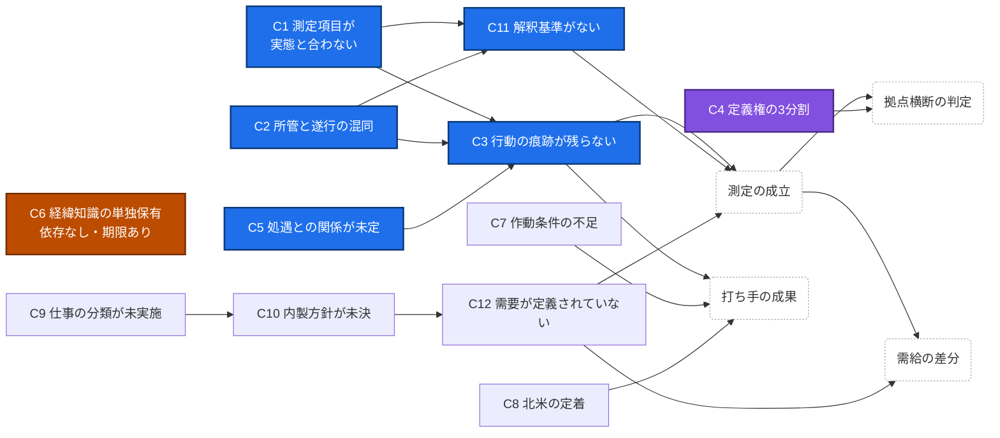

# 何を解くのか ── 3つの根本課題と、そこに連なる12項目

> 本資料は、これまでの検討が個別に示してきた課題を 根本課題として整理し、全項目をそこに対応づけ、依存関係を確定させることを目的とする。
> 誰が解くかは問わない。 対処の時期と方法は、その課題を担う立場が決めるべきものである。

## 根本課題は3つ

### ① 組織は、自分の状態を知覚できていない

- 測定項目と実態が二重にずれている
    - 社員が実際に担ってきたこと ── 要件翻訳、受入判断、工数の妥当性検証、経緯知識、社内調整 ── は標準タクソノミーに存在せず、
    - 標準タクソノミーにある実装・設計・構築の能力は、長期のベンダー依存によって社内に保有されていない可能性が高い。
- さらに深刻なのは、誤差の性質である
    - 「15年この領域を担当してきた」という事実から「この領域を遂行できる」が導かれてしまう。悪意も虚偽もなく、所管と遂行が混同される。 
    - 組織全員が同じ認識枠組みを共有しているためピアレビューでも補正されない。
- 結果としてスキル台帳は
    - 最も知りたいこと ── その領域は自社で遂行できるのか、外部がいなければ止まるのか ── を隠す。
    - これは「可視化止まり」以前の問題であり、可視化の対象そのものが違っている。

### ② 揃える動機が、どの職掌からも生じない

- 3拠点にそれぞれIT組織長がおり、
    - それぞれが自拠点のケイパビリティ戦略を策定している。
    - 全員が自分の職掌を正しく果たしている。にもかかわらず尺度は揃わない。
- 一般に言われる「オーナーシップの不在」とは構造が違う。
    - 誰もやっていないのではなく、全員が別々にやっている。 したがって調整担当を新設しても埋まらない。
    - その人にとって、揃わなくても業務は止まらないためである。困るのは組織であって、その人ではない。
- 帰結として、
    - 拠点を超えた人材の比較・活用が、意志ではなく原理の問題として判定不能になっている。
    - 5年間のタレント開発活動が、ひとつの活動ではなく3つの並行した別の活動であった。

### ③ 失われつつあるものに、期限がある

- 経緯知識 ── なぜこのシステムがこう作られているか ── の単一保有である。
    - ①②が回復可能な課題であるのに対し、これだけが不可逆である。 
    - 保有者が退職した瞬間、採用でも配置でも外部調達でも戻らない。
- そして現時点で、誰が何を単独保有しているかのリストが存在しない。 
    - 作成に要するのは半日程度と見積もられている。
    - 実在する締切を持つ論点は、これ一つである。

 
 

## 課題の整理（根本課題への対応）

### ① 知覚の欠落 に属する項目

| # | 課題 | 内容 |
|---|---|---|
| C1 | 測定項目が実態と合っていない | 社員が実際に担ってきた業務（要件翻訳、受入判断、工数検証、経緯知識、社内調整）が標準タクソノミーに存在しない。逆に、標準タクソノミーが持つ実装・設計・構築の能力は保有されていない可能性が高い |
| C2 | 所管と遂行が構造的に混同される | 「長く担当してきた」から「遂行できる」が導かれる。誤差の方向が定まっているため集計で打ち消されず、認識枠組みが共有されているためピアレビューでも補正されない |
| C3 | 行動の痕跡が記録に残らない | 自社積算、差し戻し検討結果、切り分け仮説、代替案の提示が様式に存在せず、照会先がない |
| C5 | 測定結果と処遇の関係が定まっていない | 接続しないことが明文化されていないため、抵抗と申告の歪みが生じる余地が残る |
| C11 | 測定結果の解釈基準が定義されていない | 発展段階の差を能力差と読む、ベテランの低評価と読む、コスト削減施策と読む ── 出力はそのまま提示すれば誤読される |

---

> C1・C2 が装置の設計、C3 が入力の存在、C5 が入力の正直さ、C11 が出力の伝わり方にあたる。
> いずれか一つでも欠ければ、組織は自らの状態を知覚できない。

 

### ② 定義権の分割 に属する項目

| # | 課題 | 内容 |
|---|---|---|
| C4 | スキル定義の権限が3拠点に分割されている | 各拠点のIT組織長が自拠点の定義を持ち、揃える動機がどの職掌からも生じない。拠点を超えた比較が原理的に判定不能 |

---

 

### ③ 経緯知識の喪失 に属する項目

| # | 課題 | 内容 |
|---|---|---|
| C6 | 経緯知識が単独保有されている | なぜこのシステムがこう作られているかを照会できる社員が、領域によって1名である。保有者リストが存在しない |

---

 

### いずれの根本課題にも属さない項目

| # | 課題 | 内容 |
|---|---|---|
| C7 | 作動条件が整っていない | 機会（業務の配分）・失敗の許容・時間（工数）が揃わなければ、打ち手を設計しても行動は発生しない |
| C8 | 北米拠点の人員が定着していない | 短サイクルでの入れ替えが生じており、遂行水準が積み上がらない |
| C9 | 仕事の分類が未実施 | ①場所拘束／②場所自由・移転可能／③場所自由・移転不能 の分類が行われておらず、北米の需要への加算分が確定しない |
| C10 | 内製方針が未決 | ②に分類される領域を社内で持つか外部に出すかが定まっていない。能力の議論では決着しない |
| C12 | 需要が定義されていない | 機能×拠点×ロールで必要人数が記入されておらず、供給側を測っても差分が算出できない。加えて、需要の単位は三層で異なるため、人数を記入する様式は基層にしか適用できない |

 

## 課題の依存関係

 

| 表示 | 意味 |
|---|---|
| 青 | ① 知覚の欠落（C1・C2・C3・C5・C11） |
| 紫 | ② 定義権の分割（C4） |
| 橙 | ③ 経緯知識の喪失（C6） |
| 無着色 | いずれの根本課題にも属さない（C7〜C10・C12） |
| 破線の丸 | 課題ではなく、到達される状態 |

---

 

## 課題が解決した状態（目標）

### ① 知覚の欠落が解決した状態

- 任意の機能×拠点について「その領域は自社で遂行できるのか、外部がいなければ止まるのか」を、記録に基づいて答えられる状態。

- 具体的には、次が成り立っている。
    - どの領域が「遂行できる／評価できる／所管しているのみ」のいずれにあるかが、全対象について判定されている
    - その判定が申告ではなく痕跡 ── 自社積算、差し戻しの記録、提示した代替案、切り分け仮説 ── に裏づけられており、第三者が記録を辿れば同じ判定に到達できる
    - 痕跡がなく判定できない領域が、「水準が低い」ではなく「未検証」として区別して出力されている
    - 測定結果を処遇に接続しないことが明文化されており、実態どおりに申告しても不利益が生じない
    - 出力が、段階差を能力差と読ませない形、ベテランの低評価と読ませない形、コスト削減施策と読ませない形で提示されている

- 解決とみなさないもの
    - 台帳の値が良くなること。むしろ初回は「所管しているのみ」と「未検証」が大量に出るのが正常であり、それが出ることこそが解決の証拠です。
    - 判定基準は値の良さではなく、値の正しさです。

### ② 揃える動機の不在が解決した状態

- 尺度が揃っていなければ職掌を果たせない立場が実在し、その立場が実際に判定を行っている状態。

- 具体的には、次が成り立っている。
    - スキル定義の語彙・粒度・判定基準について、単一の主体が権限を持っている
    - その主体の職掌が「揃えること」そのものではなく、揃っていないと果たせない別の責務として定義されている
    - 水準の判定が、拠点ではなくその主体によって行われている
    - 判定の基準となるアンカー事例に改定履歴が残り、基準が恣意的に動かされていないことを拠点側が検証できる
    - 3拠点が同じ様式・同じ語彙で記録しており、拠点間の判定差異が検出され、解消された記録がある
    - 「日本の誰かを北米で活かせるか」が、判定可能な問いになっている

- 解決とみなさないもの 
    - 人が実際に拠点を越えて動くこと。解決するのは判定できることまでであり、実行にはビザ・言語・報酬体系・本人の意思が残ります。
    - また、調整担当が任命されただけの状態は解決ではありません。その人が困らない構造であれば、名前が付いただけです。

### ③ 経緯知識の喪失が解決した状態

- 知らないうちに失う、が起きない状態。

- 具体的には、次が成り立っている。
    - どのシステムについて誰が経緯を保有しているかのリストが存在し、定期的に更新されている
    - 単独保有（1名）の箇所が特定され、件数が把握されている
    - 単独保有のうち、保有者の在籍見込みに照らして期限が切迫しているものが識別され、優先順位がついている
    - 優先度の高い箇所について、移転が業務として割り当てられ、時間が確保されている
    - 移転する側にとって、経緯を渡すことが不利益にならないことが担保されている
    - 移転が完了した箇所は、保有者が2名以上になっている

- 解決とみなさないもの
    - 全システムで複数名が経緯を保有している状態。これは費用的にも人員的にも現実的でなく、目標に置けば達成されない目標になります。
    - 単独保有をゼロにすることではなく、単独保有を把握し、期限のあるものから手当てできていることが解決です。

 

## アーティファクト（案）

### ① 知覚の欠落

| 名称 | 概要 | 優先度 |
|---|---|---|
| タクソノミー | タクソノミー（標準＋自社固有カテゴリ）、3水準の判定基準、必要な証拠の種類、設問形式、結果の提示規則を1本にまとめたもの | ★ 最優先 |
| 業務様式の改訂案 | 稟議・検収記録・決裁・インシデント記録の4様式に欄を追加。痕跡の発生源であり、蓄積に時間を要する | 高 |
| 規程 | 測定結果を等級・報酬に接続しないことを定めた規程または通達。1枚で足りる | 高 |

---

### ② 揃える動機の不在

| 名称 | 概要 | 優先度 |
|---|---|---|
| 定義不一致の立証資料 | 3拠点の現行定義の並置と、同じ「中級」が別物である具体例。決定を促すための材料 | ★ 最優先 |
| 定義権の所在を定めた文書 | 誰が語彙・粒度・判定基準を持つかの明文。人事権・予算を含まないことの明記と、「揃っていなければ果たせない責務」としての職掌記述を含む | 高 |
| アンカー事例集 | 各水準の判定基準となる実例。較正の実体であり、これがなければ判定は語彙の一致に留まる | 中 |

---

### ③ 経緯知識の喪失

| 名称 | 概要 | 優先度 |
|---|---|---|
| 経緯知識保有者リスト | システム×保有者氏名×人数。在籍見込みと切迫度を列に持たせ、単独保有の抽出と優先順位づけを1枚で兼ねる | ★ 最優先 |
| 移転の不利益回避に関する取り決め | 経緯を渡すことが本人の不利益にならないことの担保。これがなければ移転は実行されない | 高 |
| 設計経緯書 | 移転の成果物。唯一、内容そのものに価値のあるアーティファクト | 中 |

---
