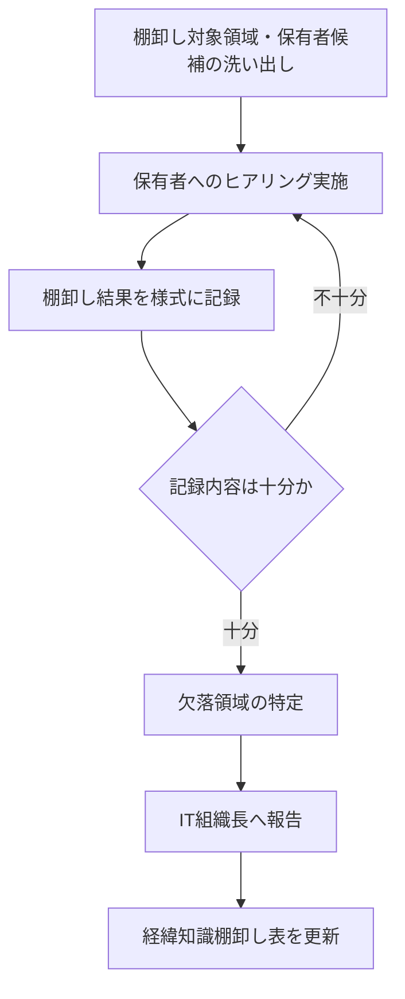
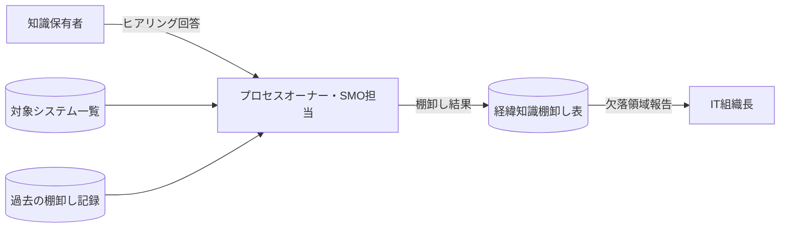
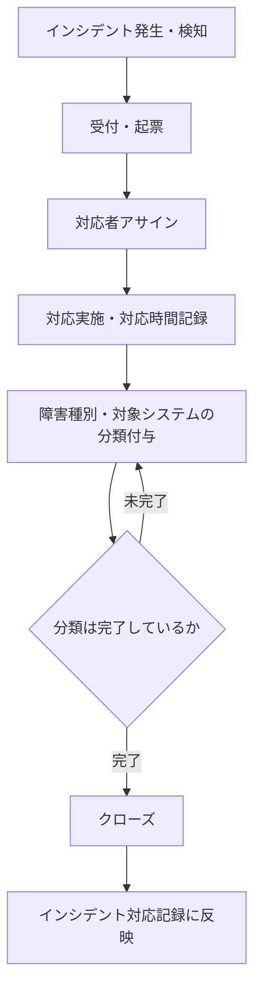
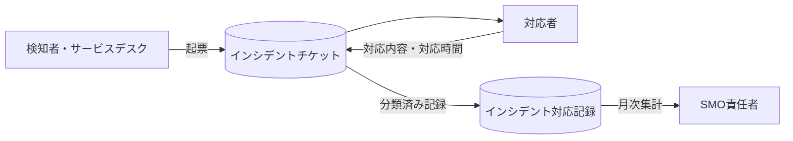
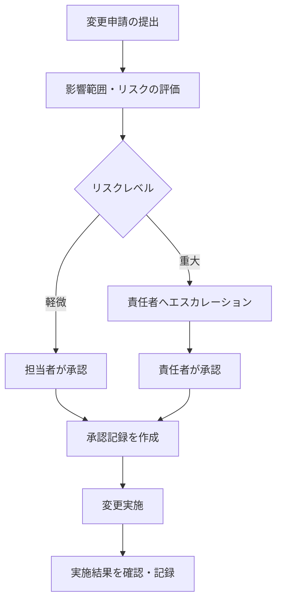
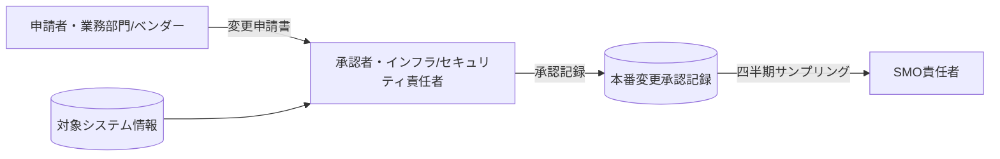
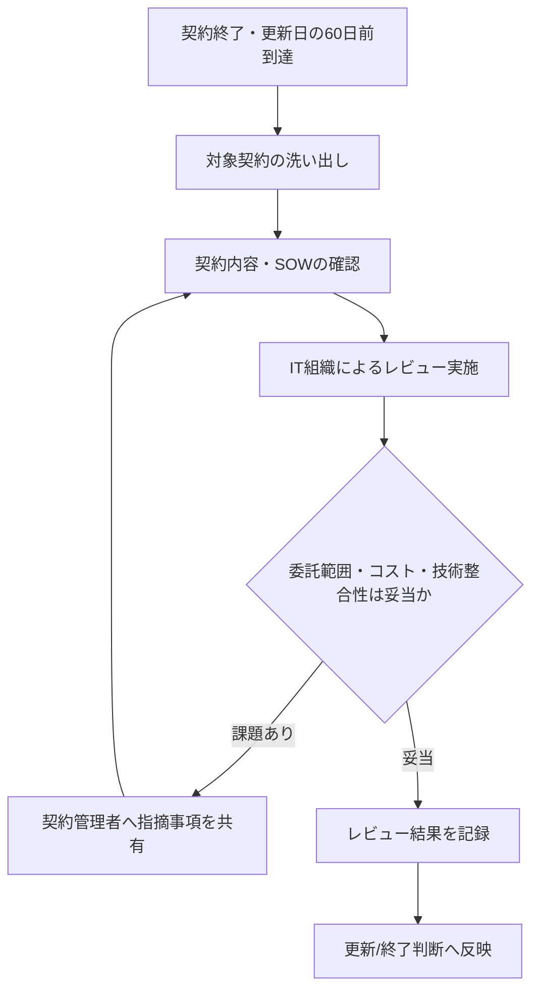
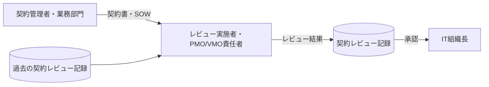
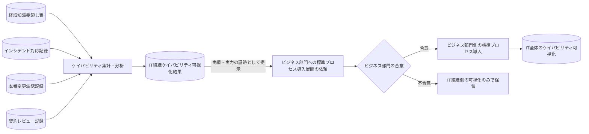

# 総括

## 第１章 今回の取り組みの振り返り

### 1.1 総括 ── 拒絶の構造(表層から深層へ)

拒絶は一つの理由ではなく、層になっている。下にいくほど、個々の説得や資料の改善では動かせない。

| 層 | 表面上の理由 | 実際の構造 |
|---|---|---|
| 現場管理者 | 「できればいいね」「目の前の1年に集中させてほしい」 | 正直に答えることが、自分の運用モデル(外注に実行を委ね、自分は管理に専念して多くの案件を抱える)を脅かす。コスト削減と無関係だとは宣言できない以上、この懸念は妄想ではなく正確な予測だった |
| IT組織長・マネジャー | 「これをやれば解決するという確証がなければ、裁量予算は動かせない」 | この提案が渡せるのは「1サイクル完走した実績」であり、解決の保証ではない。診断の解像度に対して、意思決定への接続の解像度が低すぎた |
| (検討中に判明) 記録の不在 | 調査票を事実・データで埋めようとしても埋まらない | A1〜A5を裏付ける一次証拠(要件定義書の執筆者欄、稟議の自社積算欄、検収の差し戻し記録、インシデントの一次対応者、契約台帳)が、プロジェクト・運用・調達のいずれにもほぼ存在しない。PMO/SMO/VMO的なデータ規律そのものが土台として無い |
| **(最深層) 権限の不在** | ここまでの全ての抵抗と共通する土台 | **アプリケーション領域の意思決定・評価はビジネス部門のガバナンス下にあり、IT組織は求められればアドバイスする程度の関与しか持たない。IT組織には、この問題(アプリケーション領域の依存・ケイパビリティ)を解決する権限がそもそも無かった** |

> **この表の読み方。** 最後の行がすべてを説明してしまう可能性がある。権限のない主体(IT組織)が、権限のない領域(アプリケーション)の可視化を、その領域を動かす権限もインセンティブも持たない人たち(現場管理者・IT組織長)に依頼していた。全レイヤの拒絶は、個々の説得下手の集積ではなく、この一点に収斂する。

### 1.2 Lessons Learned

- **診断の解像度と、意思決定への接続の解像度は、同じレベルで用意する必要がある。** IT組織長には「解決します」ではなく「来期のこの意思決定1件への入力になります」という具体的な使い道を、測定設計より先に用意すべきだった。
- **「測定してから使い道を考える」の順序は誤りだった。** 使い道(それを使って意思決定する権限を持つ主体)が実在することを先に確認してから、測定設計に着手すべきだった。
- **コスト削減と無関係だと宣言できないなら、無理に協力を求めるべきではない。** 虚偽の上に築いた協力は、いずれ崩れて二度と信頼を得られなくなる。ここで踏みとどまった判断は正しかった。
- **自己申告に頼る前に、まず一次証拠(記録)が存在するかどうかを確認すべきだった。** 存在しない場合、それ自体がこの提案より手前にある、別の(より地味だが説明しやすい)問題である。
- **「IT組織のケイパビリティ」を測る前に、「その領域の意思決定権は誰にあるか」を最初に確認すべきだった。** 領域(アプリケーション/インフラ/データ等)によって、決裁権の所在は同じではない。当社ではアプリケーションは業務部門、インフラ・設備はIT組織である。この区別をせずに「IT組織のケイパビリティ」として一括りにしたことが、そもそもの設計ミスだった。
- **同じ反応が二社で起きたのは偶然ではない。** 内容ではなく、「診断が先、権限確認が後」という進め方そのものに再現性のある欠陥があった可能性が高い。

---

## 第２章 再始動するための準備

### 2.1 再始動の前提条件

以下のいずれかが崩れない限り、同じ形での再始動は同じ結果になる。

| 前提 | 内容 | 現状(2026年8月末) |
|---|---|---|
| A. 権限の所在の変化 | アプリケーション領域の意思決定にIT組織が正式に関与する仕組みができる、または業務部門側に自発的なスポンサーが立つ | 未成立 |
| B. 意思決定への接続 | 「解決の保証」ではなく、特定の意思決定1件への入力として、権限を持つ主体が事前に使途を合意している | 未成立 |
| C. コスト削減の扱いの明確化 | 削減そのものが目的ではなく配分判断であることを予算権限者自身が言える状態、または削減もあり得ることを正直に扱える信頼関係がある | 未成立 |
| D. 一次証拠となる記録の存在 | 案件台帳・決裁様式・検収記録・契約台帳など、最低限のデータ規律が(プロジェクト・運用・調達のいずれかの領域で)存在する | ほぼ無い |
| E. 揃っていないと困る人の実在(C4の解消) | 「揃っていない」ことで実際に困る立場の人が、どこかに実在する | 未確認 |

> 唯一、これらの前提を待たずに今すぐ着手できるのは、**経緯知識保有者リストの作成(半日)** である。これは誰の合意も、記録も、権限の確認も要らない。不可逆な差分はここだけであり、前提が整うのを待つ理由がない。

### 2.2 相談相手とその順序(再始動する場合)

1. **(今すぐ、単独で)** 経緯知識保有者リストの作成。前提の成立を待たない。
2. **業務部門側で、アプリケーションの予算・決裁権を実質的に持つ人物を特定し、個別に非公式な対話をする。** 目的は説得ではなく、「揃っていないと困る」動機(ベンダー依存によるリスク、過去のトラブル等)を持つ人がいるかどうかを探ること。
3. **見つかった場合、その人物を最初のスポンサーとして固める。** 何の意思決定に使うか(前提B)を、測定設計より先に合意する。
4. **IT組織長には、「IT主導の枠組みへの賛同」としてではなく、「特定の業務部門の意思決定を、IT組織の技術的知見で支援する役割」として持ち込む。** IT組織のケイパビリティを測ることが目的ではなく、既に動いている意思決定を支援する立場に、依頼の形を変える。
5. **ITガバナンス長には、ここまでの経緯(権限の所在という発見を含む)を、WFO全体の設計を見直すための材料として共有する。** これは「進捗が遅い」への言い訳ではなく、WFOのスコープそのものに関わる発見として扱う。
6. **現場管理者は最後。** データ規律(前提D)が整い、狭い事実確認の質問(この契約、誰が見ていますか)に絞れる状態になってから依頼する。自己申告での協力要請はしない。

### 2.3 ケイパビリティ可視化ロードマップ

#### 2.3.1 起点 ── COBITをITガバナンスフレームワークに据える

| COBITドメイン | 役割 | PMO/SMO/VMOとの関係 |
|---|---|---|
| EDM(評価・指示・モニタリング) | 統治(ガバナンス)の最上位。COSOに接続 | 対象外(ビジネス側の統治構造) |
| APO(整合・計画・組織化) | 戦略・体制・関係管理の目標群 | PMO/SMO/VMO共通の土台(APO05/07/08/10等) |
| BAI(構築・調達・導入) | プロジェクト・ソリューション構築の目標群 | 主にPMO・SMOのプロセス(BAI01-11) |
| DSS(提供・サービス・サポート) | 運用・サービス提供の目標群 | 主にSMOのプロセス(DSS01-06) |
| MEA(モニタリング・評価・審査) | 監視・監査の目標群 | J-SOX/ITGCの抽出元 |

#### 2.3.2 導入準備 ── 標準プロセス管理プロセス

COBITを起点として管理領域(PMO/SMO/VMO)を定めた直後、個々の標準プロセスの内容を作り込む前に、標準プロセスをどう作り・検証し・変更するかという「標準を管理するための標準」を先に定める。この管理プロセス(Plan/Do/Check/Actの4段階、計10プロセス)を、2.3.3で定義するすべての標準プロセスに共通で適用する。

| 段階 | プロセス | 内容 | アウトプット | KPI |
|---|---|---|---|---|
| Plan | プロセスオーナー任命 | 対象プロセスごとにオーナーを任命し、役割・責任・権限を明確化する | プロセスオーナー任命記録 | オーナー任命済み率(7プロセス中) |
| Plan | 標準プロセス定義 | プロセスオーナーが対象業務を棚卸しし、インプット・アウトプット・基準・手順・様式を定義する | 標準プロセス定義書(初版) | 定義書作成済み率 |
| Plan | 資源確保 | プロセス実行に必要な人員・時間・ツールを確保する | 実施体制表 | 必要資源に対する充足率 |
| Do | 試験導入 | 一部の案件・業務で試験的に運用する | 試験導入結果報告 | 試験導入を完了したプロセス数 |
| Do | 本運用の実行 | 定めた基準・手順に従ってプロセスを実行する | 実行記録(棚卸し表・承認記録・契約レビュー記録等) | 対象案件・対象期間に占める記録作成率 |
| Check | 定期サンプリング | 一定期間ごとに記録の有無・記載精度をサンプリングする | サンプリング結果 | サンプリング実施率 |
| Check | 導入状況の評価 | サンプリング結果を集計し、導入率・遵守率を評価する | 導入状況レポート | 導入率 |
| Check | 課題管理 | 判明した課題を記録し、対応状況を追跡する | 課題管理台帳 | 課題クローズ率 |
| Act | 是正処置 | 課題に対する是正処置を実施する | 是正処置記録 | 是正処置完了率 |
| Act | 変更起票・標準プロセスの改定 | プロセスオーナーが変更を起票し、IT組織長が承認して標準プロセス定義書を改定する | 変更履歴、改定後の標準プロセス定義書 | 改定計画の遵守率 |

#### 2.3.3 標準プロセス定義① ── PMO/SMO/VMOの標準プロセス全量(内容の作り込みは2.3.2の管理プロセスに従う)

##### PMO ── PMBOK(10知識エリア)

| 標準プロセス | 対応COBIT目標 |
|---|---|
| 統合マネジメント | BAI01・BAI11 |
| スコープマネジメント | BAI02 |
| スケジュールマネジメント | BAI11 |
| コストマネジメント | APO06 |
| 品質マネジメント | BAI03 |
| 資源マネジメント | APO07 |
| コミュニケーションマネジメント | APO08 |
| リスクマネジメント | APO12 |
| **調達マネジメント** | **APO10・APO09(VMOと重複)** |
| ステークホルダーマネジメント | APO08 |

##### SMO ── ITIL 4(34プラクティス)

###### 一般管理プラクティス
| 標準プロセス | 対応COBIT目標 |
|---|---|
| アーキテクチャ管理 | APO03 |
| 継続的改善 | MEA01・APO02 |
| 情報セキュリティ管理 | APO13・DSS05 |
| **ナレッジ管理** | **BAI08(C6経緯知識と直結)** |
| 測定と報告 | MEA01 |
| 組織変更管理 | BAI05 |
| ポートフォリオ管理 | APO05 |
| プロジェクト管理 | BAI11 |
| 関係管理 | APO08 |
| リスク管理 | APO12 |
| サービス財務管理 | APO06 |
| 戦略管理 | APO02 |
| **サプライヤー管理** | **APO10(VMOと重複)** |
| 人材管理 | APO07 |

###### サービス管理プラクティス
| 標準プロセス | 対応COBIT目標 |
|---|---|
| 可用性管理 | BAI04 |
| ビジネス分析 | BAI02 |
| キャパシティ・パフォーマンス管理 | BAI04 |
| 変更実現 | BAI06 |
| インシデント管理 | DSS02 |
| IT資産管理 | BAI09 |
| モニタリング・イベント管理 | DSS01 |
| 問題管理 | DSS03 |
| リリース管理 | BAI07 |
| サービスカタログ管理 | APO09 |
| サービス構成管理 | BAI10 |
| サービス継続性管理 | DSS04 |
| サービス設計 | BAI03 |
| サービスデスク | DSS02 |
| サービスレベル管理 | APO09 |
| サービス要求管理 | DSS02 |
| サービス検証・テスト | BAI07 |

###### 技術管理プラクティス
| 標準プロセス | 対応COBIT目標 |
|---|---|
| 展開管理 | BAI07 |
| インフラ・プラットフォーム管理 | DSS01 |
| ソフトウェア開発・管理 | BAI03 |

##### VMO ── ISO 37500(4フェーズ+中央ガバナンス)

| 標準プロセス | 対応COBIT目標 |
|---|---|
| 戦略分析(Outsourcing strategy analysis) | APO10 |
| 開始・選定(Initiation and selection) | APO10・APO09 |
| 移行(Transition) | BAI07 |
| 価値提供(Deliver Value) | APO08・APO09 |
| 中央ガバナンス機能 | APO10全体を横断 |

#### 2.3.4 標準プロセス定義② ── 優先導入(導入しやすさ×ケイパビリティ可視化への影響度)

判断基準: 導入しやすさ・影響度の両方が高い → 最優先。導入しにくいが影響度がある → 第二優先。影響度が低い → 導入しない(不要)。

##### 導入する

| 標準プロセス(2.3.3と同一) | 組織機能 | 導入しやすさ | 可視化への影響度 | 優先度 | 生成される文書名 | そこから得られる情報 |
|---|---|---|---|---|---|---|
| ナレッジ管理 | SMO | 易(IT組織内で完結) | 高 | 最優先 | 経緯知識棚卸し表 | 保有者・知識内容・深度 |
| インシデント管理 | SMO | 易(IT組織内で完結) | 中〜高(蓄積後) | 最優先 | インシデント対応記録 | 障害内容・対応者・対応時間 |
| 変更実現 | SMO | 易(既存承認慣行の明文化) | 中 | 最優先 | 本番変更承認記録 | 承認者・変更内容・頻度・エスカレーション有無 |
| 調達マネジメント | PMO(VMOと重複領域) | 易(契約終了時レビューを主張できる) | 中 | 最優先 | 契約レビュー記録 | 委託範囲・契約内容・選定理由 |
| 資源マネジメント | PMO | 難(業務部門の協力が要る) | 高 | 第二優先 | 資源計画書 | 案件ごとの体制・役割・必要スキル |
| スコープマネジメント | PMO | 難(業務部門が作成、IT組織はレビューのみ) | 中 | 第二優先 | 要求事項定義書 | 業務要求・IT側レビューコメント |
| 移行 | VMO | 易(契約終了時はIT組織が関与できる) | 中(契約終了時のみに限定され断片的) | 第二優先 | 知識移転記録 | 引継ぎ元・引継ぎ先・移転範囲 |

##### 導入しない(影響度が低い)

| 標準プロセス(2.3.3と同一) | 組織機能 | 影響度が低い理由 |
|---|---|---|
| IT資産管理 | SMO | 個人の力量ではなく対象範囲(何を管理すべきか)の確定にとどまり、力量データそのものではない |
| 戦略分析 | VMO | 内製/外部委託のマクロな範囲把握であり、個人の力量には触れない |
| 統合マネジメント | PMO | プロジェクト憲章・教訓登録は業務部門主導の案件ガバナンス情報が中心で、IT組織側の力量データにならない |
| サービスレベル管理 | SMO | ベンダーとの合意事項が中心で、内部人材の力量とは直結しない |
| 開始・選定 | VMO | ベンダー選定基準・評価記録であり、選定権限も情報の主体も業務部門側にある |

#### 2.3.5 標準プロセス定義③ ── 最優先4プロセスの標準プロセス定義

2.3.4の最優先4プロセス(ナレッジ管理・インシデント管理・変更実現・調達マネジメント)を定義する。2.3.2のPlan段階(標準プロセス定義)の成果物にあたる。

##### ナレッジ管理(経緯知識棚卸しプロセス)

| 項目 | 内容 |
|---|---|
| 目的 | 属人化している経緯知識(なぜこうなっているかという背景知識)を可視化し、喪失を防ぐとともにケイパビリティの一次情報とする |
| 適用範囲 | SMOが管理する全システム・業務のうち、標準化されていない運用知識・トラブル対応知識 |
| トリガー | 定期棚卸し(四半期ごと)、または知識保有者の異動・契約終了が判明した時点 |
| 手順 | ①対象領域・保有者候補の洗い出し → ②保有者へのヒアリング・棚卸し実施 → ③棚卸し結果の様式への記録(保有者・知識内容・深度) → ④欠落領域の特定 → ⑤IT組織長への報告 |
| 役割と責任 | 棚卸し実施者(SMO担当)、知識保有者(運用担当者)、承認者(IT組織長) |
| インプット | 対象システム一覧、過去の棚卸し記録 |
| アウトプット | 経緯知識棚卸し表(保有者・知識内容・深度・最終更新日) |
| 判定基準 | 深度は3水準(遂行できる/評価できる/所管しているのみ)で記録する |
| 記録・保管 | 棚卸し表を継続的に更新・保管し、四半期ごとに欠落領域を確認する |
| 対応COBIT目標 | BAI08 |

##### インシデント管理(障害対応記録プロセス)

| 項目 | 内容 |
|---|---|
| 目的 | 障害発生・対応の実績を記録し、蓄積することで「遂行できる」レベルの実績データとする |
| 適用範囲 | SMOが管理する全システムで発生したインシデント |
| トリガー | インシデントの発生・検知 |
| 手順 | ①インシデントの受付・起票 → ②対応者のアサイン → ③対応内容・対応時間の記録 → ④分類(障害種別・対象システム)の付与 → ⑤クローズ |
| 役割と責任 | 起票者(サービスデスク/検知者)、対応者(運用担当者)、記録確認者(SMO責任者) |
| インプット | 障害検知情報、過去のインシデント記録 |
| アウトプット | インシデント対応記録(障害内容・対応者・対応時間・分類) |
| 判定基準 | 全インシデントをチケット化し、分類体系に従って記録する(分類なしでのクローズは不可) |
| 記録・保管 | 記録を蓄積し、月次で対応者別・分類別に集計する |
| 対応COBIT目標 | DSS02 |

##### 変更実現(本番変更承認プロセス)

| 項目 | 内容 |
|---|---|
| 目的 | 本番環境への変更をインフラ/セキュリティ観点で適切に承認し、承認の事実を記録として残す |
| 適用範囲 | 本番環境に影響する全ての変更(アプリケーション・インフラ・設定変更を問わない) |
| トリガー | 変更申請の提出(業務部門・ベンダーからの依頼を含む) |
| 手順 | ①変更申請の受付 → ②影響範囲・リスクの評価 → ③承認可否の判定(必要に応じてエスカレーション) → ④承認記録の作成 → ⑤変更実施の確認 |
| 役割と責任 | 申請者(業務部門/ベンダー)、承認者(インフラ/セキュリティ責任者)、記録管理者(SMO担当) |
| インプット | 変更申請書、対象システム情報 |
| アウトプット | 本番変更承認記録(承認者・変更内容・日時・エスカレーション有無) |
| 判定基準 | リスクレベルに応じた承認者の階層(軽微=担当者決裁、重大=責任者決裁) |
| 記録・保管 | 承認記録を最低1年間保管し、四半期ごとのサンプリング対象とする |
| 対応COBIT目標 | BAI06 |

##### 調達マネジメント(契約レビュープロセス)

| 項目 | 内容 |
|---|---|
| 目的 | 契約終了・更新時にIT組織が内容をレビューし、委託範囲・条件を記録として残す |
| 適用範囲 | IT関連の外部委託契約(保守・開発・運用委託等)の終了・更新案件 |
| トリガー | 契約終了日・更新日の一定期間前(目安60日前) |
| 手順 | ①対象契約の洗い出し → ②契約内容・SOWの確認 → ③IT組織によるレビュー(委託範囲の妥当性・コスト・技術的整合性) → ④レビュー結果の記録 → ⑤更新/終了判断への反映 |
| 役割と責任 | 契約管理者(業務部門)、レビュー実施者(PMO/VMO責任者)、承認者(IT組織長) |
| インプット | 契約書、SOW、過去の契約レビュー記録 |
| アウトプット | 契約レビュー記録(委託範囲・契約内容・選定理由・レビューコメント) |
| 判定基準 | レビュー実施の要否は契約金額・重要度で判断(初期は重要契約から着手) |
| 記録・保管 | レビュー記録を契約期間中保管し、契約更新のたびに更新する |
| 対応COBIT目標 | APO10・APO09 |

#### 2.3.6 標準プロセス定義④ ── フローチャートとデータフロー

2.3.5の4プロセスを、手順のフローチャートとデータフローで表す。

##### ナレッジ管理

**フローチャート**

**データフロー**

##### インシデント管理

**フローチャート**

**データフロー**

##### 変更実現

**フローチャート**

**データフロー**

##### 調達マネジメント

**フローチャート**

**データフロー**

#### 2.3.7 ケイパビリティ可視化 ── 4プロセスの出力からビジネス部門への展開依頼へ

2.3.6の4プロセスが生成する記録(データフローの出力)を集約し、IT組織自身のケイパビリティを可視化する。これは4プロセスだけでは完成しない、IT組織側から見たIT組織自身のケイパビリティに過ぎない。この可視化結果を実績・実力の証跡として、ビジネス部門に標準プロセスの導入・展開を依頼し、合意が得られて初めてIT全体のケイパビリティ可視化に近づく。

| 出力(データフローの終点) | 可視化される内容 | 限界 |
|---|---|---|
| 経緯知識棚卸し表 | 誰が・何を・どの深さで知っているか | IT組織内の知識に限定 |
| インシデント対応記録 | 蓄積後の「遂行できる」レベルの実績 | 蓄積に時間を要する |
| 本番変更承認記録 | 本番判断を任されている担当者 | 対象領域(A1-A5)の切り分けは別途必要 |
| 契約レビュー記録 | 外部依存の範囲 | 内部人材の力量そのものではない |
| **IT組織ケイパビリティ可視化結果(集約後)** | **IT組織側から見たIT組織自身のケイパビリティ** | **ビジネス部門側のケイパビリティが欠落しており、IT全体としては不十分** |

---

### 注記

- 本文書は正式な提案資料ではなく、個人の検討メモである。
- 「本件」はアプリケーション領域の依存・ケイパビリティに関する問題を指す。インフラ・設備領域(IT組織がガバナンスを持つ)は、この問題とは別の話として切り離している。
- 2.3のロードマップは、COBIT・PMBOK・ITIL・ISO 37500の詳細対応関係(`COBIT対応表_PMO_SMO_VMO.md`)、および各プロセスのケイパビリティ可視化への効果分析(`一次情報化とケイパビリティ可視化への効果.md`)を土台に再構成したものであり、両ファイルに詳細な理由づけを残してある。
- 関連: `../FRAMEWORK.md`(フレームワーク本体)、`../project-charter/trial-project-charter.md`(トライアル計画)、`../proposal/`(ケイパビリティ観測計画)
