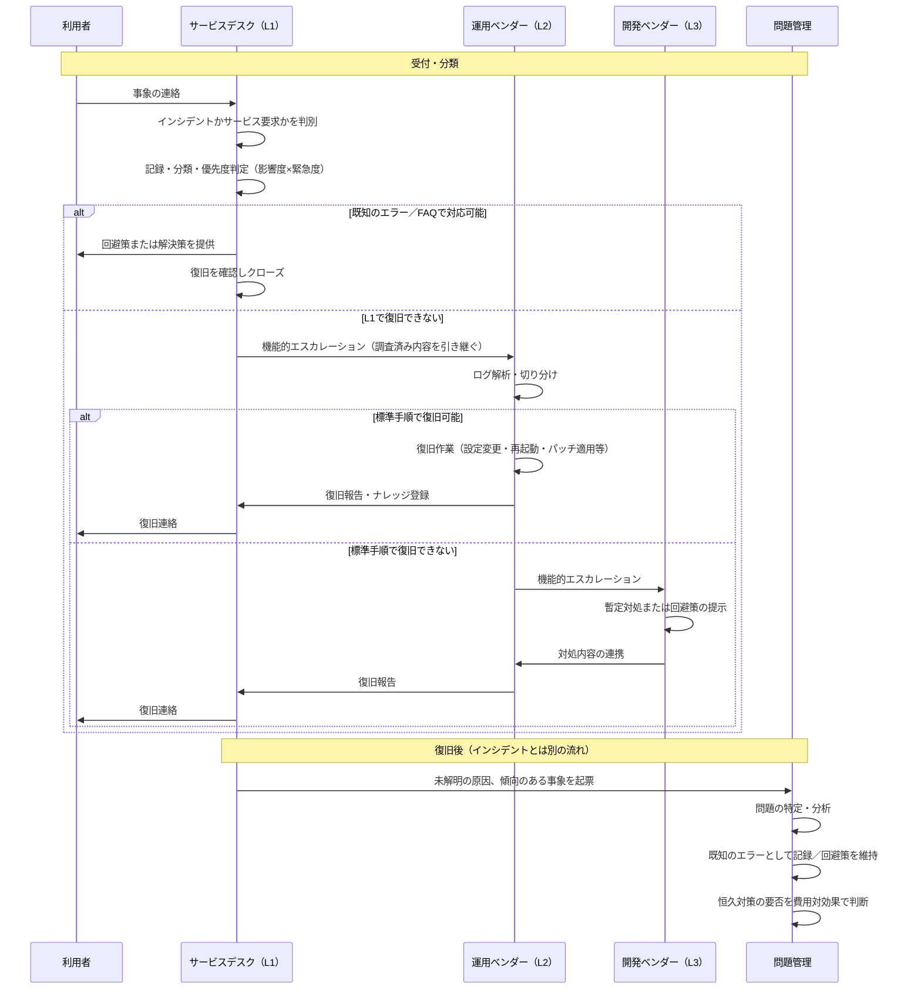

# 付録C：ITILの基礎知識 ― インシデント管理・問題管理とサポート階層

## C.1 本付録の目的と前提

### C.1.1 目的と想定読者

運用保守の委託契約では、「一次受付はどこまでやるのか」「根本原因の調査は誰の責任か」「エスカレーションの基準は何か」といった論点が必ず出てくる。これらを議論するための共通言語がITILである。本付録は、**ITILにおけるインシデント管理・問題管理の正しい理解**を身につけ、ベンダーとの責任分界の議論に使えるようにすることを目的とする。

- **想定読者**：運用保守の委託契約に関わるIT部門メンバー、ベンダーマネジメント担当者
- **使う場面**：委託範囲の定義、SLA項目の設計、ベンダーとの用語合わせ、運用ドキュメントのレビュー
- 本付録は単独で参照できるリファレンスとして構成している。

 

### C.1.2 先に押さえるべき3つの前提

| # | 前提 | よくある誤解 |
|---|------|-------------|
| 1 | ITILは**優れた実践の指針（グッドプラクティス）**であり、そのまま適用する手順書ではない | 「ITILに従えば運用手順が決まる」…決まらない。ITILは「何を達成すべきか」を示し、具体的な手順・様式は各組織が設計する |
| 2 | **L1／L2／L3というサポート階層はITILが定義する用語ではない** | 「ITILのL1・L2・L3」…そのような区分はITILの規定にない。業界で広く使われる実務上の慣行である（[C.5](#c5-サポート階層とエスカレーション)） |
| 3 | **インシデント管理と問題管理は別のプラクティス**である | 「障害対応＝問題管理」…違う。障害からの復旧はインシデント管理、原因の特定・除去は問題管理（[C.3](#c3-インシデント管理と問題管理の区別)） |

 

---

## C.2 ITILの基礎知識

### C.2.1 版の変遷と現在地

| 版 | 時期 | 構成 | 状態 |
|----|------|------|------|
| ITIL v3／2011 edition | 2007／2011 | 5つのライフサイクル段階、26プロセス | 旧版。社内文書がこの版に基づいている場合がある |
| **ITIL 4** | 2019 | サービスバリュー・システム（SVS）、**34のマネジメントプラクティス** | 現在広く使われている版 |
| **ITIL（Version 5）** | 2026〜 | 段階的リリース。まずFoundationから提供 | 移行期。ITIL 4も引き続き利用可能 |

ITIL（Version 5）は、AIを活用した環境への対応、サービスに加えて**プロダクト**を中心に据えた考え方、資格体系の簡素化を掲げて段階的に導入が進んでいる。ITIL 4で得た知識と資格は引き続き有効とされている。本付録はITIL 4を基準に記述する。

 

### C.2.2 サービスマネジメントの4つの側面

ITIL 4は、サービスマネジメントを次の4側面から全体的に捉えることを求める。運用の議論がプロセス（手順）の話だけに寄りがちなときの点検軸として使える。

| # | 側面 | 委託先管理での例 |
|---|------|-----------------|
| 1 | 組織と人材 | 委託先の要員体制、スキル、固定メンバー制 |
| 2 | 情報と技術 | チケットシステム、ナレッジベース、監視ツール |
| 3 | **パートナーとサプライヤー** | 委託先・再委託先との関係、契約、責任分界 |
| 4 | バリューストリームとプロセス | インシデント対応・エスカレーションの流れ |

 

### C.2.3 サービスバリュー・システムと6つのバリューチェーン活動

ITIL 4は、需要から価値創出までの仕組み全体を**サービスバリュー・システム（SVS）**と呼び、次の5つの要素で構成する。

- 指針となる原則（Guiding principles）
- ガバナンス（Governance）
- **サービスバリュー・チェーン（Service value chain）**
- プラクティス（Practices）
- 継続的改善（Continual improvement）

このうちサービスバリュー・チェーンは6つの活動からなる。ITIL 4では、これらを状況に応じて組み合わせた**バリューストリーム**として運用を設計する（v3の固定的なライフサイクル段階とは考え方が異なる）。

| # | 活動（原文） | 内容 |
|---|-------------|------|
| 1 | Plan（計画） | 方針・目標・方向性の共有 |
| 2 | Improve（改善） | 製品・サービス・プラクティスの継続的改善 |
| 3 | Engage（エンゲージ） | 利害関係者（利用者、サプライヤーを含む）との関係構築とニーズの把握 |
| 4 | Design and transition（設計と移行） | 品質・コスト・市場投入時間の要件を満たす設計と移行 |
| 5 | Obtain/build（獲得・構築） | 必要なコンポーネントの調達または構築 |
| 6 | Deliver and support（提供とサポート） | 合意された仕様どおりのサービス提供と支援 |

 

### C.2.4 7つの指針となる原則

現場の判断に迷ったときの拠りどころとなる原則。契約やSLAの設計方針を説明する際にも使える。

| # | 原則 |
|---|------|
| 1 | 価値に着目する（Focus on value） |
| 2 | 現状からはじめる（Start where you are） |
| 3 | フィードバックを元に反復して進化する（Progress iteratively with feedback） |
| 4 | 協働し、可視性を高める（Collaborate and promote visibility） |
| 5 | 包括的に考え、取り組む（Think and work holistically） |
| 6 | シンプルにし、実践的にする（Keep it simple and practical） |
| 7 | 最適化し、自動化する（Optimize and automate） |

 

### C.2.5 34のマネジメントプラクティス

ITIL 4は、v3の「プロセス」に代えて34の**プラクティス**を定義し、3つに分類している。運用保守の委託で関係が深いものを太字で示す。

| 分類 | 数 | プラクティス |
|------|---|-------------|
| 一般マネジメントプラクティス | 14 | アーキテクチャ管理、**継続的改善**、**情報セキュリティ管理**、**ナレッジ管理**、**測定および報告**、組織変更管理、ポートフォリオ管理、プロジェクト管理、**関係管理**、**リスク管理**、サービス財務管理、戦略管理、**サプライヤ管理**、要員および人材管理 |
| サービスマネジメントプラクティス | 17 | 可用性管理、ビジネス分析、キャパシティおよびパフォーマンス管理、**変更実現**、**インシデント管理**、IT資産管理、**監視およびイベント管理**、**問題管理**、リリース管理、サービスカタログ管理、サービス構成管理、サービス継続性管理、サービスデザイン、**サービスデスク**、**サービスレベル管理**、**サービス要求管理**、サービスの妥当性確認およびテスト |
| 技術マネジメントプラクティス | 3 | 展開管理、インフラストラクチャおよびプラットフォーム管理、ソフトウェア開発および管理 |

 

---

## C.3 インシデント管理と問題管理の区別

本付録の中心となる論点である。委託契約でもっとも責任分界が曖昧になりやすいのがここである。

### C.3.1 目的の違い

| | インシデント管理 | 問題管理 |
|---|---|---|
| 目的（ITIL 4） | インシデントの影響を最小化するため、**通常のサービス運用をできるだけ早く回復する** | インシデントの実際の原因・潜在的な原因を特定し、回避策を管理することで、**インシデントの発生可能性と影響を低減する** |
| 成功の基準 | 復旧の速さ | 再発の防止、影響の低減 |
| 時間軸 | 即時 | 中長期 |
| 典型的な成果物 | 復旧、回避策の適用 | 既知のエラーの登録、恒久対策、変更要求 |

> 原文（Incident management）："to minimize the negative impact of incidents by restoring normal service operation as quickly as possible."
> 原文（Problem management）："to reduce the likelihood and impact of incidents by identifying actual and potential causes of incidents, and managing workarounds."

**重要な帰結**：インシデントは、**根本原因が分からなくても、サービスが回復すればクローズしてよい**。原因究明は問題管理として別途扱う。「原因が分かるまでインシデントを閉じない」という運用はITILの考え方に反しており、復旧時間の指標を実態から乖離させる。

 

### C.3.2 用語の定義

| 用語 | 定義 | 誤用されやすい点 |
|------|------|-----------------|
| インシデント（Incident） | 計画外のサービスの中断、またはサービス品質の低下 | 「問い合わせ」も含めてインシデントとして扱ってしまう（下記のサービス要求と区別する） |
| サービス要求（Service request） | 通常のサービス提供の一部としてあらかじめ定められた、利用者からの要求（アカウント発行、権限付与など） | インシデントと混在させると、障害件数が実態より多く見える |
| 問題（Problem） | 1つ以上のインシデントの原因、または潜在的な原因 | インシデントの言い換えとして使ってしまう |
| 既知のエラー（Known error） | 分析済みで、まだ解決されていない問題 | 記録されず、同じ調査が繰り返される |
| 回避策（Workaround） | インシデントや問題の影響を低減または解消する手段。恒久的な解決ではない | 回避策の適用をもって「解決済み」とし、問題管理に引き継がれない |
| イベント（Event） | 状態の変化のうち、管理上意味を持つもの | 監視アラートをすべてインシデントとして起票してしまう |

 

### C.3.3 問題管理の3つのフェーズ

ITIL 4の問題管理は次の3フェーズで構成される。

| フェーズ | 内容 |
|---------|------|
| 問題の特定（Problem identification） | インシデントの傾向分析、重大インシデントのレビュー、サプライヤーやパートナーからの情報などにより問題を識別する |
| 問題の制御（Problem control） | 問題の分析、既知のエラーとしての文書化、回避策の特定 |
| エラーの制御（Error control） | 既知のエラーの継続的な管理、恒久対策の検討、費用対効果に基づく対応可否の判断 |

**費用対効果の判断が含まれる点が重要**である。ITILは「すべての既知のエラーを解消せよ」とは言わない。解消コストが影響を上回る場合、回避策を維持したまま既知のエラーとして管理し続けることは正当な選択である。委託契約では、この判断を誰が行うかを決めておく必要がある。

 

### C.3.4 混同すると何が起きるか

| 混同 | 実務で生じる問題 |
|------|-----------------|
| インシデントのクローズ条件に原因究明を含める | 復旧しているのにチケットが開き続け、「解決時間」のSLA実績が実態を表さなくなる |
| 問題管理の役割を契約に書かない | 同じ障害が繰り返されても、誰も恒久対策の責任を負わない |
| サービス要求をインシデントとして計上 | 障害件数が水増しされ、ベンダー評価の指標が歪む |
| 回避策の適用を恒久対策とみなす | 既知のエラーが放置され、環境変更のたびに再発する |

 

---

## C.4 優先度の決め方

ITILでは、優先度（Priority）は**影響度（Impact）と緊急度（Urgency）の組み合わせ**で決める。「重要度」という単一の尺度ではない点に注意する。

- **影響度**：影響を受ける利用者・業務プロセスの範囲と、事業への影響の大きさ
- **緊急度**：どれだけ早く対応する必要があるか（回避策の有無、締め日などの時間的制約）

**優先度マトリクスの例**（実際の区分は自組織で定義する）

| 影響度＼緊急度 | 高 | 中 | 低 |
|---|---|---|---|
| **高**（全社・基幹業務停止） | P1 | P2 | P3 |
| **中**（部門・一部業務に支障） | P2 | P3 | P4 |
| **低**（個人・代替手段あり） | P3 | P4 | P4 |

委託契約では、**優先度の判定を誰が行うか**を明記する必要がある。ベンダーが判定するとP1が付きにくくなり、利用者側が判定するとP1が濫用される。実務では「初期判定はサービスデスク、異議申立ての手続きを設ける」という設計が使われる。

 

---

## C.5 サポート階層とエスカレーション

### C.5.1 ITILが定義するのは階層ではなくエスカレーションの種類

ITILは、エスカレーションを次の2種類に区別する。

| 種類 | 内容 | 誰に上げるか |
|------|------|-------------|
| 機能的エスカレーション（Functional escalation） | より高い技術的専門性を持つ担当へ引き継ぐ | 技術専門チーム、開発ベンダー、製品ベンダー |
| 階層的エスカレーション（Hierarchical escalation） | より高い権限を持つ管理者へ報告・判断を仰ぐ | 管理者、経営層 |

この2つは**目的が違う**。技術的に手詰まりなら機能的エスカレーション、判断や資源投入の承認が要るなら階層的エスカレーションである。委託契約では両方の発動条件と連絡先を定義する。

 

### C.5.2 L1／L2／L3／L4はITILの用語ではない

一次受付をL1、標準的な復旧をL2、恒久対応をL3、製品ベンダーをL4とする区分は、**業界で広く使われている実務上の慣行**であり、ITILが定義した用語ではない。ITILが求めるのは「適切な専門性を持つ担当へ確実に引き継ぐこと」であって、階層の数や境界を規定してはいない。

したがって次の点に注意する。

- **「ITILに準拠しているのでL1はここまで」という説明は成り立たない**。各階層の範囲は自組織とベンダーの合意で定義する事項である。
- ベンダーごとに「L2」の指す範囲が違う。RFPや契約では、階層名ではなく**具体的な作業内容**で範囲を書く。
- 階層を増やすほど引き継ぎ回数が増え、復旧が遅くなる。階層は目的があって置くものであり、多いほど良いわけではない。

 

### C.5.3 階層型とスワーミング

近年は、階層を順に上げる代わりに、関係する専門家が最初から同時に参画する**スワーミング（swarming）**を採る組織も増えている。ITILはどちらかを指定していない。

| | 階層型（tiered） | スワーミング（swarming） |
|---|---|---|
| 進め方 | L1→L2→L3と順にエスカレーション | 影響システムに応じ、必要な専門家が最初から参画 |
| 向く場面 | 定型的・大量の問い合わせ。委託範囲を切り分けやすい | 複雑で切り分けが難しい障害。原因箇所が特定できない事象 |
| 長所 | 役割と単価を分離でき、契約設計が容易 | 引き継ぎロスがなく、複雑な事象の解決が速い |
| 短所 | 引き継ぎのたびに時間と情報が失われる | 要員の拘束が大きい。委託契約で範囲を切りにくい |

**委託契約での含意**：階層型は責任分界を契約に落としやすいため、外部委託では選ばれやすい。ただし、重大インシデント（P1）についてはスワーミング的な合同対応を別途定義しておくと、階層型の弱点を補える。

 

---

## C.6 階層型サポートモデルの実装例

以下は、ITILのプラクティスを階層型サポートモデルに実装した**一例**である。ITILの規定ではないため、各階層の範囲・目標値は自組織で定義する必要がある。

### C.6.1 階層の定義例

| 階層 | 担当 | 業務範囲（契約に記載する内容） | 目標値の例 |
|------|------|------------------------------|-----------|
| L1 | 社内ヘルプデスク | 受付、初期トリアージ、優先度の初期判定、FAQ・既知のエラーによる対応 | 15分以内に初期応答 |
| L2 | 運用ベンダー | 標準手順による障害復旧、ログ解析、パッチ適用、回避策の適用 | 4時間以内に復旧 |
| L3 | 開発ベンダー | カスタムコードの修正、設計変更、根本原因分析への技術協力 | 48時間以内に対処方針を提示 |
| L4 | 製品ベンダー | プロダクトの不具合修正、機能追加 | 製品サポート契約に従う |

> **注**：上表の「復旧」と「原因究明」は別物である（[C.3](#c3-インシデント管理と問題管理の区別)）。L3が担うのはインシデントの復旧支援であり、恒久対策の検討は問題管理として別の合意事項になる。

 

### C.6.2 インシデント対応フローの例

**この図の読み方**

- 上半分（受付〜復旧）が**インシデント管理**、下半分が**問題管理**である。両者は別の流れであり、インシデントは復旧をもってクローズする。
- エスカレーションはすべて**機能的エスカレーション**である。判断や資源投入の承認が必要な場合は、これとは別に階層的エスカレーション（管理者への報告）を発動する。
- 優先度判定はサービスデスクが行い、以降の対応時間の目標はその優先度に紐づく。

 

---

## C.7 委託契約で定義しておくべき事項

ITILの用語を使うだけでは責任分界は決まらない。以下は契約・SLAで明示的に合意しておく事項である。

| 論点 | 定義しないと起きること |
|------|----------------------|
| インシデントとサービス要求の区別 | 件数指標が実態と乖離し、ベンダー評価が歪む |
| インシデントのクローズ条件（復旧をもって閉じるか） | 原因究明待ちでチケットが滞留し、解決時間の実績が測れない |
| 優先度の判定者と、異議申立ての手続き | 優先度の付け方をめぐる恒常的な対立が生じる |
| 各階層の具体的な業務範囲（階層名ではなく作業内容で） | ベンダーごとの「L2」の解釈差により対応が漏れる |
| 機能的エスカレーションの発動条件と時間 | 手詰まりのまま滞留し、上位へ渡らない |
| 階層的エスカレーションの連絡先と発動基準 | 重大障害時に判断者へ情報が上がらない |
| 問題管理の実施主体と成果物（既知のエラーの記録先） | 同じ障害が繰り返されても恒久対策の責任者が不在になる |
| 既知のエラーを恒久対応しない判断の承認者 | 回避策が無期限に放置される |
| ナレッジ（回避策・既知のエラー）の帰属と引き渡し | 契約終了時にナレッジが失われ、ベンダーロックインの原因になる |

 

---

## C.8 よくある誤解の整理

| 誤解 | 正しい理解 |
|------|-----------|
| 「ITILに準拠した運用」を認証で証明できる | ITILに組織の認証制度はない。個人向けの資格認定（ITIL Foundation等）はある |
| ITILのL1・L2・L3 | ITILはサポート階層を定義していない。業界の実務慣行である |
| インシデント管理＝障害の原因を突き止めること | インシデント管理はサービスの回復。原因の特定・除去は問題管理 |
| 優先度＝重要度 | 優先度は影響度と緊急度の組み合わせで決まる |
| 監視アラートはすべてインシデント | イベントのうち、サービスの中断・品質低下に該当するものがインシデント |
| ITIL 4はプロセスを定義している | ITIL 4は「プラクティス」34件を定義する。v3の26プロセスとは構成が異なる |
| ITIL 4が最新版 | 2026年時点でITIL（Version 5）が段階的に提供されている。ITIL 4も引き続き利用可能 |

 

---

## C.9 出典

### C.9.1 一次情報（正式な定義はここを参照）

ITILのプラクティス名・目的文・用語定義の正式な定義は、以下の公式刊行物に拠る。本付録の記述と齟齬がある場合は公式資料が優先する。

| 資料 | 内容 |
|------|------|
| 『ITIL® 4 Foundation』（AXELOS／PeopleCert） | 4つの側面、SVS、7つの指針となる原則、34のプラクティスの概要 |
| ITIL 4 プラクティスガイド（Incident Management／Problem Management／Service Desk／Supplier Management ほか） | 各プラクティスの目的・活動・役割の詳細定義 |
| ITIL（Version 5）関連刊行物 | 2026年以降の新版の内容 |

- PeopleCert 公式サイト（ITILの権利者・認定機関）：https://www.peoplecert.org/

 

### C.9.2 本付録の記述と参照元の対応

| 本付録の記述 | 参照元 |
|---|---|
| 34のマネジメントプラクティスの3分類と一覧、インシデント管理・問題管理・サービスデスク・変更実現・サービスレベル管理・サプライヤ管理の目的文（[C.2.5](#c25-34のマネジメントプラクティス)／[C.3.1](#c31-目的の違い)） | ITSM.tools "ITIL 4 Management Practices Explained: Full List and Purposes" — https://itsm.tools/34-itil-4-management-practices/ |
| 4つの側面、SVSの構成要素、6つのバリューチェーン活動、7つの指針となる原則、v3からの変更点（[C.2.2](#c22-サービスマネジメントの4つの側面)〜[C.2.4](#c24-7つの指針となる原則)） | ITSM.tools "ITIL 4 Explained: Framework, Practices, and Key Changes" — https://itsm.tools/itil-4-explained/ ／ IT Process Wiki "ITIL 4" — https://wiki.en.it-processmaps.com/index.php/ITIL_4 |
| ITIL（Version 5）の状況、ITIL 4資格の扱い（[C.2.1](#c21-版の変遷と現在地)） | PeopleCert "New ITIL Explained for Certified Professionals｜ITIL (Version 5)" — https://www.peoplecert.org/news-and-announcements/itil-version-5-explained |
| 優先度＝影響度×緊急度、機能的／階層的エスカレーション、スワーミング（[C.4](#c4-優先度の決め方)／[C.5](#c5-サポート階層とエスカレーション)） | Upstat "ITIL Incident Management: Process, Best Practices & ITIL 4" — https://upstat.io/blog/itil-incident-management-framework ／ ITSM.tools "Ending the L1 vs L2 Escalation Wars" — https://itsm.tools/ending-l1-l2-escalation-wars-it-service-desk/ |
| 問題管理の3フェーズ、既知のエラー・回避策の定義（[C.3.2](#c32-用語の定義)／[C.3.3](#c33-問題管理の3つのフェーズ)） | 複数の公開解説資料で相互確認。**正式な定義はITIL 4公式刊行物で要確認** |
| L1〜L4の階層定義例、優先度マトリクスの例、契約で定義すべき事項（[C.4](#c4-優先度の決め方)／[C.6](#c6-階層型サポートモデルの実装例)／[C.7](#c7-委託契約で定義しておくべき事項)） | **本付録による実装例・整理**。ITILの規定ではない |

 

### C.9.3 出典の扱いに関する注記

- 本付録は、**文書共有サイト等に掲載されたITIL公式刊行物の非公式な複製物を出典として掲載しない**方針をとる。
- 原文（英文）の引用は、プラクティスの目的を一意に同定するために必要な範囲にとどめている。
- ITIL® はPeopleCertグループの登録商標である。フレームワークの権利は権利者に帰属する。

**最終確認日**：2026年9月5日
