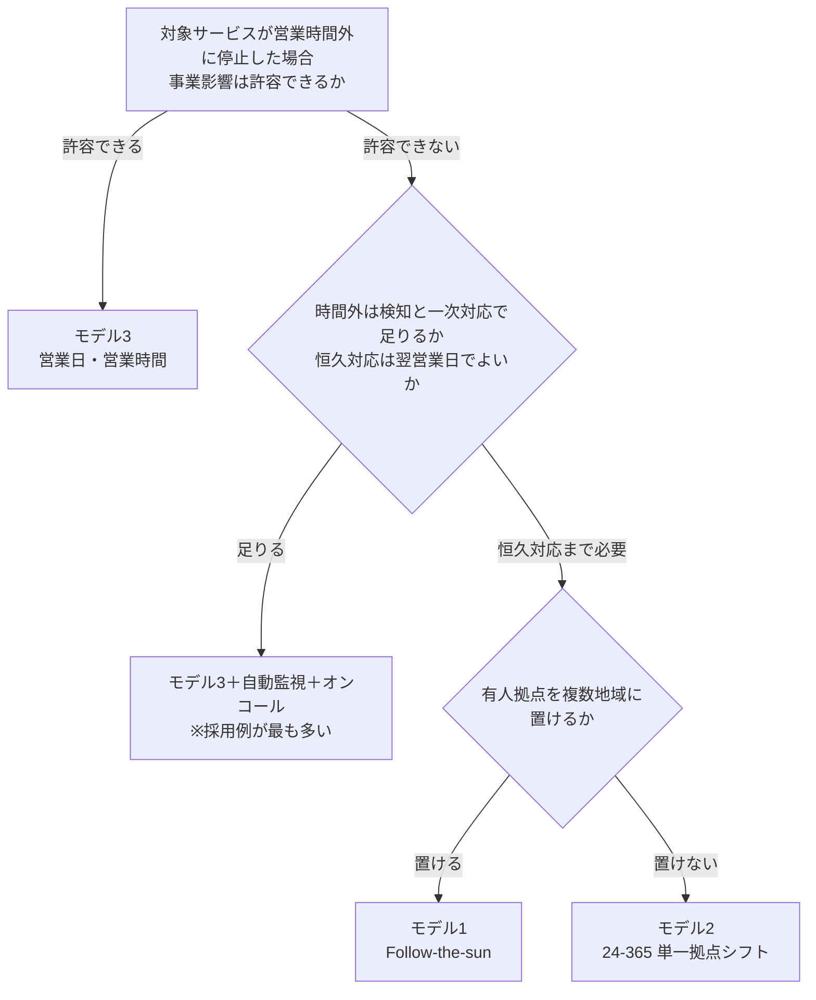
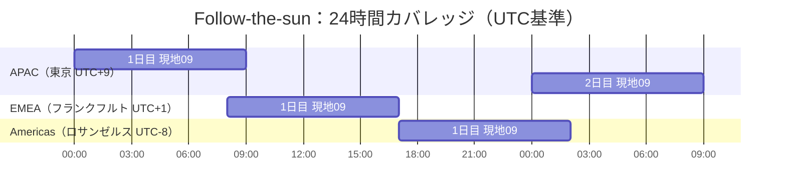

# 付録D：サポート運用体制モデルの比較（Follow-the-sun／24-365／通常営業）

## D.1 この付録の目的と前提

### D.1.1 目的と想定読者

運用保守をベンダーに委託する際、「サポートを何時から何時まで、誰が提供するか」は契約金額と障害時の復旧速度を同時に左右する。本付録は、VMOがベンダー提案を比較・交渉する際の判断材料として、代表的な3つの提供時間モデルを整理する。

- **想定読者**：VMO担当者（ベンダーとの契約条件を設計・交渉する立場）
- **使う場面**：新規調達時のRFP要件定義、契約更新時の現行体制の妥当性検証、ベンダー提案の比較評価

<br>

### D.1.2 本付録の前提

本付録の記述を検証・再計算できるよう、前提を先に明示する。数値の算定根拠は [D.8](#d8-本付録で用いた前提値と算定根拠レビュー用) に一覧で示す。

| 項目 | 本付録での扱い |
|------|----------------|
| 時刻の基準 | すべて **UTC** を併記する。読者が自拠点のオフセットを足して検算できるようにするため（JST = UTC+9、日本にサマータイムはない） |
| サマータイム（DST） | 特記なき場合は**標準時（冬時間）**で記載。欧州・米州はDST期間中に現地時刻が1時間ずれる |
| 対象範囲 | **有人サポートの提供時間**。システムの自動監視・自動通知はこれとは別に定義でき、両者を混同しない |
| 適用階層 | L1〜L4のサポート階層（受付／標準復旧／恒久対応／製品ベンダー）のいずれにも適用できる。**階層ごとに別のモデルを選んでよい**（[D.6.3](#d63-現実解は階層ごとの組み合わせ)） |
| コスト | 地域・単価で絶対額が大きく変わるため、「高い／安い」ではなく**コストドライバ（何が費用を決めるか）**で比較する |
| 適用外 | 特定ベンダー・特定製品の体制、要員の雇用形態の是非、個別の単価水準 |

<br>

---

## D.2 3モデルの全体像

### D.2.1 モデルの定義

3モデルの違いは「24時間カバレッジを作るか」「作るなら地域分散で作るか、単一拠点のシフトで作るか」の2択に整理できる。

| モデル | 24時間の作り方 | 引き継ぎの性質 | 拠点数 |
|--------|----------------|----------------|--------|
| **1. Follow-the-sun** | 時差のある複数拠点が、各拠点の日中帯だけ稼働してリレーする | 拠点間（言語・文化・組織が異なる） | 3拠点前後 |
| **2. 24-365（単一拠点シフト制）** | 1拠点内で交代勤務を組み、深夜帯も同じチームが担当する | 同一チーム内（同一言語・同一手順） | 1〜2拠点 |
| **3. 通常の営業日・営業時間** | 24時間カバレッジを作らない。時間外は無対応、または監視／オンコールで補完する | 原則発生させない | 1拠点 |

> **表記について**：本書では「24-365」を24時間365日体制の略記として用いる。Follow-the-sunも結果として24時間をカバーするため、「24時間対応か否か」ではなく**「単一拠点シフトか、地域分散リレーか」**が両者の区別である。

<br>

### D.2.2 選定の分岐



<br>

---

## D.3 モデル1：Follow-the-sun（複数拠点リレー）

### D.3.1 仕組み

時差のある複数拠点に運用チームを置き、各拠点は現地の日中帯のみ稼働する。ある拠点の終業時に未解決の案件を次の拠点へ引き継ぐことで、**どの拠点にも深夜勤務を発生させずに**24時間カバレッジを作る。

<br>

### D.3.2 稼働時間の設計（UTC基準）

**設計ルール**：拠点数 × 1拠点あたりの稼働時間 ≧ 24時間 ＋ 引き継ぎ重複時間の合計。
3拠点 × 9時間 = 27時間のため、24時間を埋めたうえで重複に使える余裕は**合計3時間**しかない。

**設計例（隙間が生じない組み合わせ）**

| 拠点 | 標準時オフセット | 現地稼働時間 | UTC | JST |
|------|-----------------|-------------|-----|-----|
| APAC（東京） | UTC+9 | 09:00-18:00 | 00:00-09:00 | 09:00-18:00 |
| EMEA（フランクフルト） | UTC+1 | 09:00-18:00 | 08:00-17:00 | 17:00-翌02:00 |
| Americas（ロサンゼルス） | UTC-8 | 09:00-18:00 | 17:00-翌02:00 | 翌02:00-11:00 |

**カバレッジの検算（UTC・1日）**

| UTC時間帯 | 00:00-02:00 | 02:00-08:00 | 08:00-09:00 | 09:00-17:00 | 17:00-24:00 |
|-----------|-------------|-------------|-------------|-------------|-------------|
| 稼働拠点 | APAC＋Americas | APAC | APAC＋EMEA | EMEA | Americas |
| 状態 | 重複2時間 | 単独 | 重複1時間 | 単独 | 単独 |



<br>

**設計上の注意（この例でも残る問題）**

- **EMEA→Americasの重複が0時間**（UTC 17:00でちょうど接続）。引き継ぎ時間を確保するには、Americas拠点の始業を現地08:00に前倒しする、または引き継ぎを口頭ではなく記録ベースの非同期方式にする必要がある。
- 重複が「APAC-Americasに2時間、APAC-EMEAに1時間、EMEA-Americasに0時間」と**偏在する**。均等にはならない。

<br>

### D.3.3 拠点の組み合わせによっては空白が生じる

3拠点が経度上でほぼ等間隔（時差8時間ずつ）でないと、カバレッジに**空白**または**過剰な重複**が生じる。

**空白が生じる例：東京・ロンドン・ニューヨーク**

| 拠点 | 標準時オフセット | 現地稼働時間 | UTC |
|------|-----------------|-------------|-----|
| 東京 | UTC+9 | 09:00-18:00 | 00:00-09:00 |
| ロンドン | UTC+0 | 09:00-18:00 | 09:00-18:00 |
| ニューヨーク | UTC-5 | 09:00-18:00 | 14:00-23:00 |

- **UTC 23:00-24:00（JST 08:00-09:00）が無人**になる。
- 一方でUTC 14:00-18:00の4時間はロンドンとニューヨークが重複しており、余裕がそこに偏っている。
- 原因は時差の不均等（東京-ロンドン9時間、ロンドン-ニューヨーク5時間、ニューヨーク-東京10時間）。

**確認手順**：候補拠点の現地稼働時間をUTCに換算し、24時間分を並べて空白の有無を確認する。空白が出る場合は、①拠点を入れ替える、②いずれかの拠点の稼働時間をずらす、③空白帯をオンコールで補う、のいずれかを契約前に決める。

<br>

### D.3.4 成立条件と典型的な失敗

**成立条件**

- 拠点間で**同一のチケットシステム・ナレッジベース・手順書**を使っている（別々だと引き継ぎが成立しない）
- 引き継ぎ時の記録項目が標準化されている（事象、実施済みの切り分け、次のアクション、顧客への連絡状況）
- 拠点間の共通言語（通常は英語）で記録が書かれている

**典型的な失敗**

- 引き継ぎ記録が薄く、次の拠点が調査をやり直す（実質的な対応時間が伸び、SLAは達成しているのに復旧が遅い状態になる）
- 拠点間でスキル差が生じ、特定の時間帯だけ解決率が低下する
- 拠点間の同期会議が全拠点にとって業務時間内に収まる時間帯は存在しない。会議に依存した運用設計は破綻するため、非同期の記録引き継ぎを前提に設計する

<br>

---

## D.4 モデル2：24-365（単一拠点シフト制）

### D.4.1 仕組みとシフト編成例

単一または少数の拠点内で交代勤務を組み、地域をまたぐ引き継ぎを発生させずに24時間365日のカバレッジを維持する。

| シフト | 時間帯（JST） | 主な役割 |
|--------|--------------|----------|
| 早番 | 06:00-14:00 | 夜間発生事象の確認、日中対応への引き継ぎ |
| 日勤 | 14:00-22:00 | 通常問い合わせ対応、ベンダー折衝 |
| 夜勤 | 22:00-06:00 | 監視、一次対応、緊急エスカレーション |

> 上記は8時間×3交代（重複なし）の例。引き継ぎ時間を確保する場合は各シフトを8.5〜9時間とし、30〜60分の重複を設けるのが一般的である。**引き継ぎ回数はFollow-the-sunと同じ1日3回**であり、違いは回数ではなく「同一チーム・同一言語で引き継げる」点にある。

<br>

### D.4.2 必要要員数の考え方

1つのポジション（常時1名）を24時間365日埋めるために必要な要員数は、次の式で概算できる。

```
年間の所要時間 = 24時間 × 365日 = 8,760時間
1人あたり年間実働可能時間 ≒ 1,700〜1,800時間
　（所定 8時間 × 年間所定労働日数 約245日 = 約1,960時間 から、
　　年次有給休暇・研修・欠勤等を控除した概算）

必要要員 = 8,760 ÷ 1,700〜1,800 ≒ 4.9〜5.2人
```

- **常時1名体制でも、最低5名（余裕を見て5〜6名）が必要**になる。急な欠員に備えるバックアップを含めるとさらに増える。
- 夜勤帯（8時間）だけを外部委託・オンコールに切り出す場合の所要は 8時間 × 365日 = 2,920時間 ÷ 1,700〜1,800 ≒ **1.7〜1.8人**。
- 上記の「1,700〜1,800時間」は自社またはベンダーの所定労働日数・有給取得率で置き換えて再計算すること。この値が変われば必要人数も変わる。

**VMOの確認事項**：ベンダー提案の要員数がこの計算と整合しているか。整合しない場合、①バックアップ要員がいない、②複数顧客との兼務、③実際にはオンコールで代替している、のいずれかである可能性が高い。

<br>

### D.4.3 労務面の制約

| 論点 | 内容 | 注意点 |
|------|------|--------|
| 深夜割増賃金 | 日本では22:00-翌05:00の労働に25%以上の割増（労働基準法第37条）。時間外かつ深夜の場合は50%以上 | 委託料に転嫁されるため、単価内訳の開示を求める |
| 勤務間インターバル | 日本では**努力義務**（労働時間等設定改善法）であり、義務ではない。EU域内の拠点は労働時間指令により連続11時間の付与が**義務** | 拠点の所在国により制約の強さが異なる |
| シフト設計 | 36協定、変形労働時間制の設計が前提となる | ベンダー側の体制であっても、破綻すればカバレッジが落ちる |

<br>

### D.4.4 典型的な失敗

- 夜勤要員の離職・欠員が直接カバレッジの穴になる（少人数拠点ほど影響が大きい）
- 夜勤帯の対応範囲が実質「監視と一次受付のみ」に縮退し、名目上の24時間対応と実態が乖離する
- 夜勤帯の実対応件数が少ないためスキルが維持されず、実際の重大障害時に機能しない

<br>

---

## D.5 モデル3：通常の営業日・営業時間

### D.5.1 仕組み

平日日中（例：JST 09:00-18:00）のみサポートを提供する。時間外の扱いは3通りあり、**どれを選ぶかを契約で明示する必要がある**。

| 区分 | 時間帯 | 対応内容 |
|------|--------|----------|
| 通常対応 | 平日 09:00-18:00 | 問い合わせ・障害対応・ベンダー折衝すべて |
| 時間外 | 平日夜間・土日祝 | 下記3案のいずれか |

**時間外の3つの選択肢**

| 案 | 内容 | 費用の性質 |
|----|------|-----------|
| ① 完全に対応なし | 翌営業日の受付・対応 | 追加費用なし |
| ② 自動監視＋通知のみ | 検知と通知は24時間、人の対応は翌営業日 | 監視ツール費用 |
| ③ オンコール | 待機要員が呼び出しに応じて一次対応 | 待機料（固定）＋呼出料（従量） |

<br>

### D.5.2 最重要論点：SLAの時計をどう数えるか

このモデルで最も認識齟齬が起きるのが、**SLAの経過時間を暦時間で数えるか、営業時間換算で数えるか**である。

| 前提 | 金曜17:00に発生した「4時間以内解決」案件の期限 |
|------|---------------------------------------------|
| 暦時間で計測 | 金曜21:00（時間外だが期限は進行する） |
| 営業時間換算で計測 | 翌週月曜12:00（金曜17:00-18:00で1時間消化、残3時間は月曜09:00から） |

同じ「4時間」でも期限は**約3日ずれる**。契約書に計測方式と時計の停止条件（顧客回答待ち、ベンダー起因でない待機など）を明記しない限り、SLA未達の判定そのものが成立しない。

<br>

### D.5.3 適する対象と失敗

- **適する**：社内業務システムなど、時間外の停止が事業に直結しない対象。夜間バッチが失敗しても翌営業日の復旧で業務が回るもの。
- **失敗**：海外拠点のユーザーを抱えている場合、時差により相手方の業務時間の大半が「時間外」になる。カバレッジは満たしていても実用にならない。

<br>

---

## D.6 3モデルの比較

### D.6.1 比較表

| 比較項目 | Follow-the-sun | 24-365（シフト制） | 通常の営業日・営業時間 |
|----------|----------------|---------------------|------------------------|
| カバレッジ | 24時間（拠点リレー） | 24時間365日（同一拠点シフト） | 平日日中のみ（＋任意でオンコール） |
| 引き継ぎ回数 | 1日3回 | 1日3回 | 原則なし |
| 引き継ぎの性質 | 拠点間。言語・文化・組織が異なり、記録が唯一の伝達手段 | 同一チーム内。同一言語・同一手順で口頭補足が可能 | 時間外に発生させない |
| 深夜勤務 | 発生しない（各拠点は日中帯のみ） | 発生する | 発生しない |
| 品質の一貫性 | 拠点間でナレッジ差・解決率差が生じやすい | 保ちやすい（ただし夜勤帯のスキル維持が課題） | 保ちやすい（対応時間内に限る） |
| 人材確保の難易度 | 高（複数拠点・複数言語でのチーム編成） | 中〜高（夜勤要員の確保と定着） | 低 |
| SLA対応力 | 24時間対応可能 | 24時間対応可能 | 時間外は翌営業日対応。時計の計測方式の定義が必須 |
| 主な失敗モード | 引き継ぎ記録の劣化による調査のやり直し・たらい回し | 夜勤要員の欠員によるカバレッジの穴、夜勤帯の対応範囲の縮退 | 時間外の重大障害で復旧が翌営業日まで遅延 |
| 向いている対象 | グローバル利用のミッションクリティカルシステム | 単一拠点・単一タイムゾーン運用で24時間監視が必要な基幹システム | 社内業務システムなど優先度が中程度以下のサービス |

<br>

### D.6.2 コスト構造の比較

コストの絶対水準は拠点の人件費単価に大きく依存するため、「Follow-the-sunが高い」と一律に言うことはできない。判断はコストドライバで行う。

| モデル | コストドライバ | 増減の効きどころ |
|--------|---------------|-----------------|
| Follow-the-sun | **拠点数 × 各拠点の最低要員数**。深夜割増は原則発生しない。加えて多拠点のマネジメント、ツール統一、共通手順の整備コスト | 拠点を1つ増やすと最低要員数がまるごと1拠点分増える。単価の低い地域を使えば総額は下がりうる |
| 24-365 | **深夜・休日割増賃金**、夜勤要員の採用・定着コスト、欠員時のバックアップ要員。拠点は1つで済む | 1ポジションあたり約5名（[D.4.2](#d42-必要要員数の考え方)）が下限。割増率が総額に直結する |
| 通常の営業日・営業時間 | 基本の人件費のみ。オンコールを付ける場合は**待機料（固定）＋呼出料（従量）** | 呼出頻度が上がると従量分が膨らみ、24-365との差が縮まる |

**VMOへの示唆**：オンコールの呼出実績が月に何度も発生している場合、実質的に24時間体制を割高な従量課金で買っている状態である。呼出実績を根拠に24-365への切り替えを交渉できる。

<br>

### D.6.3 現実解は階層ごとの組み合わせ

3モデルは排他ではない。サポート階層（L1〜L4）ごとに異なるモデルを選ぶ構成が、実務上もっとも多く採用される。

> **補足**：L1〜L4という階層区分は業界で広く使われる実務上の慣行であり、ITILなどの標準フレームワークが定義する用語ではない。各階層の範囲は自組織で定義する必要がある。

| 階層 | 担当 | 提供時間モデルの例 |
|------|------|-------------------|
| L1（受付・一次切り分け） | 社内ヘルプデスク／BPOベンダー | 24-365、またはFollow-the-sun |
| L2（標準復旧） | 運用ベンダー | 営業時間＋時間外オンコール |
| L3（コード修正・設計変更） | 開発ベンダー | 営業時間のみ |
| L4（製品バグ） | 製品ベンダー | 製品ベンダーのサポート契約に従う |

この構成では、**時間外に「受付はできるが恒久対応はできない」時間帯が生じる**。その時間帯に何ができて何ができないかを、サービスオーナーと事前に合意しておく必要がある。

<br>

---

## D.7 選定の進め方

### D.7.1 判断材料と確認方法

| # | 判断材料 | 何を見るか／誰に確認するか |
|---|---------|--------------------------|
| 1 | 時間外停止の事業影響 | サービスオーナー・事業部門への確認。過去インシデントの**発生時刻の分布**（実際に時間外に何件起きているか） |
| 2 | SLAの対応時間要件 | 既存契約のSLA条項、ITサービスマネジャー。要件が「24時間」なのか「重大障害のみ24時間」なのかを切り分ける |
| 3 | ユーザー・拠点の地理的分散 | 利用者の所在拠点と、実際の利用時間帯の実績データ |
| 4 | 予算制約 | 財務部門。現行の運用委託費との差分で提示する |
| 5 | 要員確保の実現可能性 | ベンダー提案の拠点・要員数・夜勤体制の実績。[D.4.2](#d42-必要要員数の考え方)の計算と整合するかを検証する |

**段階移行**：初期は「営業時間モデル＋重大障害時のみオンコール」で開始し、呼出実績とインシデント発生時刻の分布を根拠に、24-365やFollow-the-sunへ段階的に移行する設計が有効である。実績データなしに最初から24時間体制を契約すると、根拠のないコストを固定化しやすい。

<br>

### D.7.2 契約・SLAで必ず定義する事項

| 論点 | 定義しないと起きること |
|------|----------------------|
| サポート提供時間（開始・終了・タイムゾーン・祝日の扱い） | 年末年始や拠点所在国の祝日に無人になる |
| SLA時計の計測方式（暦時間／営業時間換算）と停止条件 | 時間外に発生した案件の期限解釈が食い違う（[D.5.2](#d52-最重要論点slaの時計をどう数えるか)） |
| 時間外の受付手段と「一次応答」の定義 | 自動応答メールをもって「応答済み」と扱われる |
| 引き継ぎの実施方法と記録の必須項目 | 拠点・シフトを跨いだ調査のやり直しが発生する |
| 拠点構成・要員体制の開示と、変更時の事前通知義務 | 無断でのオフショア切替や要員削減により品質が低下する |
| 深夜・休日対応、オンコール待機・呼出の料金体系 | 請求段階で想定外の追加費用が発生する |
| カバレッジ実績の月次報告（実稼働時間、無人時間帯の有無、時間帯別の受付・解決件数） | モデルが機能しているかを検証できず、更新交渉の根拠を持てない |

VMOは契約更新や新規ベンダー選定のタイミングで、上記に照らして現行モデルの妥当性を定期的に見直す。

<br>

---

## D.8 本付録で用いた前提値と算定根拠（レビュー用）

| 項目 | 本付録での値 | 根拠・算出方法 | 変わりうる条件 |
|------|-------------|---------------|---------------|
| タイムゾーンオフセット | JST +9／CET +1／GMT ±0／EST −5／PST −8 | 各地域の標準時（冬時間） | DST期間中は欧州・米州が+1時間ずれる |
| DSTの切替時期 | 米国：3月第2日曜〜11月第1日曜／EU：3月最終日曜〜10月最終日曜 | 各制度の規定 | 切替日が米欧で異なるため、**日本との時差は年4回変化する**。制度自体の改正もありうる |
| 24時間365日の年間所要時間 | 8,760時間 | 24 × 365 | 閏年は8,784時間 |
| 1人あたり年間実働可能時間 | 1,700〜1,800時間 | 所定8時間 × 年間所定労働日数 約245日 ≒ 1,960時間から、年次有給・研修・欠勤等を控除した概算 | 自社／ベンダーの所定労働日数・有給取得率により変動 |
| 1ポジションあたり必要要員 | 約5名（4.9〜5.2名） | 8,760 ÷ 1,700〜1,800 | 上記2値に依存。バックアップ要員を含めるとさらに増える |
| 深夜割増賃金 | 22:00-翌05:00に25%以上（時間外と重複時は50%以上） | 労働基準法第37条 | 国外拠点は各国法令による |
| 勤務間インターバル | 日本：努力義務／EU：連続11時間の義務 | 労働時間等設定改善法／EU労働時間指令 | 制度改正の可能性あり |
| Follow-the-sunの3拠点構成 | 東京 UTC+9／フランクフルト UTC+1／ロサンゼルス UTC−8 | 時差がほぼ均等になる組み合わせとして選定 | 拠点を変えるとカバレッジの空白・重複が変化する（[D.3.3](#d33-拠点の組み合わせによっては空白が生じる)） |

<br>

**レビュー時に特に確認いただきたい点**

1. **[D.3.2](#d32-稼働時間の設計utc基準)・[D.3.3](#d33-拠点の組み合わせによっては空白が生じる)の時刻換算**：現地時刻→UTCの換算と、カバレッジの空白・重複の有無
2. **[D.4.2](#d42-必要要員数の考え方)の要員数**：前提値（年間実働1,700〜1,800時間）が自社および委託先の実態と合っているか
3. **[D.7.2](#d72-契約slaで必ず定義する事項)の契約定義事項**：過去に実際のトラブルになった論点で、表から漏れているものがないか
