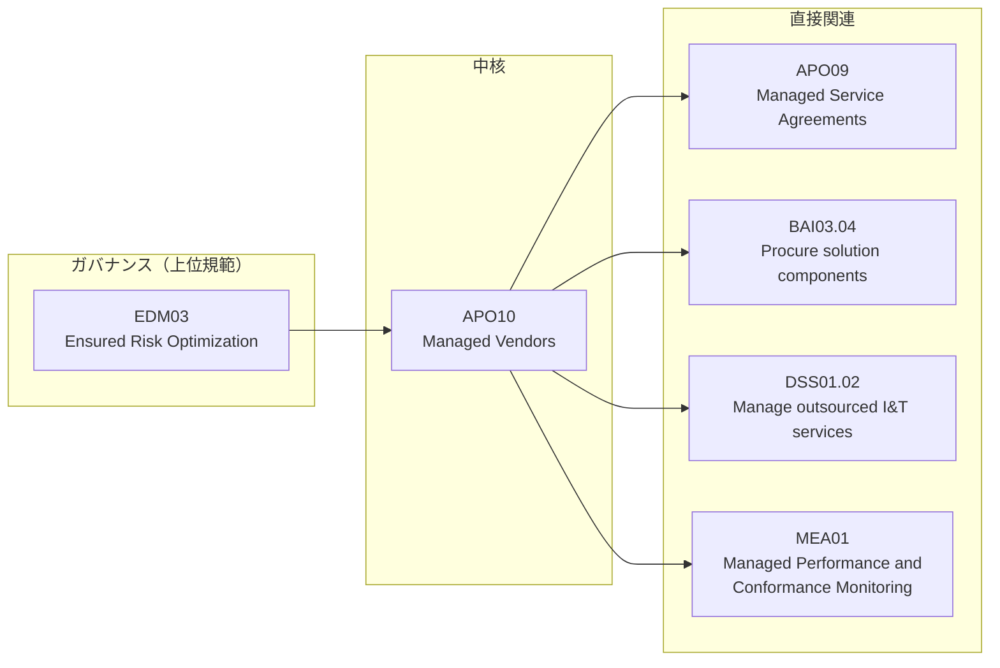

# 付録E：VMOの業務とCOBIT 2019フレームワークの対応

## E.1 本付録の目的と読み方

### E.1.1 目的と想定読者

本付録は、COBIT 2019においてベンダーマネジメントがどの目標・プラクティスとして定義されているかを整理し、**COBITにおけるベンダーマネジメントの正しい理解を身につけること**を目的とする。単独で参照できるリファレンスとして構成している。

- **想定読者**：VMO担当者に限らず、IT組織内でガバナンス議論に関わるメンバー全般
- **使う場面**：監査・内部統制部門との議論、ガバナンス報告での用語合わせ、VMO業務の位置づけ説明

 

### E.1.2 先に押さえるべき3つの前提

以降を読む前に、COBITについて誤解されやすい点を確認する。ここを取り違えると、対応表を正しく読めない。

| # | 前提 | よくある誤解 |
|---|------|-------------|
| 1 | COBITは**「何を達成すべきか」を示す枠組み**であり、手順書ではない | 「COBITに従えば調達手順が決まる」…決まらない。具体的な手順・様式・帳票は各組織が設計する |
| 2 | COBIT 2019に**「VMO」という役割・組織は定義されていない** | 「COBITがVMOの設置を求めている」…求めていない。VMOはガバナンスシステムの構成要素「組織構造」の一実装形態（[E.3.2](#e32-cobitにおけるvmoの位置づけ)） |
| 3 | COBITに**組織の認証制度はない** | 「COBIT認証を取得する」…組織としての認証制度は存在しない。個人向けの資格認定（COBIT Foundation等）はある |

 

---

## E.2 COBIT 2019の基礎知識

### E.2.1 ガバナンスとマネジメントの区別

COBIT 2019は、ガバナンスとマネジメントを明確に区別する。

| 区分 | 主体 | 行うこと | 該当ドメイン |
|------|------|---------|-------------|
| ガバナンス | 取締役会・経営層 | 評価（Evaluate）・方向付け（Direct）・モニタリング（Monitor） | EDM |
| マネジメント | CEO以下の経営陣・実務部門 | 計画（Plan）・構築（Build）・実行（Run）・モニタリング（Monitor） | APO／BAI／DSS／MEA |

VMOの日常業務はマネジメント側（主にAPO）に位置し、その判断基準の上位規範をガバナンス側（EDM）から受け取る、という関係になる。

 

### E.2.2 5ドメイン・40目標の構成

COBIT 2019は、ガバナンス目標とマネジメント目標を合計**40件**、5つのドメインに分類して定義している。

| ドメイン | 正式名称 | 目標数 | 区分 | 主な内容 |
|---|---|---|---|---|
| EDM | Evaluate, Direct and Monitor | 5 | ガバナンス | 取締役会・経営層による評価・指示・モニタリング |
| APO | Align, Plan and Organize | 14 | マネジメント | 戦略・アーキテクチャ・リスク・資源計画 |
| BAI | Build, Acquire and Implement | 11 | マネジメント | ソリューションの構築・調達・導入・変更管理 |
| DSS | Deliver, Service and Support | 6 | マネジメント | 運用・インシデント対応・セキュリティ・継続性 |
| MEA | Monitor, Evaluate and Assess | 4 | マネジメント | パフォーマンス・コンプライアンス・保証 |

 

### E.2.3 目標・プラクティス・活動の3階層（コードの読み方）

COBITの記述は3階層になっている。本付録で「APO10.04」のような表記が出てきたら、**目標の下位にあるプラクティス**を指す。

| 階層 | 表記例 | 内容 | 粒度 |
|------|--------|------|------|
| 目標（Objective） | APO10 | Managed Vendors | 「ベンダーを管理する」という達成目標 |
| プラクティス（Practice） | APO10.04 | Manage vendor risk | 目標を構成する管理活動のまとまり |
| 活動（Activity） | APO10.04配下 | 個別の実施事項 | 実務レベルの行為 |

 

### E.2.4 ガバナンスシステムの7つの構成要素

COBIT 2019は、ガバナンスシステムを7つの構成要素（コンポーネント）で捉える。プロセスだけではガバナンスは成立しない、という考え方である。

| # | 構成要素 |
|---|---------|
| 1 | プロセス |
| 2 | **組織構造** ← VMOはここに該当する |
| 3 | 原則・ポリシー・手続き |
| 4 | 情報 |
| 5 | 文化・倫理・行動 |
| 6 | 人材・スキル・遂行能力 |
| 7 | サービス・インフラストラクチャ・アプリケーション |

 

### E.2.5 デザインファクターと能力レベル

- **デザインファクター**：企業戦略、企業目標、リスクプロファイル、コンプライアンス要件、IT の役割、**ソーシングモデル**、実装手法、技術戦略、企業規模などの要因により、どの目標を優先するかは組織ごとに変わる。**40目標すべてを等しく実装するものではない**。とりわけソーシングモデル（内製／アウトソース／クラウド）はVMOの業務量に直結するデザインファクターである。
- **能力レベル（Capability Level）**：プロセスの達成度を**0〜5の6段階**で評価する。「レベル1〜5の5段階」ではない点に注意。

 

---

## E.3 VMOに関係するCOBIT目標の全体像

### E.3.1 関係する目標の3層分類

VMOに関係する目標は、関与の深さで3層に分けて理解すると整理しやすい。

| 層 | 目標 | VMOとの関係 |
|----|------|-------------|
| ガバナンス | EDM03 Ensured Risk Optimization | 経営層が設定するリスク許容度が、ベンダーリスク判断の上位規範になる |
| **中核** | **APO10 Managed Vendors** | ベンダーの識別・選定・契約管理・リスク管理・パフォーマンス監視の全体 |
| 直接関連 | APO09 Managed Service Agreements | サービス／サービスレベルの定義と合意。VMOのSLA設計はここに接続する |
| 直接関連 | BAI03.04 Procure solution components | 外部からの調達行為そのもの |
| 直接関連 | DSS01.02 Manage outsourced I&T services | 委託した運用サービスの管理 |
| 直接関連 | MEA01 Managed Performance and Conformance Monitoring | 全社的なパフォーマンス監視の枠組み。ベンダーKPIレビューはその一部 |
| 間接関連 | [E.6](#e6-間接的に関係する目標) 参照 | 予算・リスク・セキュリティ・資産・継続性・外部要求への準拠 |

> **注**：SLA・サービスレベルの定義はAPO10ではなく**APO09**の管轄である。ベンダー管理をAPO10だけで説明しようとすると、VMOの主要業務であるSLA設計・交渉の位置づけが欠落する。

 

### E.3.2 COBITにおけるVMOの位置づけ

COBIT 2019のRACIチャートに登場する役割名は、Board、CEO、CIO、CTO、Business Process Owners、Relationship Manager、Head IT Operations、Service Manager、Legal Counsel、Compliance、Audit など既存の職責であり、**「VMO」「Vendor Manager」に相当する役割は定義されていない**。APO10のRACIでもCIOをはじめとする既存の役職に責任が割り当てられている。

したがって、COBITの文脈でVMOを説明する場合は次のように整理するのが正確である。

> VMOは、COBITが定める役割ではなく、**ガバナンスシステムの構成要素「組織構造」の一実装形態**である。COBITがAPO10などの目標として示す「達成すべきこと」を、自社では専任組織に集約して担わせる、という設計判断の結果にあたる。

この整理を持っておくと、「COBITにVMOと書いてあるのか」という監査部門からの問いに正しく答えられる。答えは「書かれていないが、APO10の達成責任を果たすための組織設計として妥当」である。

 

---

## E.4 中核：APO10 Managed Vendors

**目的（Purpose）**：稼働中のI&T能力を最適化してI&T戦略とロードマップを支えるとともに、パフォーマンス未達または非準拠のベンダーに起因するリスクを最小化し、競争力のある価格を確保すること。

> 原文："Optimize available I&T capabilities to support the I&T strategy and road map, minimize the risk associated with nonperforming or noncompliant vendors, and ensure competitive pricing."

APO10は5つのプラクティスで構成される。

| プラクティス | 名称 | 概要 | VMO業務での該当領域 |
|---|---|---|---|
| APO10.01 | Identify and evaluate vendor relationships and contracts | ベンダーを種類・重要度・重大性で識別し、比較評価基準を設け、ベンダー・契約ポートフォリオを定期的にレビューする | ベンダー台帳の作成と管理、ベンダー分類 |
| APO10.02 | Select vendors | RFI/RFPなど公正・正式な調達プロセスにより、要件に最も適したベンダーを評価・選定する | 調達プロセスにおけるベンダー選定 |
| APO10.03 | Manage vendor relationships and contracts | 関係責任者の割当、コミュニケーション手順、契約管理、定期的な有効性レビューによりベンダー関係を正式化する | オンボーディング、関係性・コスト最適化、オフボーディング |
| APO10.04 | Manage vendor risk | ベンダーのサービス提供能力（上流のサプライチェーンや再委託先を含む）に起因する運用リスクを識別・管理する | ベンダーリスク管理とエスカレーション |
| APO10.05 | Monitor vendor performance and compliance | 定期的なパフォーマンスレビューと契約要件への準拠状況の監視を行い、市場・代替ベンダーとの比較で費用対効果を評価する | パフォーマンスモニタリング、ベンダーKPIレビュー |

**読み解きのポイント**：APO10.04は、リスクの範囲に**上流のサプライチェーンや再委託先（4th party）を含む**と明示している。直接の契約相手だけを見ていては、このプラクティスを満たしたことにならない。

 

---

## E.5 直接関連する目標

### E.5.1 APO09：Managed Service Agreements

**目的**：I&Tのプロダクト、サービスおよびサービスレベルが、現在および将来の企業ニーズを満たすようにすること。

> 原文（Purpose）："Ensure that I&T products, services and service levels meet current and future enterprise needs."

| プラクティス | 名称 | VMOとの関係 |
|---|---|---|
| APO09.01 | Identify I&T services | 委託対象となるサービスの特定 |
| APO09.02 | Catalog I&T-enabled services | サービスカタログの整備。ベンダー台帳の「提供サービス」情報と接続する |
| APO09.03 | Define and prepare service agreements | **SLAの定義・作成。VMOのSLA設計・交渉業務の直接の対応先** |
| APO09.04 | Monitor and report service levels | サービスレベルの監視と報告 |
| APO09.05 | Review service agreements and contracts | サービス合意・契約の定期見直し。契約更新判断の根拠となる |

**APO09とAPO10の使い分け**：APO09は「どんなサービスをどの水準で提供するか（サービスの中身）」、APO10は「そのサービスを提供するベンダーをどう管理するか（相手方の管理）」を扱う。SLAの数値設計はAPO09、ベンダーの選定・評価・リスクはAPO10、と切り分けると混乱しない。

 

### E.5.2 EDM03：Ensured Risk Optimization

**目的**：I&Tに関連する企業リスクが企業のリスク選好度・リスク許容度を超えないようにし、I&Tリスクが企業価値に与える影響を識別・管理し、コンプライアンス違反の可能性を最小化すること。

> 原文（Purpose）："Ensure that I&T-related enterprise risk does not exceed the enterprise's risk appetite and risk tolerance, the impact of I&T risk to enterprise value is identified and managed, and the potential for compliance failures is minimized."

| プラクティス | 名称 | 概要 |
|---|---|---|
| EDM03.01 | Evaluate risk management | IT利用が企業にもたらす現在・将来のリスクを継続的に評価し、組織のリスク許容度を見極める |
| EDM03.02 | Direct risk management | リスク許容度の範囲内でITリスクが管理されるよう、方針・アプローチを指示する |
| EDM03.03 | Monitor risk management | リスクマネジメントの主要指標をモニタリングし、逸脱の識別・追跡・是正報告の方法を定める |

**VMOの観点**：EDM03は取締役会・経営層が担うガバナンス目標であり、VMOが実施する目標ではない。VMOにとっての意味は、**APO10.04でベンダーリスクを「許容するか／是正を求めるか」を判断する際の基準が、EDM03で設定されたリスク許容度である**という点にある（この対応づけは本付録の解釈であり、COBITが明文で規定するものではない）。

 

### E.5.3 BAI03：Managed Solutions Identification and Build（特にBAI03.04）

**目的**：企業の戦略目標・業務目標を支える、タイムリーで費用対効果の高いソリューション（技術、業務プロセス、ワークフロー）を確立すること。

BAI03は12のプラクティス（設計・開発・調達・品質保証・テスト・保守など）で構成される大きな目標である。VMOの業務と直接関連するのはそのうち**BAI03.04「Procure solution components」（ソリューションコンポーネントの調達）**に限定される。ハードウェア・ソフトウェア・サービスを外部から調達する際の調達手順や供給元の妥当性確認がここに含まれる。

**APO10.02との違い**：APO10.02はベンダーという相手方の**選定**、BAI03.04は必要なコンポーネントの**調達行為**を扱う。同じRFPの場面でも、「どのベンダーを選ぶか」はAPO10.02、「必要なものを適切に調達したか」はBAI03.04である。

 

### E.5.4 DSS01：Managed Operations（特にDSS01.02）

**目的**：計画通りにI&Tの運用上のプロダクト・サービス成果を提供すること。

> 原文（Purpose）："Deliver I&T operational product and service outcomes as planned."
> 原文（Description）："Coordinate and execute the activities and operational procedures required to deliver internal and outsourced I&T services."

DSS01は5つのプラクティス（DSS01.01〜DSS01.05）で構成されるが、VMOと直接関連するのは**DSS01.02「Manage outsourced I&T services」（委託先I&Tサービスの管理）**である。情報保護とサービス提供の信頼性を維持しながら、外部委託されたITサービスの運用を管理することを指す。クラウド/SaaSや運用保守の委託先管理はここに位置づけられる。

**注**：DSS01の説明文（Description）に「internal and outsourced」と明記されているとおり、COBITは内製と委託を同じ運用管理の枠組みで扱う。委託しているから管理責任が移る、という考え方は取らない。

 

### E.5.5 MEA01：Managed Performance and Conformance Monitoring

**目的**：パフォーマンスと適合性の透明性を提供し、目標達成を推進すること。

> 原文（Purpose）："Provide transparency of performance and conformance and drive achievement of goals."

| プラクティス | 名称 | 概要 |
|---|---|---|
| MEA01.01 | Establish a monitoring approach | 関係者と連携し、モニタリングの目的・範囲・測定方法を定義する |
| MEA01.02 | Set performance and conformance targets | パフォーマンス・準拠目標を設定し、測定システムに組み込んでレビュー・承認する |
| MEA01.03 | Collect and process performance and conformance data | 合意された指標を測定するため、タイムリーかつ正確なデータを収集・処理する |
| MEA01.04 | Analyze and report performance | 目標に対する実績を定期的にレビューし、I&Tパフォーマンス全体を俯瞰できる形で報告する |
| MEA01.05 | Ensure the implementation of corrective actions | 識別された異常に対する是正措置の特定・着手・追跡を関係者とともに進める |

**APO10.05との違い**：APO10.05は**個々のベンダー**のパフォーマンス・準拠を監視する。MEA01は**全社的なパフォーマンス監視の仕組み**そのものを扱う。VMOのベンダーKPIレビューは、APO10.05の実施であると同時に、MEA01が定める全社の測定・報告体系に組み込まれるべきもの、という二重の位置づけになる。

 

---

## E.6 間接的に関係する目標

以下はVMOが単独で責任を負う目標ではないが、ベンダー管理の実務で必ず接点が生じる。担当部門との連携先を把握する目的で一覧化する。

| 目標 | 名称 | VMOとの接点 |
|---|---|---|
| APO06 | Managed Budget and Costs | ベンダー支出の予算管理・コスト配賦、コスト最適化 |
| APO07 | Managed Human Resources | 委託先要員・契約要員の管理（要員体制、固定メンバー制の要求など） |
| APO08 | Managed Relationships | 事業部門との関係管理。ベンダー選定時の要件把握の前提 |
| APO12 | Managed Risk | 全社のI&Tリスク管理。ベンダーリスク（APO10.04）はその一部として集約される |
| APO13／DSS05 | Managed Security／Managed Security Services | ベンダーのセキュリティ要件、監査権、データ保護条項 |
| BAI09 | Managed Assets | ソフトウェアライセンス・保守契約の資産管理。契約情報との突合 |
| DSS04 | Managed Continuity | ベンダーのBCP・可用性要件（SLA設計の前提） |
| MEA03 | Managed Compliance With External Requirements | 委託に関わる法令・規制要件への準拠（個人情報保護、越境データ移転など） |
| MEA04 | Managed Assurance | 内部監査・第三者保証（SOC 2報告書の提出要求など） |

 

---

## E.7 VMO業務とCOBITプラクティスの対応表（まとめ）

| VMOの業務領域 | 対応するCOBIT 2019プラクティス／目標 |
|---|---|
| 調達プロセス（RFI/RFP、選定、契約締結） | APO10.02（ベンダー選定）、BAI03.04（ソリューションコンポーネントの調達） |
| ベンダー台帳の作成と管理、ベンダー分類 | APO10.01（ベンダー関係・契約の識別と評価）、APO09.02（サービスカタログ） |
| オンボーディング | APO10.03（ベンダー関係・契約の管理） |
| パフォーマンス／リスクのモニタリング | APO10.05（ベンダーパフォーマンス・準拠の監視）、APO09.04（サービスレベルの監視・報告）、MEA01 |
| 関係性の維持・コスト最適化 | APO10.03（ベンダー関係・契約の管理）、APO06（予算・コスト管理） |
| ベンダーリスク管理とエスカレーション | APO10.04（ベンダーリスクの管理）、EDM03（リスク最適化の確保）、APO12（リスク管理） |
| オフボーディング（契約終了・移行） | APO10.01（契約ポートフォリオの更新）、APO10.03（契約管理）、APO09.05（サービス合意・契約の見直し） |
| クラウド/SaaS・運用保守の委託先管理 | DSS01.02（委託先I&Tサービスの管理）、APO13／DSS05（セキュリティ）、MEA04（保証） |
| SLAの設計・交渉 | **APO09.03（サービス合意の定義・作成）**、APO09.04、DSS04（継続性） |
| ベンダーKPIの設定とレビュー | APO10.05、MEA01（パフォーマンス・準拠モニタリング） |

 

---

## E.8 補足：COBIT 5からの主な変更点

旧版の資料や社内文書がCOBIT 5に基づいている場合があるため、差分を把握しておく。

| 論点 | COBIT 5 | COBIT 2019 |
|------|---------|-----------|
| 総数 | 37プロセス | **40のガバナンス／マネジメント目標** |
| ベンダー管理の名称 | APO10 Manage Suppliers（サプライヤ管理） | **APO10 Managed Vendors（ベンダー管理）** |
| 追加された目標 | — | APO14 Managed Data、BAI11 Managed Projects、MEA04 Managed Assurance |
| 呼称 | プロセス／イネーブラー | 目標／ガバナンスシステムの構成要素 |
| カスタマイズ | 一般的なガイダンス | **デザインファクター**による優先順位付けを明示 |

**今後の予定**：ISACAは2026年内にCOBITの更新を予定しており、コンテンツの多くをデジタル形式で提供すること、ギャップ特定のための柔軟なアセスメントモジュールを追加することを公表している。本付録の記述は更新後に再確認が必要である。

 

---

## E.9 出典

### E.9.1 一次情報（正式な定義はここを参照）

COBITの目標名・目的文・プラクティス名の正式な定義は、ISACAが刊行する以下の公式資料に拠る。本付録の記述と齟齬がある場合は、常に公式資料が優先する。

| 資料 | 内容 |
|------|------|
| ISACA『COBIT 2019 Framework: Introduction and Methodology』 | フレームワークの構造・原則・ガバナンスシステムの構成要素 |
| ISACA『COBIT 2019 Framework: Governance and Management Objectives』 | 40目標の説明文・目的文・プラクティス・活動・RACIチャート |
| ISACA『COBIT 2019 Design Guide』 | デザインファクターによるガバナンスシステムの設計 |
| ISACA『COBIT 2019 Implementation Guide』 | 導入・改善の進め方 |

- ISACA公式リソースページ：https://www.isaca.org/resources/cobit

**日本語での理解の補助**：
- ISACA東京支部 基準委員会「COBIT 2019の概要」（2019年10月28日）— https://www.isaca.gr.jp/standard/img/cobit_20191028.pdf

 

### E.9.2 本付録の記述と参照元の対応

| 本付録の記述 | 参照元 |
|---|---|
| 5ドメイン・40目標の構成、40目標の名称一覧（[E.2.2](#e22-5ドメイン40目標の構成)／[E.6](#e6-間接的に関係する目標)） | ISACA公式リソースページ／SecPortal "COBIT 2019 Explained: IT Governance for Cybersecurity" — https://secportal.io/frameworks/cobit-2019 |
| ガバナンスとマネジメントの区別、7つの構成要素、デザインファクター、能力レベル0〜5（[E.2.1](#e21-ガバナンスとマネジメントの区別)／[E.2.4](#e24-ガバナンスシステムの7つの構成要素)／[E.2.5](#e25-デザインファクターと能力レベル)） | ISACA東京支部「COBIT 2019の概要」／ISACA "COBIT Design Factors" — https://www.isaca.org/resources/news-and-trends/industry-news/2019/cobit-design-factors |
| COBIT 2019のRACIに登場する役割名一覧、VMOに相当する役割が存在しないこと（[E.3.2](#e32-cobitにおけるvmoの位置づけ)） | COBIT 2019 RACI by Role（公開されている役割別RACI一覧）に基づき確認 |
| APO09の目的文・プラクティス一覧（[E.5.1](#e51-apo09managed-service-agreements)） | Process-Symphony COBIT2019 wiki — https://wiki.process-symphony.com.au/framework/lifecycle/process/service-agreements-management-apo09-cobit2019/ |
| BAI03の目的・プラクティス数（12件）（[E.5.3](#e53-bai03managed-solutions-identification-and-build特にbai0304)） | Process-Symphony COBIT2019 wiki — https://wiki.process-symphony.com.au/framework/lifecycle/process/solution-identification-and-build-management-bai03-cobit2019/ |
| DSS01の説明文・目的文・プラクティス一覧（[E.5.4](#e54-dss01managed-operations特にdss0102)） | 公開されているCOBIT 2019 DSSドメイン抜粋により確認 |
| EDM03・APO10・MEA01の目的文とプラクティス一覧（[E.4](#e4-中核apo10-managed-vendors)／[E.5.2](#e52-edm03ensured-risk-optimization)／[E.5.5](#e55-mea01managed-performance-and-conformance-monitoring)） | 複数の公開資料で原文表現を相互確認。**正式な定義はISACA公式刊行物で要確認** |
| COBIT 5からの変更点、2026年の更新予定（[E.8](#e8-補足cobit-5からの主な変更点)） | ISACA "Celebrating Three Decades of COBIT"（@ISACA 2026 Volume 8）— https://www.isaca.org/resources/news-and-trends/newsletters/atisaca/2026/volume-8/celebrating-three-decades-of-cobit |
| VMO業務領域との対応づけ（[E.7](#e7-vmo業務とcobitプラクティスの対応表まとめ)）、E.5.2のリスク許容度の解釈 | **本付録の解釈**。COBITが明文で規定するものではない |

 

### E.9.3 出典の扱いに関する注記

- 本付録は、**文書共有サイト等に掲載されたISACA刊行物の非公式な複製物を出典として掲載しない**方針をとる。内容確認の過程で参照した場合も、出典としては公式資料および出所の明らかな解説資料を挙げている。
- 原文（英文）の引用は、目標・プラクティスを一意に同定するために必要な範囲にとどめている。
- COBIT® はISACAの登録商標であり、フレームワークの著作権はISACAに帰属する。

**最終確認日**：2026年9月5日
