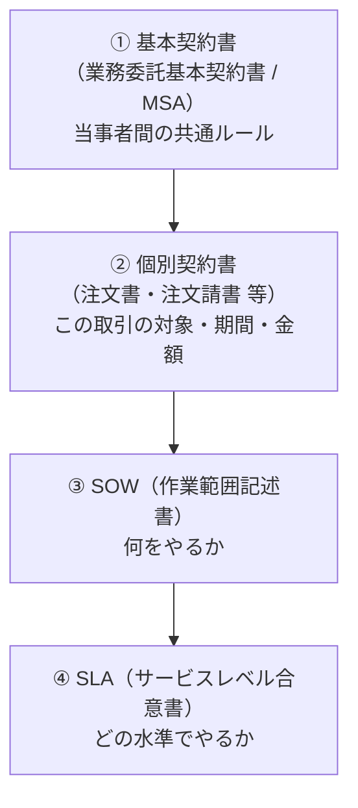

# 付録F：SOWとSLA ― 運用保守委託の契約文書の構造

## F.1 本付録の位置づけ

運用保守の委託契約で「SLAをどう決めるか」から議論を始めると、ほぼ必ず失敗する。SLAは単独では成立せず、**SOW（作業範囲記述書）で定義された業務に対してのみ設定できる**からである。本付録は、契約文書の構造の中でSLAがどこに位置づくかを整理したうえで、SOWとSLAそれぞれの設計と、両者の整合性の点検方法を扱う。

- **想定読者**：運用保守の委託契約を設計・交渉・点検する担当者
- **使い方**：ベンダー提案の点検、RFPへの要求事項の記載、契約締結前の最終確認
- **注意**：本付録の数値・条項例はいずれも**設計の出発点**であり、そのまま使うものではない。法的有効性については必ず法務部門の確認を得ること。データ保護・セキュリティの契約要件は付録Gで扱う。
- 単独で参照できるリファレンスとして構成している。

 

---

## F.2 契約文書の構造

### F.2.1 4つの層

運用保守の委託契約は、通常4つの層で構成される。層ごとに書かれている内容と、変更の重さが異なる。

| 層 | 主に書かれること | 変更の重さ |
|---|---|---|
| ① 基本契約書 | 契約期間、秘密保持、知的財産、責任制限、損害賠償、再委託、解除、準拠法・管轄 | 重い。法務の関与が必須で、変更に時間がかかる |
| ② 個別契約書 | 対象業務の名称、契約期間、契約金額、支払条件 | 中。更新のたびに見直す |
| ③ SOW | 対象範囲、業務一覧と役割分担、除外事項、前提条件、成果物、体制、作業時間、変更管理 | 中。**実務上いちばん交渉の余地がある層** |
| ④ SLA | サービスレベル項目、目標値、測定方法、報告、未達時の措置 | 軽〜中。見直し条項を入れておけば期中でも改定できる |

 

### F.2.2 SOWとSLAの関係

**SOWは範囲の問題、SLAは品質の問題**を扱う。順序としてSOWが先であり、SOWに定義されていない業務にSLAを設定することはできない。

| | SOW | SLA |
|---|---|---|
| 答える問い | 何を、誰が、どこまでやるのか | それをどの水準で行うのか |
| 記載の例 | 「監視アラートを受信し、一次切り分けを行い、必要に応じて開発ベンダーへエスカレーションする」 | 「一次切り分けの開始を、アラート受信から15分以内とする」 |
| 欠けた場合 | 作業のたびに範囲の解釈が割れ、追加費用の議論になる | 実施義務はあるが品質の基準がなく、遅くても契約違反にならない |

**もっとも多い失敗は、SLAだけを交渉してSOWを読まないこと**である。次のような不整合が起きる。

> SLAに「重大障害は4時間以内に復旧」と書かれている。しかしSOWのサポート提供時間は「平日9:00-18:00」である。金曜17時に発生した障害の復旧期限は、翌週月曜の12時になる。SLAは嘘をついていない。範囲を読んでいなかっただけである。

 

### F.2.3 日本の実務での呼称の揺れ

SOWという名称でそのまま提示されるとは限らない。ベンダーによって次のような名前で提示される。

- 作業範囲記述書／業務範囲記述書
- 仕様書／作業仕様書
- 業務一覧／業務分担表
- 運用要件定義書／運用設計書
- 個別契約書の「別紙」「附属書」

**名前ではなく、書かれている内容で判断する**。F.3.1の構成要素が揃っていればSOW相当と扱ってよい。逆に「仕様書」という名前でも、対象範囲と除外事項が書かれていなければSOWとしては機能しない。

 

### F.2.4 契約期間・更新・終了に関する条項

この層の条項は基本契約書または個別契約書に置かれる。締結時には影響が見えにくいが、終了時に効いてくる。

| 論点 | 確認すること |
|---|---|
| 契約期間と更新方式 | 自動更新か、都度更新か |
| **解約通知期限** | 満了日の何日前までに、どの方法（書面／電子）で、どこ宛に通知するか |
| 中途解約の可否 | 可能か、違約金はいくらか、前払費用は返還されるか |
| 更新時の価格改定 | 改定に合意が必要か、通知のみで足りるか、通知期限はあるか |
| 存続条項 | 契約終了後も効力が残る条項（秘密保持、監査協力等）の範囲と期間 |

> 自動更新契約の解約通知期限は満了日の60〜90日前に設定されていることが多い。**1つでも逃すと1更新期間分の費用が確定する**ため、締結時にカレンダーへ登録する。

 

---

## F.3 SOWの設計

### F.3.1 SOWに含める構成要素

| # | 項目 | 書く内容 | 抜けると起きること |
|---|---|---|---|
| 1 | 目的・背景 | 何のための委託か | 判断に迷ったときの拠りどころがない |
| 2 | 対象範囲 | 対象システム、環境（本番／検証／開発）、拠点、利用者数 | 検証環境が対象か否かで揉める |
| 3 | 業務一覧と役割分担 | 各業務を動詞で記述し、実施・承認の主体を明示（RACI） | 「やると思っていた／聞いていない」が発生する |
| 4 | **除外事項** | 対象外の作業を明示 | 追加費用の請求根拠が不明確になる（F.3.3） |
| 5 | **前提条件** | 見積の前提（台数、件数、稼働時間など）と、崩れた場合の扱い | 前提が崩れた瞬間に交渉が始まる（F.3.3） |
| 6 | 成果物 | 報告書、運用ドキュメント、構成情報の一覧と提出期限 | 提出物が曖昧になり、契約終了時に何も残らない |
| 7 | 体制と要員 | 人数、役割、常駐／リモート、主要要員の指名と交代時の通知義務 | 無断で要員が入れ替わり、品質が落ちる |
| 8 | 作業場所・作業時間 | サポート提供時間、時間外の扱い、休日の定義 | **SLAの復旧目標が実質的に機能しなくなる**（F.5） |
| 9 | コミュニケーション | 定例会の頻度、報告経路、エスカレーション先 | 問題が上がってこない |
| 10 | 変更管理手続き | 作業追加時の依頼・見積・承認のプロセスと標準リードタイム | 口頭依頼が積み重なり、後から一括請求される |
| 11 | 期間と検収 | 検収の基準、検収期限、みなし検収の有無 | 検収が滞留し、支払が止まる |
| 12 | 費用と課金単位 | 固定／従量の区分、従量の単価、上限、超過時の扱い | 想定外の請求が発生する |

 

### F.3.2 業務一覧の書き方

**名詞ではなく動詞で書く。** 名詞だけの項目は、必ず解釈が割れる。

| 避ける書き方 | 望ましい書き方 |
|---|---|
| 監視 | 監視ツールのアラートを受信し、手順書に基づく一次切り分けを行い、復旧できない場合は開発ベンダーへエスカレーションする |
| バックアップ | 日次バックアップの実行結果を確認し、失敗時は再実行する。月次でリストア試験を実施し、結果を報告する |
| パッチ適用 | 提供元が公開したセキュリティパッチを月次で棚卸しし、適用対象を提案する。承認後、検証環境で確認のうえ本番環境へ適用する |
| 問い合わせ対応 | 受付窓口でユーザーからの問い合わせを受け、FAQ・既知の事象で回答可能なものは回答し、それ以外は起票してエスカレーションする |

あわせて、各業務について**「実施する側」と「承認する側」**を分けて書く。パッチ適用を例にとると、「提案はベンダー、承認は自社、適用作業はベンダー」のように分解しておかないと、承認なしの適用や、逆に承認待ちでの放置が起きる。

 

### F.3.3 除外事項と前提条件

この2つは**ベンダーが自らを守るために書く項目**であり、そのぶん委託側がもっとも注意して読むべき箇所である。追加費用の請求は、ほぼ例外なくここを根拠に行われる。

**除外事項（Out of Scope）でよく見るもの**

- ハードウェア障害の切り分け・交換手配
- OS／ミドルウェアのバージョンアップ、EOL対応
- 他社製品に起因する障害の調査
- データ移行、マスタメンテナンス
- エンドユーザー向けの教育・説明会
- 監視ツール・運用ツールのライセンス費用
- 災害時・大規模障害時の特別体制

> **読み方**：除外事項に書かれた作業は、消えてなくなるわけではない。**誰かがやらなければならない。** 自社でやるのか、別途費用を払ってベンダーに頼むのか、別のベンダーに頼むのかを、締結前に決めておく。

**前提条件（Assumptions）でよく見るもの**

- 対象サーバ・機器の台数、対象ユーザー数
- 月間の問い合わせ件数、インシデント件数の上限
- 営業日・営業時間の定義
- 既存の運用ドキュメントが最新であること
- 検証環境が本番環境と同等であること
- 自社側の窓口担当が確保されていること

> **必ず決めること**：前提が崩れた場合の扱いである。「協議の上決定する」だけでは、実際には値上げ交渉の入口になる。少なくとも、①どの程度の乖離までは追加費用が発生しないか（許容幅）、②超過分の単価、③前提の実績を定期報告するか、を書いておく。

 

### F.3.4 SOWの点検チェックリスト

- [ ] 業務一覧が動詞で書かれ、実施主体と承認主体が分かれている
- [ ] 対象範囲に、検証環境・開発環境が含まれるかどうかが明記されている
- [ ] 除外事項が列挙されており、そこに書かれた作業の担い手が決まっている
- [ ] 前提条件に数値が入っており、崩れた場合の扱いが書かれている
- [ ] サポート提供時間と、時間外・休日の扱いが明記されている
- [ ] 成果物の一覧と提出期限があり、運用ドキュメントが含まれている
- [ ] 主要要員の交代時に事前通知を受ける権利がある
- [ ] 作業追加時の見積・承認プロセスと標準リードタイムが決まっている
- [ ] 「一式」「等」「必要に応じて」といった表現が残っていない

 

---

## F.4 SLAの設計

### F.4.1 SLAの構成要素

| # | 項目 | 書く内容 |
|---|---|---|
| 1 | 対象サービスと対象範囲 | **SOWの対象範囲と一致していること** |
| 2 | サービスレベル項目と目標値 | 測定可能な形で（F.4.2） |
| 3 | 測定方法・測定期間・データソース | 誰がどのツールで測るか。ベンダー自己申告か、自社側の計測か |
| 4 | 報告 | 頻度、形式、提出期限 |
| 5 | 未達時の措置 | 減額、改善計画、連続未達時の措置（F.4.5） |
| 6 | 免責事項 | 不可抗力、利用者起因、事前合意した計画停止 |
| 7 | 見直しの手続き | 見直しの頻度と、目標値を改定する手続き |

 

### F.4.2 サービスレベル項目の選び方

サービスレベル項目は7つの分類で整理すると漏れにくい（F.7の出典に挙げたチェックリストの分類に沿う）。

| 分類 | 代表的な項目 |
|---|---|
| 可用性 | サービス提供時間、稼働率、計画停止の予告期間 |
| 信頼性 | 障害の通知時間、復旧目標時間（MTTR）、目標復旧時間（RTO） |
| 性能 | 応答時間、バッチ処理の完了時刻 |
| 拡張性 | 同時接続数、データ容量、追加リソースの提供期間 |
| サポート | 問い合わせの受付時間、一次応答時間、解決目標時間 |
| データ管理 | バックアップ頻度、目標復旧時点（RPO）、データ返還の期間 |
| セキュリティ | 脆弱性対応の期限、インシデント通知の期限（詳細は付録G） |

**運用保守委託で最低限決める項目**：サービス提供時間／障害の一次応答時間／優先度別の復旧目標／問い合わせの応答時間／報告の頻度と期限。

 

### F.4.3 可用性の設計

**目標値を決める前に定義すべきこと**

| 論点 | 定義しないと起きること |
|---|---|
| 計測期間（月次か年次か） | 年次だと1回の長時間停止が吸収され、実質的な保証にならない |
| 計画停止を分母に含めるか | 除外すると、計画停止を増やすことで数値を維持できてしまう |
| 停止の起点（検知時刻か、利用者からの申告時刻か） | 検知が遅れるほどベンダーに有利になる |
| 基盤事業者（クラウド事業者等）の障害の扱い | 免責されると、SaaSではSLAがほとんど機能しない |
| 部分停止の扱い | 一部機能の停止を稼働とみなすかどうかで数値が大きく変わる |

**可用性目標と許容停止時間**

| 可用性 | 月あたりの許容停止 | 年あたりの許容停止 |
|---|---|---|
| 99.9% | 約43分 | 約8.8時間 |
| 99.95% | 約22分 | 約4.4時間 |
| 99.99% | 約4分 | 約53分 |

> 算出根拠：月＝30日（720時間）、年＝365日（8,760時間）として計算。99.9%なら 720時間 × 0.1% = 0.72時間 ≒ 43分。

> **注意**：月次で99.9%を保証していても、SOWで月1回8時間の計画停止が認められていれば、利用者から見た実質の稼働率は約98.9%になる。8時間 ÷ 720時間 ≒ 1.11%。

 

### F.4.4 インシデント対応の設計

優先度は影響度と緊急度の組み合わせで決める。区分と目標値は自組織で定義する。

| 優先度 | 定義の例 | 一次応答目標 | 復旧目標 |
|---|---|---|---|
| P1 | 事業が停止する。全社または基幹業務に影響 | 15分以内 | 4時間以内 |
| P2 | 業務に遅延が生じる。部門または一部業務に影響 | 30分以内 | 24時間以内 |
| P3 | 機能が制限される。回避策がある | 4時間以内 | 5営業日以内 |

**必ず定義する事項**

| 論点 | 定義しないと起きること |
|---|---|
| 時間の計測方式（暦時間か、サポート提供時間換算か） | 金曜17時発生の「4時間以内」が、金曜21時か翌週月曜12時かで解釈が割れる |
| 時計の停止条件（自社側の回答待ち、ベンダー起因でない待機） | すべての待機がベンダーの責任として計上され、実態と合わない |
| 優先度の判定者と、異議申立ての手続き | 優先度の付け方をめぐる恒常的な対立が生じる |
| 「一次応答」「復旧」「解決」の定義 | 自動応答をもって応答済み、回避策の適用をもって解決済みとされる |

 

### F.4.5 未達時の措置

**減額（サービスクレジット）だけでは行動は変わらない。** 月額の数%の減額は、ベンダーにとって改善に投資するより安く済むことが多いためである。実効性のある措置は次の組み合わせになる。

| 措置 | 効き方 |
|---|---|
| 減額 | 金額そのものより、未達の事実を社内で可視化する効果が大きい |
| 改善計画の提出義務 | 期限と、改善の確認方法をセットで定める |
| 体制変更の要求権 | 要員の質に起因する未達に有効 |
| **連続未達時の解約権（違約金なし）** | もっとも効く。「3ヶ月連続未達で違約金なく解約できる」など |
| 第三者監査の受入義務 | 原因がベンダー側に閉じていて検証できない場合に有効 |

**減額条項で必ず確認すること**

- 減額の上限（月額の何%まで）
- **減額の適用が自動か、自社からの請求が必要か。** 多くの契約は「利用者からの請求があった場合に限る」となっており、請求しなければ減額されない
- 請求の期限（未達の翌月末まで、など）
- 減額の方法（返金か、次期請求からの控除か）

 

---

## F.5 SOWとSLAの整合性チェック

契約締結前に、SLAの各項目についてSOW側の対応箇所を確認する。ここで見つかる不整合が、稼働後のトラブルの大半を占める。

| SLA側の記述 | SOW側で確認すること | 不整合の例 |
|---|---|---|
| 復旧目標「4時間以内」 | サポート提供時間 | SOWが平日9-18時なら、金曜17時の障害は実質翌週月曜まで動かない |
| 稼働率「99.9%」 | 計画停止の定義・頻度・上限 | 月1回8時間の計画停止が認められていれば、実質稼働率は約98.9% |
| 一次応答「15分以内」 | 受付手段と受付時間 | メール受付のみで、確認が営業時間内なら15分は成立しない |
| 「月次報告」 | 成果物一覧に報告書があるか | SLAに報告義務があってもSOWに成果物がなければ、粒度が決まらない |
| セキュリティパッチ「適用率100%」 | 業務一覧に適用作業が含まれるか | SOWで「別途見積」なら、目標だけあって作業が契約に入っていない |
| 「障害の根本原因分析報告」 | 業務一覧・成果物にあるか | 復旧はSOW内、原因分析は範囲外というケースがある |
| 目標復旧時点「RPO 24時間」 | バックアップの頻度・保存世代 | 日次バックアップでも保存世代が1世代なら、論理障害では戻せない |

 

---

## F.6 契約締結前の点検チェックリスト

**構造**

- [ ] 基本契約／個別契約／SOW／SLAの4層が揃っている（名称が違ってもよい）
- [ ] SLAの対象範囲がSOWの対象範囲と一致している
- [ ] SLAの各項目に、対応するSOWの業務がある（F.5）

**SOW**

- [ ] F.3.4のチェックリストを満たしている
- [ ] 除外事項に書かれた作業の担い手が決まっている
- [ ] 前提条件が崩れた場合の扱いが書かれている

**SLA**

- [ ] 測定方法とデータソースが決まっており、自社側で検証できる
- [ ] 計測方式（暦時間／サポート提供時間換算）と時計の停止条件が定義されている
- [ ] 減額の適用が自動か請求制かを確認し、請求制なら請求の運用を決めた
- [ ] 連続未達時の措置がある
- [ ] 見直しの手続きと頻度がある

**期間・終了**

- [ ] 解約通知期限を確認し、カレンダーに登録した
- [ ] 中途解約の可否、違約金、前払費用の返還を確認した
- [ ] 価格改定の手続き（合意が必要か、通知期限があるか）を確認した

 

---

## F.7 出典

### F.7.1 参照した公開資料

| 資料 | 発行 | 本付録での用途 |
|---|---|---|
| IPA／経済産業省「情報システム・モデル取引・契約書（第二版）」 | IPA、2020年12月公表（その後更新） | 契約文書の層構成、保守・運用契約の条項構成の確認 — https://www.ipa.go.jp/digital/model/model20201222.html |
| 「民間向けITシステムのSLAガイドライン 第四版」 | 日経BP（JISA／JEITA等による策定）、2014年 | SLAの項目分類（ITサービス／ITプロセスマネジメント／ITリソース）と、基本契約・個別契約・SLAの文書構成の確認 — https://www.jisa.or.jp/it_info/engineering/tabid/1115/Default.aspx |
| 経済産業省「SaaS向けSLAガイドライン」 | 経済産業省、2008年1月 | SaaS利用時のサービスレベル項目の確認 — https://www.meti.go.jp/policy/netsecurity/secdoc/contents/seccontents_000078.html |
| 経済産業省「クラウドサービスレベルのチェックリスト」 | 経済産業省、2010年8月公表（以降改訂） | F.4.2のサービスレベル項目7分類（可用性・信頼性・性能・拡張性・サポート・データ管理・セキュリティ） |
| SOW（作業範囲記述書）の定義・構成要素 | 一般的な解説資料により確認 | F.3.1の構成要素の整理 |

 

### F.7.2 本付録独自の整理

以下は特定の標準に基づくものではなく、実務上の整理である。レビュー時はこの区別を前提に確認すること。

- F.2.1の4層構造の図と、層ごとの「変更の重さ」
- F.3.2の業務一覧の書き方（動詞で書く／実施と承認を分ける）
- F.3.3の除外事項・前提条件の読み方
- F.4.5の未達時措置の実効性の比較
- **F.5のSOW–SLA整合性チェック表**
- 可用性目標・優先度区分・復旧目標の数値例

### F.7.3 注記

- 本付録の数値（可用性目標、応答・復旧目標、通知期限など）は一般に用いられる水準の例であり、特定の標準や規制が定めるものではない。自組織の要件に応じて設定すること。
- 条項の法的有効性を保証するものではない。締結前に必ず法務部門のレビューを受けること。

**最終確認日**：2026年9月5日
