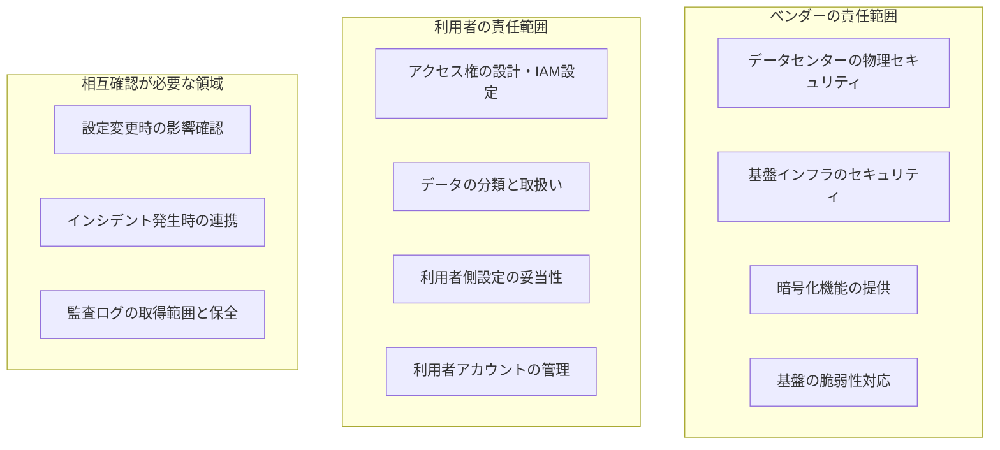

# 付録G：データ保護・セキュリティの契約要件

## G.1 本付録の位置づけ

ベンダーにシステムの運用や、データを扱う業務を委託しても、**データに対する責任は委託元から移転しない**。この一点が、データ保護の契約要件を設計するうえでの出発点である。本付録は、その前提となる規律を整理したうえで、契約に定めるべき事項をまとめる。

- **想定読者**：委託契約のデータ保護・セキュリティ要件を設計・点検する担当者
- **使い方**：RFPへの要求事項の記載、契約書ドラフトの点検、クラウド/SaaS導入時の確認
- **注意**：本付録は契約実務の整理であり、法令解釈を示すものではない。個人情報を扱う委託については、必ず法務部門および個人情報保護の所管部門の確認を得ること。サービスレベル（可用性・応答時間など）の設計は付録Fで扱う。
- 単独で参照できるリファレンスとして構成している。

<br>

---

## G.2 前提となる規律

### G.2.1 委託しても責任は移転しない

個人情報の取扱いを委託する場合、委託元には**委託先を監督する義務**がある（個人情報保護法第25条）。委託したことをもって責任を免れる構成にはなっていない。したがって契約には、監督を実行できるだけの具体的な事項（取扱範囲、安全管理措置、報告義務、監査権、再委託の統制）を書き込む必要がある。

「信頼できるベンダーだから」「大手だから」は監督の代替にならない。**監督は、契約条項と定期的な確認という形でしか実行できない。**

<br>

### G.2.2 データの所在と越境移転

個人データを外国にある第三者へ提供する場合には、国内の第三者提供とは別の規律がかかる（個人情報保護法第28条）。クラウド/SaaSでは次の点が論点になる。

| 論点 | 確認すること |
|---|---|
| データの保管リージョン | 本番データ、バックアップ、ログのそれぞれがどこに保管されるか |
| 運用・保守作業の実施場所 | 保管は国内でも、**保守要員が国外から接続する**構成になっていないか |
| サブプロセッサ（再委託先）の所在 | 一次委託先が国内でも、その先が国外である場合がある |
| 移転先国の制度 | 委託元には、取扱いを行う国の制度を把握したうえで安全管理措置を講じることが求められる（外的環境の把握） |

> **実務上もっとも見落とされるのは「運用・保守作業の実施場所」**である。データセンターは国内でも、監視・保守が国外拠点から行われていれば、データは国外から参照されている。SOWの「作業場所」の記載（付録F）と突き合わせて確認する。

<br>

### G.2.3 クラウドにおける責任分界

クラウド/SaaSでは、どこまでがベンダーの責任でどこからが利用者の責任かが層によって変わる。境界が曖昧な領域は「相互確認」として手順を定める。



**契約で確認すること**：責任分界の図がベンダーから提示されている場合、それが**契約文書の一部になっているか**を確認する。Webサイトに掲載されているだけで契約に組み込まれていなければ、一方的に変更されうる。

<br>

---

## G.3 契約に定める事項

### G.3.1 データの取扱範囲

| 論点 | 契約に記載する内容 |
|---|---|
| 取扱いを認めるデータの範囲 | 機密・内部・公開の区分ごとに、取り扱える範囲を明記する |
| 利用目的の限定 | 委託業務の遂行に必要な範囲に限る。統計利用・サービス改善への二次利用の可否を明示する |
| 取扱者の限定 | 業務に従事する要員を限定し、名簿の提出・更新を求めるか |
| 持ち出しの禁止 | 個人端末・私物媒体への複製、指定環境外への持ち出しの禁止 |

> **二次利用の条項に注意する。** 利用規約に「サービス改善のためにデータを利用できる」と書かれているSaaSは多い。委託した業務データがベンダーの分析対象になってよいかは、必ず確認する。

<br>

### G.3.2 保管場所と越境移転

| 論点 | 契約に記載する内容 |
|---|---|
| 保管場所 | 本番データ・バックアップ・ログの保管国／リージョンを指定する |
| 移転の制限 | 指定外への移転には事前の書面承認を要する |
| 作業実施場所 | 運用・保守作業を行う拠点の所在国を明示させる |
| 違反時の措置 | 通知義務と、解除権の発動条件 |

**条項例**

```markdown
第X条（データの保管場所および作業実施場所）
1. 乙は、甲のデータ（バックアップおよびログを含む）を日本国内に保管する。
2. 乙は、本業務に係る運用・保守作業を日本国内で実施する。
3. 前2項について変更が生じる場合、乙は事前に甲の書面による承認を得る。
4. 乙は、本業務に関与する再委託先の名称および所在国を甲に開示し、
   変更時は事前に通知する。
5. 本条に違反した場合、甲は本契約を解除することができる。
```

<br>

### G.3.3 暗号化とアクセス管理

| 論点 | 契約に記載する内容 |
|---|---|
| 暗号化 | 保管時・通信時の暗号化の要否と方式。顧客管理鍵（BYOK）対応の要否 |
| アクセス権 | 業務に必要な最小限とすること。付与・削除の手続きと記録 |
| 特権アクセス | ベンダー側管理者による本番データへのアクセス条件と、その記録の保存 |
| 認証 | 多要素認証の適用範囲 |
| ログ | 取得するログの種類、保存期間、**自社が参照できるか** |

> **特権アクセスの扱いが最大の盲点**になりやすい。運用委託では、ベンダーの管理者が本番データを参照できる構成がほとんどである。参照を認める条件（作業依頼に基づく場合のみ、など）と、アクセスログの提出義務を定める。

<br>

### G.3.4 バックアップと復旧

| 論点 | 契約に記載する内容 |
|---|---|
| 取得頻度と保存世代 | 頻度だけでなく**世代数**を定める。1世代では論理障害から戻せない |
| 保存期間と保管場所 | 本体データと同一障害の影響を受けない場所か |
| 暗号化 | バックアップデータの暗号化 |
| 自社での取得可否 | 自社が独自にバックアップを取得・保管できるか |
| 復旧試験 | リストア試験の実施頻度と、結果の報告義務 |

> 目標復旧時点（RPO）はサービスレベルの項目として付録Fで扱うが、それを実現できるバックアップ構成になっているかは本項で確認する。

<br>

### G.3.5 削除と返還

契約終了時にもっとも揉める領域である。締結時に決めておく。

| 論点 | 契約に記載する内容 |
|---|---|
| 返還の形式 | CSV／JSON等の標準形式。独自形式のみでは実質的に持ち出せない |
| 返還の範囲 | 本体データに加え、添付ファイル、ログ、マスタ設定を含むか |
| 返還の期限と費用 | 終了日から何日以内か。**追加費用を要しないこと**を明記する |
| 削除の方法 | 論理削除に加え、復元不能な方式による削除 |
| 削除の証明 | 削除完了証明書の提出義務と提出期限 |
| バックアップの削除 | バックアップ・アーカイブに残る分の削除時期 |

> 削除の方式について、契約で技術標準を参照する場合は NIST SP 800-88（媒体のサニタイズに関するガイドライン）が用いられることが多い。ただし**クラウドサービスでは物理媒体の破棄を利用者が確認できない**ため、実務上は「復元不能な方式による削除」と「証明書の提出」を求める形になる。

<br>

### G.3.6 インシデント発生時の通知

| 論点 | 契約に記載する内容 |
|---|---|
| 通知の対象 | 情報の漏えい・滅失・毀損、およびそのおそれがある事象 |
| **通知の期限** | 覚知から何時間以内か。「速やかに」では機能しない |
| 通知の宛先と手段 | 担当者不在時の代替経路を含める |
| 第一報の内容 | 発生日時、覚知日時、事象の概要、影響範囲の暫定評価、暫定対応 |
| 報告書の提出 | 期限と記載事項（原因、影響範囲の確定、再発防止策） |
| 調査協力義務 | 自社が行う調査への協力、証跡の保全 |
| 公表・当局対応 | 公表の可否と手順、監督官庁への報告における役割分担 |

> 委託元には法令上の報告義務が生じうるため、**ベンダーからの通知が遅れると委託元が期限を守れない**。通知期限は法令上の報告期限から逆算して設定する。

<br>

### G.3.7 監査権と第三者保証

自社で監査を実施するか、第三者保証報告書の提出で代替するかを決める。

| 手段 | 内容 | 使いどころ |
|---|---|---|
| 実地監査権 | 年1回等の頻度で監査を実施する権利 | 重要ベンダー、機密データを扱う委託 |
| 書面監査（チェックシート回答） | 定型の質問票への回答提出 | 一般ベンダー、負荷を抑えたい場合 |
| 第三者保証報告書 | SOC 2 報告書等の提出義務 | クラウド/SaaS。個別監査に応じない事業者が多い |
| 認証の取得・維持 | ISO/IEC 27001、27017（クラウドセキュリティ）、27018（クラウド上の個人情報）、27701（プライバシー情報管理）等 | 認証の維持を契約上の義務とする |

**確認すること**：認証や報告書は**適用範囲（スコープ）**が重要である。企業全体ではなく特定のサービス・データセンターのみが対象のことがあるため、自社が利用するサービスがスコープに含まれているかを確認する。

<br>

### G.3.8 再委託の管理

| 論点 | 契約に記載する内容 |
|---|---|
| 再委託の可否 | 原則禁止か、事前承認制か、通知制か |
| 開示義務 | 再委託先の名称、所在国、委託する業務範囲 |
| 義務の承継 | 再委託先にも本契約と同等の義務を課すこと |
| 責任 | 再委託先の行為について一次委託先が責任を負うこと |
| 変更時の手続き | 変更の事前通知と、自社が拒否できる場合 |

> クラウド/SaaSでは、サブプロセッサの一覧がWebサイトで公開され、随時更新される形が一般的である。この場合、**更新時の通知手段と、通知後に自社が異議を述べる手続き**を契約で確保しておく。

<br>

---

## G.4 クラウド/SaaS特有の確認事項

オンプレミス製品や個別開発の委託と比べ、次の観点が追加で必要になる。

| 観点 | 確認すること |
|---|---|
| マルチテナント | テナント間のデータ分離方式。他テナントの影響が波及する構成でないか |
| データの保管リージョン | 選択可能か、固定か。バックアップとログのリージョンも確認する |
| データポータビリティ | 標準形式での出力可否、API提供の有無、出力できないデータの有無 |
| 基盤事業者 | 利用しているIaaS/PaaS事業者と、その所在。障害時の責任の所在 |
| 仕様変更・機能廃止 | 事前通知の義務と通知期間。廃止により業務継続が困難になる場合の解除権 |
| 利用規約の変更 | 一方的に変更できる構成になっていないか。変更時の通知と解除権 |
| 二次利用 | 利用規約上、データがサービス改善・分析に利用される定めがないか |
| 認証・報告書 | 自社が利用するサービスが適用範囲に含まれているか |

**条項例**

```markdown
第Y条（データのエクスポート）
1. 甲は、契約期間中いつでも自己のデータの全量を出力できる。
2. 出力形式はCSVまたはJSONその他の標準的な形式とする。
3. 契約終了時の出力は、終了日から30日以内に完了し、追加費用を要しない。

第Z条（サービス仕様の変更）
1. 乙は、甲の業務に影響を及ぼす仕様変更または機能の提供終了について、
   実施日の90日前までに書面で甲に通知する。
2. 前項の変更により甲の業務継続が困難となる場合、
   甲は違約金を負担することなく本契約を解除できる。
```

<br>

---

## G.5 点検チェックリスト

**取扱いの範囲**

- [ ] 取り扱えるデータの区分と利用目的が限定されている
- [ ] 二次利用（統計・サービス改善）の可否が明示されている
- [ ] 取扱者が限定され、名簿の提出・更新の取り決めがある

**所在**

- [ ] 本番データ・バックアップ・ログの保管国が指定されている
- [ ] **運用・保守作業の実施場所（要員の所在国）**を確認した
- [ ] 再委託先の名称と所在国が開示されている
- [ ] 国外が含まれる場合、越境移転の要件と外的環境の把握について所管部門の確認を得た

**保護措置**

- [ ] 保管時・通信時の暗号化が定められている
- [ ] ベンダー側特権アクセスの条件とログ提出義務がある
- [ ] 取得するログの種類・保存期間と、自社が参照できるかが決まっている
- [ ] バックアップの頻度に加え、**保存世代数**が定められている
- [ ] リストア試験の実施頻度と報告義務がある

**インシデント**

- [ ] 通知の期限が**時間単位**で定められている
- [ ] 第一報の記載事項と、報告書の提出期限が定められている
- [ ] 公表・当局対応における役割分担が決まっている

**確認手段**

- [ ] 監査権または第三者保証報告書の提出義務がある
- [ ] 認証・報告書の適用範囲に、自社が利用するサービスが含まれている
- [ ] 再委託先にも同等の義務が承継される定めがある

**終了時**

- [ ] データ返還の形式・範囲・期限が定められ、追加費用を要しない
- [ ] 削除の方式と、削除完了証明書の提出義務がある
- [ ] バックアップ・アーカイブに残る分の削除時期が定められている

<br>

---

## G.6 出典

### G.6.1 参照した公開資料

| 資料 | 本付録での用途 |
|---|---|
| 個人情報保護委員会「個人情報の保護に関する法律についてのガイドライン（通則編）」 | 委託先の監督（法第25条）、安全管理措置、外的環境の把握の確認 — https://www.ppc.go.jp/personalinfo/legal/guidelines_tsusoku/ |
| 個人情報保護委員会「同ガイドライン（外国にある第三者への提供編）」 | 越境移転（法第28条）に関する規律の確認 — https://www.ppc.go.jp/personalinfo/legal/guidelines_offshore/ |
| 経済産業省「クラウドサービスレベルのチェックリスト」 | データ管理・セキュリティに関する確認項目の整理 |
| IPA／経済産業省「情報システム・モデル取引・契約書（第二版）」 | 委託契約における条項構成の確認 — https://www.ipa.go.jp/digital/model/model20201222.html |
| NIST SP 800-88「Guidelines for Media Sanitization」 | 削除方式の技術標準としての参照（G.3.5） |
| ISO/IEC 27001／27017／27018／27701 | 認証・第三者保証の枠組みの整理（G.3.7） |

<br>

### G.6.2 本付録独自の整理

- G.2.2の「運用・保守作業の実施場所」を保管場所と分けて確認する観点
- G.3.3の特権アクセスに関する整理
- G.3.5の、クラウドにおける削除証明の実務的な限界に関する記述
- G.5の点検チェックリスト
- 条項例（通知期限90日、返還期限30日などの数値）

### G.6.3 注記

- 本付録は契約実務の整理であり、**法令の解釈を示すものではない**。個人データの取扱いを伴う委託については、法務部門および個人情報保護の所管部門の確認を必ず得ること。
- 条項例は要求事項を整理するための文例であり、法的有効性を保証するものではない。
- 対象地域により追加の要件（GDPR等の域外適用、業種別規制、輸出管理）が生じる場合がある。

**最終確認日**：2026年9月5日
