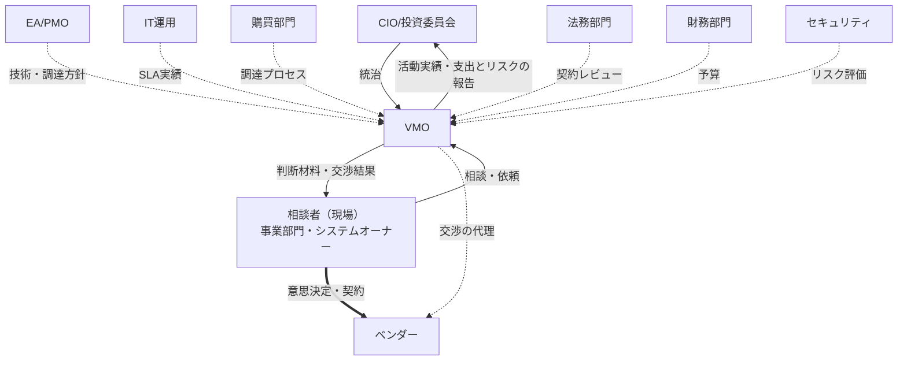

# 第I部：VMOの価値提供（Value Delivery）

本部は、VMO担当者だけでなく、VMOと関わるすべてのIT組織メンバーに向けたものである。

構成は、**第1章でVMOの提供方法から始める**。「VMOが何をする組織か」より先に、「VMOがどう関わってくるのか」を示すためである。ベンダー対応の機能を現場から引き取るのか、現場に残したまま上乗せするのか——ここが決まらないと、以降の機能や役割分担の説明はすべて別の意味に読めてしまう。第2章から第4章で、その提供方法を前提とした機能、ステークホルダーへの提供価値、他のIT機能との役割分担を示す。

<br>

---

## 第1章：VMOの提供方法 ― エージェント型（伴走型サービス）

### 1.1 私たちが選ぶ形

VMOは、ベンダー対応の機能を現場から引き取って一元管理する「ガバナンス型」ではなく、**現場の意思決定とオーナーシップを維持したまま、交渉力と専門性を上乗せする「エージェント型（伴走型サービス）」**として価値を届ける。

現場からベンダー対応を引き取るのではなく、**現場の代理人として交渉と契約設計を担う**。判断とオーナーシップが現場に残るため、成果がいまの水準を下回ることがない。そしてVMOが経験を積むほど、その成長分が現場の成果に上乗せされていく。

以下では、なぜこの形を選ぶのかを、現状およびガバナンス型と並べて示す。

<br>

### 1.2 3つのモデル

いまの姿を100とした指数で、3つを同じ物差しで比べる。VMOは立ち上げ時点では現場の半分（50）から始まり、案件が集まるほど育つ、と置く。**以下の数値はいずれも性質を示すための概念上の値であり、実測値ではない。**

**① 現状（分散・自前対応）**

```
V = d
　V：案件全体の成果の平均（いまの水準を100とする指数）
　d：現場の寄与度（平均100、案件ごとにばらつく）
```

現場が自分で対応している、いまの姿である。全体の成果は案件ごとの積み上げで、一件ごとの結果は担当者の力量と経験に左右される。劣った状態という意味ではなく、比較の出発点である。ベンダー対応の経験が個人に閉じるため、時間が経っても水準は上がらない。

**② ガバナンス型（機能集約）**

```
V(t) = v(t) ×（1 − λ）
　v(t)：VMOの専門性（同じ物差しの指数。案件が集まるほど育つ）
　λ　 ：現場の文脈がVMOへ渡りきらないことによる伝達ロス
　d　 ：移管が終われば0に近づくため、式に残らない
```

ベンダー対応の機能をVMOへ移す形である。移管が終われば現場はほとんど関与しなくなるため、**成果はVMOの水準そのものになる**。誰が担当しても同じ手順に乗るためばらつきは小さくなるが、VMOが現場の水準（100）に追いつくまで、平均は基準を割ったままになる。ガバナンス型が買っているのは、水準ではなく分散の縮小である。

**③ エージェント型（伴走）**

```
V(t) = max ( d , v(t) − c )
　d　 ：現場の寄与度（伴走では平均100のまま保たれる）
　v(t)：VMOの専門性
　c　 ：伴走にかかる調整コスト（現場とVMOのやり取りの手間）
```

現場を残したまま、VMOを上乗せする形である。**現場の力量と、VMOが保証できる水準の、高い方を取る。** VMOが持ち込むのは相場、確認すべき観点、他契約からの交渉材料であり、それらは既に備えている担当者よりも、備えていない担当者にこそ大きく効く。したがって平均が上がると同時に、ばらつきも縮む。「100を下回らない」ことは仮定ではなく、この形から出てくる結果である。

<br>

### 1.3 3モデルの比較

| | ① 現状（自前対応） | ② ガバナンス型（分散を抑える） | ③ エージェント型（平均を上げる） |
|---|---|---|---|
| 式 | `V = d` | `V(t) = v(t) ×（1 − λ）` | `V(t) = max ( d , v(t) − c )` |
| 成果の平均（導入時→数年後） | 100 → 100 | 100 → 124 | 100 → 134 |
| ばらつき σ（同上） | 20 → 20 | 20 → 7 | 20 → 11 |
| 強み | 現場が全体を把握しており意思決定が速い。調整コストがかからない | 誰が担当しても同じ手順に乗るためばらつきが小さい。統制と監査対応が容易。VMO側に経験が集約されて育つ | 現場が100を保つため基準を割らない。VMOが育った分だけ分布全体が持ち上がり、基準を超えたあとはばらつきも収まる |
| 弱み | 案件ごとのばらつきが大きく結果が担当者に依存する。経験が個人に閉じて蓄積せず、水準が上がらない | 成果がVMOの水準そのものになり、**VMOが現場に追いつくまで基準を割り続ける**。伝達ロスが残り、現場の寄与度はほぼゼロになる | ばらつきが収まるのはVMOが基準を超えたあと。均一化の速さでは②に劣る。上乗せが生まれるまでは調整コストだけが乗る |

**②と③は、効く順番が違う。** ②は最初にばらつきを抑え、水準は後から追いつく。③はまず全体を持ち上げ、VMOが基準を超えたあとにばらつきが収まる。どちらを先に必要とするかで選び方が変わる。

数式・グラフによる詳細な比較は [`../html/three-models.html`](../html/three-models.html) に示している。

<br>

### 1.4 分かれ目：育つ間のリスクを誰が負うか

②と③を分けるのは、**VMOが現場の水準（100）を超えるまでの期間を、誰が負担するか**である。

- ②では、成果がVMOの水準そのものになるため、VMOが現場に追いつくまで組織全体の成果が基準を割り続ける。**育つ間のリスクを現場（＝事業）が負う。**
- ③では、現場が下限を支えるため割り込まない。**育つ間のリスクをVMOだけが負う。**

導入初期から事業にリスクを負わせることなく、現場のスピードと意思決定権を維持したまま価値を積み上げていける。これが、私たちがエージェント型を選ぶ理由である。

<br>

### 1.5 早期相談は、モデル上の必然

VMOが育つのは、案件が集まるからである。式のなかで `v(t)` を成長させるものは、経験した案件数以外にない。

現場が早く声をかけるほど `v` が早く100を超え、上乗せの始まりが前倒しになる。**「早めにご相談ください」はお願いではなく、モデル上の必然である。** そして早い段階の相談ほど、選べる選択肢も交渉の余地も大きい。

<br>

### 1.6 3つから1つを選ぶ、という話ではない

3つのモデルは、現実を単純化して性質だけを取り出した**基準線**である。基準線は位置を測るためのものであって、その上を歩くためのものではない。

実際には、案件の性質によって効く形が変わる。定型的で件数の多い契約と、金額も文脈も大きい契約とでは、適した距離の取り方が違う。VMOが育つにつれても動く。うまくいく形は、あらかじめ選ぶものではなく、進めながら形になっていく。

必要なのは精緻なモデルではなく、**前提と目的の共有**である。いまVMOがどの水準にあり、何を引き受けられて、何がまだ引き受けられないのか。この案件で最も守りたいものは何か。それさえ共有されていれば、呼び名が①でも②でも③でも、その場に合った役割分担は見つかる。

<br>

### 1.7 導入後にモニタリングすること

エージェント型は、**現場の寄与が残っていることを前提に成り立つ**モデルである。前提が崩れれば（現場が判断を手放し、実質的に②へ移行すれば）、モデルの利点は失われる。したがって、狙いどおりに機能しているかを継続的に確認する。

| 見るもの | 確認すること |
|---|---|
| 成果の平均 | 相談を経た案件の条件が、相談前・非相談案件と比べて改善しているか |
| ばらつき | 担当者による結果の差が縮まっているか |
| 現場の寄与 | 意思決定が現場に残っているか。VMOが決めてしまっていないか |
| 相談の時期 | 相談が早い段階で来ているか。契約直前の駆け込みが増えていないか |
| VMOの水準 | 蓄積した相場・交渉実績が、実際に案件で使われているか |

<br>

---

## 第2章：VMOの機能と役割

### 2.1 VMOの定義

VMOは、IT組織におけるベンダーマネジメント機能である。エージェント型を採る本組織では、次のように定義する。

> **VMOは、ベンダーとの取引において現場の代理人として動く専門機能である。** 組織横断の情報（ベンダー台帳、契約情報、相場・交渉実績）を維持し、個別の案件では現場に代わって調査・設計・交渉を行う。**意思決定は現場に残る。**

<br>

### 2.2 案件のライフサイクルと、相談の入口

VMOは、システムやサービスの検討開始から契約終了まで、4つのフェーズにわたって機能を担う。利用者から見れば、これらは**相談の入口**として現れる。

| フェーズ | VMOが担う機能 | 相談の入口（利用者の言葉） |
|---|---|---|
| ① 探索 | 製品・ベンダーが未確定の段階から、選択肢と費用感を整理する | ・どんな選択肢があるのか、相場感を知りたい |
| ② 選定・契約 | RFP／見積依頼の準備、契約条件の設計、ベンダーとの交渉を行う | ・RFP・見積依頼の準備を手伝ってほしい<br>・もう決まっている案件を、契約前に確認したい<br>・契約条件をどう詰めればいいか分からない |
| ③ 運用・改善 | 稼働後の品質・コスト・予算を継続的にモニタリングし、改善や価格交渉に対応する | ・ベンダーの対応品質に納得がいかない<br>・ベンダーから値上げを要請された<br>・来年度の予算をどう積めばいいか分からない<br>・契約が入り組んで、全体が見えない |
| ④ 見直し・転換 | 体制の増強・縮小、乗り換え、契約終了など、次の姿に合わせて契約を組み替える | ・いまの体制が実態に合っていない<br>・いまのベンダーを続けるべきか迷っている<br>・システムの縮小・廃止を控えている |

**利用者向けの案内は [`../html/consultation-landing.html`](../html/consultation-landing.html)、入口ごとの実務は第III部（第7〜10章）で扱う。** 本ガイドの実務編が業務プロセス別ではなく相談の入口別に構成されているのは、相談が業務プロセスの順番ではなく、利用者が困った順番で来るためである。

<br>

### 2.3 VMOが担う業務

| 業務 | 内容 |
|---|---|
| ベンダー台帳・契約情報の維持 | 全ITベンダー・SaaSの契約、満了日、解約通知期限の一元管理 |
| 相場・交渉実績の蓄積と提供 | 案件ごとの単価・条件・交渉結果を記録し、次の案件で参照できる形に保つ |
| 選択肢の調査と比較材料の作成 | 市場の選択肢、費用レンジ、評価基準、比較表 |
| 契約条件・SLAの設計 | SOW・SLA・出口条項の設計と、リスクの洗い出し |
| **ベンダーとの交渉の代行** | 価格・条件の交渉を、現場の代理人として引き受ける |
| SLA未達時の是正交渉 | 事実の記録化、改善要求、改善計画の追跡 |
| 契約更新期限の管理と事前の声がけ | 解約通知期限から逆算し、相談を待たずに現場へ働きかける |
| ベンダーリスクの把握と共有 | 体制変更、財務、セキュリティ事案の把握とエスカレーション |

> **注**：ベンダーの分類・評価は、格付けして統制するために行うのではない。**手のかけ方とレビュー頻度を決めるため**に行う。分類の結果として管理を強めるのはVMO自身の作業量であって、現場の裁量ではない。

<br>

---

## 第3章：ステークホルダーとそれぞれに対する提供価値

VMOは、単一の部門のためではなく、IT組織内外の多様なステークホルダーに対して価値を提供する。

| ステークホルダー | VMOとの関係 | VMOが提供する価値 |
|---|---|---|
| 現場（事業部門・システムオーナー） | 相談者。意思決定の主体 | ベンダー対応にかかる専門知識・交渉力・市場相場情報を提供し、対応工数と判断の負荷を軽減する。判断は現場に残したまま、材料と交渉を引き受ける |
| CIO／投資委員会 | 統治・承認 | 全社のITベンダー支出とリスクの一元的な可視化、投資判断に資する情報提供、重大リスクの早期把握 |
| EA/PMO | 調達方針を受け取る | 技術戦略・アーキテクチャ方針に沿った調達の実行。EA/PMOの意図をベンダー選定・契約条件に確実に反映する |
| IT運用（ITサービスマネージャー） | 日常のSLA監視データを共有 | SLA未達時の是正交渉をVMOが担い、運用チームが技術的対応に専念できる環境をつくる |
| 購買部門 | RFP発行・入札プロセスで協働 | IT特有の契約論点（SLA、ライセンス、クラウド契約等）の専門知識を補い、公正な調達プロセスの設計を支援する |
| 法務部門 | 契約レビューで連携 | データ保護・SLA・解約条項などIT特有のリスク論点を事前に整理し、法務レビューの負荷を軽減する |
| 財務部門 | 予算確保で連携 | 契約条件・市場相場に基づく精度の高い予算見積もりを提供し、コスト最適化の効果を可視化する |
| セキュリティ部門 | リスク評価で連携 | ベンダーのセキュリティ体制を契約段階から評価基準に組み込み、監査対応の負荷を軽減する |
| 各ベンダー | 取引先 | 明確な窓口と一貫した評価基準による公正な取引関係、長期的なパートナーシップの機会を提供する |

<br>

---

## 第4章：VMOとその他IT機能との役割と責任

### 4.1 組織上の位置づけ

エージェント型では、VMOはベンダーと現場の間に**代理人として**立つ。ベンダーを直接統制する立場ではない。



<br>

### 4.2 案件対応での役割分担（RACI）

個別案件では、**意思決定の最終責任（A）は常に相談者（現場）にある**。VMOは実行責任（R）を担う。

| 活動 | 相談者（現場） | VMO | 購買 | 財務 | 法務 | セキュリティ | EA/PMO | ITサービスMGR |
|---|---|---|---|---|---|---|---|---|
| 業務要件の決定 | **A**/R | C | I | I | I | C | C | C |
| 選択肢・相場の調査 | **A** | R | C | I | I | I | C | I |
| 評価基準の設計 | **A** | R | C | I | I | C | C | C |
| RFP／見積依頼の作成・運営 | **A** | R | R | I | C | C | C | C |
| ベンダーの選定 | **A**/R | C | C | I | I | C | C | C |
| 契約条件・SLAの設計 | **A** | R | C | C | C | C | I | C |
| 価格・条件の交渉 | **A** | R | R | C | C | I | I | I |
| 契約の締結 | **A** | C | R | C | R | I | I | I |
| 予算確保・社内承認 | **A**/R | C | I | R | I | I | I | I |
| SLA/KPIの日常モニタリング | C | C | I | I | I | C | I | **A**/R |
| 改善要求・是正交渉 | **A** | R | C | I | C | C | I | R |
| 継続／切替の判断 | **A** | R | C | C | C | I | C | C |
| 契約終了・移行の実行 | **A** | R | C | C | C | R | I | R |

**凡例**：**A** = Accountable（最終責任）／R = Responsible（実行）／C = Consulted（相談を受ける）／I = Informed（情報共有される）

<br>

### 4.3 A（最終責任）の置き方の原則

> **VMOが「A」を持つのは、自らの基盤業務に限る。** 個別案件の意思決定——どのベンダーを選ぶか、どの条件で契約するか、続けるか乗り換えるか——のAは、常に相談者（現場）にある。VMOはそこでRを担う。

この線引きが、エージェント型とガバナンス型を分ける実務上の分水嶺である。契約交渉やベンダー評価のAをVMOへ移した時点で、それは②のガバナンス型であり、[1.4](#14-分かれ目育つ間のリスクを誰が負うか)で述べた「育つ間のリスクを現場が負う」構造に変わる。

判断に迷ったときは、次の問いに戻る。**「この決定が誤りだったとき、責任を負うのは誰か」** 答えが現場であれば、Aは現場にある。
