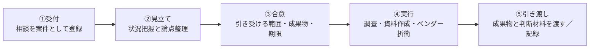
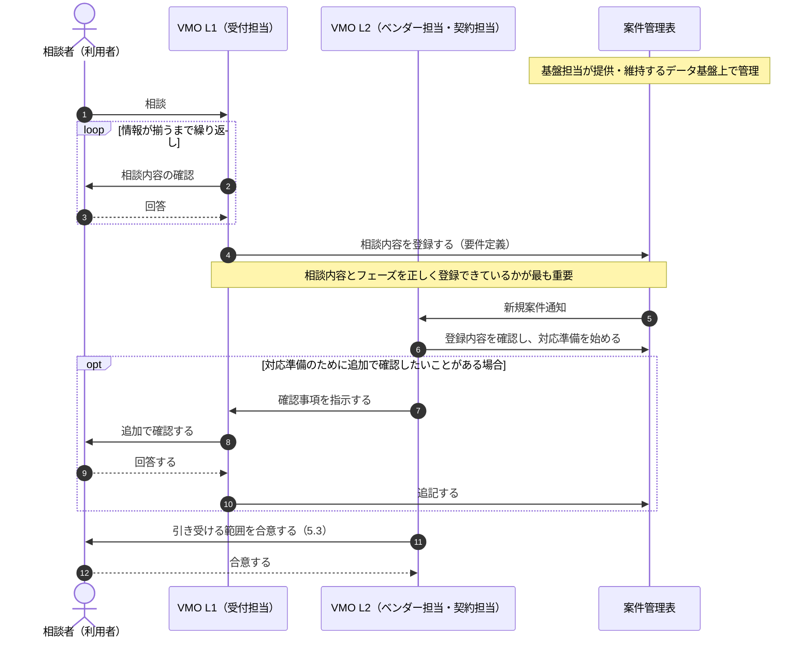
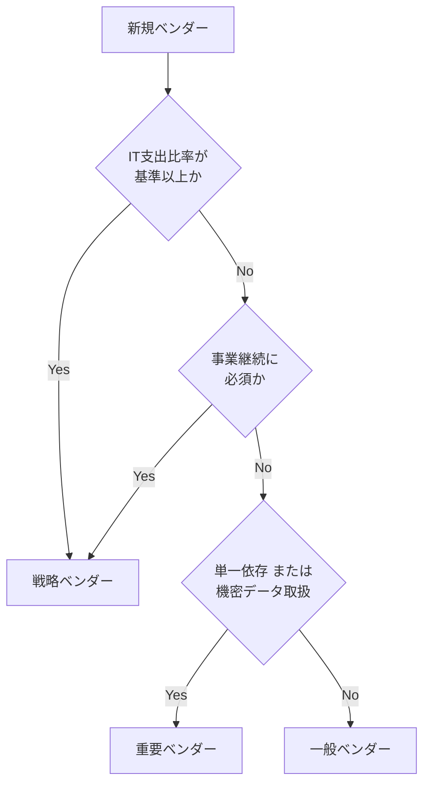

# 第II部：実務ガイド（相談の入口編）

VMOの実務は、利用者からの相談を起点に始まる。本部では、どの入口から相談を受けても共通するVMOの動き方（第5章）と、個々の相談に速く正確に応じるために平時から維持しておくべき基盤業務（第6章）を扱う。相談の入口ごとの実務は第III部で扱う。

 

## 第5章：相談を受けるときの共通の型

VMOの担当者は、外部から見える相談者向けのL1（相談受付）・L2（対応）というサービス単位とは別に、内部的には次の4つの役割で業務を分担する。L1（受付担当）と基盤担当は平時のオペレーショナル業務（定型業務）を担い、L2（ベンダー担当・契約担当）はAdhocな個別対応に特化する「エージェント」として、案件が発生したときにだけ動く。

| 内部の役割 | L1/L2上の位置づけ | 業務の性格 | 主な仕事 |
|------|---------|---------|---|
| 基盤担当 | なし | 定型業務(改善含む) | ベンダーマスタ・契約マスタのデータ整備、および案件管理表・市場調査・交渉記録などを管理するためのデータ基盤（システム・環境）を提供し、維持する。あわせて、このVMOのL1/L2プロセス全体のプロセスオーナーでもある |
| 受付担当 | L1（相談受付） | 定型業務(改善含む) | 相談者とのやり取りを重ね、相談内容とフェーズを案件台帳に正しく登録する（5.5）。契約更新カレンダーに基づく相談者への声がけなど、定型的な働きかけも行う（6.3） |
| ベンダー担当 | L2（Adhoc対応） | 個別事案への非定型対応 | 市場調査・相場感の提示、ベンダーとの価格・条件交渉 |
| 契約担当 | L2（Adhoc対応） | 個別事案への非定型対応 | 契約条件・SLAの設計、契約リスクの洗い出しと論点整理 |

受付担当と基盤担当はいずれも平時のオペレーショナル業務であるため、実務上は同じ人材が互いにバックアップ要員を兼ねることが多い。ベンダー担当・契約担当はAdhoc対応に特化するため、この兼務の対象には含めない。

L2（対応）は、ベンダー担当と契約担当が案件の性質に応じて連携し、ひとつの対応として相談者に返す。基盤担当はL1・L2の業務、すなわち個別の相談のやり取りには直接関わらない。受付担当が5.5で案件管理表に登録し、L2がそれを参照して対応準備を始められるのは、基盤担当がベンダーマスタ・契約マスタのデータ整備を行い、案件管理表・市場調査・交渉記録などを管理するためのデータ基盤を提供し、環境を維持しているからである。このデータ基盤が整っていないと、5.2の初回確認も5.4の案件記録も拠り所を失い、受付担当・ベンダー担当・契約担当のいずれも機能しなくなる。基盤担当は、この5.1〜5.5で定義するL1/L2プロセスそのもののプロセスオーナーでもある。個々の案件の実行には入らないが、プロセスが実際に機能しているかを見渡し、必要な見直しを行う立場にある。

 

### 5.1 相談から完了までの5ステップ

どの入口から入っても、VMOの動き方は次の5段階になる。

| ステップ | VMOがやること | 落としてはいけない点 |
|---|---|---|
| ①受付 | 相談内容、対象システム、相談者、期限を記録し、案件として採番する | 立ち話で終わらせない。記録がないと蓄積されず、次の案件で使えない |
| ②見立て | 5.2の項目を確認し、打てる手と打てない手を切り分ける | この段階で結論を出さない。事実を集めてからにする |
| ③合意 | 何を引き受け、何を引き受けないかを相談者と明示的に合意する | ここを曖昧にすると、期待値のずれが最後に噴き出す |
| ④実行 | 市場調査、資料作成、ベンダーとの折衝を実行する | 相談者を飛ばしてベンダーと合意しない。決めるのは相談者 |
| ⑤引き渡し | 判断材料を渡し、相談者が決める。結果と条件を記録する | 「VMOが決めた」形にしない。オーナーシップは現場に残す |

 

### 5.2 初回に必ず確認する7項目

| # | 確認項目 | なぜ聞くか |
|---|---------|-----------|
| 1 | 対象のシステム／サービスと、利用している部門 | 影響範囲と、巻き込むべき関係者が決まる |
| 2 | いまどの段階か（未着手／候補あり／内示済み／契約済み） | **段階によって打てる手がまったく変わる**。最も重要な質問 |
| 3 | 決めなければならない期限と、その期限の根拠 | 動かせる期限か、動かせない期限かで進め方が変わる |
| 4 | 現行契約の有無（あれば金額・満了日・更新方式・解約通知期限） | 交渉材料の起点。解約通知期限を過ぎていると選択肢が消える |
| 5 | 予算の状況（確保済み／これから／上限額） | 提示できる選択肢の幅が決まる |
| 6 | **すでにベンダーに伝えてしまっていること** | 予算額や内示を伝えていると、価格交渉の余地はほぼ失われている。早期に知る必要がある |
| 7 | 最終的に誰が決裁するか | 成果物を誰向けに、どの粒度で作るかが決まる |

 

### 5.3 引き受ける範囲の合意

VMOは、現場から意思決定を取り上げる立場ではなく、現場が主導権を持ったまま交渉力と専門性を上乗せする立場をとる。この線引きを最初に共有しておく。

| VMOが引き受けること | 相談者（現場）に残ること |
|---|---|
| 市場調査、相場情報の提供 | 業務要件そのものの決定 |
| 評価基準の設計、比較表の作成 | 技術的な適合性の判断 |
| 契約条件・SLAの設計 | どのベンダーを選ぶかの決定 |
| ベンダーとの価格・条件交渉 | 予算の確保と社内承認の取得 |
| 契約リスクの洗い出しと論点整理 | 法務・セキュリティの最終判断（各部門と連携） |

**伝え方の例**：「材料と交渉はこちらで引き受けます。決めるのは皆さんです。」

 

### 5.4 案件記録として残すもの

個別の相談で得た情報は、次の相談で使う資産になる。相談ごとに最低限、次を記録する。

- 対象システム、ベンダー名、契約金額と契約期間
- 提示された当初条件と、交渉後の着地条件、**その差分**
- 交渉で有効だった論点、通らなかった論点
- 見積の内訳（単価、数量、前提条件）
- 相談から完了までの実所要期間

 

### 5.5 L1受付からL2対応への引き継ぎシーケンス（研修・振り返り用）

VMO担当者は、相談を受けるL1（相談受付）と、相談に対応するL2（対応）に分かれる。L1は受付担当が担い、L2はベンダー担当・契約担当が案件の性質に応じて連携して担う。L1の役割は、相談者との複数回のやり取りを通じて、相談内容とフェーズを案件台帳に正しく登録することにある。一度の質問応答で済ませようとせず、必要な情報が出揃うまでやり取りを重ね、正しい登録にたどり着くことが最も重要である。次のシーケンス図は、受付担当（L1）が相談者とのやり取りを重ねて案件台帳へ登録し、L2（ベンダー担当・契約担当）がエスカレーションを受けて対応準備を始めるまでの流れを示したものであり、受付担当の業務を振り返り、改善点を確認するための材料として用いる。図中の案件管理表は、基盤担当が提供・維持するデータ基盤の上で運用されており、受付担当の登録もL2の参照も、このデータ基盤があって初めて成り立つ。

 
 

## 第6章：相談に応じるための基盤業務

個別の相談に速く正確に応じられるかどうかは、平時にどれだけ情報を整えているかで決まる。本章の業務は相談がなくても継続する。

この基盤（ベンダーマスタ・契約マスタ、案件管理表、市場調査・交渉記録などのデータ）の質こそが、VMO全体の対応力を支えている。基盤担当の仕事は、データを入力することだけでは終わらない。入力された情報を常に正しい状態に保ち続けることが本質であり、そのためには決まった手順をこなす定常対応だけでなく、何のためにこの情報を残すのかという目的を理解し、使われ方に照らして基盤を改善し続けるマインドセットが求められる。

この基盤は、基盤担当だけでは完成しない。受付担当（L1）は相談者と直接向き合う窓口として、現場で起きていることを正しく理解する。基盤担当は社内に蓄積されたデータ基盤・記録を正しく理解し、その状態を保つ。どちらも同じくらい重要な情報であり、一方が他方に作業を依頼して終わるような関係ではない。この二つの理解を突き合わせ、合わせて初めて、この基盤は機能する状態を保ち続けられる。以降の節では、基盤担当が担う社内データの理解と、受付担当（L1）が担う現場の理解を、どう組み合わせて基盤を保っていくかを示す。

### 6.1 ベンダー台帳と契約情報の維持（基盤担当）

台帳がなければ、9.2の値上げ検証も9.4の契約整理も成立しない。基盤担当が全ベンダー・全契約を一元管理できるデータ基盤を整え、少なくとも次を保持する。

- ベンダー名、契約ID、対象システム、契約金額、契約期間
- **満了日と解約通知期限**、更新方式（自動更新か都度更新か）
- 業務窓口・技術窓口、ベンダー側の担当
- 分類とレビュー頻度

**ベンダー分類の基準（受付担当が定型業務として判定）**

基盤担当が保持するのは台帳と分類結果のデータであり、どの分類に位置づけるかの判定は、受付担当が平時の定型業務として次の基準に沿って行う。分類の見直しが契約条件の再交渉に発展する場合は、そこからはAdhoc対応としてベンダー担当・契約担当（L2）に引き継ぐ。

| 分類 | 定義 | レビュー頻度 | 管理レベル |
|------|------|------------|-----------|
| 戦略ベンダー | IT支出比率が高い、または事業継続に必須 | 四半期毎 | 最高 |
| 重要ベンダー | 単一依存、または機密データを取り扱う | 半期毎 | 高 |
| 一般ベンダー | 代替可能かつ低額 | 年次 | 標準 |

> 支出比率のしきい値は自組織の支出構造に合わせて設定する。上位数社に支出が集中している組織で一律の比率を置くと、ほとんどが一般ベンダーに分類されてしまう。

 

### 6.2 相場・実績情報の蓄積（基盤担当が基盤を提供／ベンダー担当・契約担当が記録）

「他案件と突き合わせて初めて検証できる」という価値は、蓄積があって初めて成立する。基盤担当は案件ごとの情報を残せるデータ基盤を提供し、実際の記録は案件を対応したベンダー担当・契約担当が案件ごとに行う。次を記録し、参照できる形で保持する。

| 記録する項目 | 使う場面 |
|---|---|
| 単価と数量、その前提条件 | 相場感の提示（7.1）、値上げ検証（9.2） |
| 当初提示条件と着地条件の差分 | 交渉余地の見積もり（8.2、9.2） |
| 有効だった交渉論点、通らなかった論点 | 交渉戦術の再現 |
| 移行・切替の実所要期間と費用 | 切替コストの積算（10.2） |
| 契約条項の交渉結果（受け入れられた／拒否された） | 契約条件の設計（8.3） |

 

### 6.3 契約更新カレンダーと能動的な声がけ（受付担当の定型業務）

相談を待っていると手遅れになる。L1と基盤担当は平時のオペレーショナル業務を担うため、基盤担当が維持する更新カレンダーの仕組み（満了日・解約通知期限のデータ）をもとに、受付担当が定型業務として**満了日ではなく解約通知期限**を基準に期限から逆算し、相談者に声をかける。声がけを通じて条件交渉や候補調査など具体的な対応が必要になった時点で、5.1の①受付として案件登録し、Adhoc対応を担うL2（ベンダー担当・契約担当）に引き継ぐ。

| 満了日からの時点 | 受付担当のアクション |
|---|---|
| 12ヶ月前 | 継続か見直しかの方針を相談者に確認する |
| 6ヶ月前 | 継続の場合は契約担当に、見直しの場合はベンダー担当に、Adhoc対応として引き継ぐ |
| 解約通知期限の1ヶ月前 | 通知の要否を確定する（**この判断が最終期限**。対応中のL2案件がある場合はL2と確認する） |
| 解約通知期限 | 通知するか、更新を確定する |
| 1〜2ヶ月前 | 移行・切替の進捗をL2とともに確認する（切替の場合） |

> 自動更新契約の解約通知期限は満了日の60〜90日前に設定されていることが多い。契約締結時に必ずカレンダーへ登録する（8.4）。

 

### 6.4 案件記録とナレッジの蓄積（基盤担当が基盤を提供／受付担当・L2が記入）

- 相談は立ち話であっても、受付担当が案件として採番し、基盤担当が提供する案件管理表に記録する
- 完了時に、対応したベンダー担当・契約担当が5.4の項目を必ず埋める
- 記録は相談者個人ではなくVMOの資産として保管する。担当が変わっても引き継げる形にするのは、基盤担当が維持するデータ基盤の役割である

 

### 6.5 平時の業務サイクル（受付担当・基盤担当）

基盤担当が整えたデータ基盤を使って、受付担当が次のサイクルで定型業務を回す。レビューの結果、交渉や契約見直しなどAdhocな対応が必要になった場合は、その都度L2（ベンダー担当・契約担当）に引き継ぐ。

| 頻度 | 実施すること |
|---|---|
| 随時 | 新規相談の受付と割り当て、進行中案件（L2対応中のものを含む）の期限確認 |
| 月次 | SLAモニタリング（情報収集、分析、契約担当者との連絡会の準備・開催を含む）、契約更新期限の確認 |
| 四半期 | 戦略ベンダーの条件見直しの要否確認レビュー会の開催（分析、資料準備、会議開催、計画更新を含む） |
| 年次 | 全契約の棚卸し、翌年度の予算支援、翌年度の契約更改の要否確認レビュー会の開催（分析、資料準備、会議開催、計画更新を含む） |
